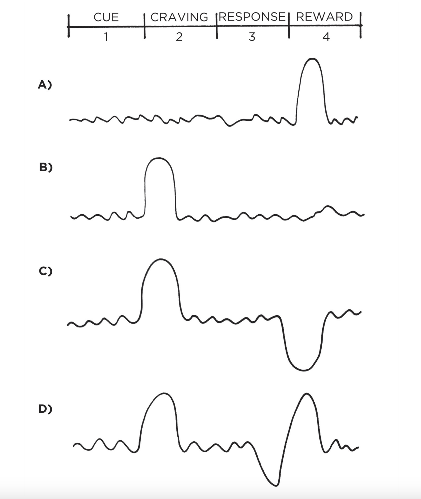
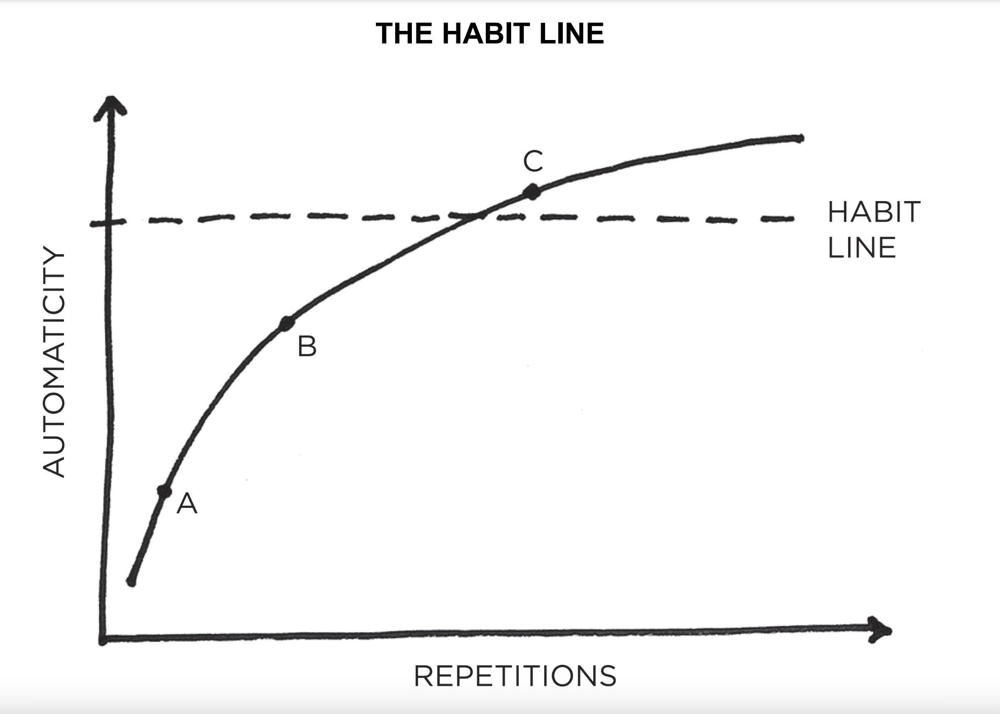
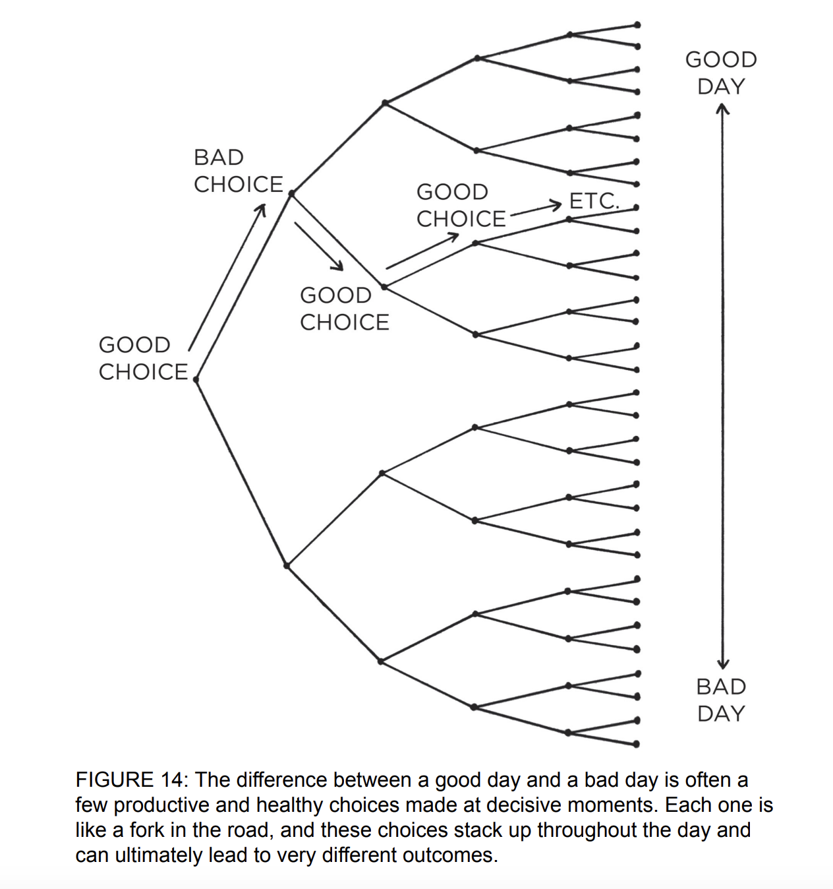
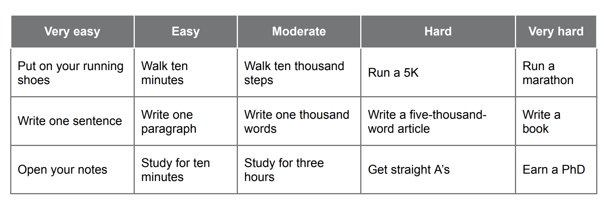
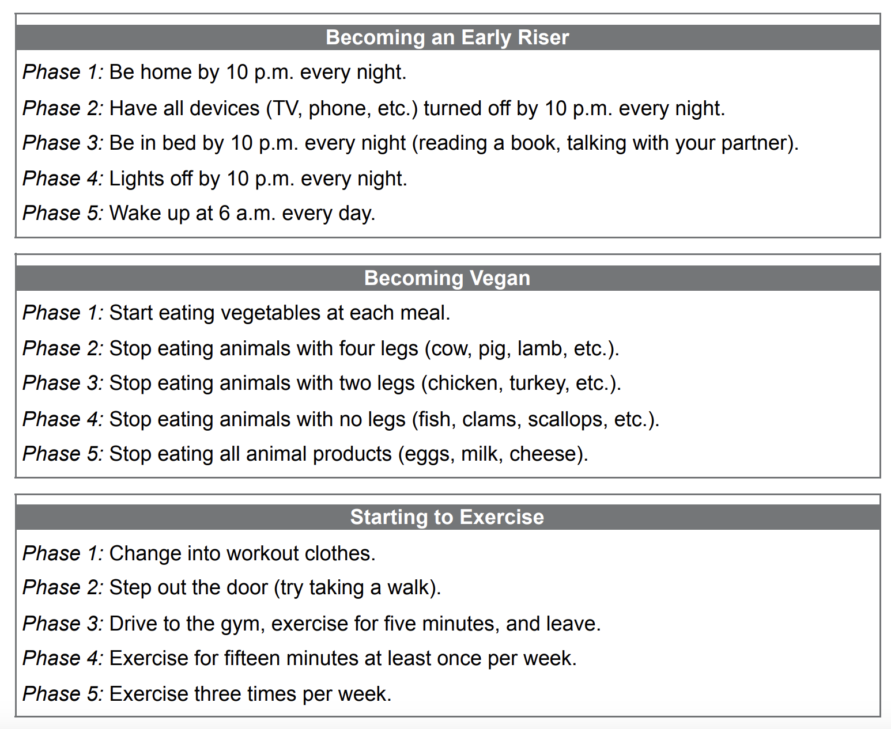
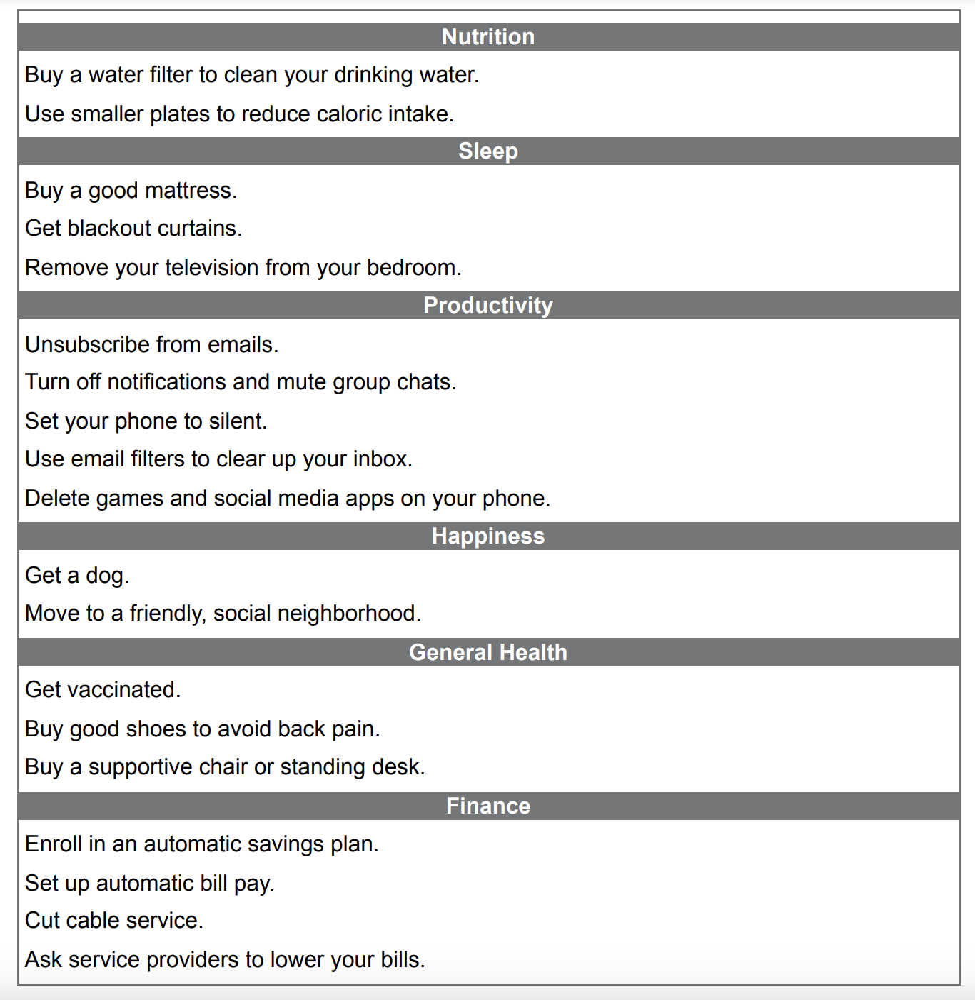

# Atomic Habits
# The Fundamentals
## The Surprising Power of Atomic Habits
The UK cycling team went from absolute noobs to winning championships in 5y all thanks to some coach who focused on the team improving via micro habits, which stack up over time.

Examples:
 * Experimented with different fabric for the outfits which are more aerodynamic
 * Tried different massages to optimize for fastest muscle recovery
 * Optimized hand-washing to minimize players getting a cold

Why does this work? Because of compounding, famously expressed via the formula 1.01^365 = 37.78, ie 1% improvement every day.

On the flip-side, getting 1% worse every day (0.99^365) results in 00.03.


Habits are the compound interest of self-improvement. They seem to make little difference day to day, but deliver massive impact over months & years.

Unfortunately, the slow velocity results in us underestimating the effect of both good and bad habits:
 * We tend to skip workouts
 * We tend to binge-watch netflix or eat a lot

We do this because short-term positive and negative impact is minimal, but that's not the case in the long-term.

**Key takeaway** - focus on putting yourself on the path to success, not on being successful. Focus on your trajectory, rather than current results.

The effect of habits is similar to the behavior of a melting cube. 
While the temperature in a room is increasing, the ice cube seemingly stays in tact, but at some point, a 1 degree increase leads to the cube melting.

Breakthrough moments are the result of many previous actions that build up the potential for a major change. Habits work similarly.

This is one of the core reasons people don't stick to habits - they don't have the patience to wait for the breakthrough because they expect linear gains.

The author refers to the time before a breakthrough as **the plateau of latent potential**.


**Forget about goals, focus on systems.**

Goals are about the results you want to achieve, systems are about the processes that lead to those results.

Goals make sense for setting direction, but systems are best for making progress towards that direction.

Problems with goal-setting:
 * Winners and losers share the same goals - survivorship-bias kicks in. Only a handful of goal-setters succeeded and those are the ones we see. We don't see the dozens of failures.
 * Achieving a goal is a momentary change - by achieving a goal, you're treating a symptom, not the root cause. You can clean your room once, but you need a system to keep it tidy over time.
 * Goals restrict your happiness - you defer happiness until you reach your goal, after which you defer for the next one. Enjoying the process lets you be happy while your system is running.
 * Goals are at odds with long-term progress - once you reach your goal, there's nothing motivating you to keep going. Goal-setting focus is winning the game, systems focus is to continue playing it.

**You don't rise to the level of your goals, you fall to the level of your systems.**

**Atomic** habits are partially about creating tiny habits, but also, they're meant to be the atoms of something bigger, the building blocks of remarkable results.

## How Your Habits Shape Your Identity (and Vice Versa)
It's often difficult to keep up with good habits or prevent yourself from doing bad habits for more than a few days.

The reason we fail to change our habits is for two reasons:
 * We try to change the wrong thing
 * We try to change our habits in the wrong way

This chapter addresses the former issue, the rest of the chapters focus on the latter.

### Three Layers of Behavior Change


A change can occur at three layers.
 * Outcomes (what you get) - changing results, ie losing weight, winning a championship, publishing a book
 * Process (what you do) - changing your habits and systems, starting a new gym routine, decluttering workplace, etc
 * Identity (what you believe) - changing your beliefs, self-image, judgements, biases, etc

Neither level is better or worse. The issue is with the direction of change we attempt.


Former builds outcome-based habits. These people focus on what they want to achieve.

Latter builds identity-based habits. These people focus on who they wish to become.

Behavior that is incongruent with the self will not last.

Examples:
 * you want more money but if your identity is of one who consumes, rather than create, that will not happen
 * you want better health but if you continue to prioritize comfort over accomplishment, that will not happen

The ultimate form of intrinsic motivation is when a habit becomes part of your identity. 
If you take pride in the outcomes you achieve by sticking to a habit, you'll fight hard to maintain your habits.

Focus on changing your identity, not achieving a particular goal:
 * Don't aim for reading a book, aim for becoming a reader
 * Don't aim for running a marathon, aim to become a runner
 * Don't aim to learn an instrument, aim to become a musician

This is a double-edged sword. If your identity is working against you, it is a curse:
 * "I'm not a morning person"
 * "I'm always late"
 * "I'm horrible at math"

Over time, you start resisting certain actions because they are against your identity.

### The Two-Step Process To Changing Your Identity
Your identity emerges out of your habits. Every belief is learned and conditioned through experience.

You believe things about your identity because you have proof of it.
 * You go to church every sunday for 20 years - you have proof you're religious
 * You study biology for 1h every night - you have proof you're studious 
 * You go to the gym when it's snowing - you have proof you are committed to working out

You habits are not the only thing reinforcing your identity but it's usually the most important one.

The effect of one-off experiences fades away while the effect of habits gets reinforced with time.

Every action you take is a vote for the type of person you wish to become. 
No single instance of working out will make you an athlete, but working out continuously will.

Meaningful change does not need radical change. Small habits make a meaningful difference by being applied over time.

Each habit not only gets results, but more importantly, teaches you to trust yourself. 
When the votes of change mount up, you start to believe you're a different person.

It works in the opposite direction as well unfortunately. However, note that it's normal to have votes in opposite directions.

You don't win the election by having unanimous votes, you win by having the majority.

Decide who you want to be. It's okay to start from the results you want, but work backwards to figure out what type of person you have to become that will achieve those results.

Once that's settled, begin taking small, consistent steps, that will take you in that direction.

The formation of habits is a feedback loop - your habits shape your identity and your identity shapes your habits.

It's important to let your habits, principles and values drive that loop, not your results.

### The Real Reason Habits Matter
The first step in behavior change is not what or how. It is who - who you want to become.

The real reason habits matter is not what you can achieve through them, but what you can become through them.

You become your habits.

## How to Build Better Habits in 4 Simple Steps
Behaviors followed by satisfying consequences tend to be repeated.
Those that produce unpleasant consequences tend not to.

This is demonstrated by a story about an experiment with cats where a cat was put in a closed box, which opens when you push a button.
Initially, the cats tend to do random actions until they accidentally stumble upon the button. 
Over time, they tend to improve and eventually, start solving the task in a few seconds.

### Why Your Brain Builds Habits
A habit is a behavior repeated enough to become automatic. Building a habit begins by trial and error. During this time, brain activity is significant.

Once you stumble upon a solution that works for you, you start gravitating towards repeating it. The more you do it, the easier it becomes.

Examples - you feel anxious after work and you learn that playing video games/going for a run/etc calms you down.

Once you learn that you enjoy a certain outcome, your brain starts reverse engineering the actions which took you there and removing unneeded ones to optimize the process.

To sum it up - habits are reliable solutions to reoccurring problems.

It is a very useful optimization due to the fact that the brain's conscious mind can only focus on one thing at the time. 
It likes delegating some activities to the unconscious one which can work in the background. That's where habits go to.

Some people worry that building too many habits make your life dull & automatic. On the contrary, building habits complements attaining freedom.

Examples:
 * Without good financial habits, you will be struggling for every dollar
 * Without good health habits, you will always be short on energy
 * Without good learning habits, you will always be behind others

If you constantly need to make decisions about simple tasks, ie when should I work out, when do I pay the bills, etc, then you will have less time for freedom.

### The Science of How Habits Work
The process of building a habit can be divided into four parts - Cue, Craving, Response, Reward.


This is the backbone of every habit and your brain runs through these steps in order every time.

The cue is a trigger which initiates the behavior - a bit of information that predicts a reward.

In the past, the cues signaled the location of food, water, sex. 
Nowadays, the cues predict secondary rewards, ie money and fame, power and status, praise and approval, etc.

These pursuits also indirectly improve our odds of survival and reproduction, which is the greater motive behind what we do.

A cue leads to craving. That's the motivational force behind every habit. Without some motivation or desire, we have no reason to act.
What you crave is not the habit itself, but the reward it provides, ie you don't crave smoking a cigarette, but the relief it provides.

Cravings differ from person to person. The sounds of slot machines spark a desire in gamblers, but are just background noise to non-gamblers.

The third step is the response - the actual habit you perform. It can be a thought or an action.

Whether the response occurs depends on how motivated you are and how much friction is involved.

If an action requires more effort than you are willing to expend, you won't do it. 
It also depends on your ability - if you want to dunk a basketball but are not high enough to do it, you won't do it.

Finally, the response delivers a reward. That's the end goal of every habit. We chase rewards because they either satisfy us or they teach us.

Rewards provide benefits on their own, ie getting a promotion gets you more money or respect, but the more immediate benefit is that rewards satisfy your craving to eat or gain status.

Additionally, rewards teach us which actions are worth remembering in the future. Your brain constantly monitors for rewards which satisfy your cravings and deliver pleasure.
That's what helps your brain distinguish useful actions from useless ones.

If a behavior is insufficient in any of the four stages, it will not become a habit:
 * no cue => behavior will never start
 * reduce craving => no willingness to start
 * make it difficult => you won't be able to do it
 * reward is not satisfying => no reason to do it again

### The Habit Loop


The cue triggers a craving, which motivates a response, which provides a reward, which becomes associated with the cue.

These four steps form a feedback loop, that enable you to create automatic habits. This cycle happens continuously at all times.

The steps can be split in two - the problem phase and the solution phase. Several examples:
 * your phone buzzes (cue), you want to learn message contents (craving), you grab your phone (response), you satisfy your curiosity (reward)
 * you are answering emails (cue), you feel stressed and overwhelmed (craving), you bite your nails (response), you reduce your stress (reward)

By the time we are adults, we rarely notice the habits that are running our lives.

### The Four Laws of Behavior Change
In the following chapters, we'll see a dozen examples of how these four steps dictate our lives.

Before we do that, we need to transform these steps into a practical framework we can use to design good habits and eliminate bad ones.

How to make good habits: 
 * make it obvious (cue)
 * make it attractive (craving)
 * make it easy (response)
 * make it satisfying (reward)

Let's invert those to see how to stop bad habits:
 * make it invisible (cue)
 * make it unattractive (craving)
 * make it difficult (response)
 * make it unsatisfying (reward)

These laws apply to nearly any field. Whenever you want to change your behavior, you can use those tools to achieve your goal.

Whenever you fail to form a good habit or remove a bad one, the answer typically lies somewhere above, in those four steps.
Every goal is doomed to fail if it goes against human nature.

Your habits are shaped by the systems in your life. 

# 1st Law - Make it Obvious
# The Man Who Didn't Look Right
Author shares a story about a skilled medical worker who was able to recognize that her father-in-law was about to get a heart attack based on the color of his skin.

He got to the hospital and was undergoing a lifesaving surgery a few hours later.

This is all due to the brain's ability to absorb experience and enable you to identify patterns invisible to the untrained eye. Our brains can do a lot not through active thinking.

Similarly, our habits can initiate based on a cue without actively thinking about the cue. This is what makes them remarkable but also dangerous as once a habit has settled in, it occurs without us thinking about it.

Examples:
 * You cover your mouth when laughing
 * You apologize before asking a question
 * You finish other people's sentences

All this happens unconsciously and you'd need someone to point this out for you to notice.

Due to this, we must begin the process of behavior change with awareness. Before building new habits, we need to get a handle on our current ones.

### The Habits Scorecard
The japanese workers at train stations use a technique called "pointing-and-calling" which is meant to minimize mistakes.

It works by saying facts they see out loud, ie current time, speed of train, signal is green, etc.

This mechanism works surprisingly well - it reduces errors by 85% and accidents by 30%.

This process works so well because it raises the level of awareness from a non-conscious habit to a conscious one.

The habits scorecard steps on this process and is meant to raise your awareness about your habits.

Start by jotting down all the behaviors you exhibit during the day, ie:
 * Wake up
 * Turn off alarm
 * Check phone
 * Go to bathroom
 * etc...

Assign + (good), - (bad), = (neutral) to each of your habits.

It's challenging to determine whether a habit is good or not as it depends on what your goals are. One way to think about good/bad habits is to consider whether a habit will give you net positive benefit in the long-term.

For example, smoking a cigarette can reduce stress now but cost you your health in the long-run.

In addition, to listing your habits, try pointing and calling them to raise your awareness of them. If you're about to eat a cookie, say out loud "I'm about to eat this cookie although I'm not hungry and I will gain weight as a result".

Hearing your bad habits spoken out loud makes the consequences seem more real and you'll be more likely to avoid doing them.

## The Best Way to Start a New Habit
In a research, scientists found that people who make a plan to workout were much more likely to do it compared to people who relied on motivation alone.

The technique which helped the successful group stick to their workouts is called "implementation intention" - a plan you make beforehand about when and where to act. In particular, the participants had to write out a sentence "During the next week, I will partake in at least 20 mins of exercise on [day] at [time] in [location]"

The cues that trigger a habit can manifest in many forms - phone buzzing, smell of chocolate, etc.

But the most common cues are time and location. Implementation intention leverages both of them.

Researchers have also found that being more granular increases the odds of success, ie detailing what route you're going to get to the gym, what transport you're going to use, etc.

The main takeaway is that people who make a specific plan for when and where they will perform a new habit are more likely to do it.

It is insufficient to plan to perform a habit when you feel like it, or the right time comes, etc.

If you aren't sure when to start a new habit, try the first day of the year, month, week, because people are more likely to take action in these times as hope is higher.

Another benefit to implementation intentions is that they make it easy to say no to distractions which take you off course.

When your dreams are vague, it is easy to rationalize little exceptions all day vs. doing what you have to do to succeed.

One of the best ways to use implementation intentions is to leverage a technique called habit stacking.

A well-known example of how this manifests is the Diderot effect. It comes from the story about a french philosopher called Diderot, who acquired a new, beautiful dress and that lead to him refurnishing his whole house as an effect because all his old possessions looked out of place compared to the new dress.

In summary, the diderot effect states that obtaining a new possession often leads to a spiral of consumption.

Examples:
 * You buy a new couch and now you have to change the layout of your whole living room
 * You get new earrings and now you have to get new dress & shoes to match

People often decide what to do next based on what they just finished doing - ie going to the bathroom reminds you to brush your teeth, wash clothes, etc.

This caveat of our behavior can be leveraged for forming new habits.

One of the best ways to start a new habit is to attach it to an existing habit you're already doing. This is called habit stacking.

It's a variation of implementation intention where instead of pairing your habit with a date & time, you pair it with an existing habit.

Examples:
 * After I pour my cup of coffee, I will meditate
 * After I take off my work shoes, I will exercise
 * After I get into bed, I will kiss my partner

Once you master the basic version, you can start chaining numerous habits like this to form larger stacks. You're leveraging the positive momentum of performing a habit to initiate in the next one.


Example habit stack - after I pour my morning cup of coffee, I will medidate. After I meditate, I will write my todo list, etc.

Once you get comfortable with habit stacks, you can develop a more general version, which guides you when the situation is appropriate:
 * When I see a set of stairs, I will take them instead of using the elevator
 * When I walk into a party, I will introduce myself to someone I don't know yet

The secret to creating a successful habit stack is to choose the right time and location to initiate the cue.

If you want to start meditating in the mornings, but they tend to be chaotic because of kids, that might not be the right moment.

Additionally, take into consideration frequency. If you want to do something every day, but the habit you stack it on only happens on Monday, that might not be the right habit to stack on.

To make this right, consider brainstorming a list of your current habits and deciding which one to turn into a stack from there.

Habit stacks work best when the cue is highly specific and actionable. If it's vague, it might not happen.

Example - doing push-ups during lunch break. But when exactly? Before you eat, after you eat, where, etc?

Better alternative - when I close my laptop for lunch, I will do my push-ups.

The more specific you are, the higher your likelihood of success.

The first law of behavior change is "make it obvious". Implementation intentions and habit stacks are practical ways to create obvious cues for your new habits.

# Motivation Is Overrated; Environment Often Matters More
Author begins chapter by mentioning a study which had the ambition to change hospital personnel's eating habits without demanding willpower or motivation.

To accomplish that, they rearranged the cafeteria room in a way that bottled water was available everywhere vs only in one location.

This lead to 11% drop in sales of soda and 25% increase in bottled water sales without anyone mentioning a thing.


In the above picture, shaded areas are where bottled water was stored before/after the study.

People choose products not because of what they are but where they are - eg if you see a plate of cookies as you walk into the kitched, you'll grab some even if you're not hungry.

Environment is the invisible hand shaping human behavior.

The most common form of change is external, not internal.

A prominent formula states that behavior is a function of the person and their environment:
 * Eg you tend to purchase items in the store at eye level more commonly than items close to the floor
 * People tend to buy starbucks because its at every corner

People have many receptors, both internal and external but the most impactful one is vision.

A small change in what you see can lead to a big change in what you do.

## How to design your environment for success
Some dutch researchers noticed how certain households spent 30% less electricity than others.

Turns out that's the case because their electricity meter is in the main hallway, easy to see, so having that visible lead to less consumption.

When energy use is obvious and easy to track, people changed their behaviors.

Every habit is initiated by a cue and we are more likely to notice cues that standout:
 * It's hard to practice the guitar if it's tucked in the basement
 * It's hard to read a book when it's at a bookshelf in the guest room

However, creating obvious cues can draw your attention toward a desired habit:
 * Putting apples in the middle of the kitchen will make you eat more apples
 * If you want to practice guitar more, place it in the middle of the living room

If you want to make a habit a big part of your life, make the cue a big part of your environment.

In fact, you can have multiple triggers around your environment to increase the likelihood you'll engage in your target habit.

## The Context is The Cue
Cues that trigger a habit can start specific but over time, your habit becomes associated with the environment, surrounding the cue, eg people tend to drink more in social situations.

Think of your environment not as a set of objects, but a set of relationships w/ the objects in it.

In one study, insomniacs were told to stay in a room different than their bedroom and only go to bed if they feel tired. This lead them to fall asleep more quickly because bed was associated with sleeping.

An important strategy involving context is changing your environment in order to build new habits.

It is easier to build a new habit in a new environment, than build it in an environment already associated with other habits.

If you can't build a new environment, try redefining your current one by segregating it into spaces for work, study, exercise, etc.

Use the mantra "one space, one purpose". Avoid mixing the context of one habit with another, usually the easier ones win out.

This is why using your phone can be powerful because of all the things you can do with it, but oftentimes, you default to using it for distracting yourself because that's the easiest habit within that context.

If you're limited by the size of your apartment, try dividing your room into activity zones, ie use your computer for work, tablet for reading, desk for writing, etc.

Focus comes easier in the desk you only use for working, sleep comes easier in the bedroom if that's all you do there.

If you want stable and predictable behaviors, you need a stable and predictable environment.

# The Secret to Self-Control
Around the end of the vietnam war, some congressman visited soldiers and found out most of them were heroin addicts.

This lead to some programs to help addicted give up heroin once they come back home from the war.

But guess what, when they came back home, most of them gave up on heroin, only ~10% relapsed in 3y.

Why? - there was a radical change in the environment.

In Vietnam, there were cues everywhere - stress from war, easy to get, etc. Once they came back home, all those where gone and no one around them was taking heroin.

When the context changed, so did the habit.

Normal drug addicts have a harder time getting off addiction because it's within their environment.

They can go to a clinic and stop it for a while but once they go back home, the old cues start resurfacing again.

~90% of heroin users get re-addicted once they go back home.

The idea that a little bit of discipline would solve all our problems is deeply embedded in our culture. Recent research, however, suggests something else.

Most people who are seen as strongly disciplined are not that different from non-disciplined folks. They just structure their environment in a way which makes it easier to stay healthy.

The people with the best self-control are the ones that need to use it the least.

Once a habit is encoded in the brain, it is ready to be used whenever the relevant situation arises.

Author tells a story about long-time smoker who used to smoke while riding a horse. They stopped smoking but 20y later, when they rode a horse again, they felt the urge to smoke again.

What's more if you stress out a person by eg suggesting they're overweight, they tend to reach out to old bad habits and overeat more.

You can break a habit but you're unlikely to forget it. Once it's encoded, it stays for life. This is why resisting temptation is not an effective strategy as you can't do it all the time.

A more reliable strategy is to cut habits at the source - reduce exposure to the cue that causes it:
 * If you can't get any work done, leave your phone in the other room
 * If you continually feel you're not enough, stop following social media
 * If you're wasting too much time watching TV, move the TV outside the bedroom

This practice is an inversion of the first principle - make it invisible.

Self-control is a short-term strategy, not a long-term one. Instead, spend your energy optimizing your environment.

Make the cues of your good habits obvious and the cues of the bad ones invisible.

# 2nd Law - Make it Attractive
# How to Make a Habit Irresistible
Some scientist experimented with birds & found that they're pre-programmed to act when a certain cue is observed:
 * some baby birds poking red dots because they're mother birds have them
 * some gooses curling round objects into their nests, because they're preprogrammed to do that with their eggs so that they don't lose them

Furthermore, when larger than usual versions of the cues were observed, that triggered an even more exaggerated response, ie gooses trying to curl back big volleyballs into their nests.

These are called `supernormal stimuli`.

Humans are also prone to fall for exaggerated versions of reality, ie consuming junk food which is an exaggerated version of the traditional food we use. This kind of cue drives our reward system crazy.

This stems from the fact that we are pre-programmed to find & consume food rich in salt, sugar & fat in quick fashion. This made sense when we were fighting for survival in the savanas, but is detrimental to our health nowadays.

Junk food tends to be so delicious because it has dynamic contrast - items with a combo of sensations, ie crunchy & creamy.

Eating traditional, unprocessed foods keeps your brain bored & it feels full quicker, whereas eating junk food is a novel experience, making it crave more food.

This is a manifestation of the second law of behavior change - **Make it attractive**. The more attractive something is, the more likely it is to become habit forming.

Society leverages this fact & engineers exaggerated versions of reality:
 * social media delivers more likes & praise than we can get at home or at the office
 * Ads have ideal lightning & photoshopped models, more beautiful than the models in real life
 * Porn sites give us stimulating scenes at a rate, impossible to replicate in real life

All this is designed so that we are dragged into excessive shopping, social media, porn, eating, etc habits.

If you want to make it likely that a behavior will occur, you have to make it attractive. It might not be possible to transform every habit into a supernormal stimulus, but you can make any habit more enticing.

To achieve this, we need to start by understanding what a craving is and how it works.

## The Dopamine-Driven Feedback Loop
The neutotransmitter that is the source of cravings is dopamine. Scientists figured it out by blocking dopamine from some mice & they stopped wanting to do anything, until they died.

A modded version of the experiment had them block dopamine but give them sugar. Turns out they still enjoyed it, but without dopamine, they didn't have the desire, hence action stopped.

On the other hand, when they flooded the mice with dopamine, they started forming habits at breakneck speed. When mice poked their nose in a box, they were given a powerful reward. They started doing it 800 times per hour as a result.

Dopamine plays a key role in many processes - motivation, learning & memory, punishment & aversion, voluntary movement.

The key takeaway when it comes to habits is that dopamine is released not only when you experience pleasure, but also when you anticipate it:
 * Gamblers have a dopamine spike before they place a bet, not after they win
 * Drug addicts experience a dopamine surge when they see the powder, not when they consume it

Whenever dopamine rises, so does your motivation to act.

The anticipation of a reward is often more rewarding than the reward itself - ie anticipating a vacation is more rewarding than experiencing it.

## The Dopamine Spike

 * A) When you haven't learnt a habit yet, dopamine rises when you first experience the reward
 * B) When you've learnt the habit, you already anticipate the reward, so you don't get a dopamine spike once you get it, only while you're anticipating it
 * C) Anticipating the reward but not getting it leads to disappointment & dopamine drop
 * D) However, getting a reward late leads to a greater dopamine spike once you get the reward

The "wanting rewards" part of the brain is much larger than the "liking" parts of it, hence why the dopamine effect is much larger in the anticipation phase.

This insight highlights the importance of this law of behavior change - we need to make something attractive in the first place, because it is the expectation of the reward that drives us to act.

A strategy that can be utilized for this purpose is temptation bundling.

## Temptation Bundling
Someone who enjoyed watching Netflix wanted to create a bike-riding habit so he made Netflix only run if he was riding the bike. Slowing down would pause netflix.

This is an example of temptation bundling - linking an action you want to do with one you have to do.

Businesses use temptation bundling to their advantage - some TV broadcasting company created the Thank God It's Thursday (TGIT) habit in viewers by prompting them to watch their shows that day while eating popcorn and drinking red wine.

This made viewers mode likely to watch their shows, because that was associated with something they wanted to do (eat popcorn & drink wine).

You're more likely to find a behavior attractive if you get to do one of your favorite things at the same time.

A way to upgrade this strategy is to combine it with habit stacking:
```
AFTER [current habit], I will [habit I need]
After [habit I need], I will [habit I want]
```

Examples:
 * After I get my morning coffee, I will say smth I'm grateful about (need), afterwards, I will read the news (want)
 * After I get back from lunch, I will call 3 clients (need), after that I will watch sports (want)
 * After I pull out my phone, I will do 10 burpees (need) and then check my facebook (want)

Eventually, you will be looking forward to doing the things you need to do, because that means it lets you do the things you want to do.

# The Role of Family and Friends in Shaping Your Habits
In the 20th century, a Hungarian man decided to dedicate his life to coaching his kids to become chess prodigies. He believed that no one is born a genius and one could become one with the proper upbringing and environment.

So he raised three girls, who were taught to play chess since 4yo. Their house was full of chess books & posters of chess masters.

All of them became grandmasters, the youngest one became the youngest grandmaster of all time. She was the No 1 ranked female player in the world for 27 years.

Despite having an atypical childhood, all sisters reported to have found it quite enjoyable as they all loved playing chess.

Whatever habits are normal in your culture are among the most attractive behaviors.

## The Seductive Pull of Social Norms
We are herd animals - we want to be accepted, respected and liked by others. Being cast out was a death sentence in times of old. The lone wolf dies but the pack survives.

Those who collaborated & bonded with others enjoyed increased safety, mating opportunities & access to resources.
We don't choose our earliest habits, we imitate them. We follow the script given to us by those in our environment/our society. 

There are ingrained "rules" in our communities - when to get married/how many kids to have/which holidays to celebrate/etc.
These are the invisible rules, guiding your everyday behavior.

If you're in a family that rewards you for playing chess, you will enjoy playing it. If you work in a place where everyone wears suit, you'll feel inclined to wear one as well.

We imitate three groups in general - The close, The many, The powerful.

Each of these groups makes habits more attractive, leveraging the 2nd law of behavior change.

## Imitating the Close
Proximity impacts our behavior. It's true of our physical and social environment.

We pick up habits from folks around us - parents, partners, etc.

One evidence for this is a study that found that if you have a friend who's obese, you are 57% more likely to become obese as well.

People around us provide peer pressure. This is only bad if that pressure is in a bad direction. But it can be a force for good if it's for something you want to achieve.

Hence, the most effective thing you can do for your habits is to join a culture where your desired behavior is the normal behavior.
To make this even more effective, you can always strive to join a culture where you have something in common with the group.

Example given in the book is of some enterpreneur who started a fitness for nerds, which prompted nerds to go there & make the change faster because they identified that people like them already exhibited the new behavior (working out).

Belonging to a tribe sustains motivation - your personal quest becomes a shared one. Your shared group identity reinforces your personal one.

Remaining part of a group after achieving your goal is crucial to sustaining habits long-term.

## Imitating the Many
Someone conducted an experiment in 1950s where a subject was put in a group of people, who were instructed to answer some obvious questions in a wrong way.

The initial answers to obvious questions were the same as the subject's one (they were correct). But after some point, the actors started deliberately answering the wrong answer.

This made the subject start doubting their own eyes and also converge to the group's obviously wrong choice.

One interesting caveat is that the more actors there were in the room, the more likely was that the subject would give the wrong answer. If it's just one person, that would have no impact, but if it's 8, there's a 75% chance they'll answer incorrectly.

Whenever we are unsure how to act, we use the group's judgement to guide our behavior, ie we look up Amazon reviews before buying something to make sure the group would approve our purchase.

This can be both good and bad. A similar study found that some monkey that learnt to break nuts effectively, reverted to using a legacy, ineffective method, when put in a group that uses it, just so it fits in. Humans are similar.

We typically prefer to be wrong with the crowd than right by ourselves.

## Imitating the Powerful
Humans pursue power, prestige and status. We want to be directors and presidents in our organizations for status purposes. We want to be acknowledged and praised.

This seems vain, but it is overall a smart move. Historically, someone with greater power and status has access to more resources and is a more attractive mate. This maximizes their chance of survival and procreation.

We naturally want to stand out from the crowd. This is why we care so much about habits of successful people - we copy them because we also want to be successful!

We are also motivated to avoid behaviors that harm our status - eg mowing the lawn so neighbors don't shame us. We are continuously thinking "what do others think of me?" and adapting our behaviors based on the answer.

# How to Find and Fix the Causes of Your Bad Habits
Author kicks off the chapter w/ a story about vising a friend in Istanbul who managed to quit smoking despite being surrounded by smokers.

When asked how, the friend explained it was after reading a book, which turned every smoke-related cue to something unattractive, ie:
 * You think you are quitting smoking, but you are not quitting anything because cigarettes do nothing for you
 * You don't need cigarettes to be social
 * Smoking is not relieving stress, it is destroying your nerves

By the time you finish the book, smoking looks like the most ridiculous thing anyone would do. If you no longer expect smoking to bring any benefits, you have no reason to do it.

This is an inversion of the 2nd law of behavior change - make it unattractive.

## Where Cravings Come From
Every behavior has a craving and a deeper underlying motive.

You might have a craving "I want to eat tacos" and if asked, you won't say you're eating to survive, but that's the underlying reason.

Some of our underlying motives:
 * Conserve energy
 * Obtain food & water
 * Find love & reproduce
 * Connect and bond with others
 * Win social acceptance and approval
 * Reduce uncertainty
 * Achieve status & prestige

A craving is a specific manifestation of a deeper underlying motive. Most products we use don't create new motivations, but latch onto our underlying motives:
 * Find love & reproduce - Tinder
 * Connect & bond with others - Facebook
 * Win social acceptance & approval - post on Instagram
 * etc...

Your habits are modern-day solutions to ancient problems. Your habits are not necessarily the best solution to the problem you're trying to solve. They are merely the ones you're accustomed to:

Example - One might smoke to reduce stress, whereas another goes for a run.

We are constantly running predictions in our mind - every time you notice a cue in your environment, your brain makes a prediction about what to do in the next moment.

Example - (cue) you see traffic light go green, (prediction) if you step on the gas, you will make it safely across.

The cause of your habits is the prediction that precedes them. Also, note that predictions are not objective reality - two people can look at a cigarette and predict opposite things.

The predictions lead to feelings, which is what we describe as a craving. It is a sense that something is missing, the desire to change your internal state.
Desire == difference between where you are now and where you want to be.

When our emotions or feelings are impaired, scientists have found, that impairs our ability to make a decision. We have no signal of what to pursue and what to avoid.

Habits are attractive when we associate them with positive feelings. We can use that to our advantage.

## How to Reprogram Your Brain to Enjoy Hard Habits
You can make hard habits attractive by associating them with a positive experience.

One easy way to achive this is to reframe when to highlight their benefits, rather than drawbacks:
 * Don't say "I have to cook dinner, I have to get out of bed", say "I get to cook dinner, I get to go out of bed"
 * A wheelchair is not confining you in one place, it is liberating you so you can get out of bed
 * Instead of saying "I need to run in the morning", you can say "I get to build endurance and speed"
 * Instead of thinking of saving as making a sacrifice, you can see it as something liberating you to spend more in the future
 * Reframe "I am nervous before a speech" to "I am excited before a speech"

These little mindset shifts can help change the feelings you associate with a particular habit.

A step further is to create motivation rituals - associate a habit with something you enjoy by eg listening to your favorite song before workout.

One example is some writer mentioned in the book, who gets into focus state just by putting on their headphones. In the beginning, they did it to listen to music that helps them get conditioned.
Later, their mind started associating the headphones with focus work.

Athletes use a similar strategy - the author used a stretching ritual before every baseball game which always went the same way for 10 mins.
It helped him feel competitive and focused.

This can be adapted to nearly anything - ie you can breathe three times & smile before petting your dog. Over time, you will associate breathing & smiling w/ feeling happy.

The key to finding and fixing your bad habits is to reframe the associations you have about them. If you can reprogram your predictions, you can transform a hard habit into an attractive one.

# 3rd Law - Make It Easy
# Walk Slowly, but Never Backward
The author starts the chapter with a story about an experiment where students were divided into two photography groups - one judged based on how many photos it produces and the other judged on the quality of one specific photo they make at the end of the period.

Turns out that the quantity group produced much better photos than that quality ones by a wide margin.

This is the difference between being in motion and taking action - the latter produces outcomes, whereas the former is all about preparing, strategizing, learning, etc.

Sometimes being in motion is useful but it will never produce outcomes on its own - you will not lose weight regardless of how many times you speak to a personal trainer. You will do it by getting on a diet.

We tend to do motion because we tend to feel the feeling of progress without the risk of failure. Preparation by itself is a form of procrastination.

To master a habit, the key is to start with repetition, not perfection.

## How Long Does it Actually Take to Form a Habit?
The more an activity is repeated, the more automatic it becomes for us. In fact, repeating a habit leads to physical changes to the brain.
 * eg musicians tend to have certain parts of their brains bigger than other humans because those parts are responsible for helping them play the guitar.
 * eg taxi drivers have a bigger hippocampus, responsible for spatial memory.

What's more, retiring from the activity leads to the impacted area of the brain to become smaller.

This is why getting in your reps is more important than theoretizing about building habits. Eventually, performing the habit will become automatic:


Another way to look at this is that habits form based on frequency, not time. 
Hence, the correct question is not how long it takes to form a habit but how much repetitions does it take.

In practice, it doesn't matter how long it takes to form a habit. What matters is that you take action to make progress. Sooner or later, you will cross the habit line and the behavior will become automatic.

The most effective way to practice a habit is to follow the 3rd law of behavior change - make it easy. The following chapters explore how to do that.

# The Law of Least Effort
At some point, a biologist mentioned that continents have different shapes and that impacts human behavior. For example - North, South America, Africa generally stretch North-South, whereas Europe, Asia and Middle East go East-west. This impacted eg the spread of agriculture, as it was more prone to develop in the east-west continents as these landmasses generally had a similar climate.


On the other hand, growing Florida oranges is not as easy to do in eg Canada, despite them being on the same continent. This lead to agriculture spreading two to three times faster in Europe and Asia than the Americas.

These differences had small impact at first - populations grew slightly faster, crops spread slightly farther. Over time, these differences compounded which lead to substantial differences over time.

This phenomenon is an example of the 3rd law of behavior change at a global scale. Conventional wisdom says that motivation is key to habit change. Instead, we tend to be lazy and do what's convenient.

Our brains are wired in a way which leans us towards choosing the option with the least amount of work.

The more energy a certain action requires, the least inclined we are to do it. If you want to do 100 push-ups per day, initially you could muster the energy to do it but after a few days, such a massive effort feels exhausting.

On the other hand, sticking to doing one push up per day requires barely any energy so that is much more likely to happen.

In a sense, habits are obstacles to getting what we want - dieting -> being fit, meditation -> feeling calm, etc.

The key to a sustainable habit is to make it as convenient as possible to do, so that you can stick with it even in your bad days.

## How to Achieve More with Less Effort
You are holding a garden hose that is bent in the middle. How can you make more water come through? You can either increase the rate of water flow or just remove the bent.

Trying to pump yourself up to perform a habit is like attempting to increase the water flow. You can do it but it requires a lot of effort and tension.
Meanwhile, making your habits simple and easy is like removing the bent preventing the water from flowing. Rather than trying to overcome the friction, you reduce it.

One of the most effective ways to achieve this is to practice environmental design. You can optimize your environment to make actions easier.

For example, you can practice your habit in a location that's already along the path of your daily routine.
You are more likely to go to the gym if it's on your way to work. On the other hand, if the gym is located several blocks away from your regular commute, you have to go out of your way to workout.

Even more effective is removing friction in your home environment. It is hard to concentrate if your phone is next to you, follow a diet when out on dinner with friends, etc.

Example of this in action is Japanese manufacturing in the 70s. What they did to optimize their products is to design their factories in a way where workers didn't have to turn and twist to get their tools. This lead to a significant improvement in product quality compared to their American counterparts.

This strategy is referred to as "Addition by Subtraction" by the author. When we remove points of friction that sap our time and energy, we can achieve more with less.

The best habit-forming products are ones which remove little points of friction in our lives - food-delivery services remove the friction of going for groceries, dating apps reduce the friction of making social intros, etc.

The central idea is to create an environment where doing the right thing is as easy as possible, while doing the bad thing is as hard as possible.

## Prime the Environment for Future Use
The author shares a strategy for tidying up called "resetting the room" - when you finish watching TV, place the remote back on the TV stand and tidy the cushions, when you leave your car, throw your trash away, etc.

Following this strategy ensures that rooms stay clean by default.

Whenever you organize a space for its indended purpose, you are priming it to make the next action easy.

An example shared in the book is about the author's wife having a box of greeting cards for different occasions. Whenever one comes up, she picks up a card and ships it to the recipient. The author, on the other hand, finds this much more challenging as they have to go to the store proactively to get a card, etc.

Other examples:
 * If you want to cook a healthy breakfast, prepare the stove and utensils the night before so everything is primed for you in the morning.
 * Want to draw more? - put pencils and paper on your desk within easy reach.
 * Want to exercise? - setup your workout clothes, shoes, water ahead of time.
 * Want to improve diet? - chop up some fruit & vegetables over the weekend in containers so they're easy to consume.

You can inverse this principle as well to make bad habits more challenging:
 * To avoid watching TV, unplug it after each use. Only plug it back in if you can shout out the name of the show you want to watch.
 * You want more friction? - move the TV to the closet after each use and remove the batteries from the remote.

Other examples:
 * Leave phone in separate room so you are too lazy to go and pick it up to mindlessly scroll.
 * Delete social media from your phone after each use
 * Hide beer in back of fridge

# How to Stop Procrastinating by Using the Two-Minute Rule
One of the greatest dancers/choreographer who got awarded some genius grant attributes much of her success to daily habits.

She begins each day at 05:30 AM, put on workout clothes and take a taxi to her gym to workout for two hours.
The ritual is not the strength training, but the cab. The moment she's told the cab driver where to go, the ritual is complete.

Researchers estimate that ~50% of daily actions are done out of habits. But the influence is even greater, because the habits shape your decisions and actions that follow.

They're like an entrance ramp to a highway. Once you go through, there is no going back until you're done.

It's easier to continue than stop at this point, eg:
 * You persist for 2 hours through a bad movie
 * You continue snacking even though you're full

The author has a critical choice each evening around 05:15 PM - either he puts on workout clothes and goes to the gym or crashes on the couch and watches a TV series.

Every day, there are a handful moments like these which have an outsized impact if you make the right choice.

The accumulation of these choices ultimately leads to a good or bad day:


The decisive moments set the options available to your future self. If you walk into a restaurant, there's only so much you can order.
Your options are shaped by your first choice.

This is why mastering these decisive moments is key to behavior change. Each day has a lot of moments, but it is only a few we need to take care of to lead us to a good trajectory.

Habits are the entry point, not the end point - the cab, not the gym.

## The Two-minute Rule
Even when you know you should start small, it's easy to start too big. Excitement leads you to try and do too many things at the same time.

The most effective way to counteract this tendency is to follow the two-minute rule - when you start a new habit, it should not take you more than two minutes to complete.

Any habit can be scaled down to two minutes:
 * Read before bed - read one page before bed
 * Do thirty minutes of yoga - take out the yoga mat
 * Study - open your notes
 * Fold the laundry - fold one pair of socks
 * Run three miles - put on running shoes

The idea is to make the new habit as easy as possible to start.

This is a powerful strategy because once you've started doing the right thing, it is easy to keep going.
You need a gateway habit that naturally leads you down to a productive path.

You can figure out the gateway habit by mapping out your goals on a scale of very easy to very hard.


It might feel weird to get excited about reading one page, but the idea is not to do one thing. It is to master the habit of showing up.

A habit must be established before it can be improved. Instead of trying to engineer a perfect habit from the get-go, do the easy thing first on a consistent basis.

As you master the first two minutes, those become a ritual that leads to the beginning of a larger routine.
Make it easy to start and the rest will follow.

To understand the impact of the first two minutes, try doing the first two minutes of a routine and then stopping:
 * Start running for two minutes and stop
 * Start meditating for two minutes and stop

You'll find that it's much more challenging to stop once you've started.

An example of this put into practice - someone lost a lot of weight by sticking to going to the gym for 2 minutes and leaving. After a while, he started staying more and more as he was already there.

Another one is journaling - people typically give up after trying it for a few days as it feels like a chore. The secret is to always stay below the point where it feels like work.

Another reason this strategy works is that you are reinforcing the identity you want to build. Going to the gym 5 days in a row casts votes in favor if you being a "gym person".

People are typically consumed by the end goal of a habit, but one push up is better than not exercising. It's much better to do less than you hoped for than do nothing at all.

Once you've mastered the two-minute rule, you can combine this with the habit shaping technique to scale your habit towards your ultimate goal.
Move on to the next phase where you're doing a bit more and focus on the first two-minutes of that new stage. Do this until you reach your ultimate goal.

Eventually, you will end up with the habit you wanted while still keeping your focus where it should be - on the first two minutes.

Examples of habit shapings:


Nearly any habit can be scaled down to a simple two-minute version. It's a simple way to make your habits easy.

# How to Make Good Habits Inevitable and Bad Habits Impossible
In 1830, Victor Hugo was given a deadline by his publisher to finish his book. Until then, he was constantly delaying it and spending time on other projects and activities.

But when he was given a 6-month deadline, he asked his assistant to lock his clothes so he can't go outside and he was forced to stay in and furiously wrote The Hunchback of Notre Dame during that time.

Oftentimes, success is not about making good habits easy, but about making bad ones hard. If you are finding yourself continually struggling to follow through on your plans, you can make your bad habits more difficult by creating a commitment device.

That is a choice you make in the present which controls your actions in the future. That's what Victor Hugo did by locking away his clothes.

There are many ways to create a commitment device:
 * Reduce overeating by purchasing food in individual packages rather than bulk size.
 * Ask to be banned from casinos voluntarily.
 * Leave wallet at home when going out to avoid getting fast food.
 * Program an adapter to cut off electricity to the router so internet stops at 10 pm.
 * Ask waiter to box half of a meal for home before it's ordered as you'd otherwise not do it once it's delivered

Commitment devices enable you to take advantage of good intentions before you can fall victim to temptation.

The key is to change the task so it takes more work to get out of the good habit than to get started on it.

Commitment devices increase the odds of doing a good habit by making bad habits difficult in the present.

## How to Automate a Habit and Never Think About it Again
We can do even better - make good habits inevitable and bad habits impossible.

An american enterpreneur in the mid-1800 found it challenging to make a profit as employees were stealing from him.

It was easy to steal receipts and money for the employees. To tackle that, he bought the first cash register - it locks itself automatically after each transaction.

This lead to employee theft vanishing overnight.

The best way to break a bad habit is to make it impractical to do. Increase the friction until you don't even have an option to act.

There are a lot of one-time things one can do which will significantly improve their lives 3 years from now even if everything else in the book is discarded:


There are many ways to automate good habits and eliminate bad ones via technology. This is the most reliable way to guarantee the right behavior.

This is particularly useful for behaviors that happen too infrequently to become habitual - things you have to do monthly or yearly.

These kinds of behaviors particularly benefit from leveraging technology to remember them for you.

Other examples:
 * Medicine - prescriptions can be automatically refilled
 * Personal finance - automatically save for retirement via wage deductions
 * Cooking - meal delivery services can do your grocery shopping
 * Productivity - cut off social media browsing via a website blocker

When you automate as much of your life as possible, you can spend your effort on the tasks machines can't do yet.

Each habit that we delegate to machines frees us up to focus on the next stage of growth.

Technology can also work against us, unfortunately:
 * Binge-watching becomes a habit when you have to put more effort to stop watching at the screen - instead of clicking a button to advance to the next episode, Netflix will do it for you
 * At the slightest whim of hunger, you can get food delivered to you
 * When you are bored, you can instantly start scrolling social media

The issue with automation is that we tend to jump from easy task to the next without doing the more difficult and rewarding ones.

The author often finds himself gravitating to social media when they are bored and this accumulates to a serious issue over time.
The average person spends two hours per day on social media - that's 600 hours per year.

One time management technique the author tested was to make their assistant reset their social media accounts password every week. This logged them out on each device. All week, author worked without distraction and get the new passwords on friday so that he can use it on the weekend.

The author adapted to this quite quickly - the first week that he tried it, he realized that he doesn't need to open social media every day.

When working in your favor, automation can make good habits inevitable and bad habits impossible. It helps you lock in future good behavior without the need for willpower.

# 4th Law - Make It Satisfying
# The Cardinal Rule of Behavior Change
In the 1990s, some guy went to Karachi, Pakistan to solve the issue of widespread disease and illness.

A contributing factor was that the city was very densely populated, there were no waste-removal systems and the city was polluted.

In such an environment, one of the most impactful activities one can do to avoid illness is to wash their hands. Everyone knew that but almost no one had made a habit out of that.

Hence, the guy supplied all neighborhoods with some premium, feel-good soap. Suddenly, almost everyone started washing their hands and illness levels dropped by more than 50%.

This is a perfect example of the 4th law of behavior change - make it satisfying. We are more likely to repeat a behavior when the experience is satisfying. Pleasure teaches your brain that a behavior is worth remembering and repeating.

Chewing gum got massively adopted only when some enterpreneur added nice flavor to it and made it leave a refreshing breath in your mouth. This lead to skyrocketing sales. Same story with toothpaste.

Conversely, if an experience is not satisfying, we are reluctant to repeat it. Author shares a story of someone who was forced to spend time with someone they didn't like. To get rid of them, they started acting boring and not talking, which lead to the other person refrain from spending time with them in the future

Conversely, if an experience is not satisfying, we are reluctant to repeat it. Author shares a story of someone who was forced to spend time with someone they didn't like. To get rid of them, they started acting boring and not talking, which lead to the other person refrain from spending time with them in the future.

What is rewarded is repeated. What is punushed is avoided.

The first three laws of behavior change increase the odds that a behavior will be performed this time. The fourth law increases the odds of repeating it next time. It closes the habit loop.

The trick is, though, that we are not looking for any kind of satisfaction. We are looking for an immediate one.

## The Mismatch Between Immediate and Delayed Rewards
Animals in Africa tend to live in immediate-return environments. Ones in which your actions deliver clear and immediate outcomes.
They are always thinking about what to eat or where to go to avoid a predator. The actions are focused on the very near future only.

In our modern society, many of our choices will not benefit us immediately:
 * If you do a good job, you will get a paycheck in a few weeks.
 * If you train, you will lose weight in a couple of months

This is a delayed-return environment that we live in. Our brains did not evolve for this kind of environment.

We still have the hardware of our ancestors from 200k years ago. Only recently (500 years or so), did our world evolve into this kind of environment.
The world has change a lot in recent years, but human nature hasn't.

We still prefer quick payoffs rather than long-term ones.

This is typically beneficial for us, but oftentimes, our tendency for instant gratification causes problems.

The consequences of bad habits are delayed, while the rewards are instant:
 * Overeating feels good now, but leads to you becoming obese
 * Smoking can lead to lung cancer, but relieves stress in the present

Every habit produces multiple outcomes over time:
 * Bad habits make immediate outcomes feel good, but the ultimate ones feel bad
 * Good habits make immediate outcomes feel bad but the ultimate ones feel good

Put another way - the cost of bad habits is in the future, whereas the cost of good habits is in the present.

Our brain's tendency to prioritize the present means we can't rely on good intentions. 

When you make a plan, you are doing it for your future self. It is easy to envision a bright future where you are fit, healthy, smart, etc.
But when the decisive moment comes, typically instant gratification wins.

As a general rule, the more immediate pleasure you get from an action, the more you should question its long-term effects.

With this in mind, we can update the cardinal rule of behavior change:
> What is **immediately** rewarded is repeated. What is **immediately** punished is avoided.

Because of how we are wired, most people will spend their time chasing quick hits of satisfaction. The road less traveled is one of delayed gratification.
Hence the saying - the last mile is the least crowded.

This explains why people who are better at delayed gratification tend to have better results in life - higher SAT scores, less obesity rates, better response to stress, etc.

Success in any field at some point requires you to ignore an immediate reward in favor of a delayed one.

Most people know this, but still find it hard to make the right choice in the decisive moment. Fortunately, we can train ourselves to delay gratification. To do so, however, we need to work with the grain of human nature, not against it.

The best way to do this is to add a bit of immediate pleasure to the habits that pay off in the long-run and a little bit of immediate pain to the ones that don't.

## How to Turn Instant Gratification to Your Advantage
The vital thing to get a habit to stick is to feel successful, even if it's in a small way. The feeling of success is a signal that your habit paid off and was worth the effort.

In a perfect world, the habit itself is the reward for doing it. In the real one, good habits feel worthwhile once they have provided you with something.

When going to the gym, it takes a few months until you start seeing the rewards of your effort - losing weight or getting some gains.

At that point, you can continue doing the habit for its own sake. But in the beginning, it's all sacrifice. This is why you need to have immediate rewards for that early phase while the delayed ones accumulate in the background.

In particular, the ending of a behavior should feel satisfying because that's what tends to be remembered.

The best way to do this is via reinforcement. That works particularly well for habits you want to stop doing, ie stop drinking alcohol or shopping too much.

When you don't do these behaviors, you typically don't experience any satisfaction as you haven't really done anything. However, you can use reinforcement to make the avoidance visible - open a bank account labeled with something you want to buy, ie "new shoes" and start putting the money you were gonna spend on drinking in there. You are making it satisfying to do nothing.

One caveat is to choose rewards that don't go against your target identity - ie don't reward yourself with a bowl of ice cream every time you exercise.

Eventually, once intrinsic rewards start kicking in - feeling less stress, having a better mood, etc - you will start doing the behavior for that purpose alone, rather than the secondary reward. The identity itself becomes the reinforcer. Incentives can start a habit, identity sustains it.

That being said, it takes time for the evidence of your new identity to accumulate, so immediate reinforcement helps in the short term, while you're waiting for the longer term benefits.

In summary, a habit needs to be enjoyable for it to last. Change is easy when it is enjoyable.

# How to Stick with Good Habits Every Day
In 1993, a stockbroker started doing a daily habit to drive more sales - he started each day with 120 paper clips in a jar and aimed to move all of them to another empty jar. Each time he made a sales call, he moved a paper clip. Eventually, he became very successful and brought in a lot of sales and made a lot of money.

Author refers to this technique as the paper clip strategy. Making progress is satisfying and visual measures provide clear evidence of your progress.
This reinforces your behavior and adds a little bit of immediate satisfaction to any activity.

Visual measures can come in many forms - food journals, workout logs, punch cards, progress bars, etc. But perhaps the best way to measure progress is via a habit tracker.

## How to Keep Your Habits on Track
The most basic version of a habit tracker is to get a calendar and cross off the days you do a habit. As time goes by, the calendar becomes a record of your streak.

Example - a comedian aims to write one joke per day and just focus on never breaking the chain. The focus is not on how good that particular joke was. It's that he just does it.

Habit tracking is so powerful because it leverages multiple laws of behavior change:
 * It's obvious - recording your last action creates a trigger for your next one. People who measure their progress tend to progress more. It's also harder to lie to yourself when you have a visual indication of how much work you've done.
 * It's attractive - The most effective form of motivation is progress. When we get a signal that we are moving forward, we are more likely to continue.
 * It's satisfying - it's satisfying to cross off an item in a todo list and watch results grow. Ie watching your investments grow is satisfying.

Habit tracking also helps you focus on the process, not the results.

One reason people are reluctant to start habit tracking despite its benefits is that it can feel like performing two habits instead of one. It's easier to say "I'll just eat less" or "I'll try harder".

Tracking isn't for everyone and there is no need to measure your whole life, but nearly everyone can benefit from it at least temporarily.

What can we do to make it easier?
 * Automate measurement as much as possible
 * Limit manual tracking to your most important habits only
 * Record each measurement immediately after the habit occurs. This nicely synergises with habit stacking.

Even if you aren't the tracking kind of person, a few weeks of tracking can be insightful.

However, any habit chain eventually breaks and it's important to have a good plan for when you fall off track.

## How to Recover Quickly When Your Habits Break Down
No matter how consistent you are, it is inevitable that life will interrupt you at some point.

Whenever this happens, remind yourself of this - never miss twice.

If you miss one day, get back to it as soon as possible. The first mistake is never the one that ruins you. It is the spiral of mistakes that follow.
Lost days hurt you more than successful days benefit you.

Hence, don't try to have all-or-nothing habits. Have fallback plans for when you can't do a full workout.

## Knowing When (and When Not) to Track a Habit
Another potential danger is measuring the wrong thing.

If you're running a restaurant and track how many people pay for a meal as a proxy for measuring food quality, you might end up in a situation where there are numerous discounts and promotions to make up for the reduced food quality.

The dark side of tracking a behavior is that you start getting driven by the number, not by its purpose.

We tend to optimize for what we measure. If we choose the wrong measurement, we get the wrong behavior.

Sometimes referred to as Goodhart's Law - When a measure becomes a target, it ceases to be a good measure.
Measurement is only useful when it guides you and adds context to a larger picture, not when it consumes you.

We tend to focus on measurable things, but there are many, just as important, soft things you can't measure.

This is why non-scale victories are important for weight loss. Sometimes, the number on the scale doesn't move as much but you start getting other improvements like better mood, more energy, etc.

# How an Accountability Partner Can Change Everything
