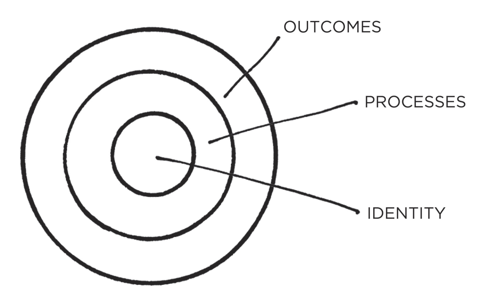
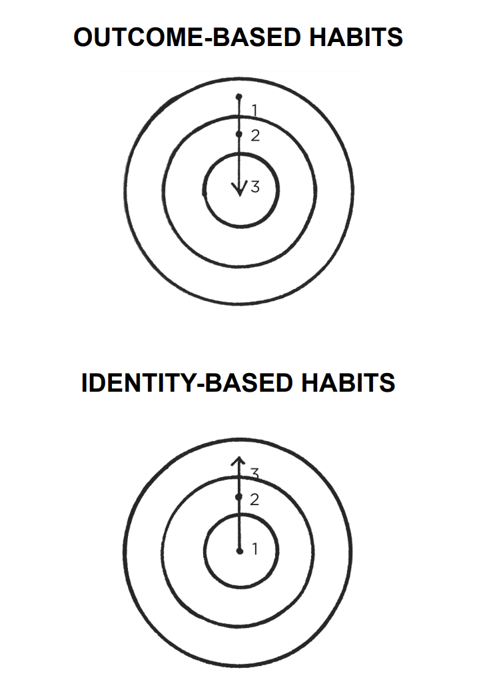
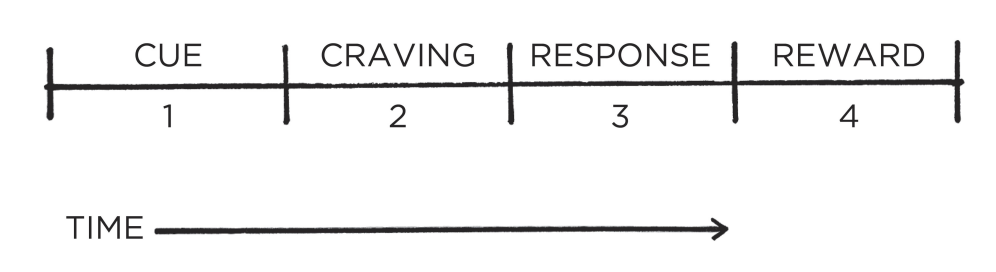
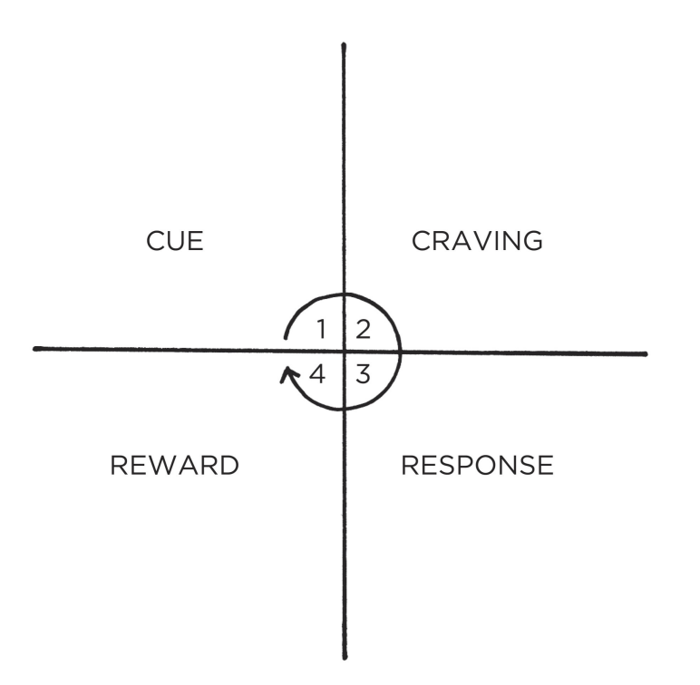
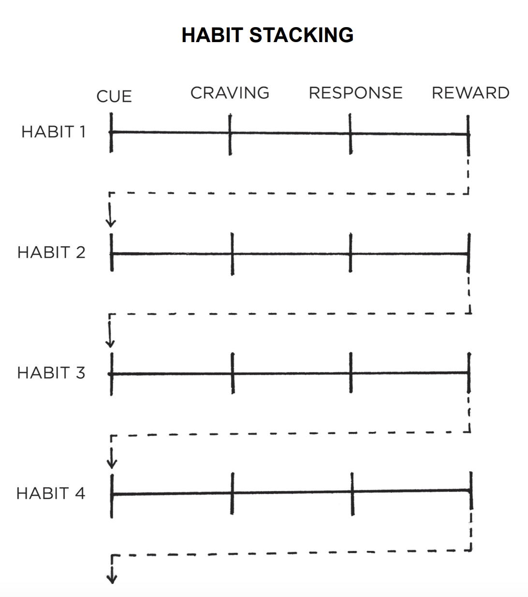
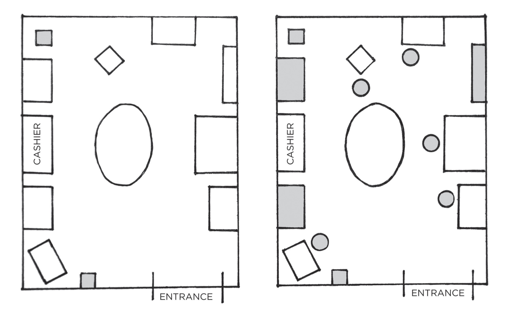

# Atomic Habits
# The Fundamentals
## The Surprising Power of Atomic Habits
The UK cycling team went from absolute noobs to winning championships in 5y all thanks to some coach who focused on the team improving via micro habits, which stack up over time.

Examples:
 * Experimented with different fabric for the outfits which are more aerodynamic
 * Tried different massages to optimize for fastest muscle recovery
 * Optimized hand-washing to minimize players getting a cold

Why does this work? Because of compounding, famously expressed via the formula 1.01^365 = 37.78, ie 1% improvement every day.

On the flip-side, getting 1% worse every day (0.99^365) results in 00.03.

Habits are the compound interest of self-improvement. They seem to make little difference day to day, but deliver massive impact over months & years.

Unfortunately, the slow velocity results in us underestimating the effect of both good and bad habits:
 * We tend to skip workouts
 * We tend to binge-watch netflix or eat a lot

We do this because short-term positive and negative impact is minimal, but that's not the case in the long-term.

**Key takeaway** - focus on putting yourself on the path to success, not on being successful. Focus on your trajectory, rather than current results.

The effect of habits is similar to the behavior of a melting cube. 
While the temperature in a room is increasing, the ice cube seemingly stays in tact, but at some point, a 1 degree increase leads to the cube melting.

Breakthrough moments are the result of many previous actions that build up the potential for a major change. Habits work similarly.

This is one of the core reasons people don't stick to habits - they don't have the patience to wait for the breakthrough because they expect linear gains.

The author refers to the time before a breakthrough as **the plateau of latent potential**.

**Forget about goals, focus on systems.**

Goals are about the results you want to achieve, systems are about the processes that lead to those results.

Goals make sense for setting direction, but systems are best for making progress towards that direction.

Problems with goal-setting:
 * Winners and losers share the same goals - survivorship-bias kicks in. Only a handful of goal-setters succeeded and those are the ones we see. We don't see the dozens of failures.
 * Achieving a goal is a momentary change - by achieving a goal, you're treating a symptom, not the root cause. You can clean your room once, but you need a system to keep it tidy over time.
 * Goals restrict your happiness - you defer happiness until you reach your goal, after which you defer for the next one. Enjoying the process lets you be happy while your system is running.
 * Goals are at odds with long-term progress - once you reach your goal, there's nothing motivating you to keep going. Goal-setting focus is winning the game, systems focus is to continue playing it.

**You don't rise to the level of your goals, you fall to the level of your systems.**

**Atomic** habits are partially about creating tiny habits, but also, they're meant to be the atoms of something bigger, the building blocks of remarkable results.

## How Your Habits Shape Your Identity (and Vice Versa)
It's often difficult to keep up with good habits or prevent yourself from doing bad habits for more than a few days.

The reason we fail to change our habits is for two reasons:
 * We try to change the wrong thing
 * We try to change our habits in the wrong way

This chapter addresses the former issue, the rest of the chapters focus on the latter.

### Three Layers of Behavior Change

A change can occur at three layers.
 * Outcomes (what you get) - changing results, ie losing weight, winning a championship, publishing a book
 * Process (what you do) - changing your habits and systems, starting a new gym routine, decluttering workplace, etc
 * Identity (what you believe) - changing your beliefs, self-image, judgements, biases, etc

Neither level is better or worse. The issue is with the direction of change we attempt.

Former builds outcome-based habits. These people focus on what they want to achieve.

Latter builds identity-based habits. These people focus on who they wish to become.

Behavior that is incongruent with the self will not last.

Examples:
 * you want more money but if your identity is of one who consumes, rather than create, that will not happen
 * you want better health but if you continue to prioritize comfort over accomplishment, that will not happen

The ultimate form of intrinsic motivation is when a habit becomes part of your identity. 
If you take pride in the outcomes you achieve by sticking to a habit, you'll fight hard to maintain your habits.

Focus on changing your identity, not achieving a particular goal:
 * Don't aim for reading a book, aim for becoming a reader
 * Don't aim for running a marathon, aim to become a runner
 * Don't aim to learn an instrument, aim to become a musician

This is a double-edged sword. If your identity is working against you, it is a curse:
 * "I'm not a morning person"
 * "I'm always late"
 * "I'm horrible at math"

Over time, you start resisting certain actions because they are against your identity.

### The Two-Step Process To Changing Your Identity
Your identity emerges out of your habits. Every belief is learned and conditioned through experience.

You believe things about your identity because you have proof of it.
 * You go to church every sunday for 20 years - you have proof you're religious
 * You study biology for 1h every night - you have proof you're studious 
 * You go to the gym when it's snowing - you have proof you are committed to working out

You habits are not the only thing reinforcing your identity but it's usually the most important one.

The effect of one-off experiences fades away while the effect of habits gets reinforced with time.

Every action you take is a vote for the type of person you wish to become. 
No single instance of working out will make you an athlete, but working out continuously will.

Meaningful change does not need radical change. Small habits make a meaningful difference by being applied over time.

Each habit not only gets results, but more importantly, teaches you to trust yourself. 
When the votes of change mount up, you start to believe you're a different person.

It works in the opposite direction as well unfortunately. However, note that it's normal to have votes in opposite directions.

You don't win the election by having unanimous votes, you win by having the majority.

Decide who you want to be. It's okay to start from the results you want, but work backwards to figure out what type of person you have to become that will achieve those results.

Once that's settled, begin taking small, consistent steps, that will take you in that direction.

The formation of habits is a feedback loop - your habits shape your identity and your identity shapes your habits.

It's important to let your habits, principles and values drive that loop, not your results.

### The Real Reason Habits Matter
The first step in behavior change is not what or how. It is who - who you want to become.

The real reason habits matter is not what you can achieve through them, but what you can become through them.

You become your habits.

## How to Build Better Habits in 4 Simple Steps
Behaviors followed by satisfying consequences tend to be repeated.
Those that produce unpleasant consequences tend not to.

This is demonstrated by a story about an experiment with cats where a cat was put in a closed box, which opens when you push a button.
Initially, the cats tend to do random actions until they accidentally stumble upon the button. 
Over time, they tend to improve and eventually, start solving the task in a few seconds.

### Why Your Brain Builds Habits
A habit is a behavior repeated enough to become automatic. Building a habit begins by trial and error. During this time, brain activity is significant.

Once you stumble upon a solution that works for you, you start gravitating towards repeating it. The more you do it, the easier it becomes.

Examples - you feel anxious after work and you learn that playing video games/going for a run/etc calms you down.

Once you learn that you enjoy a certain outcome, your brain starts reverse engineering the actions which took you there and removing unneeded ones to optimize the process.

To sum it up - habits are reliable solutions to reoccurring problems.

It is a very useful optimization due to the fact that the brain's conscious mind can only focus on one thing at the time. 
It likes delegating some activities to the unconscious one which can work in the background. That's where habits go to.

Some people worry that building too many habits make your life dull & automatic. On the contrary, building habits complements attaining freedom.

Examples:
 * Without good financial habits, you will be struggling for every dollar
 * Without good health habits, you will always be short on energy
 * Without good learning habits, you will always be behind others

If you constantly need to make decisions about simple tasks, ie when should I work out, when do I pay the bills, etc, then you will have less time for freedom.

### The Science of How Habits Work
The process of building a habit can be divided into four parts - Cue, Craving, Response, Reward.

This is the backbone of every habit and your brain runs through these steps in order every time.

The cue is a trigger which initiates the behavior - a bit of information that predicts a reward.

In the past, the cues signaled the location of food, water, sex. 
Nowadays, the cues predict secondary rewards, ie money and fame, power and status, praise and approval, etc.

These pursuits also indirectly improve our odds of survival and reproduction, which is the greater motive behind what we do.

A cue leads to craving. That's the motivational force behind every habit. Without some motivation or desire, we have no reason to act.
What you crave is not the habit itself, but the reward it provides, ie you don't crave smoking a cigarette, but the relief it provides.

Cravings differ from person to person. The sounds of slot machines spark a desire in gamblers, but are just background noise to non-gamblers.

The third step is the response - the actual habit you perform. It can be a thought or an action.

Whether the response occurs depends on how motivated you are and how much friction is involved.

If an action requires more effort than you are willing to expend, you won't do it. 
It also depends on your ability - if you want to dunk a basketball but are not high enough to do it, you won't do it.

Finally, the response delivers a reward. That's the end goal of every habit. We chase rewards because they either satisfy us or they teach us.

Rewards provide benefits on their own, ie getting a promotion gets you more money or respect, but the more immediate benefit is that rewards satisfy your craving to eat or gain status.

Additionally, rewards teach us which actions are worth remembering in the future. Your brain constantly monitors for rewards which satisfy your cravings and deliver pleasure.
That's what helps your brain distinguish useful actions from useless ones.

If a behavior is insufficient in any of the four stages, it will not become a habit:
 * no cue => behavior will never start
 * reduce craving => no willingness to start
 * make it difficult => you won't be able to do it
 * reward is not satisfying => no reason to do it again

### The Habit Loop

The cue triggers a craving, which motivates a response, which provides a reward, which becomes associated with the cue.

These four steps form a feedback loop, that enable you to create automatic habits. This cycle happens continuously at all times.

The steps can be split in two - the problem phase and the solution phase. Several examples:
 * your phone buzzes (cue), you want to learn message contents (craving), you grab your phone (response), you satisfy your curiosity (reward)
 * you are answering emails (cue), you feel stressed and overwhelmed (craving), you bite your nails (response), you reduce your stress (reward)

By the time we are adults, we rarely notice the habits that are running our lives.

### The Four Laws of Behavior Change
In the following chapters, we'll see a dozen examples of how these four steps dictate our lives.

Before we do that, we need to transform these steps into a practical framework we can use to design good habits and eliminate bad ones.

How to make good habits: 
 * make it obvious (cue)
 * make it attractive (craving)
 * make it easy (response)
 * make it satisfying (reward)

Let's invert those to see how to stop bad habits:
 * make it invisible (cue)
 * make it unattractive (craving)
 * make it difficult (response)
 * make it unsatisfying (reward)

These laws apply to nearly any field. Whenever you want to change your behavior, you can use those tools to achieve your goal.

Whenever you fail to form a good habit or remove a bad one, the answer typically lies somewhere above, in those four steps.
Every goal is doomed to fail if it goes against human nature.

Your habits are shaped by the systems in your life. 

# 1st Law - Make it Obvious
# The Man Who Didn't Look Right
Author shares a story about a skilled medical worker who was able to recognize that her father-in-law was about to get a heart attack based on the color of his skin.

He got to the hospital and was undergoing a lifesaving surgery a few hours later.

This is all due to the brain's ability to absorb experience and enable you to identify patterns invisible to the untrained eye. Our brains can do a lot not through active thinking.

Similarly, our habits can initiate based on a cue without actively thinking about the cue. This is what makes them remarkable but also dangerous as once a habit has settled in, it occurs without us thinking about it.

Examples:
 * You cover your mouth when laughing
 * You apologize before asking a question
 * You finish other people's sentences

All this happens unconsciously and you'd need someone to point this out for you to notice.

Due to this, we must begin the process of behavior change with awareness. Before building new habits, we need to get a handle on our current ones.

### The Habits Scorecard
The japanese workers at train stations use a technique called "pointing-and-calling" which is meant to minimize mistakes.

It works by saying facts they see out loud, ie current time, speed of train, signal is green, etc.

This mechanism works surprisingly well - it reduces errors by 85% and accidents by 30%.

This process works so well because it raises the level of awareness from a non-conscious habit to a conscious one.

The habits scorecard steps on this process and is meant to raise your awareness about your habits.

Start by jotting down all the behaviors you exhibit during the day, ie:
 * Wake up
 * Turn off alarm
 * Check phone
 * Go to bathroom
 * etc...

Assign + (good), - (bad), = (neutral) to each of your habits.

It's challenging to determine whether a habit is good or not as it depends on what your goals are. One way to think about good/bad habits is to consider whether a habit will give you net positive benefit in the long-term.

For example, smoking a cigarette can reduce stress now but cost you your health in the long-run.

In addition, to listing your habits, try pointing and calling them to raise your awareness of them. If you're about to eat a cookie, say out loud "I'm about to eat this cookie although I'm not hungry and I will gain weight as a result".

Hearing your bad habits spoken out loud makes the consequences seem more real and you'll be more likely to avoid doing them.

## The Best Way to Start a New Habit
In a research, scientists found that people who make a plan to workout were much more likely to do it compared to people who relied on motivation alone.

The technique which helped the successful group stick to their workouts is called "implementation intention" - a plan you make beforehand about when and where to act. In particular, the participants had to write out a sentence "During the next week, I will partake in at least 20 mins of exercise on [day] at [time] in [location]"

The cues that trigger a habit can manifest in many forms - phone buzzing, smell of chocolate, etc.

But the most common cues are time and location. Implementation intention leverages both of them.

Researchers have also found that being more granular increases the odds of success, ie detailing what route you're going to get to the gym, what transport you're going to use, etc.

The main takeaway is that people who make a specific plan for when and where they will perform a new habit are more likely to do it.

It is insufficient to plan to perform a habit when you feel like it, or the right time comes, etc.

If you aren't sure when to start a new habit, try the first day of the year, month, week, because people are more likely to take action in these times as hope is higher.

Another benefit to implementation intentions is that they make it easy to say no to distractions which take you off course.

When your dreams are vague, it is easy to rationalize little exceptions all day vs. doing what you have to do to succeed.

One of the best ways to use implementation intentions is to leverage a technique called habit stacking.

A well-known example of how this manifests is the Diderot effect. It comes from the story about a french philosopher called Diderot, who acquired a new, beautiful dress and that lead to him refurnishing his whole house as an effect because all his old possessions looked out of place compared to the new dress.

In summary, the diderot effect states that obtaining a new possession often leads to a spiral of consumption.

Examples:
 * You buy a new couch and now you have to change the layout of your whole living room
 * You get new earrings and now you have to get new dress & shoes to match

People often decide what to do next based on what they just finished doing - ie going to the bathroom reminds you to brush your teeth, wash clothes, etc.

This caveat of our behavior can be leveraged for forming new habits.

One of the best ways to start a new habit is to attach it to an existing habit you're already doing. This is called habit stacking.

It's a variation of implementation intention where instead of pairing your habit with a date & time, you pair it with an existing habit.

Examples:
 * After I pour my cup of coffee, I will meditate
 * After I take off my work shoes, I will exercise
 * After I get into bed, I will kiss my partner

Once you master the basic version, you can start chaining numerous habits like this to form larger stacks. You're leveraging the positive momentum of performing a habit to initiate in the next one.

Example habit stack - after I pour my morning cup of coffee, I will medidate. After I meditate, I will write my todo list, etc.

Once you get comfortable with habit stacks, you can develop a more general version, which guides you when the situation is appropriate:
 * When I see a set of stairs, I will take them instead of using the elevator
 * When I walk into a party, I will introduce myself to someone I don't know yet

The secret to creating a successful habit stack is to choose the right time and location to initiate the cue.

If you want to start meditating in the mornings, but they tend to be chaotic because of kids, that might not be the right moment.

Additionally, take into consideration frequency. If you want to do something every day, but the habit you stack it on only happens on Monday, that might not be the right habit to stack on.

To make this right, consider brainstorming a list of your current habits and deciding which one to turn into a stack from there.

Habit stacks work best when the cue is highly specific and actionable. If it's vague, it might not happen.

Example - doing push-ups during lunch break. But when exactly? Before you eat, after you eat, where, etc?

Better alternative - when I close my laptop for lunch, I will do my push-ups.

The more specific you are, the higher your likelihood of success.

The first law of behavior change is "make it obvious". Implementation intentions and habit stacks are practical ways to create obvious cues for your new habits.

# Motivation Is Overrated; Environment Often Matters More
Author begins chapter by mentioning a study which had the ambition to change hospital personnel's eating habits without demanding willpower or motivation.

To accomplish that, they rearranged the cafeteria room in a way that bottled water was available everywhere vs only in one location.

This lead to 11% drop in sales of soda and 25% increase in bottled water sales without anyone mentioning a thing.

In the above picture, shaded areas are where bottled water was stored before/after the study.

People choose products not because of what they are but where they are - eg if you see a plate of cookies as you walk into the kitched, you'll grab some even if you're not hungry.

Environment is the invisible hand shaping human behavior.

The most common form of change is external, not internal.

A prominent formula states that behavior is a function of the person and their environment:
 * Eg you tend to purchase items in the store at eye level more commonly than items close to the floor
 * People tend to buy starbucks because its at every corner

People have many receptors, both internal and external but the most impactful one is vision.

A small change in what you see can lead to a big change in what you do.

## How to design your environment for success
Some dutch researchers noticed how certain households spent 30% less electricity than others.

Turns out that's the case because their electricity meter is in the main hallway, easy to see, so having that visible lead to less consumption.

When energy use is obvious and easy to track, people changed their behaviors.

Every habit is initiated by a cue and we are more likely to notice cues that standout:
 * It's hard to practice the guitar if it's tucked in the basement
 * It's hard to read a book when it's at a bookshelf in the guest room

However, creating obvious cues can draw your attention toward a desired habit:
 * Putting apples in the middle of the kitchen will make you eat more apples
 * If you want to practice guitar more, place it in the middle of the living room

If you want to make a habit a big part of your life, make the cue a big part of your environment.

In fact, you can have multiple triggers around your environment to increase the likelihood you'll engage in your target habit.

## The Context is The Cue
Cues that trigger a habit can start specific but over time, your habit becomes associated with the environment, surrounding the cue, eg people tend to drink more in social situations.

Think of your environment not as a set of objects, but a set of relationships w/ the objects in it.

In one study, insomniacs were told to stay in a room different than their bedroom and only go to bed if they feel tired. This lead them to fall asleep more quickly because bed was associated with sleeping.

An important strategy involving context is changing your environment in order to build new habits.

It is easier to build a new habit in a new environment, than build it in an environment already associated with other habits.

If you can't build a new environment, try redefining your current one by segregating it into spaces for work, study, exercise, etc.

Use the mantra "one space, one purpose". Avoid mixing the context of one habit with another, usually the easier ones win out.

This is why using your phone can be powerful because of all the things you can do with it, but oftentimes, you default to using it for distracting yourself because that's the easiest habit within that context.

If you're limited by the size of your apartment, try dividing your room into activity zones, ie use your computer for work, tablet for reading, desk for writing, etc.

Focus comes easier in the desk you only use for working, sleep comes easier in the bedroom if that's all you do there.

If you want stable and predictable behaviors, you need a stable and predictable environment.

# The Secret to Self-Control
Around the end of the vietnam war, some congressman visited soldiers and found out most of them were heroin addicts.

This lead to some programs to help addicted give up heroin once they come back home from the war.

But guess what, when they came back home, most of them gave up on heroin, only ~10% relapsed in 3y.

Why? - there was a radical change in the environment.

In Vietnam, there were cues everywhere - stress from war, easy to get, etc. Once they came back home, all those where gone and no one around them was taking heroin.

When the context changed, so did the habit.

Normal drug addicts have a harder time getting off addiction because it's within their environment.

They can go to a clinic and stop it for a while but once they go back home, the old cues start resurfacing again.

~90% of heroin users get re-addicted once they go back home.

The idea that a little bit of discipline would solve all our problems is deeply embedded in our culture. Recent research, however, suggests something else.

Most people who are seen as strongly disciplined are not that different from non-disciplined folks. They just structure their environment in a way which makes it easier to stay healthy.

The people with the best self-control are the ones that need to use it the least.

Once a habit is encoded in the brain, it is ready to be used whenever the relevant situation arises.

Author tells a story about long-time smoker who used to smoke while riding a horse. They stopped smoking but 20y later, when they rode a horse again, they felt the urge to smoke again.

What's more if you stress out a person by eg suggesting they're overweight, they tend to reach out to old bad habits and overeat more.

You can break a habit but you're unlikely to forget it. Once it's encoded, it stays for life. This is why resisting temptation is not an effective strategy as you can't do it all the time.

A more reliable strategy is to cut habits at the source - reduce exposure to the cue that causes it:
 * If you can't get any work done, leave your phone in the other room
 * If you continually feel you're not enough, stop following social media
 * If you're wasting too much time watching TV, move the TV outside the bedroom

This practice is an inversion of the first principle - make it invisible.

Self-control is a short-term strategy, not a long-term one. Instead, spend your energy optimizing your environment.

Make the cues of your good habits obvious and the cues of the bad ones invisible.

# 2nd Law - Make it Attractive
# How to Make a Habit Irresistible
