# Scale From Zero to Millions of Users
Here, we're building a system that supports a few users & gradually scale it to support millions.

# Single server setup
To start off, we're going to put everything on a single server - web app, database, cache, etc.
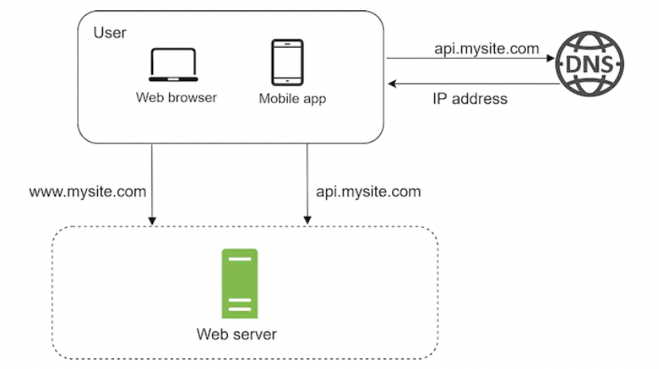

What's the request flow in there?
 * User asks DNS server for the IP of my site (ie `api.mysite.com -> 15.125.23.214`). Usually, DNS is provided by third-parties instead of hosting it yourself.
 * HTTP requests are sent directly to server (via its IP) from your device
 * Server returns HTML pages or JSON payloads, used for rendering.

Traffic to web server comes from either a web application or a mobile application:
 * Web applications use a combo of server-side languages (ie Java, Python) to handle business logic & storage. Client-side languages (ie HTML, JS) are used for presentation.
 * Mobile apps use the HTTP protocol for communication between mobile & the web server. JSON is used for formatting transmitted data. Example payload:
```
{
  "id":12,
  "firstName":"John",
  "lastName":"Smith",
  "address":{
     "streetAddress":"21 2nd Street",
     "city":"New York",
     "state":"NY",
     "postalCode":10021
  },
  "phoneNumbers":[
     "212 555-1234",
     "646 555-4567"
  ]
}
```

# Database
As the user base grows, storing everything on a single server is insufficient. 
We can separate our database on another server so that it can be scaled independently from the web tier:
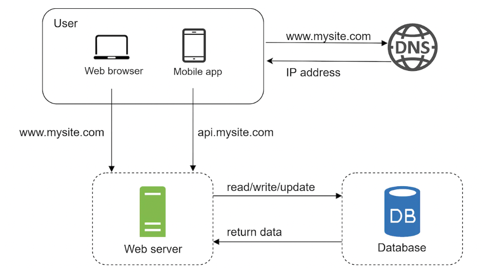

## Which databases to use?
You can choose either a traditional relational database or a non-relational (NoSQL) one.
 * Most popular relational DBs - MySQL, Oracle, PostgreSQL.
 * Most popular NoSQL DBs - CouchDB, Neo4J, Cassandra, HBase, DynamoDB

Relational databases represent & store data in tables & rows. You can join different tables to represent aggregate objects.
NoSQL databases are grouped into four categories - key-value stores, graph stores, column stores & document stores. Join operations are generally not supported.

For most use-cases, relational databases are the best option as they've been around the most & have worked quite well historically.

If not suitable though, it might be worth exploring NoSQL databases. They might be a better option if:
 * Application requires super-low latency.
 * Data is unstructured or you don't need any relational data.
 * You only need to serialize/deserialize data (JSON, XML, YAML, etc).
 * You need to store a massive amount of data.

# Vertical scaling vs. horizontal scaling
Vertical scaling == scale up. This means adding more power to your servers - CPU, RAM, etc.

Horizontal scaling == scale out. Add more servers to your pool of resources.

Vertical scaling is great when traffic is low. Simplicity is its main advantage, but it has limitations:
 * It has a hard limit. Impossible to add unlimited CPU/RAM to a single server.
 * Lack of fail over and redundancy. If server goes down, whole app/website goes down with it.

Horizontal scaling is more appropriate for larger applications due to vertical scaling's limitations. Its main disadvantage is that it's harder to get right.

In design so far, the server going down (ie due to failure or overload) means the whole application goes down with it. 
A good solution for this problem is to use a load balancer.

# Load balancer
A load balancer evenly distributes incoming traffic among web servers in a load-balanced set:
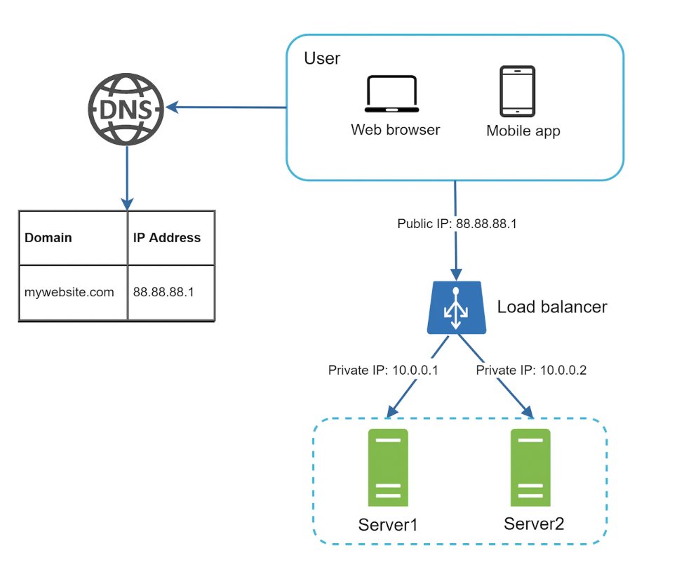

Clients connect to the public IP of the load balancer. Web servers are unreachable by clients directly.
Instead, they have private IPs, which the load balancer has access to.

By adding a load balancer, we successfully made our web tier more available and we also added possibility for fail over.

How it works?
 * If server 1 goes down, all traffic will be routed to server 2. This prevents website from going offline. We'll also add a fresh new server to balance the load.
 * If website traffic spikes and two servers are not sufficient to handle traffic, load balancer can handle this gracefully by adding more servers to the pool.

Web tier looks lit now. But what about the data tier?

# Database replication
Database replication can usually be achieved via master/slave replication (side note - nowadays, it's usually referred to as primary/secondary replication).

A master database generally only supports writes. Slave databases store copies of the data from the master & only support read operations.
This setup works well for most applications as there's usually a higher read to write ratio. Reads can easily be scaled by adding more slave instances.
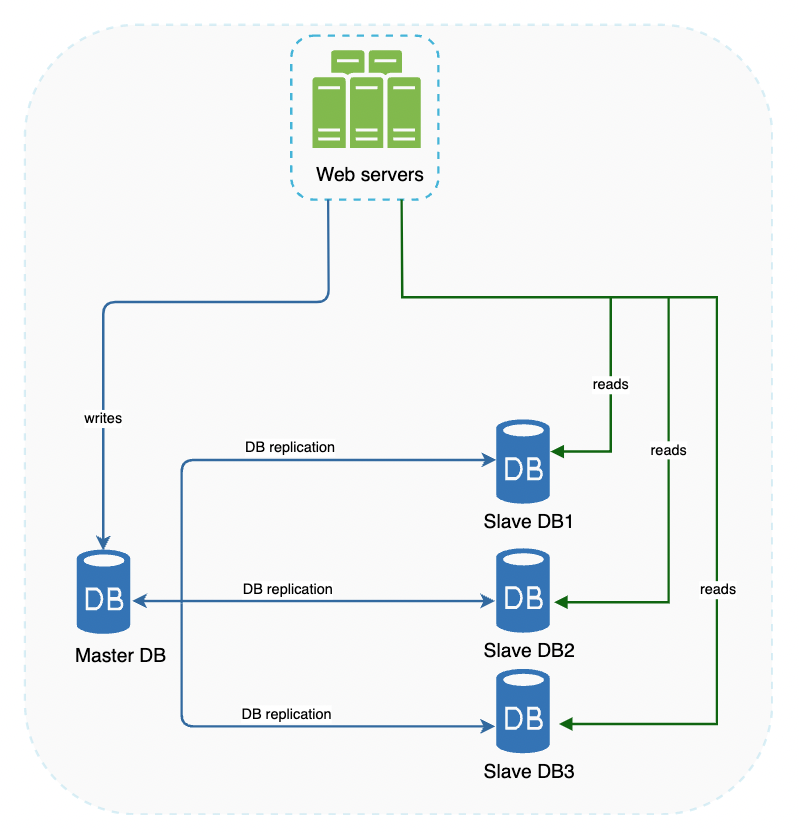

Advantages:
 * Better performance - enables more read queries to be processed in parallel.
 * Reliability - If one database gets destroyed, data is still preserved.
 * High availability - Data is accessible as long as one instance is not offline.

So what if one database goes offline?
 * If slave database goes offline, read operations are routed to the master/other slaves temporarily. 
 * If master goes down, a slave instance will be promoted to the new master. A new slave instance will replace the old master.
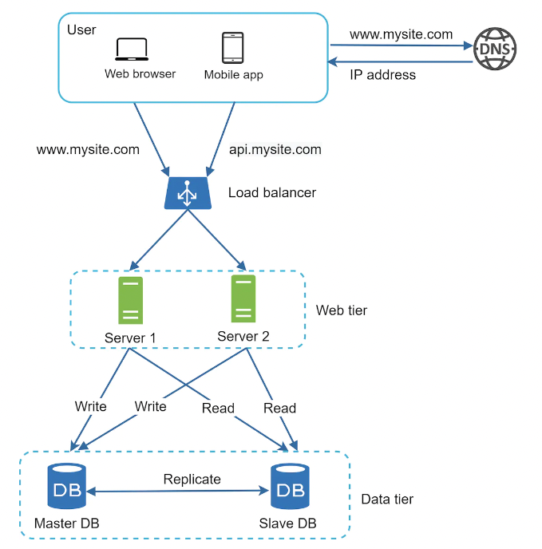

Here's the refined request lifecycle:
 * user gets IP address of load balancer from DNS
 * user connects to load balancer via IP
 * HTTP request is routed to server 1 or server 2
 * web server reads user data from a slave database instance or routes data modifications to the master instance.

Sweet, let's now improve the load/response time by adding a cache & shifting static content to a CDN.

# Cache
Cache is a temporary storage which stores frequently accessed data or results of expensive computations.

In our web application, every time a web page is loaded, expensive queries are sent to the database. 
We can mitigate this using a cache.

## Cache tier
The cache tier is a temporary storage layer, from which results are fetched much more rapidly than from within a database.
It can also be scaled independently from the database.
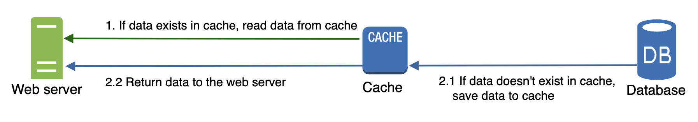

The example above is a read-through cache - server checks if data is available in the cache. If not, data is fetched from the database.

## Considerations for using cache
 * When to use it - usually useful when data is read frequently but modified infrequently. Caches usually don't preserve data upon restart so it's not a good persistence layer.
 * Expiration policy - controls whether (and when) cached data expires and is removed from it. Make it too short - DB will be queried frequently. Make it too long - data will become stale.
 * Consistency - How in sync should the data store & cache be? Inconsistency happens if data is changed in DB, but cache is not updated.
 * Mitigating failures - A single cache server could be a single point of failure (SPOF). Consider over-provisioning it with a lot of memory and/or provisioning servers in multiple locations.
 * Eviction policy - What happens when you want to add items to a cache, but it's full? Cache eviction policy controls that. Common policies - LRU, LFU, FIFO.

# Content Delivery Network (CDN)
CDN == network of geographically dispersed servers, used for delivering static content - eg images, HTML, CSS, JS files.

Whenever a user requests some static content, the CDN server closest to the user serves it:
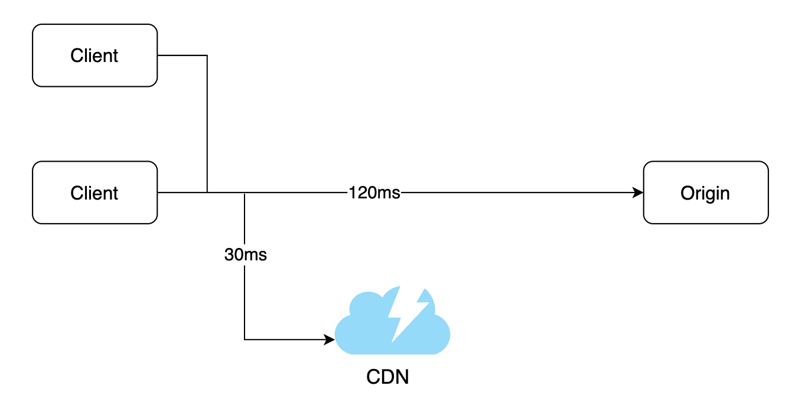

Here's the request flow:
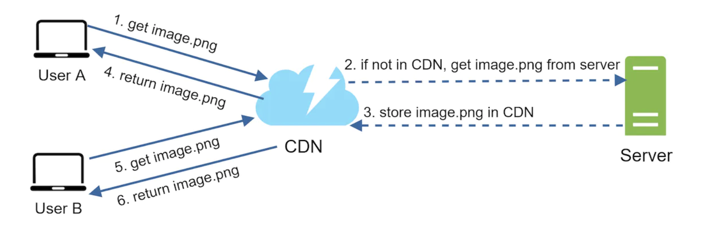
 * User tries fetching an image via URL. URLs are provided by the CDN, eg `https://mysite.cloudfront.net/logo.jpg`
 * If the image is not in the cache, the CDN requests the file from the origin - eg web server, S3 bucket, etc.
 * Origin returns the image to the CDN with an optional TTL (time to live) parameter, which controls how long that static resource is to be cached.
 * Subsequent users fetch the image from the CDN without any requests reaching the origin as long as it's within the TTL.

## Considerations of using CDN
 * Cost - CDNs are managed by third-parties for which you pay a fee. Be careful not to store infrequently accessed data in there.
 * Cache expiry - consider appropriate cache expiry. Too short - frequent requests to origin. Too long - data becomes stale.
 * CDN fallback - clients should be able to workaround the CDN provider if there is a temporary outage on their end.
 * Invalidation - can be done via an API call or by passing object versions.

Refined design of our web application:
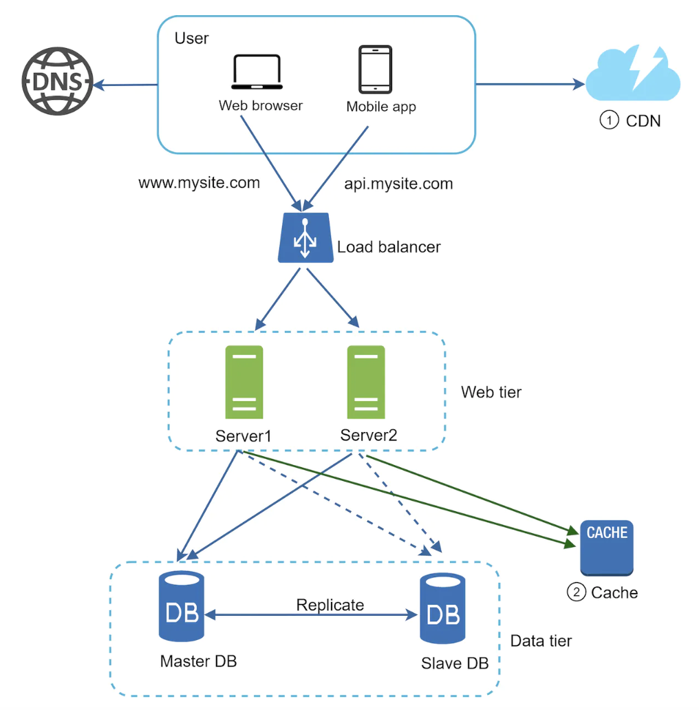

# Stateless web tier
In order to scale our web tier, we need to make it stateless.

In order to do that, we can store user session data in persistent data storage such as our relational database or a NoSQL database.

## Stateful architecture
Stateful servers remember client data across different requests. Stateless servers don't.
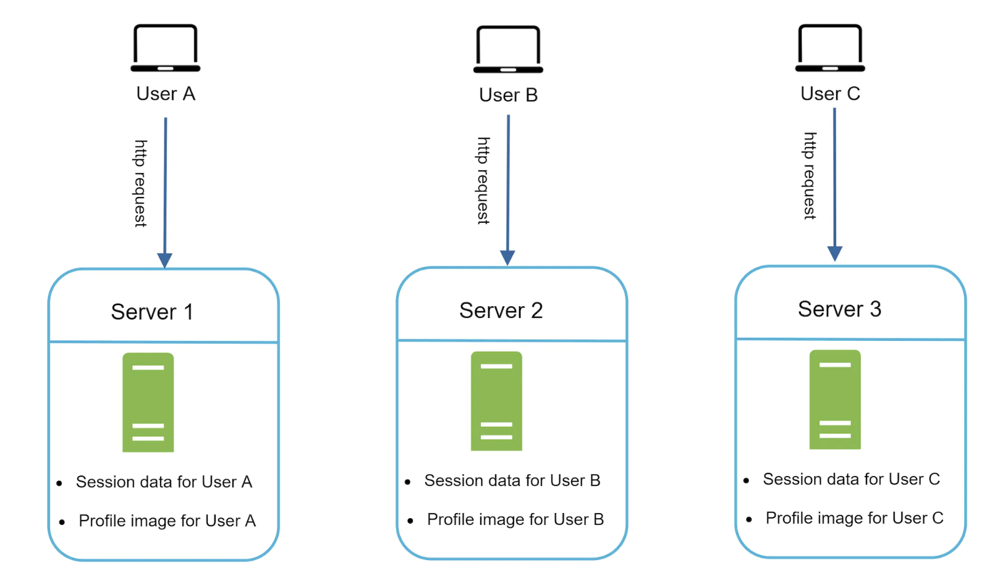

In the above case, users are coupled to the server which stores their session data. If they make a request to another server, it won't have access to the user's session.

This can be solved via sticky sessions, which most load balancers support, but it adds overhead.
Adding/removing servers is much more challenging, which limits our options in case of server failures.

## Stateless architecture
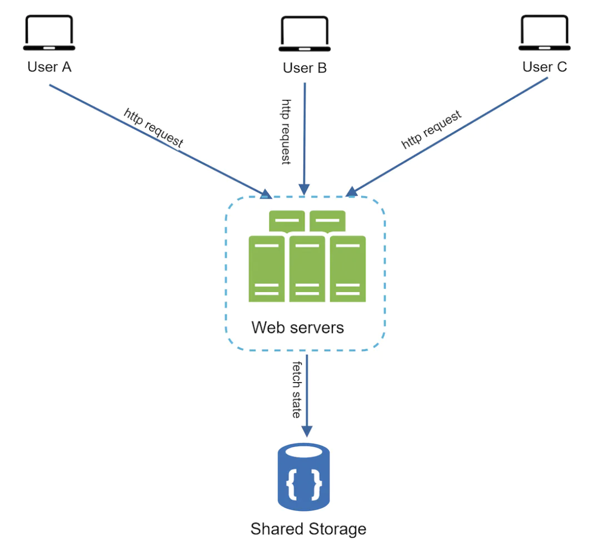

In this scenario, servers don't store any user data themselves. 
Instead, they store it in a shared data store, which all servers have access to.

This way, HTTP requests from users can be served by any web server.

Updated web application architecture:
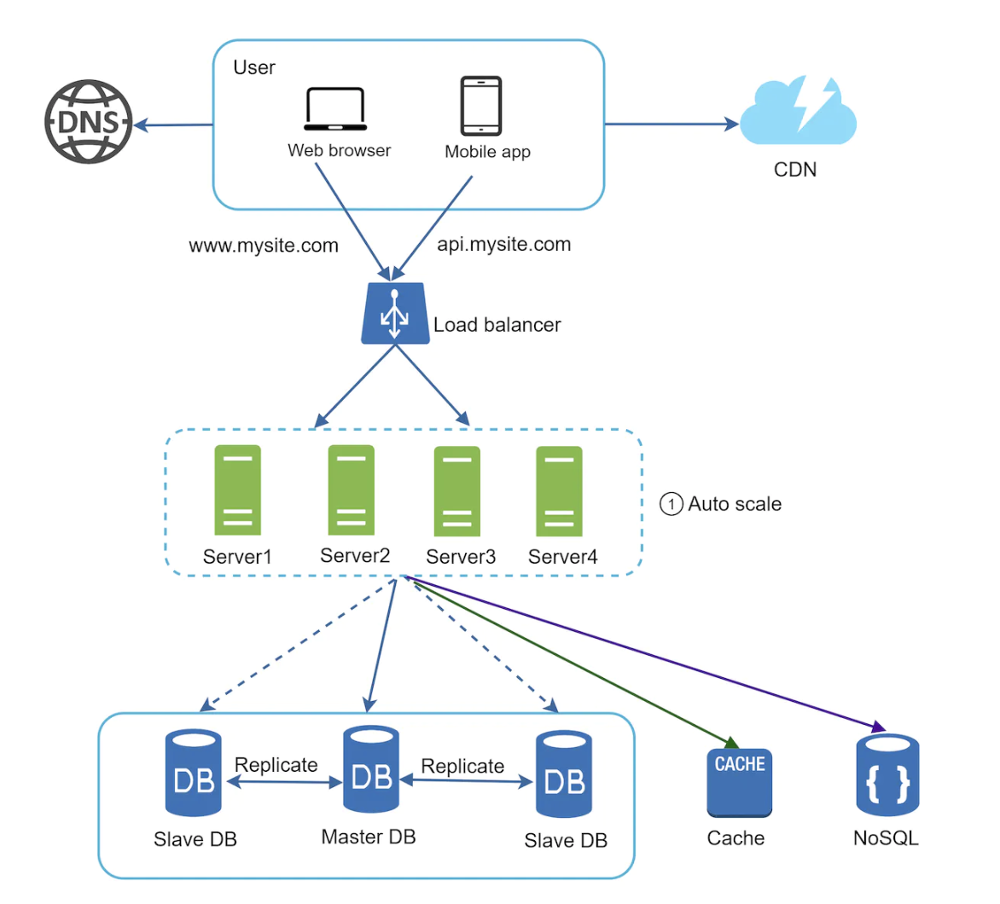

The user session data store could either be a relational database or a NoSQL data store, which is easier to scale for this kind of data.
The next step in the app's evolution is supporting multiple data centers.

# Data centers
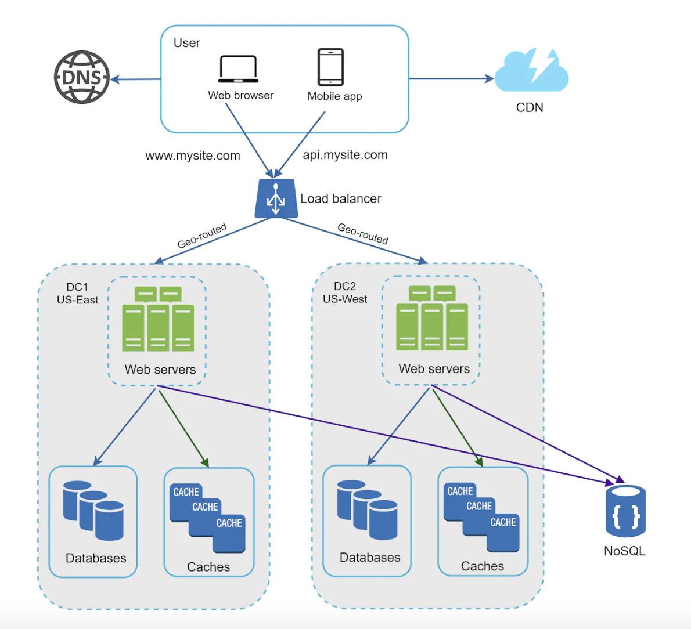

In the above example, clients are geo-routed to the nearest data center based on the IP address.

In the event of an outage, we route all traffic to the healthy data center:
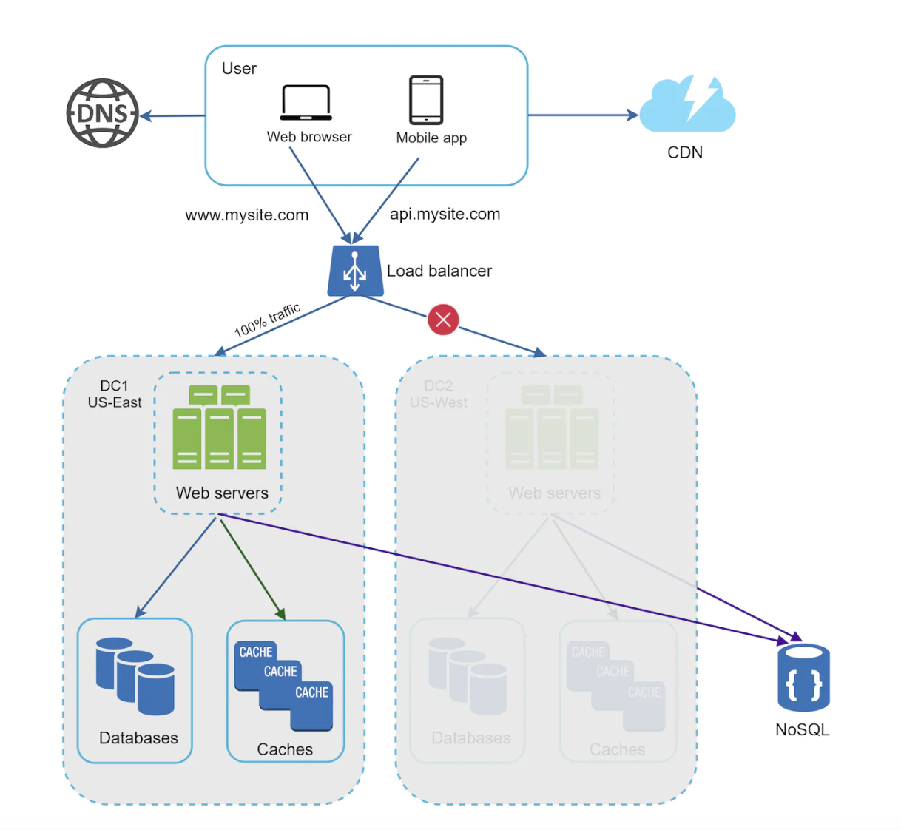

To achieve this multi-datacenter setup, there are several issues we need to address:
 * traffic redirection - tooling for correctly directing traffic to the right data center. GeoDNS can be used in this case.
 * data synchronization - in case of failover, users from DC1 go to DC2. A challenge is whether their user data is there.
 * test and deployment - automated deployment & testing is crucial to keep deployments consistent across DCs.
 
To further scale the system, we need to decouple different system components so they can scale independently.

# Message queues
Message queues are durable components, which enable asynchronous communication.
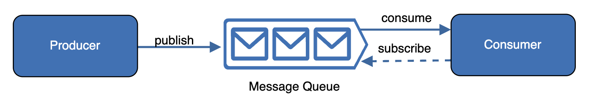

Basic architecture:
 * Producers create messages.
 * Consumers/Subscribers subscribe to new messages and consume them.

Message queues enable producers to be decoupled from consumers. 
If a consumer is down, a producer can still publish a message and the consumer will receive it at a later point.

Example use-case in our application - photo processing:
 * Web servers publish "photo processing tasks" to a message queue
 * A variable number of workers (can be scaled up or down) subscribe to the queue and process those tasks.
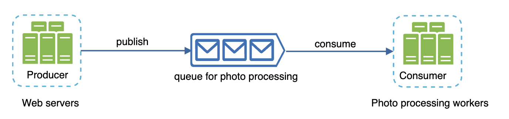

# Logging, metrics, automation
Once your web application grows beyond a given point, investing in monitoring tooling is critical.
 * Logging - error logs can be emitted to a data store, which can later be read by service operators.
 * Metrics - collecting various types of metrics helps us collect business insight & monitor the health of the system.
 * Automation - investing in continuous integration such as automated build, test, deployment can detect various problems early and also increases developer productivity.

Updated system design:
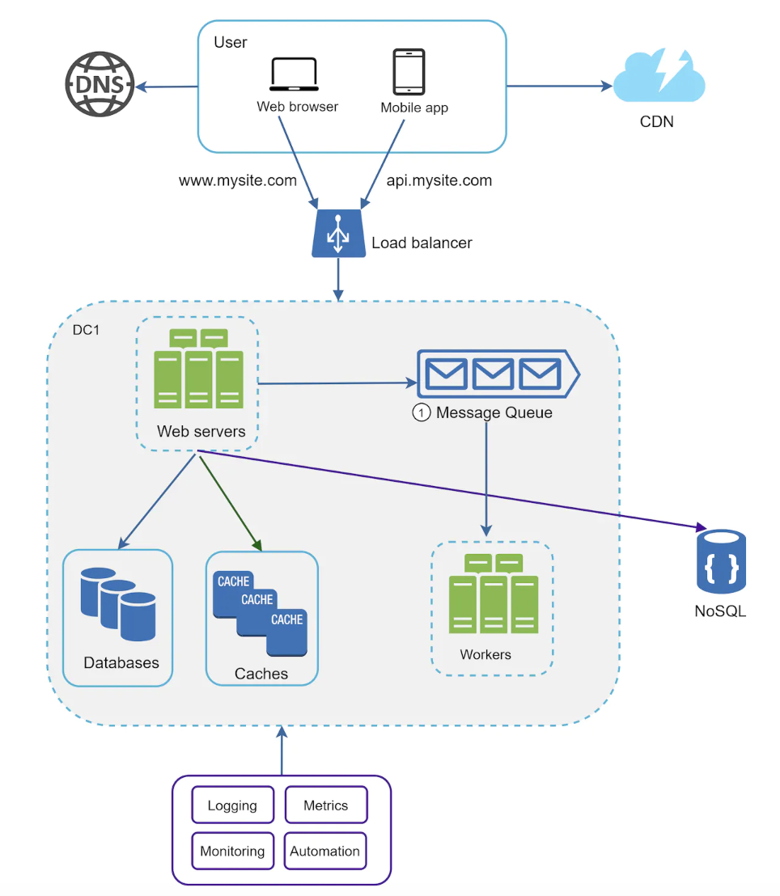

# Database scaling
There are two approaches to database scaling - vertical and horizontal.

## Vertical scaling
Also known as scaling up, it means adding more physical resources to your database nodes - CPU, RAM, HDD, etc.
In Amazon RDS, for example, you can get a database node with 24 TB of RAM.

This kind of database can handle lots of data - eg stackoverflow in 2013 had 10mil monthly unique visitors \w a single database node.

Vertical scaling has some drawbacks, though:
 * There are hardware limits to the amount of resources you can add to a node.
 * You still have a single point of failure.
 * Overall cost is high - the price of powerful servers is high.

## Horizontal scaling
Instead of adding bigger servers, you can add more of them:
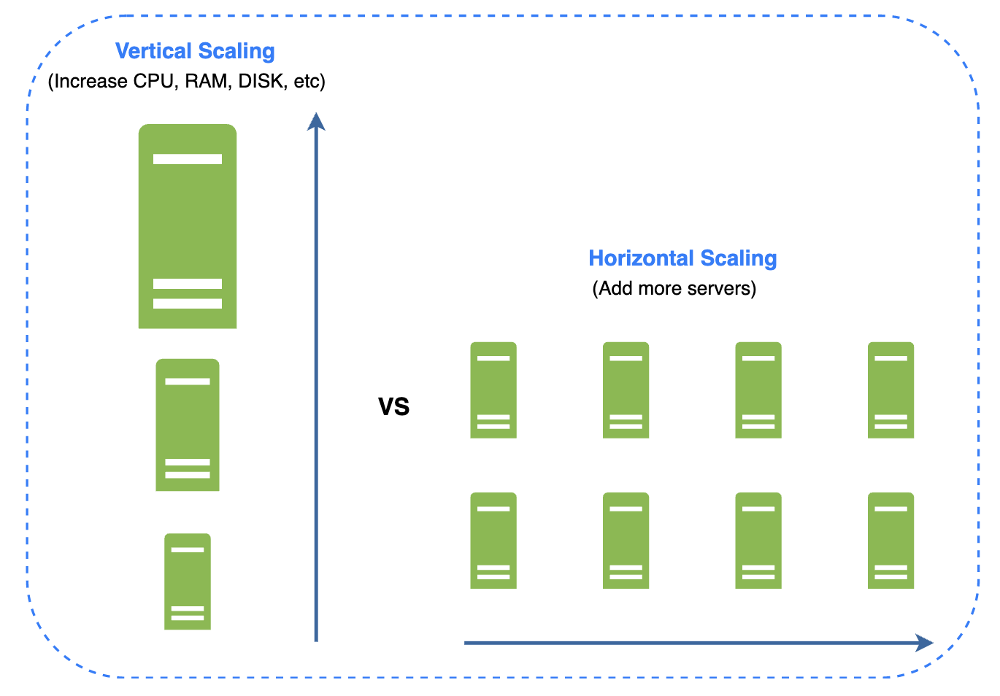

Sharding is a type of database horizontal scaling which separates large data sets into smaller ones.
Each shard shares the same schema, but the actual data is different.

One way to shard the database is based on some key, which is equally distributed on all shards using the modulo operator:
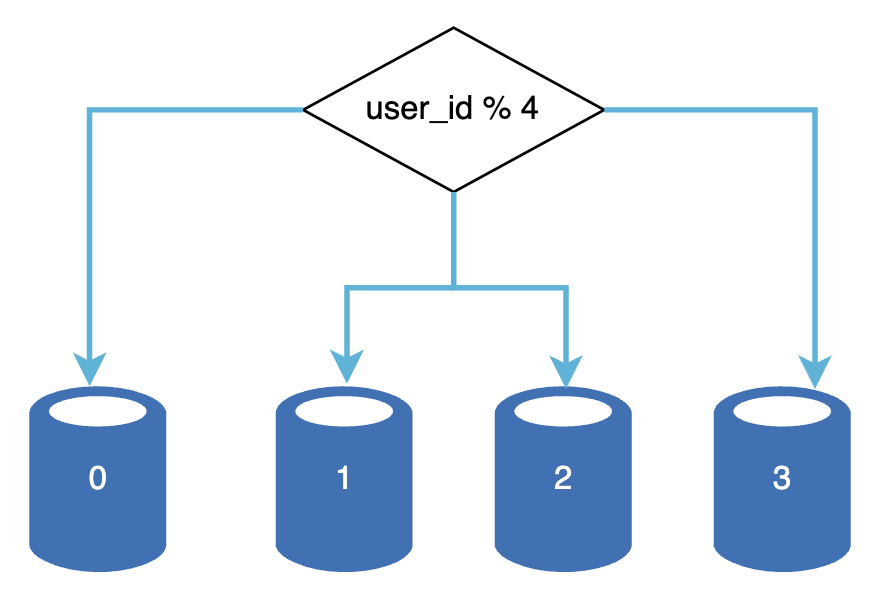

Here's how the user data looks like in this example:


The sharding key (aka partition key) is the most important factor to consider when using sharding.
In particular, the key should be chosen in a way that distributes the data as evenly as possible.

Although a useful technique, it introduces a lot of complexities in the system:
 * Resharding data - you need to do it if a single shard grows too big. This can happen rather quickly if data is distributed unevenly. Consistent hashing helps to avoid moving too much data around.
 * Celebrity problem (aka hotspot) - one shard could be accessed much more frequently than others and can lead to server overload. We may have to resort to using separate shards for certain celebrities.
 * Join and de-normalization - It is hard to perform join operations across shards. A common workaround is to de-normalize your tables to avoid making joins.

Here's how our application architecture looks like after introducing sharding and a NoSQL database for some of the non-relational data:
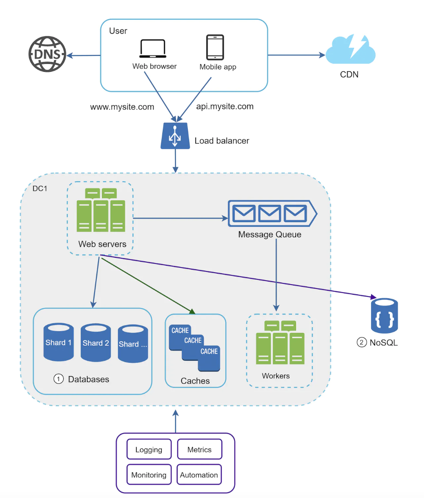

# Millions of users and beyond
Scaling a system is iterative.

What we've learned so far can get us far, but we might need to apply even more sophisticated techniques to scale the application beyond millions of users.

The techniques we saw so far can offer a good foundation to start from.

Here's a summary:
 * Keep web tier stateless
 * Build redundancy at every layer
 * Cache frequently accessed data
 * Support multiple data centers
 * Host static assets in CDNs
 * Scale your data tier via sharding
 * Split your big application into multiple services
 * Monitor your system & use automation
