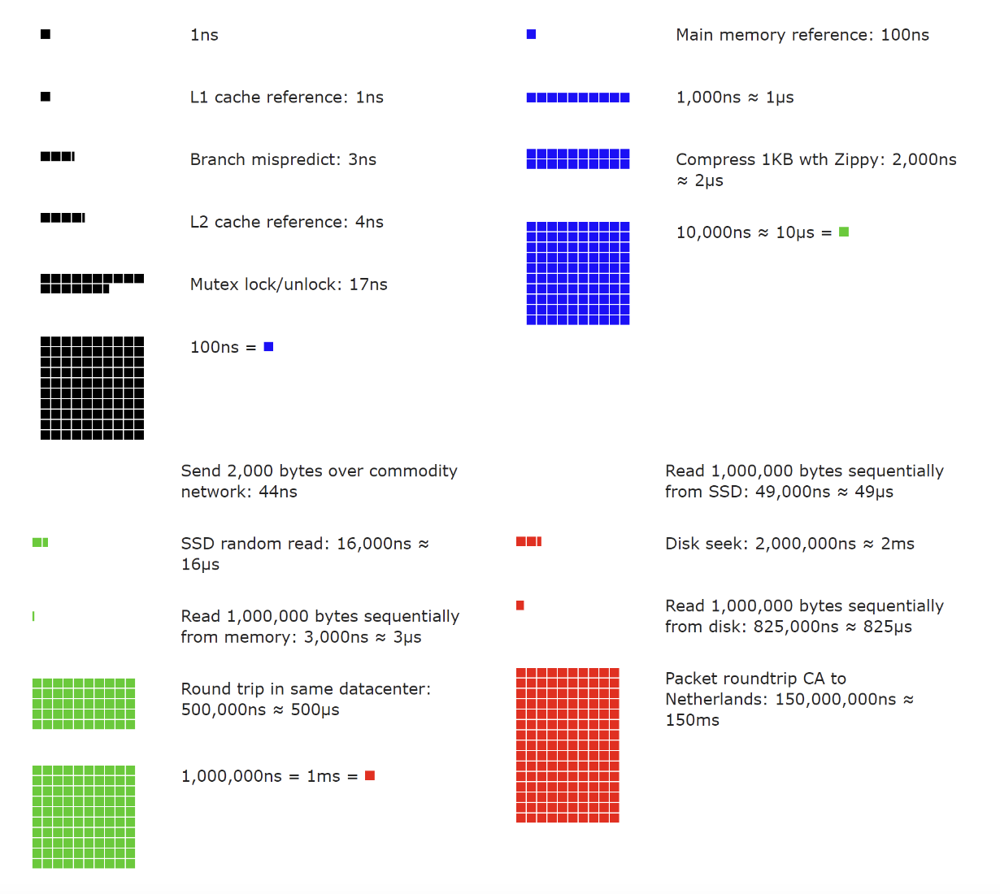
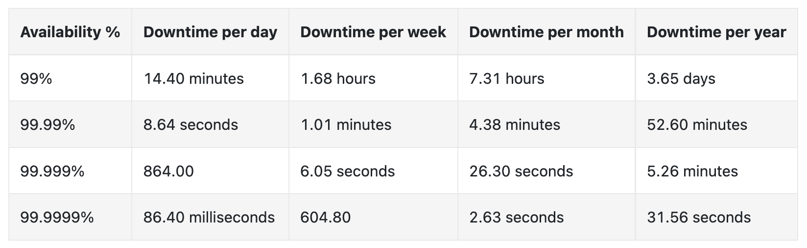

# Back-of-the-envelope Estimation
You are sometimes asked in a system design interview to estimate performance requirements or system capacity.

These are usually done with thought experiments and common performance numbers, according to Jeff Dean (Google Senior Fellow).

To do this estimation effectively, there are several mechanisms one should be aware of.

# Power of two
Data volumes can become enormous, but calculation boils down to basics.

For precise calculations, you need to be aware of the power of two, which corresponds to given data units:
 * 2^10 == ~1000 == 1kb
 * 2^20 == ~1mil == 1mb
 * 2^30 == ~1bil == 1gb
 * 2^40 == ~1tril == 1tb
 * 2^50 == ~1quad == 1pb

# Latency numbers every programmer should know
There's a well-known table of the duration of typical computer operations, created by Jeff Dean.

These might be a bit outdated due to hardware improvements, but they still give a good relative measure among the operations:
 * L1 cache reference == 0.5ns
 * Branch mispredict == 5ns
 * L2 cache reference == 7ns
 * Mutex lock/unlock == 100ns
 * Main memory reference == 100ns
 * Compress 1kb == 10,000ns == 10us
 * Send 2kb over 1gbps network == 20,000ns == 20us
 * Read 1mb sequentially from memory == 250us
 * Round trip within same DC == 500us
 * Disk seek == 10ms
 * Read 1mb sequentially from network == 10ms
 * Read 1mb sequentially from disk == 30ms
 * Send packet CA->Netherlands->CA == 150ms

A good visualization of the above:

Some conclusions from the above numbers:
 * Memory is fast, disk is slow
 * Avoid disk seeks if possible
 * Compression is usually fast
 * Compress data before sending over the network if possible
 * Data centers round trips are expensive

# Availability numbers
High availability == ability of a system to be continuously operational. In other words, minimizing downtime.

Typically, services aim for availability in the range of 99% to 100%.

An SLA is a formal agreement between a service provider and a customer. 
This formally defines the level of uptime your service needs to support.

Cloud providers typically set their uptime at 99.9% or more. Eg AWS EC2 has an SLA of 99.99%

Here's a summary of the allowed downtime based on different SLAs:

# Example - estimate Twitter QPS and storage requirements
Assumptions:
 * 300mil MAU
 * 50% of users use twitter daily
 * Users post 2 tweets per day on average
 * 10% of tweets contain media
 * Data is stored for 5y

Estimations:
 * Write RPS estimation == 150mil * 2 / 24h / 60m / 60s = 3400-3600 tweets per second, peak=7000 TPS
 * Media storage per day == 300mil * 10% == 30mil media storage per day
     * If we assume 1mb per media -> 30mil * 1mb = 30tb per day
     * in 5y -> 30tb * 365 * 5 == 55pb
 * tweet storage estimation:
     * 1 tweet = 64byte id + 140 bytes text + 1000 bytes metadata
     * 3500 * 60 * 60 * 24 = 302mb per day
     * In 5y -> 302 * 365 * 5 == 551gb in 5y

# Tips
Back-of-the-envelope Estimations are about the process, not the results. Interviewers might test your problem-solving skills.

Some tips to take into consideration:
 * Rounding and approximation - don't try to calculate 99987/9.1, round it to 100000/10 instead, which is easier to calculate.
 * Write down your assumptions before going forward with estimations
 * Label your units explicitly. Write 5mb instead of 5.
 * Commonly asked estimations to make - QPS (queries per second), peak QPS, storage, cache, number of servers.
