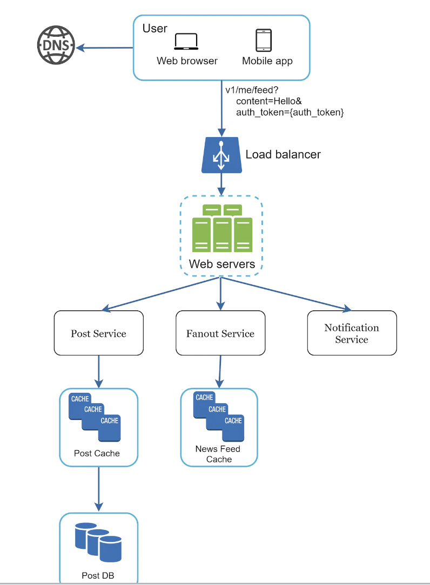
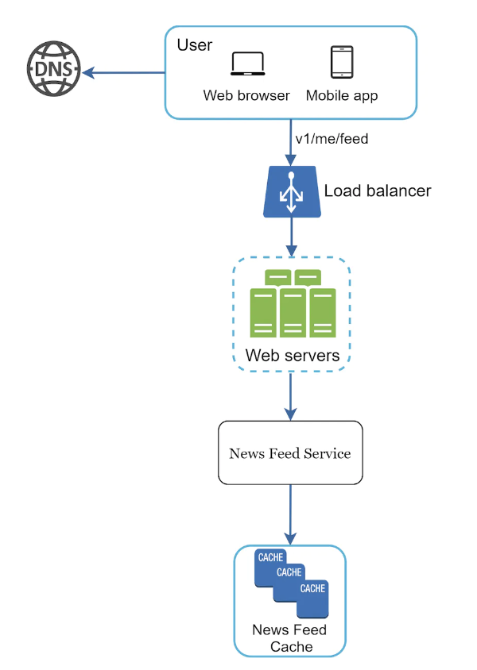
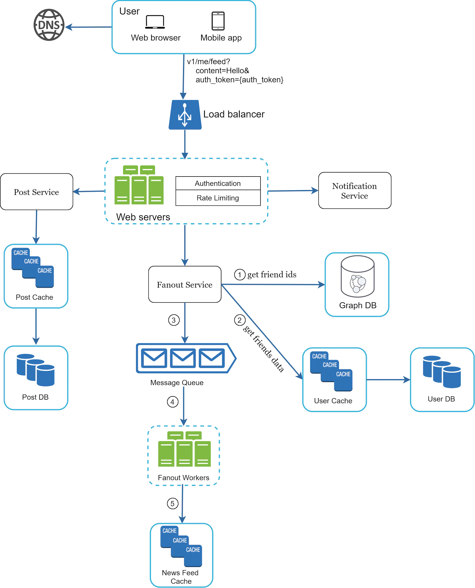
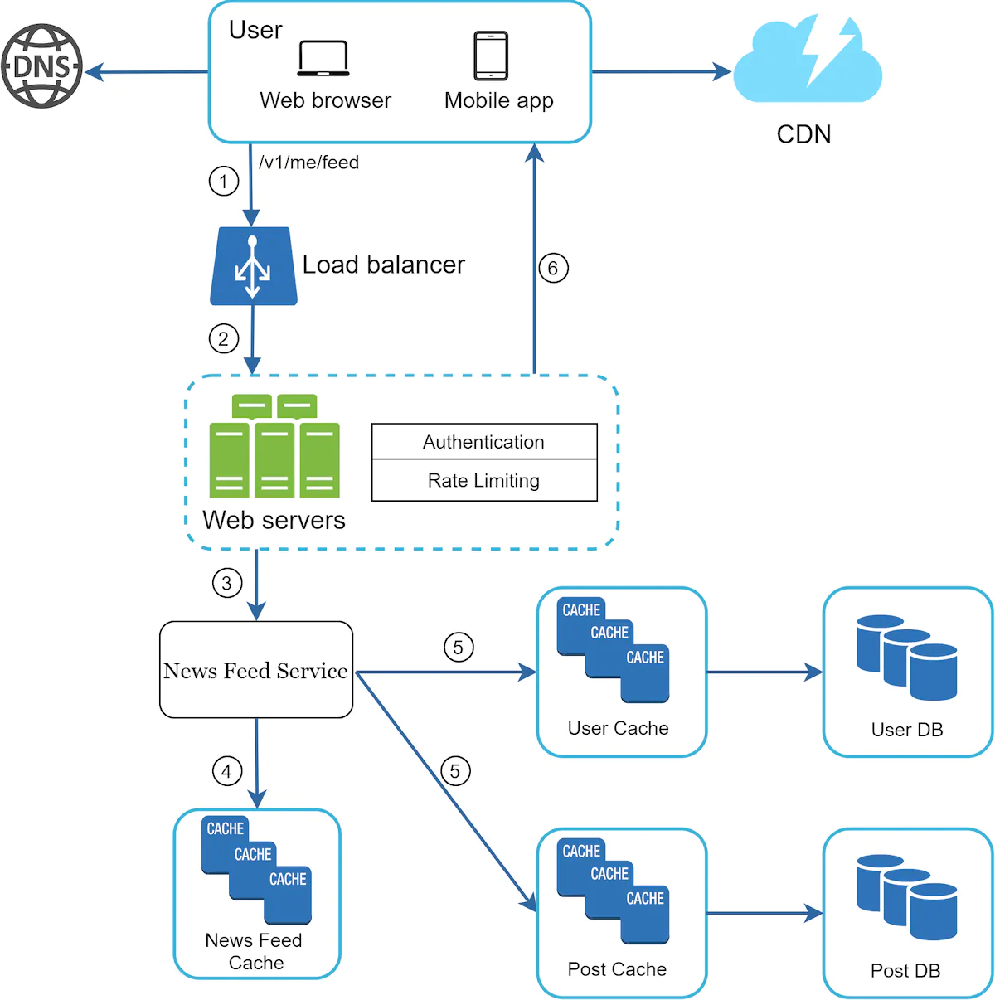

# A Framework for System Design Interviews
System design interviews are intimidating.

How could you possible design a popular system in an hour when it has taken other people decades?
 * It is about the problem solving aspect, not the final solution you came up with.
 * Goal is to demonstrate your design skills, defend your choices, respond to feedback constructively.

What's the goal of a system design interview?
 * It is much more than evaluating a person's technical design skills.
 * It is also about evaluating collaboration skills, working under pressure, resolving ambiguity, asking good questions.
 * Catching red flags - over-engineering, narrow mindedness, stubborness, etc.

# A 4-step process for effective system design interview
Although every interview is different, there are some steps to cover in any interview.

## Step 1 - understand the problem and establish design scope
Don't rush to give answers before understanding the problem well enough first.
In fact, this might be a red flag - answering without a thorough understanding of requirements.

Don't jump to solutions. Ask questions to clarify requirements and assumptions.

We have a tendency as engineers to jump ahead and solve a hard problem. But that often leads to designing the wrong system.

When you get your answers (or you're asked to make assumptions yourself), write them down on the whiteboard to not forget.

What kind of questions to ask? - to understand the exact requirements. Some examples:
 * What specific features do we need to design?
 * How many users does the product have?
 * How fast is the company anticipated to scale up? - in 3, 6, 12 months?
 * What is the company's tech stack? What existing services can you leverage to simplify the design?

For example, say you have to design a news feed. Here's an example conversation:
 * Candidate: Is it mobile, web, both?
 * Interviewer: both.
 * C: What's the most important features?
 * I: Ability to make posts & see friends' news feed.
 * C: How is the feed sorted? Just chronologically or based on eg some weight to posts from close friends.
 * I: To keep things simple, assume posts are sorted chronologically.
 * C: Max friends on a user?
 * I: 5000
 * C: What's the traffic volume?
 * I: 10mil daily active users (DAU)
 * C: Is there any media in the feed? - images, video?
 * I: It can contain media files, including video & images.

## Step 2 - Propose high-level design and get buy-in
The goal of this step is to develop a high-level design, while collaborating with the interviewer.
 * Come up with a blueprint, ask for feedback. Many good interviewers involve the interviewer.
 * Draw boxes on the whiteboard with key components - clients, APIs, web servers, data stores, cache, cdn, message queue, etc.
 * Do back-of-the-envelope calculations to evaluate if the blueprint fits the scale constraints. Communicate with interviewer if this type of estimation is required beforehand.

You could go through some concrete use-cases, which can help you refine the design. It might help you uncover edge cases.

Should we include API schema and database design? Depends on the problem. For larger scale systems, this might be too low level.
Communicate with the interviewer to figure this out.

Example - designing a news feed.

High-level features:
 * feed publishing - user creates a post and that post is written in cache/database, after which it gets populated in other news feeds.
 * news feed building - news feed is built by aggregating friends' posts in chronological order.

Example diagram - feed publishing:

Example diagram - news feed building:

## Step 3 - Design deep dive
Objectives you should have achieved so far:
 * Agreed on overall goals & features
 * Sketched out a high-level blueprint of the design
 * Obtained feedback about the high-level design
 * Received initial ideas on areas you need to focus on in the deep dive

At this stage, you should work with interviewer to prioritize which components you should focus on.

Example things you might have to focus on:
 * High-level design.
 * System performance characteristics.
 * In most cases, dig into the details of some system component.

What details could you dig into? Some examples:
 * For URL shortener - the hash function which converts long URLs into small ones
 * For Chat system - reducing latency and supporting online/offline status

Time management is essential - don't get carried away with details which don't show off your skills.
For example, don't get carried away about how facebook's EdgeRank algorithm works as it doesn't demonstrate your design skills.

Example design deep dive for feed publishing:

Example design deep dive for news feed building:

## Step 4 - Wrap up
At this stage, the interviewer might ask you some follow-up questions or give you the freedom to discuss anything you want.

A few directions to follow:
 * Identify system bottlenecks and discuss improvements. No design is perfect, there are always things to improve.
 * Give a recap of your design.
 * Failure modes - server failure, network loss, etc.
 * Operational issues - monitoring, alerting, rolling out the system.
 * What needs to change to support the next scale curve? Eg 1mil -> 10mil users
 * Propose other refinements.

Do's:
 * Ask for clarification, don't assume your assumption is correct.
 * Understand problem requirements.
 * There is no right or perfect answer. A solution for a small company is different from one for a larger one.
 * Let interviewer know what you're thinking.
 * Suggest multiple approaches.
 * Agree on blueprint and then design the most critical components first.
 * Share ideas with interviewer. They should work with you.

Dont's:
 * Come unprepared for typical interview questions.
 * Jump into a solution without understanding the requirements first.
 * Don't go into too much details on a single component at first. Design at a high-level initially.
 * Feel free to ask for hints if you get stuck.
 * Communicate, don't think silently.

## Time allocation on each step
45 minutes are not enough to cover any design into sufficient detail.

Here's a rough guide on how much time you should spend on each step:
 * Understand problem & establish design scope - 3-10m
 * Propose high-level design & get buy-in - 10-15m
 * Design deep dive - 10-25m
 * Wrap-up - 3-5m
