# Design a Rate Limiter
The rate limiter's purpose in a distributed system is to control the rate of traffic sent from clients to a given server.

It controls the maximum number of requests allowed in a given time period. 
If the number of requests exceeds the threshold, the extra requests are dropped by the rate limiter.

Examples:
 * User can write no more than 2 posts per second.
 * You can create 10 accounts max per day from the same IP.
 * You can claim rewards max 10 times per week.

Almost all APIs have some sort of rate limiting - eg Twitter allows 300 tweets per 3h max.

What are the benefits of using a rate limiter?
 * Prevents DoS attacks.
 * Reduces cost - fewer servers are allocated to lower priority APIs. 
   Also, you might have a downstream dependency which charges you on a per-call basis, eg making a payment, retrieving health records, etc.
 * Prevents servers from getting overloaded.

# Step 1 - Understand the problem and establish design scope
There are multiple techniques which you can use to implement a rate limiter, each with its pros and cons.

Example Candidate-Interviewer conversation:
 * C: What kind of rate limiter are we designing? Client-side or server-side?
 * I: Server-side
 * C: Does the rate limiter throttle API requests based on IP, user ID or anything else?
 * I: The system should be flexible enough to support different throttling rules.
 * C: What's the scale of the system? Startup or big company?
 * I: It should handle a large number of requests.
 * C: Will the system work in a distributed environment?
 * I: Yes.
 * C: Should it be a separate service or a library?
 * I: Up to you.
 * C: Do we need to inform throttled users?
 * I: Yes.

Summary of requirements:
 * Accurately limit excess requests
 * Low latency & as little memory as possible
 * Distributed rate limiting.
 * Exception handling
 * High fault tolerance - if cache server goes down, rate limiter should continue functioning.

# Step 2 - Propose high-level design and get buy-in
We'll stick with a simple client-server model for simplicity.

## Where to put the rate limiter?
It can be implemented either client-side, server-side or as a middleware.

Client-side - Unreliable, because client requests can easily be forged by malicious actors. We also might not have control over client implementation.

Server-side:
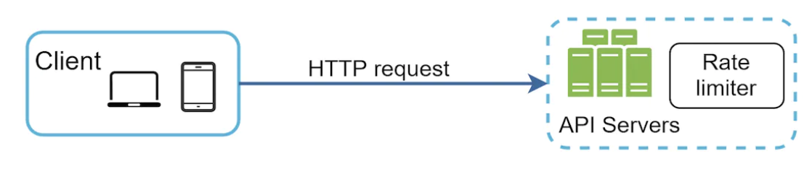

As a middleware between client and server:
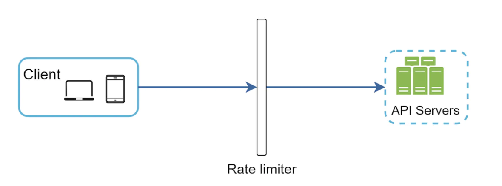

How it works, assuming 2 requests per second are allowed:
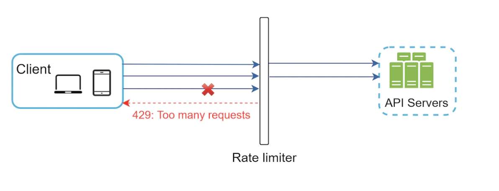

In cloud microservices, rate limiting is usually implemented in the API Gateway.
This service supports rate limiting, ssl termination, authentication, IP whitelisting, serving static content, etc.

So where should the rate limiter be implemented? On the server-side or in the API gateway?

It depends on several things:
 * Current tech stack - if you're implementing it server-side, then your language should be sufficient enough to support it.
 * If implemented on the server-side, you have control over the rate limiting algorithm.
 * If you already have an API gateway, you might as well add the rate limiter in there.
 * Building your own rate limiter takes time. If you don't have sufficient resources, consider using an off-the-shelf third-party solution instead.

## Algorithms for rate limiting
There are multiple algorithms for rate limiting, each with its pros and cons.

Some of the popular algorithms - token bucket, leaking bucket, fixed window counter, sliding window log, sliding window counter.

### Token bucket algorithm
Simple, well understood and commonly used by popular companies. Amazon and Stripe use it for throttling their APIs.
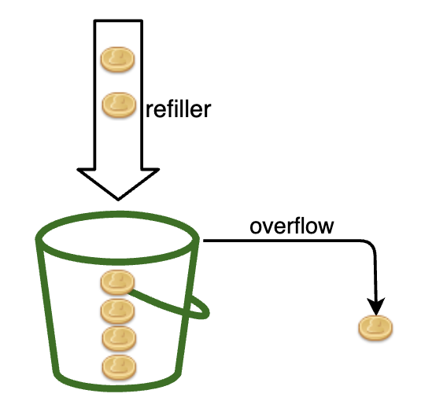

It works as follows:
 * There's a container with predefined capacity
 * Tokens are periodically put in the bucket
 * Once full, no more tokens are added
 * Each request consumes a single token
 * If no tokens left, request is dropped

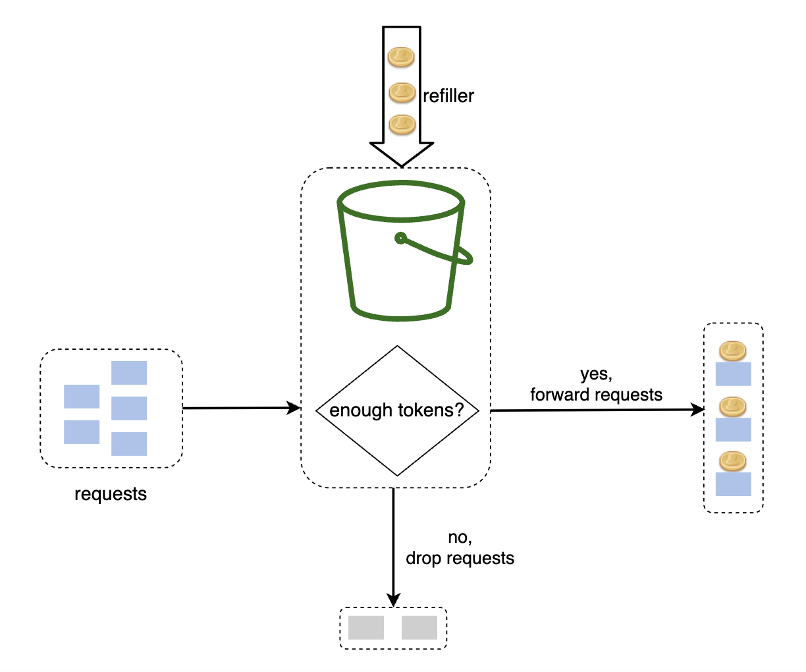

There are two parameters for this algorithm:
 * Bucket size - maximum number of tokens allowed in the bucket
 * Refill rate - number of tokens put into the bucket every second

How many buckets do we need? - depends on the requirements:
 * We might need different buckets per API endpoints if we need to support 3 tweets per second, 5 posts per second, etc.
 * Different buckets per IP if we want to make IP-based throttling.
 * A single global bucket if we want to globally setup 10k requests per second max.

Pros:
 * Easy to implement
 * Memory efficient
 * Throttling gets activated in the event of sustained high traffic only. If bucket size is large, this algorithm supports short bursts in traffic as long as they're not prolonged.

Cons:
 * Parameters might be challenging to tune properly

### Leaking bucket algorithm
Similar to token bucket algorithm, but requests are processed at a fixed rate.

How it works:
 * When request arrives, system checks if queue is full. If not, request is added to the queue, otherwise, it is dropped.
 * Requests are pulled from the queue and processed at regular intervals.
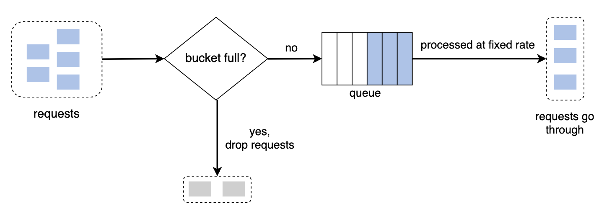

Parameters:
 * Bucket size - aka the queue size. It specifies how many requests will be held to be processed at fixed intervals.
 * Outflow rate - how many requests to be processed at fixed intervals.

Shopify uses leaking bucket for rate-limiting.

Pros:
 * Memory efficient
 * Requests processed at fixed interval. Useful for use-cases where a stable outflow rate is required.

Cons:
 * A burst of traffic fills up the queue with old requests. Recent requests will be rate limited.
 * Parameters might not be easy to tune.

### Fixed window counter algorithm
How it works:
 * Time is divided in fix windows with a counter for each one
 * Each request increments the counter
 * Once the counter reaches the threshold, subsequent requests in that window are dropped
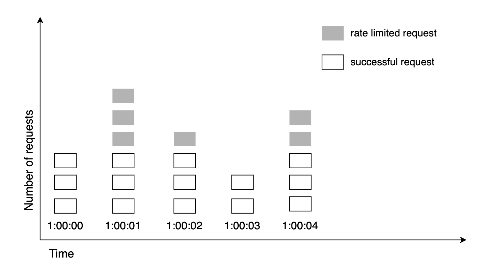

One major problem with this approach is that a burst of traffic in the edges can allow more requests than allowed to pass through:
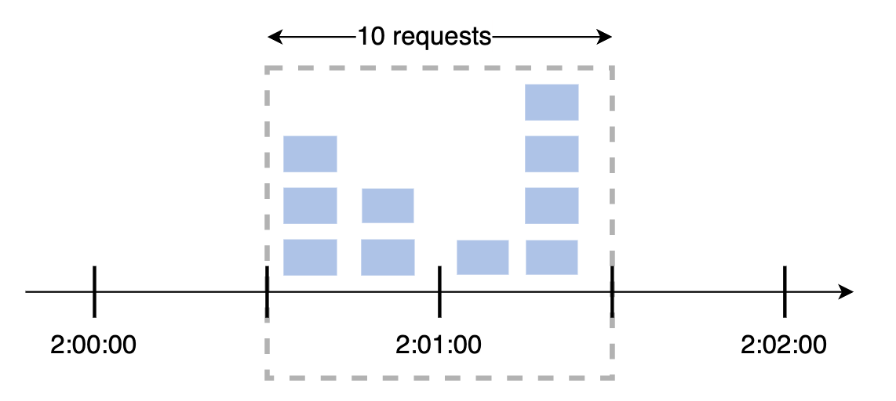

Pros:
 * Memory efficient
 * Easy to understand
 * Resetting available quota at the end of a unit of time fits certain use cases

Cons:
 * Spike in traffic could cause more requests than allowed to go through a given time window

### Sliding window log algorithm
To resolve the previous algorithm's issue, we could use a sliding time window instead of a fixed one.

How it works:
 * Algorithm keeps track of request timestamps. Timestamp data is usually kept in a cache, such as Redis sorted set.
 * When a request comes in, remove outdated timestamps.
 * Add timestamp of the new request in the log.
 * If the log size is same or lower than threshold, request is allowed, otherwise, it is rejected.

Note that the 3rd request in this example is rejected, but timestamp is still recorded in the log:
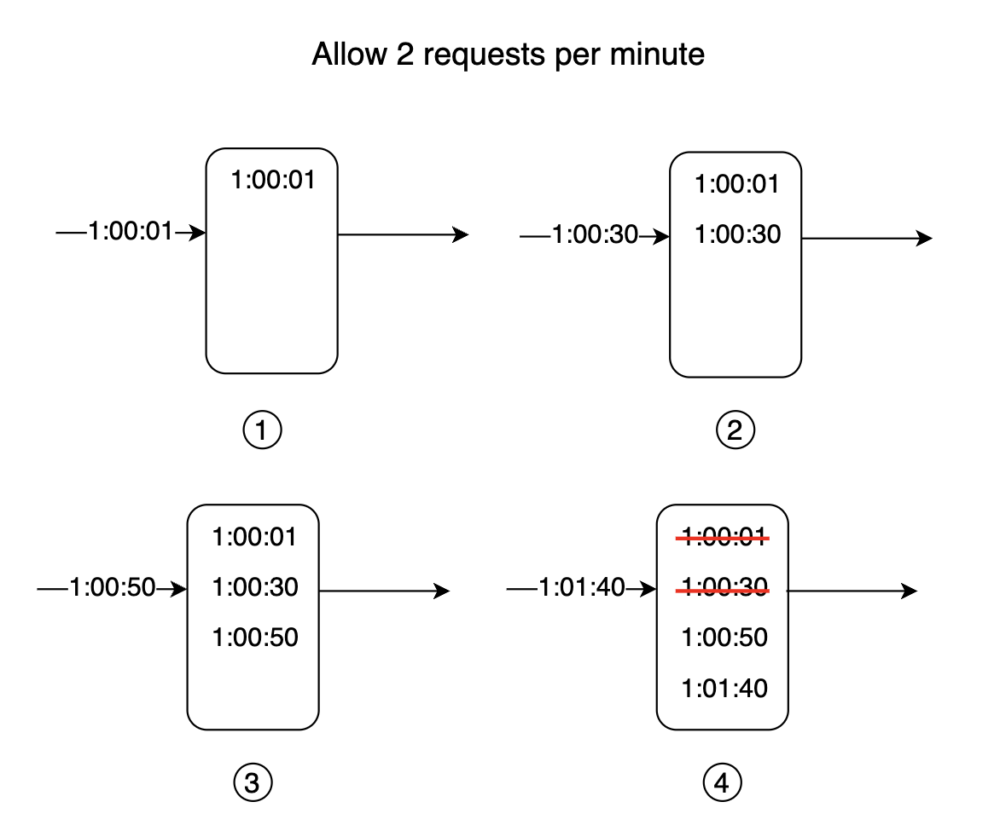

Pros:
 * Rate limiting accuracy is very high

Cons:
 * Memory footprint is very high

### Sliding window counter algorithm
A hybrid approach which combines the fixed window + sliding window log algorithms.


How it works:
 * Maintain a counter for each time window. Increment for given time window on each request.
 * Derive sliding window counter = `prev_window * prev_window_overlap + curr_window * curr_window_overlap` (see screenshot above)
 * If counter exceeds threshold, request is rejected, otherwise it is accepted.

Pros:
 * Smooths out spikes in traffic as rate is based on average rate of previous window
 * Memory efficient

Cons:
 * Not very accurate rate limiting, as it's based on overlaps. But experiments show that only ~0.003% of requests are inaccurately accepted.

## High-level architecture
We'll use an in-memory cache as it's more efficient than a database for storing the rate limiting buckets - eg Redis.
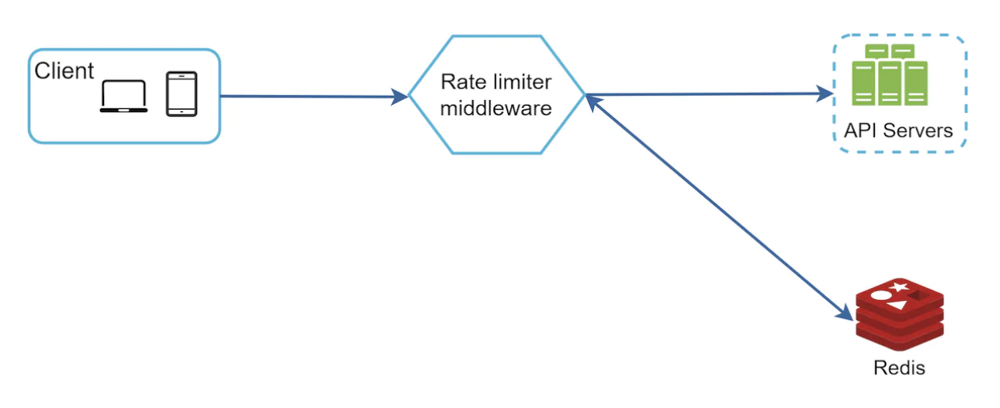

How it works:
 * Client sends request to rate limiting middleware
 * Rate limiter fetches counter from corresponding bucket & checks if request is to be let through
 * If request is let through, it reaches the API servers

# Step 3 - Design deep dive
What wasn't answered in the high-level design:
 * How are rate limiting rules created?
 * How to handle rate-limited requests?

Let's check those topics out, along with some other topics.

## Rate limiting rules
Example rate limiting rules, used by Lyft for 5 marketing messages per day:
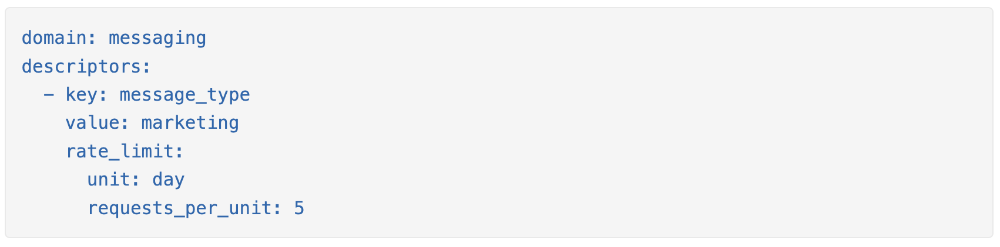

Another example \w max login attempts in a minute:
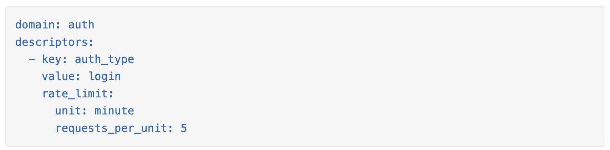

Rules like these are generally written in config files and saved on disk.

## Exceeding the rate limit
When a request is rate limited, a 429 (too many requests) error code is returned.

In some cases, the rate-limited requests can be enqueued for future processing.

We could also include some additional HTTP headers to provide additional metadata info to clients:
```
X-Ratelimit-Remaining: The remaining number of allowed requests within the window.
X-Ratelimit-Limit: It indicates how many calls the client can make per time window.
X-Ratelimit-Retry-After: The number of seconds to wait until you can make a request again without being throttled.
```

## Detailed design
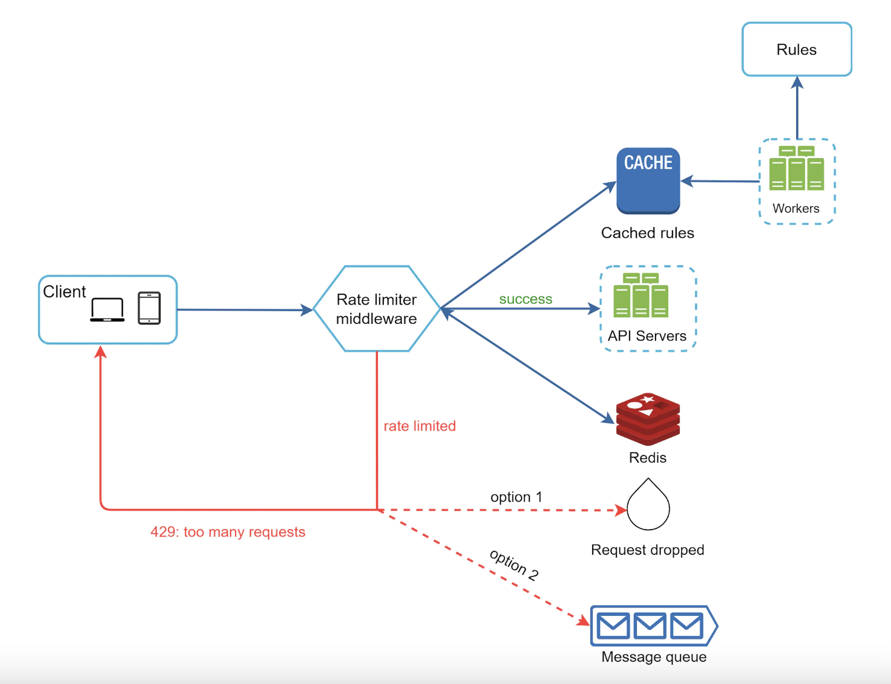

 * Rules are stored on disk, workers populate them periodically in an in-memory cache.
 * Rate limiting middleware intercepts client requests.
 * Middleware loads the rules from the cache. It also fetches counters from the redis cache.
 * If request is allowed, it proceeds to API servers. If not, a 429 HTTP status code is returned. Then, request is either dropped or enqueued.

## Rate limiter in a distributed environment
How will we scale the rate limited beyond a single server?

There are several challenges to consider:
 * Race condition
 * Synchronization

In case of race conditions, the counter might not be updated correctly when mutated by multiple instances:
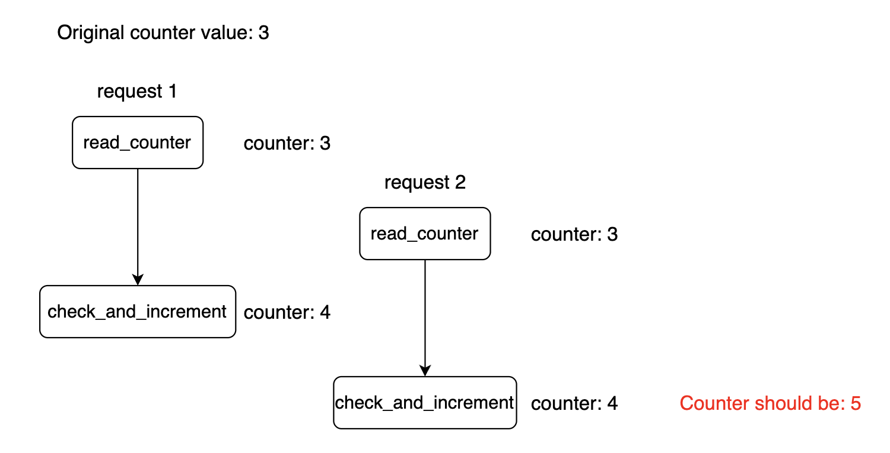

Locks are a typical way to solve this issue, but they are costly.
Alternatively, one could use Lua scripts or Redis sorted sets, which solve the race conditions.

If we maintain user information within the application memory, the rate limiter is stateless and we'll need to use sticky sessions to make sure requests from the same user is handled by the same rate limiter instance.
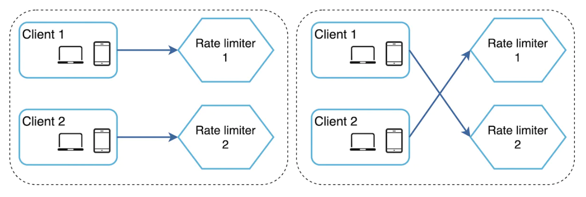

To solve this issue, we can use a centralized data store (eg Redis) so that the rate limiter instances are stateless.
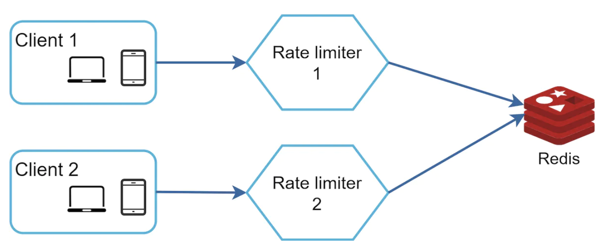

## Performance optimization
There are two things we can do as a performance optimization for our rate limiters:
 * Multi-data center setup - so that users interact with instances geographically close to them.
 * Use eventual consistency as a synchronization model to avoid excessive locking.

## Monitoring
After the rate limiter is deployed, we'd want to monitor if it's effective.

To do so, we need to track:
 * If the rate limiting algorithm is effective
 * If the rate limiting rules are effective

If too many requests are dropped, we might have to tune some of the rules or the algorithm parameters.

# Step 4 - Wrap up
We discussed a bunch of rate-limiting algorithms:
 * Token bucket - good for supporting traffic bursts.
 * Leaking bucket - good for ensuring consistent inbound request flow to downstream services
 * Fixed window - good for specific use-cases where you want time divided in explicit windows
 * Sliding window log - good when you want high rate-limiting accuracy at the expense of memory footprint.
 * Sliding window counter - good when you don't want 100% accuracy with a very low memory footprint.

Additional talking points if time permits:
 * Hard vs. soft rate limiting
   * Hard - requests cannot exceed the specified threshold 
   * Soft - requests can exceed threshold for some limited time
 * Rate limiting at different layers - L7 (application) vs L3 (network)
 * Client-side measures to avoid being rate limited:
   * Client-side cache to avoid excessive calls
   * Understand limit and avoid sending too many requests in a small time frame
   * Gracefully handle exceptions due to being rate limited
   * Add sufficient back-off and retry logic
