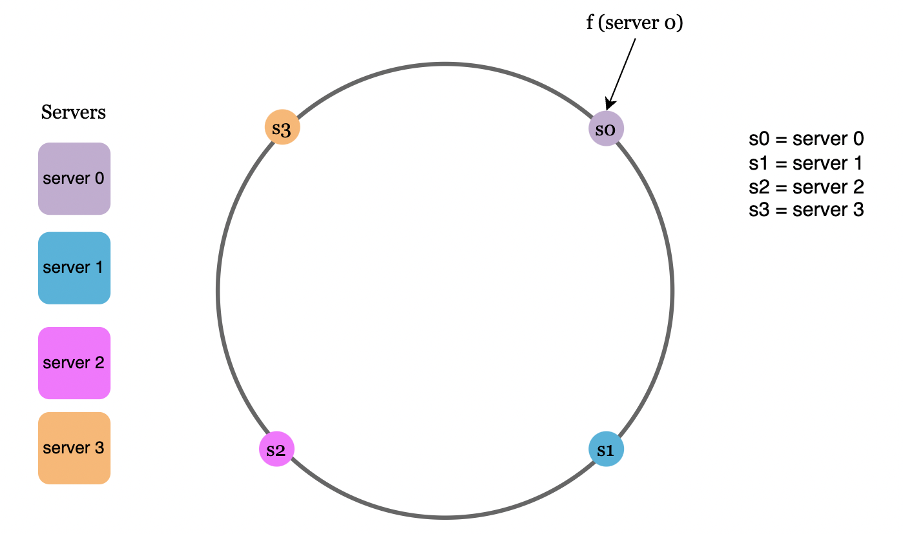
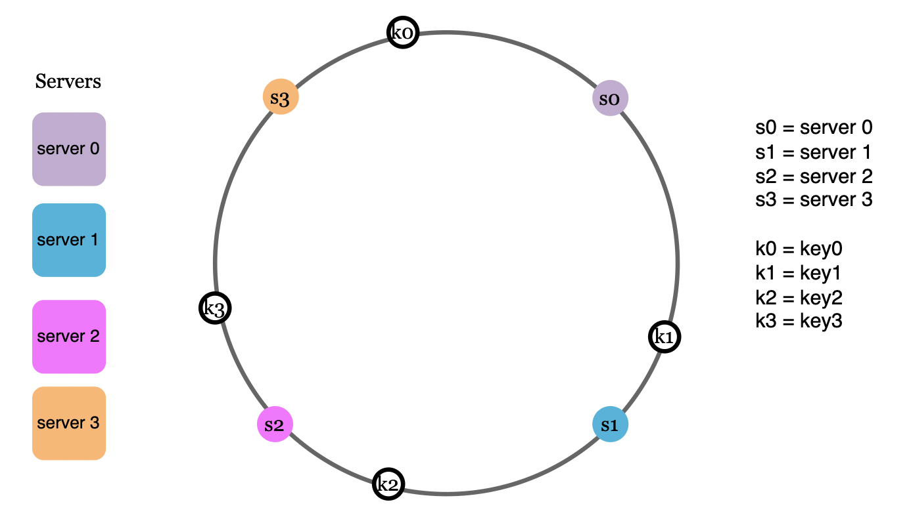
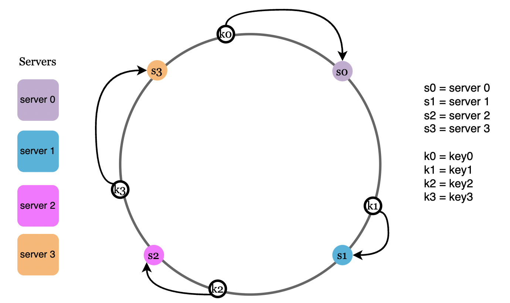
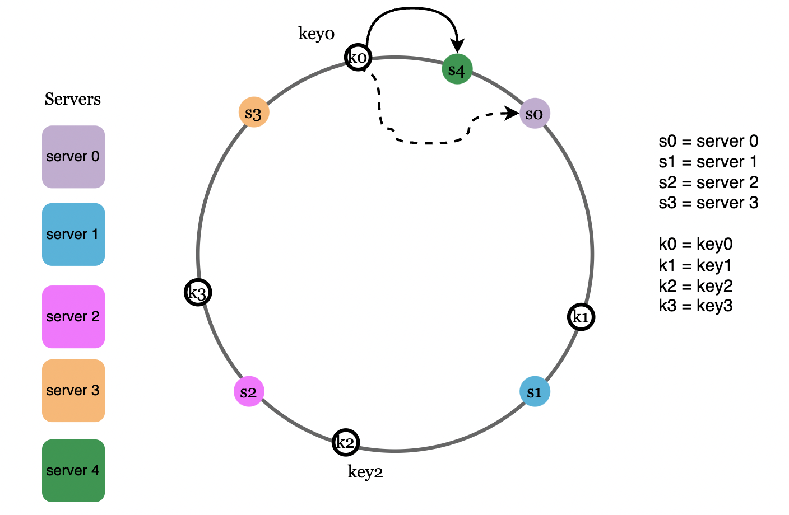
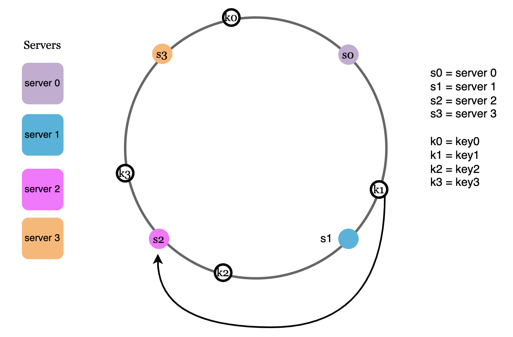
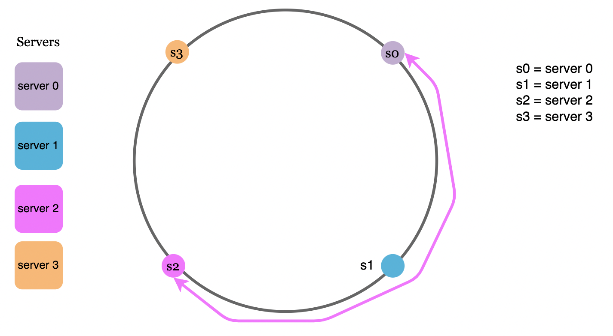
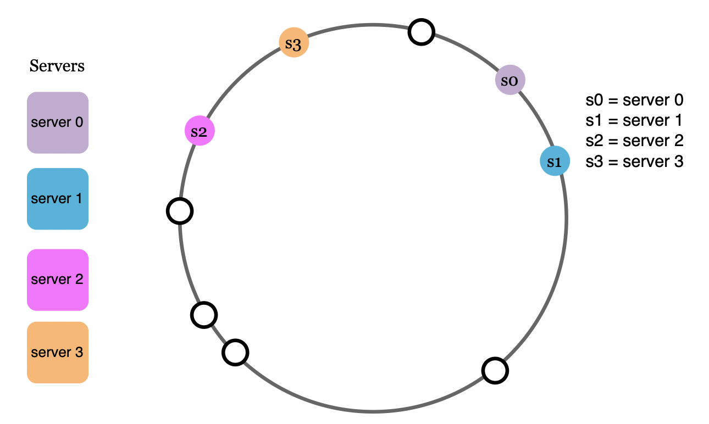
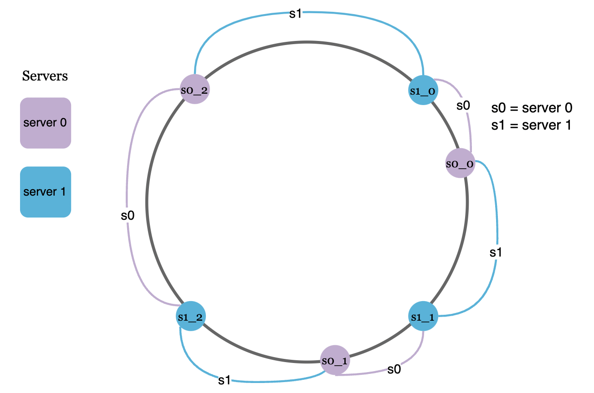
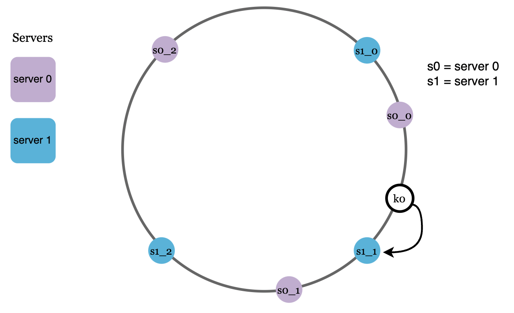

# Design Consistent Hashing
For horizontal scaling, it is important to distribute requests across servers efficiently.

Consistent hashing is a common approach to achieve this.

# The rehashing problem
One way to determine which server a request gets routed to is by applying a simple hash+module formula:
```
serverIndex = hash(key) % N, where N is the number of servers
```

This makes it so requests are distributed uniformly across all servers.
However, whenever new servers are added or removed, the result of the above equation is very different, meaning that a lot of requests will get rerouted across servers.

This causes a lot of cache misses as clients will be connected to new instances which will have to fetch the user data from cache all over again.

# Consistent hashing
Consistent hashing is a technique which allows only a K/N servers to be remapped whenever N changes, where K is the number of keys.

For example, K=100, N=10 -> 10 re-mappings, compared to close to 100 in the normal scenario.

# Hash space and hash ring
A hash ring is a visualization of the possible key space of a given hash algorithm, which is combined into a ring-like structure:


# Hash servers
Using the same hash function for the requests, we map the servers based on server IP or name onto the hash ring:


# Hash keys
The hashes of the requests also get resolved somewhere along the hash ring. Notice that we're not using the modulo operator in this case:


# Server lookup
Now, to determine which server is going to serve each request, we go clockwise from the request's hash until we reach the first server hash:


# Add a server
Via this approach, adding a new server causes only one of the requests to get remapped to a new server:


# Remove a server
Likewise, removing a server causes only a single request to get remapped:


# Two issues in the basic approach
The first problem with this approach is that hash partitions can be uneven across servers:


The second problem derives from the first - it is possible that requests are unevenly distributed across servers:


# Virtual nodes
To solve this issue, we can map a servers on the hash ring multiple times, creating virtual nodes and assigning multiple partitions to the same server:


Now, a request is mapped to the closest virtual node on the hash ring:


The more virtual nodes we have, the more evenly distributed the requests will be.

An experiment showed that between 100-200 virtual nodes leads to a standard deviation between 5-10%.

# Wrap up
Benefits of consistent hashing:
 * Very low number of keys are distributed in a re-balancing event
 * Easy to scale horizontally as data is uniformly distributed
 * Hotspot issue is mitigated by uniformly distributing data, related to eg a celebrity, which is often accessed

Examples of real-world applications of consistent hashing:
 * Amazon's DynamoDB partitioning component
 * Data partitioning in Cassandra
 * Discord chat application
 * Akamai CDN
 * Maglev network load balancer
