# Design a Key-Value Store
Key-value stores are a type of non-relational databases.
 * Each unique identifier is stored as a key with a value associated to it.
 * Keys must be unique and can be plain text or hashes.
 * Performance-wise, short keys work better.

Example keys:
 * plain-text - "last_logged_in_at"
 * hashed key - `253DDEC4`

We're now about to design a key-value store which supports:
 * `put(key, value)` - insert `value` associated to `key`
 * `get(key)` - get `value` associated to `key`

# Understand the problem and establish design scope
There's always a trade-off to be made between read/write and memory usage.
Another trade-off is between consistency and availability.

Here are the characteristics we're striving to achieve:
 * Key-value pair size is small - 10kb
 * We need to be able to store a lot of data.
 * High availability - system responds quickly even during failures.
 * High scalability - system can be scaled to support large data sets.
 * Automatic scaling - addition/deletion of servers should happen automatically based on traffic.
 * Tunable consistency.
 * Low latency.

# Single server key-value store
Single server key-value stores are easy to develop.

We can just maintain an in-memory hash map which stores the key-value pairs.

Memory however, can be a bottleneck, as we can't fit everything in-memory. Here are our options to scale:
 * Data compression
 * Store only frequently used data in-memory. The rest store on disk.

Even with these optimizations, a single server can quickly reach its capacity.

# Distributed key-value store
A distributed key-value store consists of a distributed hash table, which distributes keys across many nodes.

When developing a distributed data store, we need to factor in the CAP theorem

## CAP Theorem
This theorem states that a data store can't provide more than two of the following guarantees - consistency, availability, partition tolerance;
 * Consistency - all clients see the same data at the same time, no matter which node they're connected to.
 * Availability - all clients get a response, regardless of which node they connect to.
 * Partition tolerance - A network partition means that not all nodes within the cluster can communicate. Partition tolerance means that the system is operational even in such circumstances.
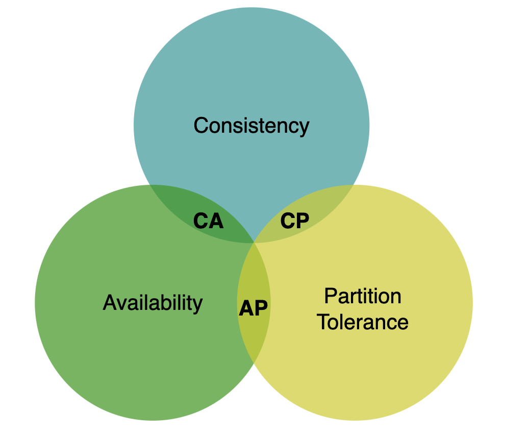

A distributed system which supports consistency and availability cannot exist in the real world as network failures are inevitable.

Example distributed data store in an ideal situation:
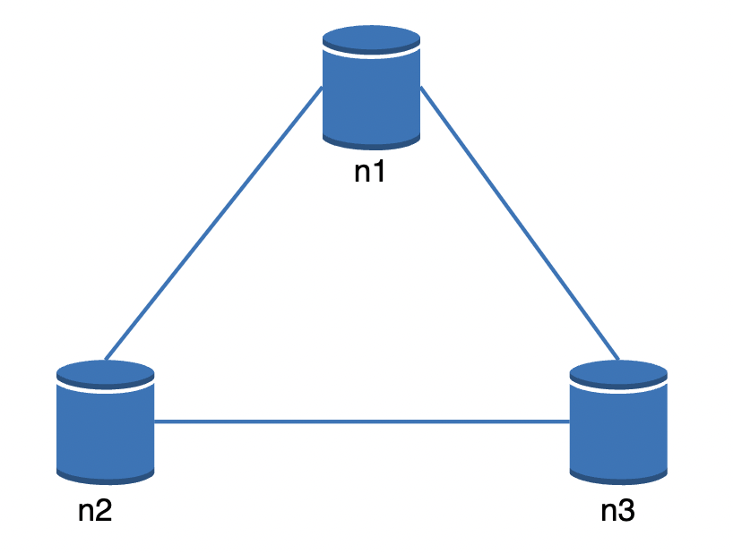

In the real world, a network partition can occur which hinders communication with eg node 3:
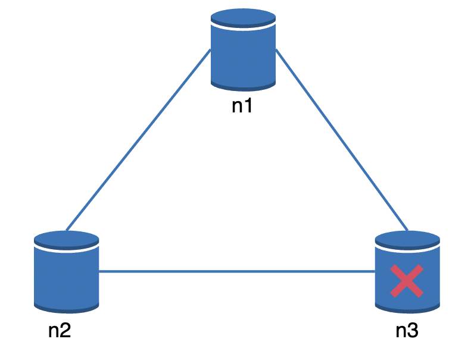

If we favor consistency over availability, all write operations need to be blocked when the above scenario occurs.

If we favor availability on the other hand, the system continues accepting reads and writes, risking some clients receiving stale data.
When node 3 is back online, it will be re-synced with the latest data.

What you choose is something you need to clarify with the interviewer. There are different trade-offs with each option.

# System components
This section goes through the key components needed to build a distributed key-value store.

## Data partition
For a large enough data set, it is infeasible to maintain it on a single server.
Hence, we can split the data into smaller partitions and distribute them across multiple nodes.

The challenge then, is to distribute data evenly and minimize data movement when the cluster is resized.

Both these problems can be addressed using consistent hashing (discussed in previous chapter):
 * Servers are put on a hash ring
 * Keys are hashed and put on the closest server in clockwise direction
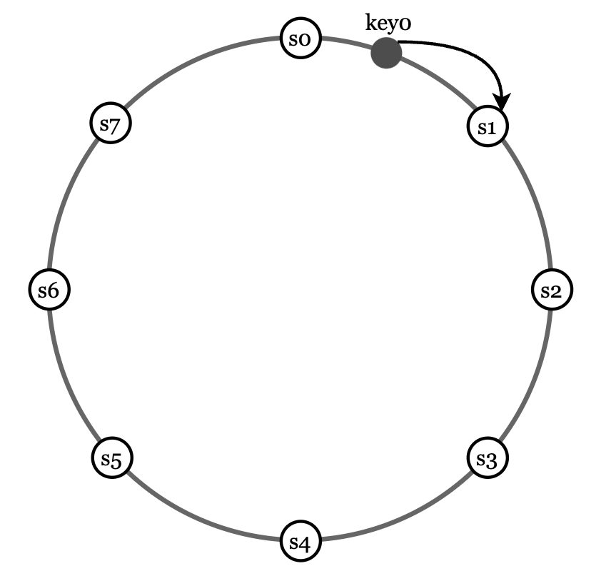

This has the following advantages:
 * Automatic scaling - servers can be added/removed at will with minimal impact on key location
 * Heterogeneity - servers with higher capacity can be allocated with more virtual nodes

## Data replication
To achieve high availability & reliability, data needs to be replicated on multiple nodes.

We can achieve that by allocating a key to multiple nodes on the hash ring:
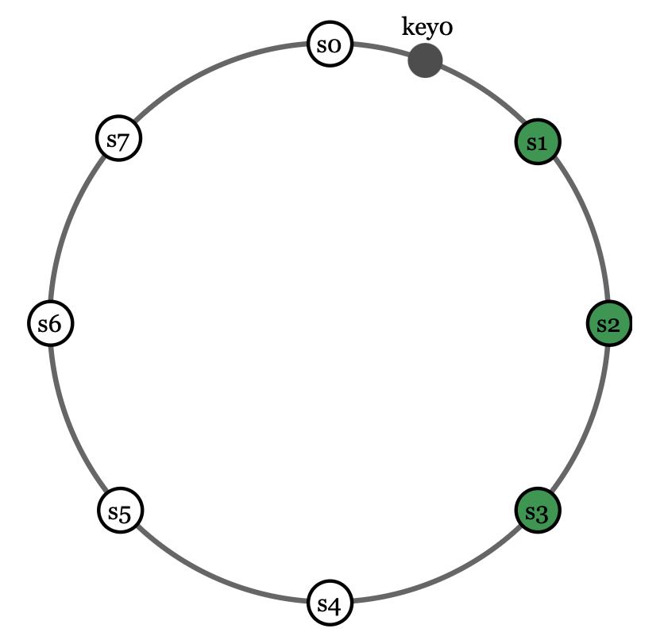

One caveat to keep in mind that your key might get allocated to virtual nodes mapped to the same physical node. 
To avoid this, we can only choose unique physical nodes when replicating data.

An additional reliability measure is to replicate data across multiple data centers as nodes in the same data centers can fail at the same time.

## Consistency
Since data is replicated, it must be synchronized.

Quorum consensus can guarantee consistency for both reads and writes:
 * N - number of replicas
 * W - write quorum. Write operations must be acknowledged by W nodes.
 * R - read quorum. Read operations must be acknowledged by R nodes.
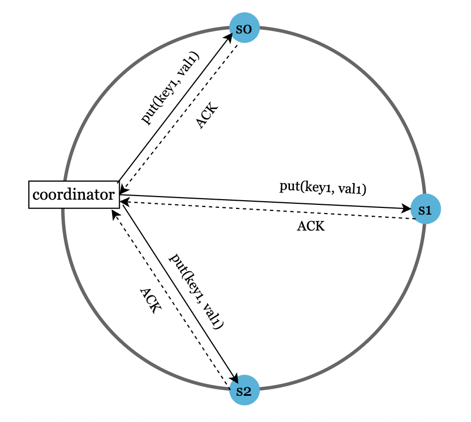

The configuration of W and R is a trade-off between latency and consistency.
 * W = 1, R = 1 -> low latency, eventual consistency
 * W + R > N -> strong consistency, high latency

Other configurations:
 * R = 1, W = N -> strong consistency, fast reads, slow writes
 * R = N, W = 1 -> strong consistency, fast writes, slow reads

## Consistency models
There are multiple flavors of consistency we can tune our key-value store for:
 * Strong consistency - read operations return a value corresponding to most up-to-date data. Clients never see stale data.
 * Weak consistency - read operations might not see the most up-to-date data.
 * Eventual consistency - read operations might not see most up-to-date data, but with time, all keys will converge to the latest state.

Strong consistency usually means a node not accepting reads/writes until all nodes have acknowledged a write.
This is not ideal for highly available systems as it can block new operations.

Eventual consistency (supported by Cassandra and DynamoDB) is preferable for our key-value store.
This allows concurrent writes to enter the system and clients need to reconcile the data mismatches.

## Inconsistency resolution: versioning
Replication provides high availability, but it leads to data inconsistencies across replicas.

Example inconsistency:
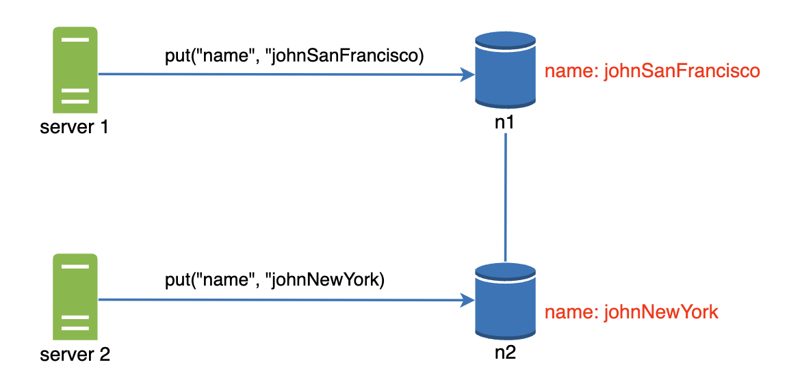

This kind of inconsistency can be resolved using a versioning system using a vector clock.
A vector clock is a [server, version] pair, associated with a data item. Each time a data item is changed in a server, it's associated vector clock changes to [server_id, curr_version+1].

Example inconsistency resolution:
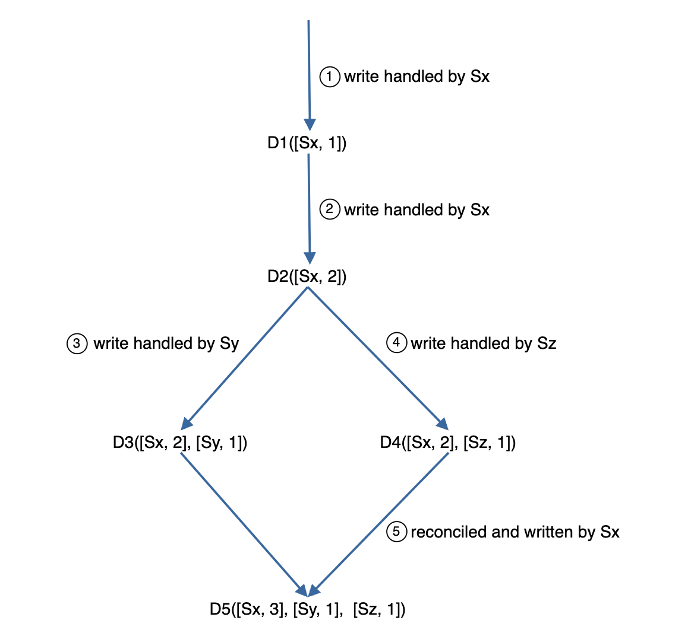
 * Client writes D1, handled by Sx, which writes version [Sx, 1]
 * Another client reads D1, updates it and Sx increments version to [Sx, 2]
 * Client writes D3 based on D2 in Sy -> D3([Sx, 2][Sy, 1]).
 * Simultaneously, another one writes D4 in Sz -> D4([Sx, 2][Sz, 1])
 * A client reads D3 and D4 and detects a conflict. It makes a resolution and adds the updated version in Sx -> D5([Sx, 3][Sy, 1][Sz, 1])

A conflict is detected by checking whether a version is an ancestor of another one. That can be done by verifying that all version stamps are less than or equal to the other one.
 * [s0, 1][s1, 1] is an ancestor of [s0, 1][s1, 2] -> no conflict.
 * [s0, 1] is not an ancestor of [s1, 1] -> conflict needs to be resolved.

This conflict resolution technique comes with trade-offs:
 * Client complexity is increased as clients need to resolve conflicts.
 * Vector clocks can grow rapidly, increasing the memory footprint of each key-value pair.

# Handling failures
At a large enough scale, failures are inevitable. It is important to determine your error detection & resolution strategies.

## Failure detection
In a distributed system, it is insufficient to conclude that a server is down just because you can't reach it. You need at least another source of information.

One approach to do that is to use all-to-all multi-casting. This, however, is inefficient when there are many servers in the system.
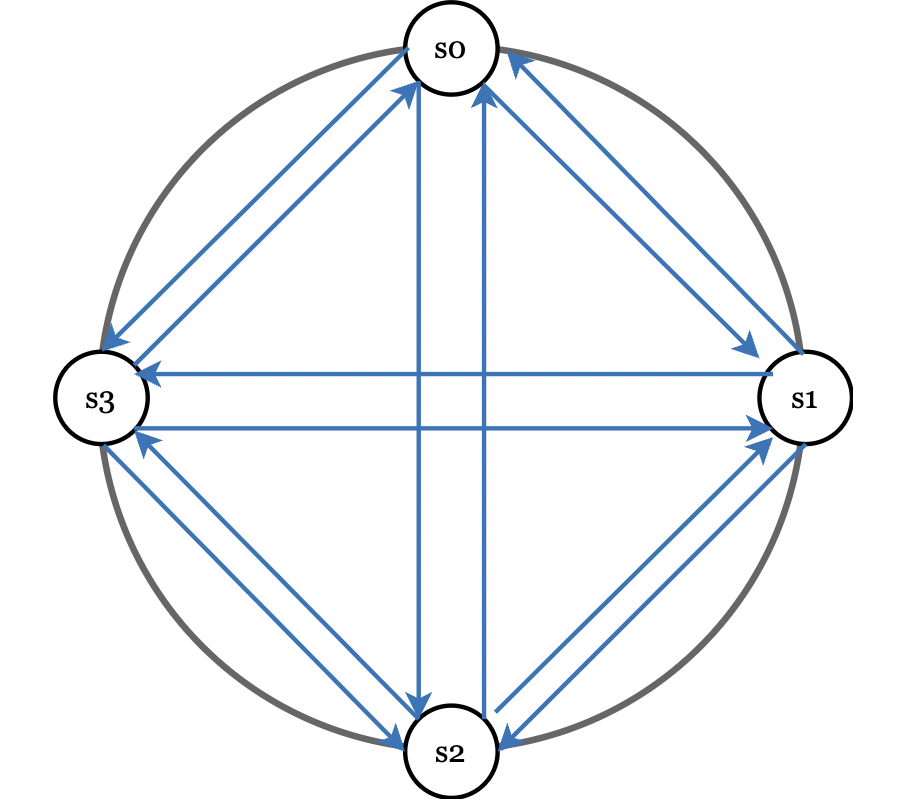

A better solution is to use a decentralized failure detection mechanism, such as a gossip protocol:
 * Each node maintains a node membership list with member IDs and heartbeat counters.
 * Each node periodically increments its heartbeat counter
 * Each node periodically sends heartbeats to a random set of other nodes, which propagate it onwards.
 * Once a node receives a heartbeat, its membership list is updated.
 * If a heartbeat is not received after a given threshold, the member is marked offline.

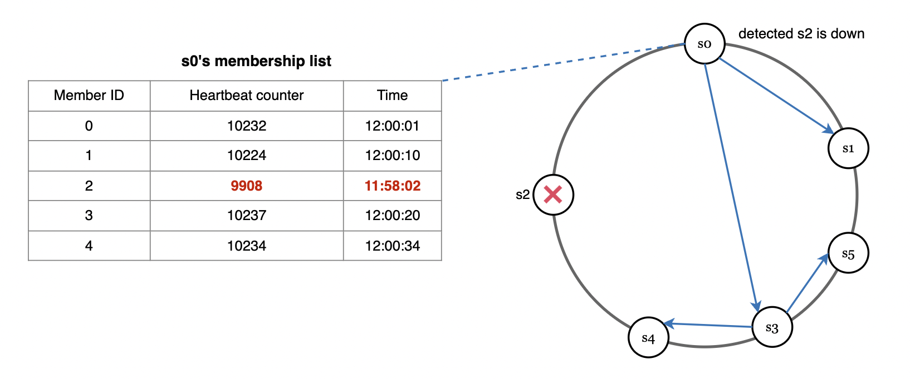

In the above scenario, s0 detects that s2 is down as no heartbeat is received for a long time. 
It propagates that information to other nodes which also verify that the heartbeat hasn't been updated.
Hence, s2 is marked offline.

## Handling temporary failures
A nice little trick to improve availability in the event of failures is hinted handoff.

What it means is that if a server if temporarily offline, you can promote another healthy service in its place to process data temporarily.
After the server is back online, the data & control is handed back to it.

## Handling permanent failures
Hinted handoff is used when the failure is intermittent.

If a replica is permanently unavailable, we implement an anti-entropy protocol to keep the replicas in-sync.

This is achieved by leveraging merkle trees in order to reduce the amount of data transmitted and compared to a minimum.

The merkle tree works by building a tree of hashes where leaf nodes are buckets of key-value pairs.

If any of the buckets across two replicas is different, then the merkle tree's hashes will be different all the way to the root:
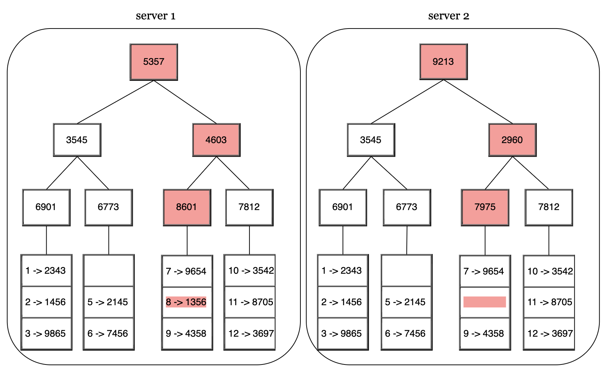

Using merkle trees, two replicas will compare only as much data as is different between them, instead of comparing the entire data set.

## Handling data center outage
A data center outage could happen due to a natural disaster or serious hardware failure.

To ensure resiliency, make sure your data is replicated across multiple data centers.

# System architecture diagram
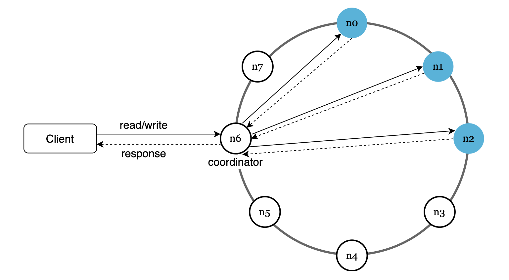

Main features:
 * Clients communicate with the key-value store through a simple API
 * A coordinator is a proxy between the clients and the key-value store
 * Nodes are distributed on the ring using consistent hashing
 * System is decentralized, hence adding and removing nodes is supported and can be automated
 * Data is replicated at multiple nodes
 * There is no single point of failure

Some of the tasks each node is responsible for:
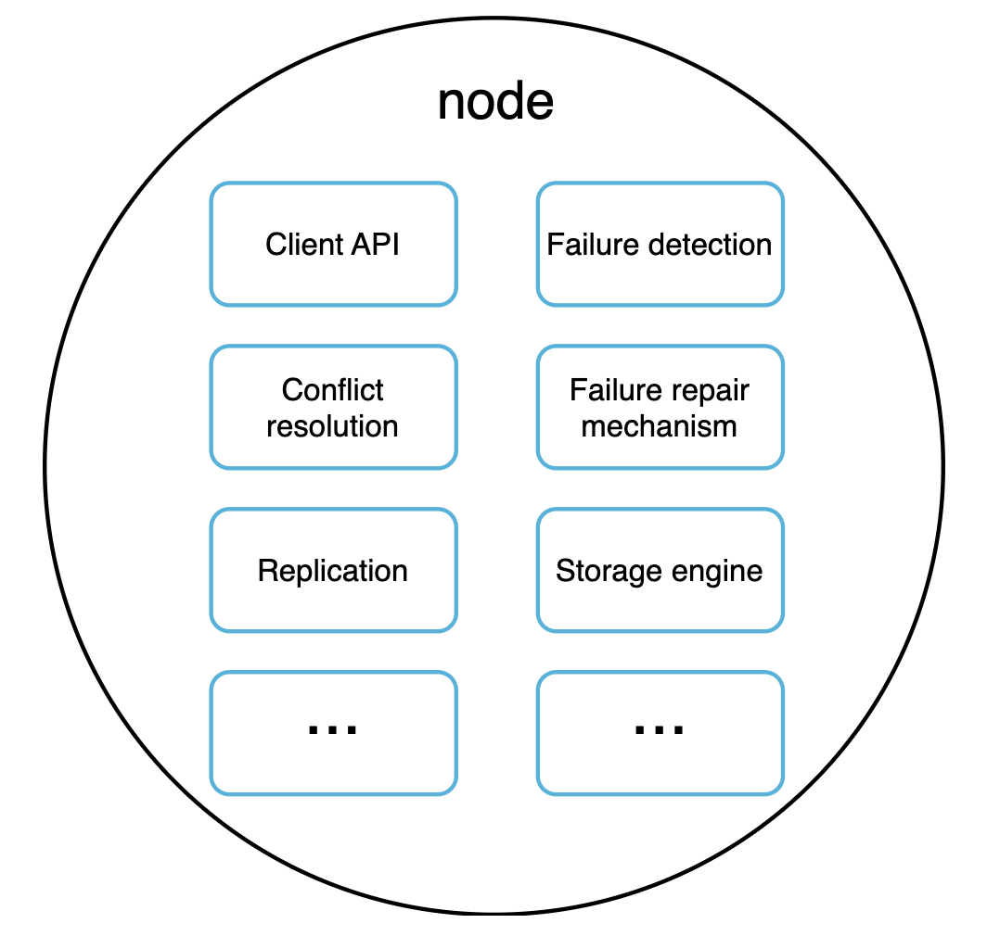

## Write path
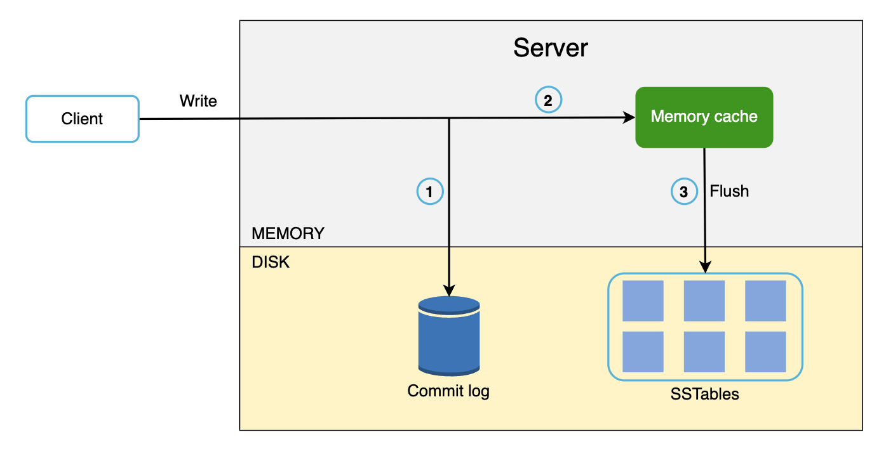
 * Write requests are persisted in a commit log
 * Data is saved in the memory cache
 * When memory cache is full or reaches a given threshold, data is flushed to an SSTable on disk

SSTable == Sorted String Table. Holds a sorted list of key-value pairs.

## Read path
Read path when data is in memory:
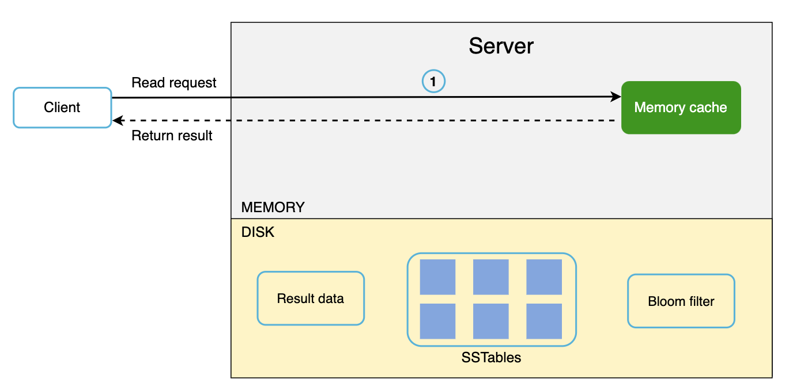

Read path when data is not in memory:
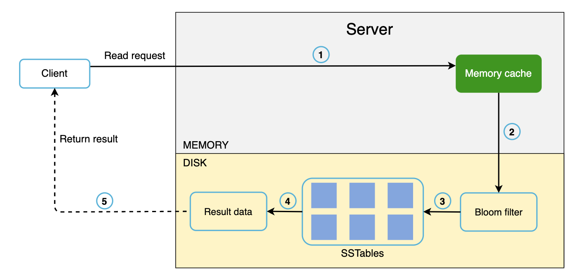
 * If data is in memory, fetch it from there. Otherwise, find it in the SSTable.
 * A bloom filter is used for efficient lookup in the SSTable.
 * The SSTables returns the resulting data, which is returned to the client

# Summary
We covered a lot of concepts and techniques, here's a summary:
| Goal/Problems               | Technique                                             |
|-----------------------------|-------------------------------------------------------|
| Ability to store big data   | Use consistent hashing to spread load across servers  |
| High availability reads     | Data replication Multi-datacenter setup               |
| Highly available writes     | Versioning and conflict resolution with vector clocks |
| Dataset partition           | Consistent Hashing                                    |
| Incremental scalability     | Consistent Hashing                                    |
| Heterogeneity               | Consistent Hashing                                    |
| Tunable consistency         | Quorum consensus                                      |
| Handling temporary failures | Sloppy quorum and hinted handoff                      |
| Handling permanent failures | Merkle tree                                           |
| Handling data center outage | Cross-datacenter replication                          |

