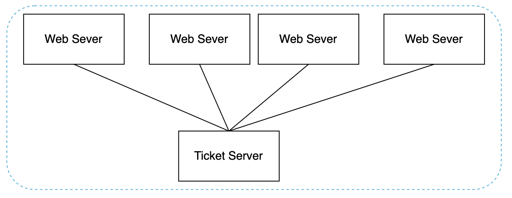
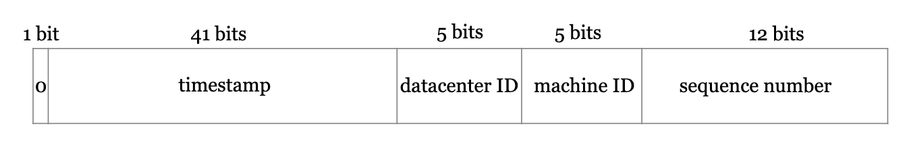

# Design a Unique ID Generator in Distributed Systems
We need to design a unique ID generator, compatible with distributed systems.

A primary key with auto_increment won't work here, because generating IDs across multiple database servers has high latency.

# Step 1 - Understand the problem and establish design scope
 * C: What characteristics should the unique IDs have?
 * I: They should be unique and sortable.
 * C: For each record, does the ID increment by 1?
 * I: IDs increment by time, but not necessarily by 1.
 * C: Do IDs contain only numerical values?
 * I: Yes
 * C: What is the ID length requirement?
 * I: 64 bytes
 * C: What's the system scale?
 * I: We should be able to generate 10,000 IDs per second

# Step 2 - Propose high-level design and get buy-in
Here's the options we'll consider:
 * Multi-master replication
 * Universally-unique IDs (UUIDs)
 * Ticket server
 * Twitter snowflake approach

## Multi-master replication

This uses the database's auto_increment feature, but instead of increasing by 1, we increase by K where K = number of servers.

This solves the scalability issues as id generation is confined within a single server, but it introduces other challenges:
 * Hard to scale \w multiple data centers
 * IDs do not go up in time across servers
 * Adding/removing servers breaks this mechanism

## UUID
A UUID is a 128-byte unique ID.

The probability of UUID collision across the whole world is very little.

Example UUID - `09c93e62-50b4-468d-bf8a-c07e1040bfb2`.

Pros:
 * UUIDs can be generated independently across servers without any synchronization or coordination.
 * Easy to scale.

Cons:
 * IDs are 128 bytes, which doesn't fit our requirement
 * IDs do not increase with time
 * IDs can be non-numeric

## Ticket server
A ticket server is a centralized server for generating unique primary keys across multiple services:

Pros:
 * Numeric IDs
 * Easy to implement & works for small & medium applications

Cons:
 * Single point of failure.
 * Additional latency due to network call.

## Twitter snowflake approach
Twitter's snowflake meets our design requirements because it is sortable by time, 64-bytes and can be generated independently in each server.

Breakdown of the different sections:
 * Sign bit - always 0. Reserved for future use.
 * Timestamp - 41 bytes. Milliseconds since epoch (or since custom epoch). Allows 69 years max.
 * Datacenter ID - 5 bits, which enables 32 data centers max.
 * Machine ID - 5 bits, which enables 32 machines per data center.
 * Sequence number - For every generated ID, the sequence number is incremented. Reset to 0 on every millisecond.

# Step 3 - Design deep dive
We'll use twitter's snowflake algorithm as it fits our needs best.

Datacenter ID and machine ID are chosen at startup time. The rest is determined at runtime.

# Step 4 - wrap up
We explored multiple ways to generate unique IDs and settled on snowflake eventually as it serves our purpose best.

Additional talking points:
 * Clock synchronization - network time protocol can be used to resolve clock inconsistencies across different machines/CPU cores.
 * Section length tuning - we could sacrifice some sequence number bits for more timestamp bits in case of low concurrency and long-term applications.
 * High availability - ID generators are a critical component and must be highly available.
