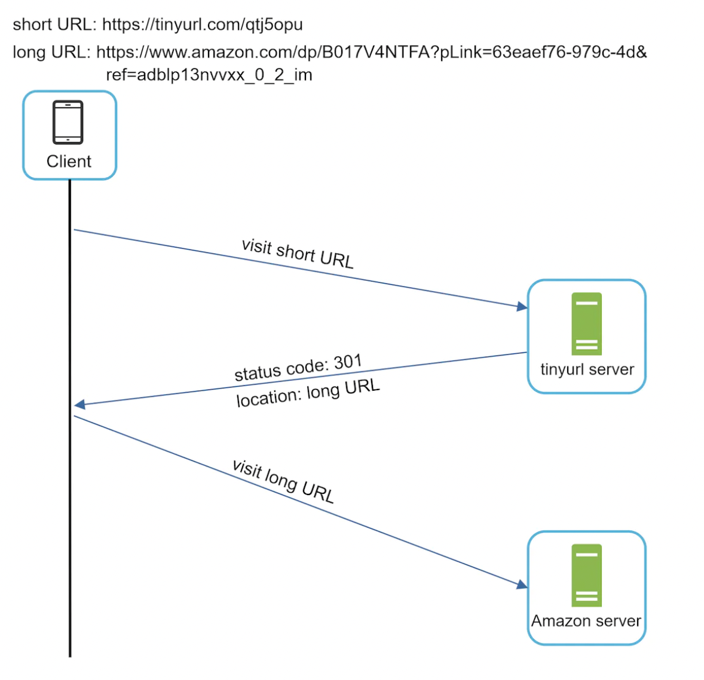
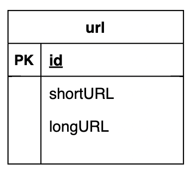
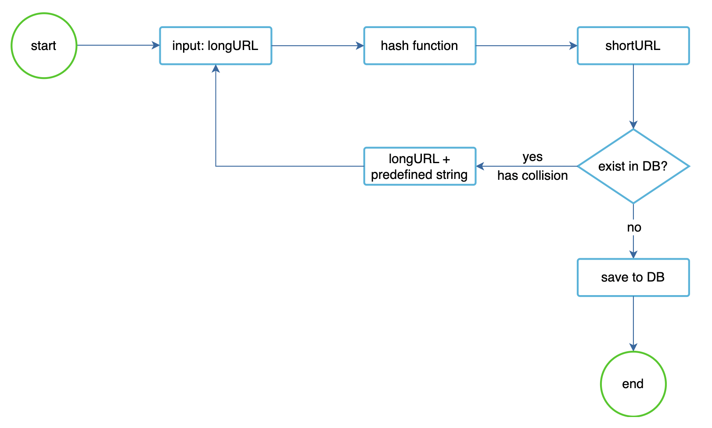
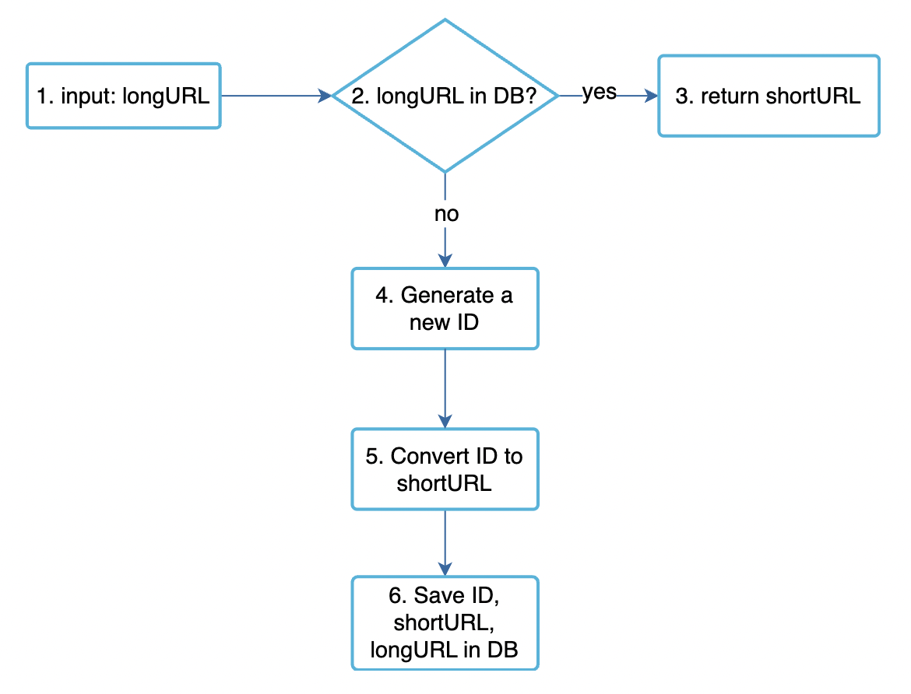
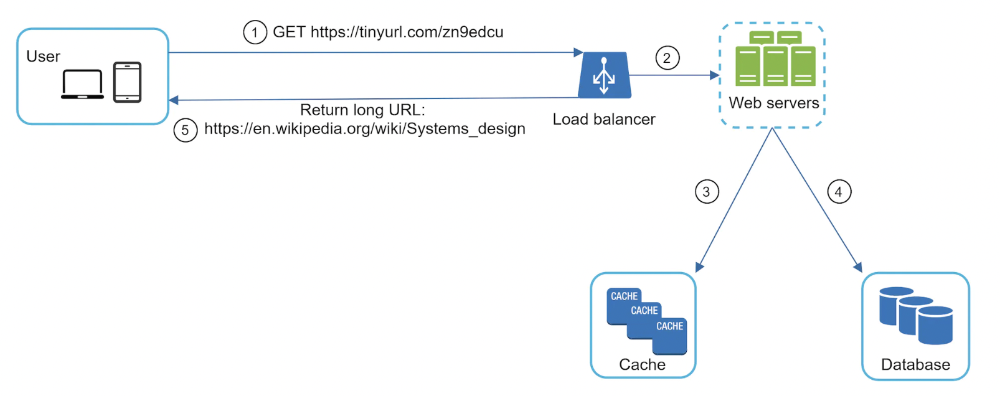

# Design a URL Shortener
We're tackling a classical system design problem - designing a URL shortening service like tinyurl.

# Step 1 - Understand the problem and establish design scope
 * C: Can you give an example of how a URL shortening service works?
 * I: Given URL `https://www.systeminterview.com/q=chatsystem&c=loggedin&v=v3&l=long` and alias `https://tinyurl.com/y7keocwj`. You open the alias and get to the original URL.
 * C: What is the traffic volume?
 * I: 100 million URLs are generated per day.
 * C: How long is the shortened URL?
 * I: As short as possible
 * C: What characters are allowed?
 * I: numbers and letters
 * C: Can shortened URLs be updated or deleted?
 * I: For simplicity, let's assume they can't.

Other functional requirements - high availability, scalability, fault tolerance.

# Back of the envelope calculation
 * 100 mil URLs per day -> ~1200 URLs per second.
 * Assuming read-to-write ratio of 10:1 -> 12000 reads per second.
 * Assuming URL shortener will run for 10 years, we need to support 365bil records.
 * Average URL length is 100 characters
 * Storage requirements for 10y - 36.5 TB

# Step 2 - Propose high-level design and get buy-in
## API Endpoints
We'll make a REST API.

A URL shortening service needs two endpoints:
 * `POST api/v1/data/shorten` - accepts long url and returns a short one.
 * `GET api/v1/shortURL` - return long URL for HTTP redirection.

## URL Redirecting
How it works:

What's the difference between 301 and 302 statuses?
 * 301 (Permanently moved) - indicates that the URL permanently points to the new URL. This instructs the browser to bypass the tinyurl service on subsequent calls.
 * 302 (Temporarily moved) - indicates that the URL is temporarily moved to the new URL. Browser will not bypass the tinyurl service on future calls.

Choose 301 if you want to avoid extra server load. Choose 302 if tracking analytics is important.

Easiest way to implement the URL redirection is to store the `<shortURL, longURL>` pair in an in-memory hash-table.

## URL Shortening
To support the URL shortening, we need to find a suitable hash function.

It needs to support hashing long URL to shortURL and mapping them back.

Details are discussed in the detailed design.

# Step 3 - Design deep dive
We'll explore the data model, hash function, URL shortening and redirection.

## Data model
In the simplified version, we're storing the URLs in a hash table. That is problematic as we'll run out of memory and also, in-memory doesn't persist across server reboot.

That's why we can use a simple relational table instead:

## Hash function
The hash value consists of characters `[0-9a-zA-Z]`, which gives a max of 62 characters.

To figure out the smallest hash value we can use, we need to calculate n in `62^n >= 365bil` -> this results in `n=7`, which can support ~3.5 trillion URLs.

For the hash function itself, we can either use `base62 conversion` or `hash + collision detection`.

In the latter case, we can use something like MD-5 or SHA256, but only taking the first 7 characters. To resolve collisions, we can reiterate \w an some padding to input string until there is no collision:

The problem with this method is that we have to query the database to detect collision. Bloom filters could help in this case.

Alternatively, we can use base62 conversion, which can convert an arbitrary ID into a string consisting of the 62 characters we need to support.

Comparison between the two approaches:
| Hash + collision resolution                                                                   | Base 62 conversion                                                                                                                   |
|-----------------------------------------------------------------------------------------------|--------------------------------------------------------------------------------------------------------------------------------------|
| Fixed short URL length.                                                                       | Short URL length is not fixed. It goes up with the ID.                                                                               |
| Does not need a unique ID generator.                                                          | This option depends on a unique ID generator.                                                                                        |
| Collision is possible and needs to be resolved.                                               | Collision is not possible because ID is unique.                                                                                      |
| It’s not possible to figure out the next available short URL because it doesn’t depend on ID. | It is easy to figure out what is the next available short URL if ID increments by 1 for a new entry. This can be a security concern. |

# URL shortening deep dive
To keep our service simple, we'll use base62 encoding for the URL shortening.

Here's the whole workflow:

To ensure our ID generator works in a distributed environment, we can use Twitter's snowflake algorithm.

# URL redirection deep dive
We've introduced a cache as there are more reads than writes, in order to improve read performance:

 * User clicks short URL
 * Load balancer forwards the request to one of the service instances
 * If shortURL is in cache, return the longURL directly
 * Otherwise, fetch the longURL from the database and store in cache. If not found, then the short URL doesn't exist
 
# Step 4 - Wrap up
We discussed:
 * API design
 * data model
 * hash function
 * URL shortening
 * URL redirecting

Additional talking points:
 * Rate limiter - We can introduce a rate limiter to protect us against malicious actors, trying to make too many URL shortening requests.
 * Web server scaling - We can easily scale the web tier by introducing more service instances as it's stateless.
 * Database scaling - Replication and sharding are a common approach to scale the data layer.
 * Analytics - Integrating analytics tracking in our URL shortener service can reap some business insights for clients such as "how many users clicked the link".
 * Availability, consistency, reliability - At the core of every distributed systems. We'd leverage concepts already discussed in [Chapter 02](../chapter02).

