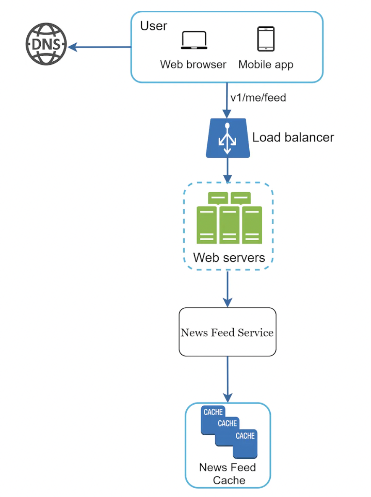
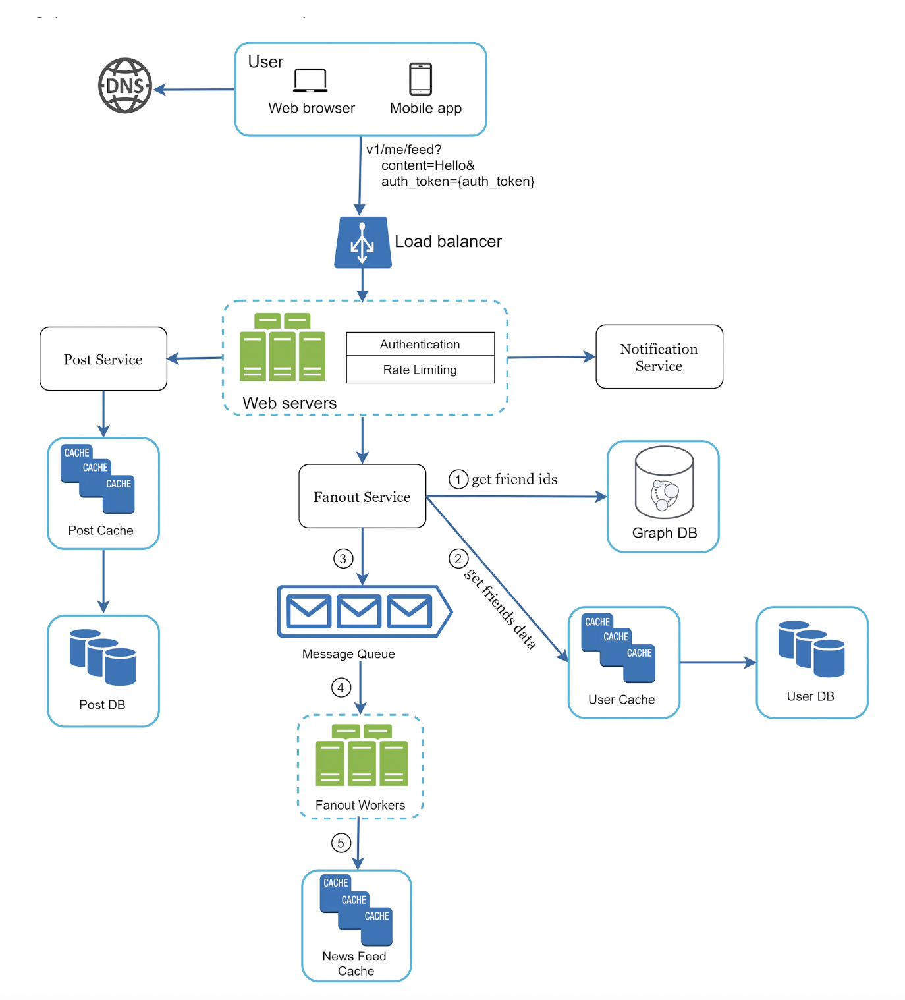
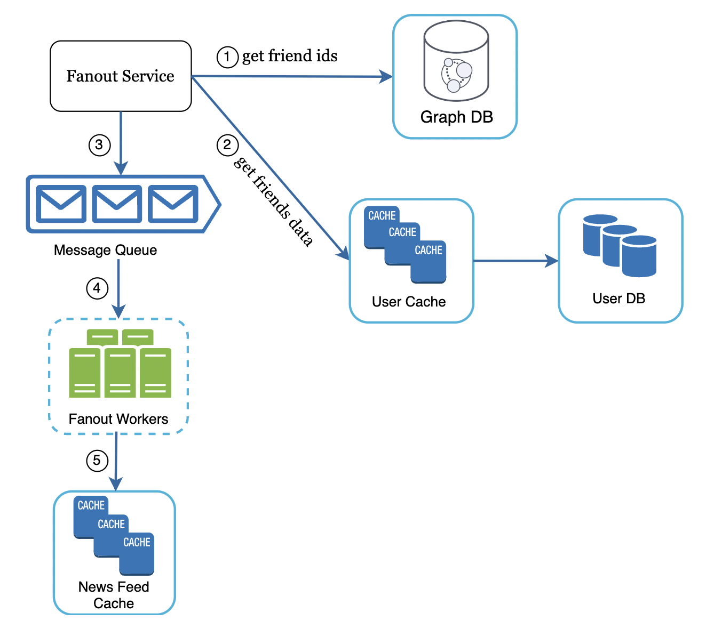
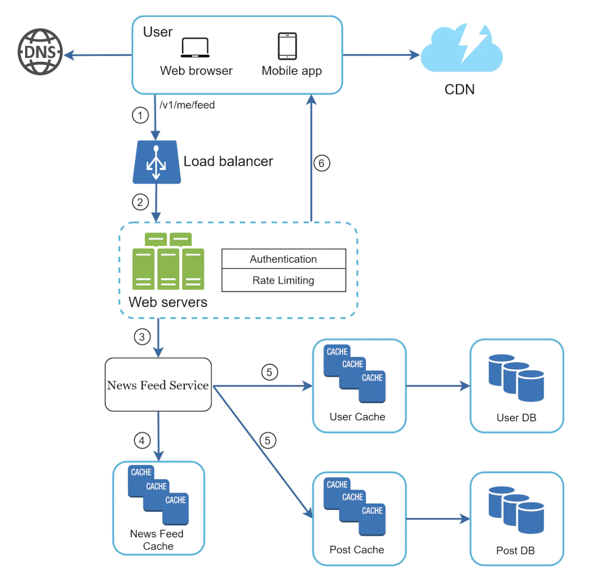
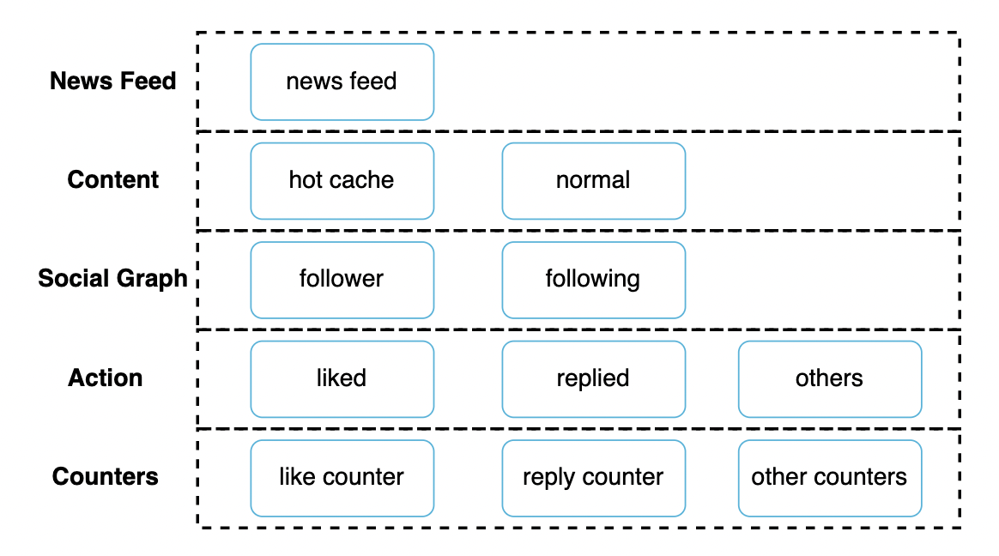

# Design a News Feed System
News feed == constantly updating list of stories on your home page.

It includes status updates, photos, videos, links, etc.

Similar interview questions - design facebook news feed, twitter timeline, instagram feed, etc.

# Step 1 - Understand the problem and establish design scope
First step is to clarify what the interviewer has in mind exactly:
 * C: Mobile, web app?
 * I: Both
 * C: What are the important features?
 * I: User can publish posts and see friends' posts on news feed.
 * C: Is news feed sorted in reverse chronological order or based on rank, eg best friends' posts first.
 * I: To keep it simple, let's assume reverse chrono order
 * C: Max number of friends?
 * I: 5000
 * C: Traffic volume?
 * I: 10mil DAU
 * C: Can the feed contain media?
 * I: It can contain images and video

# Step 2 - Propose high-level design and get buy-in
There are two parts to the design:
 * Feed publishing - when user publishes a post, corresponding data is written to cache and DB. Post is populated to friends' news feed.
 * Newsfeed building - built by aggregating friends' posts in news feed.

## Newsfeed API
The Newsfeed API is the primary gateway for users to the news feed services.

Here's some of the main endpoints.
 * `POST /v1/me/feed` - publish a post. Payload includes `content` + `auth_token`.
 * `GET /v1/me/feed` - retrieve news feed. Payload includes `auth_token`.

## Feed publishing

 * User makes a new post via API.
 * Load balancer - distributes traffic to web servers.
 * Web servers - redirect traffic to internal services.
 * Post service - persist post in database and cache.
 * Fanout service - push posts to friends' news feeds.
 * Notification service - inform new friends that content is available.

## Newsfeed building

 * User sends request to retrieve news feed.
 * Load balancer redirects traffic to web servers.
 * Web servers - route requests to newsfeed service.
 * Newsfeed service - fetch news feed from cache.
 * Newsfeed cache - store pre-computed news feeds for fast retrieval.

# Step 3 - Design deep dive
Let's discuss the two flows we covered in more depth.

## Feed publishing deep dive

### Web servers
besides a gateway to the internal services, these do authentication and apply rate limits, in order to prevent spam.

### Fanout service
This is the process of delivering posts to friends. There are two types of fanouts - fanout on write (push model) and fanout on read (pull model).

Fanout on write (push model) - posts are pre-computed during post publishing.

Pros:
 * news feed is generated in real-time and can be delivered instantly to friends' news feed.
 * fetching the news feed is fast as it's precomputed

Cons:
 * if a friend has many friends, generating the news feed takes a lot of time, which slows down post publishing speed. This is the hotkey problem.
 * for inactive users, pre-computing the news feed is a waste.

Fanout on read (pull model) - news feed is generated during read time.

Pros:
 * Works better for inactive users, as news feeds are not generated for them.
 * Data is not pushed to friends, hence, no hotkey problem.

Cons:
 * Fetching the news feed is slow as it's not pre-computed.

We'll adopt a hybrid approach - we'll pre-compute the news feed for people without many friends and use the pull model for celebrities and users with many friends/followers.

System diagram of fanout service:

 * Fetch friend IDs from graph database. They're suited for managing friend relationships and recommendations.
 * Get friends info from user cache. Filtering is applied here for eg muted/blocked friends.
 * Send friends list and post ID to the message queue.
 * Fanout workers fetch the messages and store the news feed data in a cache. They store a `<post_id, user_id>` mappings** in it which can later be retrieved.

** I think there is some kind of error in this part of the book. It doesn't make sense to store a `<post_id, user_id>` mapping in the cache. Instead, it should be a `<user_id, post_id>` mapping as that allows one to quickly fetch all posts for a given user, which are part of their news feed. In addition to that, the example in the book shows that you can store multiple user_ids or post_ids as keys in the cache, which is typically not supported in eg a hashmap, but it is actually supported when you use the `Redis Sets` feature, but that is not explicitly mentioned in the chapter.

## News feed retrieval deep dive

 * user sends request to retrieve news feed.
 * Load balancer distributes request to a set of web servers.
 * Web servers call news feed service.
 * News feed service gets a list of `post_id` from the news feed cache.
 * Then, the posts in the news feed are hydrated with usernames, content, media files, etc.
 * Fully hydrated news feed is returned as a JSON to the user.
 * Media files are also stored in CDN and fetched from there for better user experience.

## Cache architecture
Cache is very important for a news feed service. We divided it into 5 layers:

 * news feed - stores ids of news feeds
 * content - stores every post data. Popular content is stored in hot cache.
 * social graph - store user relationship data.
 * action - store info about whether a user liked, replied or took actions on a post.
 * counters - counters for replies, likes, followers, following, etc.

# Step 4 - wrap up
In this chapter, we designed a news feed system and we covered two main use-cases - feed publishing and feed retrieval.

Talking points, related to scalability:
 * vertical vs. horizontal database scaling
 * SQL vs. NoSQL
 * Master-slave replication
 * Read replicas
 * Consistency models
 * Database sharding

Other talking points:
 * keep web tier stateless
 * cache data as much as possible
 * multiple data center setup
 * Loose coupling components via message queues
 * Monitoring key metrics - QPS and latency.
