# Design a Chat System
We'll be designing a chat system similar to Messenger, WhatsApp, etc.

In this case, it is very important to nail down the exact requirements because chat systems can differ a lot - eg ones focused on group chats vs. one-on-one conversations.

# Step 1 - Understand the problem and establish design scope
 * C: What kind of chat app should we design? One-on-one convos or group chat?
 * I: It should support both cases.
 * C: Mobile app, web app, both?
 * I: Both
 * C: What's the app scale? Startup or massive application?
 * I: It should support 50mil DAU
 * C: For group chat, what is the member limit?
 * I: 100 people
 * C: What features are important? Eg attachments?
 * I: 1-on-1 and group chats. Online indicator. Text messages only.
 * C: Is there message size limit?
 * I: Text length is less than 100,000 chars long.
 * C: End-to-end encryption required?
 * I: Not required, but will discuss if time permits.
 * C: How long should chat history be stored?
 * I: Forever

Summary of features we'll focus on:
 * One-on-one chat with low delivery latency
 * Small group chats (100 ppl)
 * Online presence
 * Same account can be logged in via multiple devices.
 * Push notifications
 * Scale of 50mil DAU

# Step 2 - Propose high-level design and get buy-in
Let's understand how clients and servers communicate first.
 * In this system, clients can be mobile devices or web browsers.
 * They don't connect to each other directly. They are connected to a server.

Main functions the chat service should support:
 * Receive messages from clients
 * Find the right recipients for a message and relay it
 * If recipient is not online, hold messages for them until they get back online.
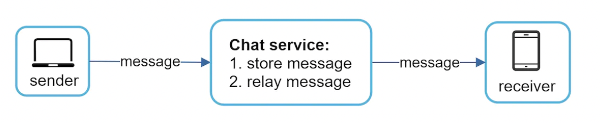

When clients connect to the server, they can do it via one or more network protocols.
One option is HTTP. That is okay for the sender-side, but not okay for receiver-side.

There are multiple options to handle a server-initiated message for the client - polling, long-polling, web sockets.

## Polling
Polling requires the client to periodically ask the server for status updates:
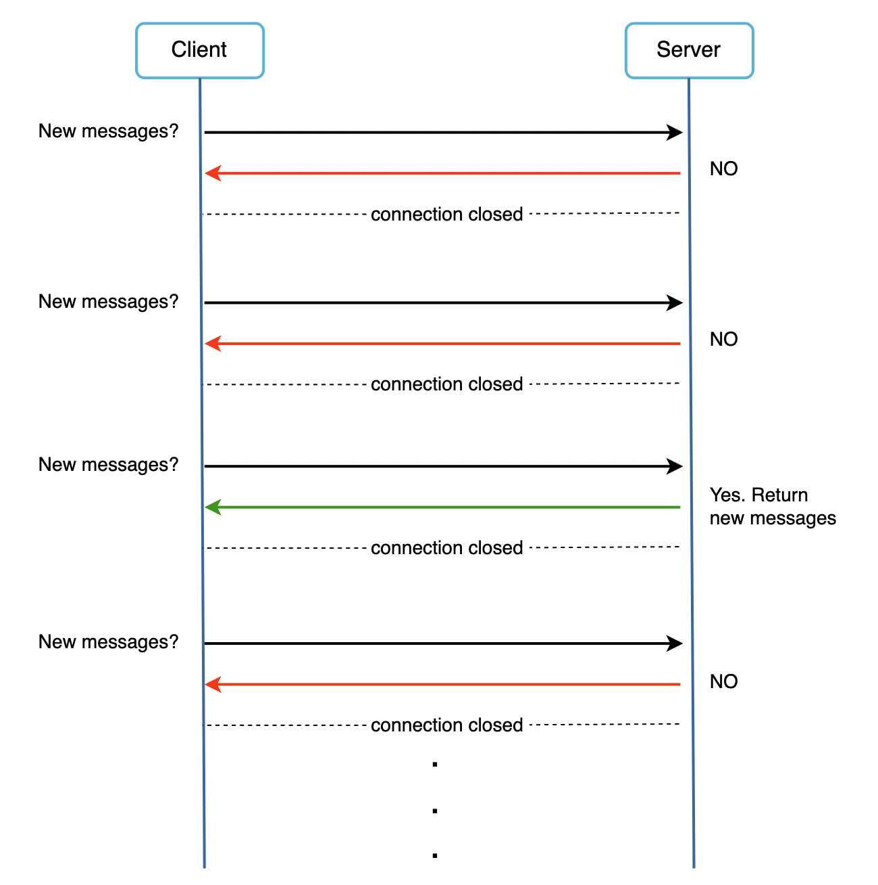

This is easy to implement but it can be costly as there are many requests, which often yield no results

## Long polling
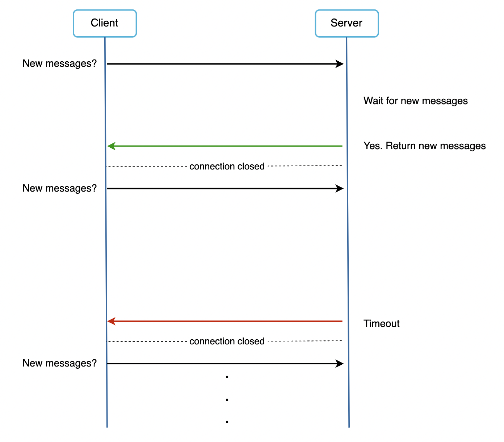

With long polling, clients hold the connection open while waiting for an event to occur on the server-side.
This still has some wasted requests if users don't chat much, but it is more efficient than polling.

Other caveats:
 * Server has no good way to determine if client is disconnected.
 * senders and receivers might be connected to different servers.

## WebSocket
Most common approach when bidirectional communication is needed:
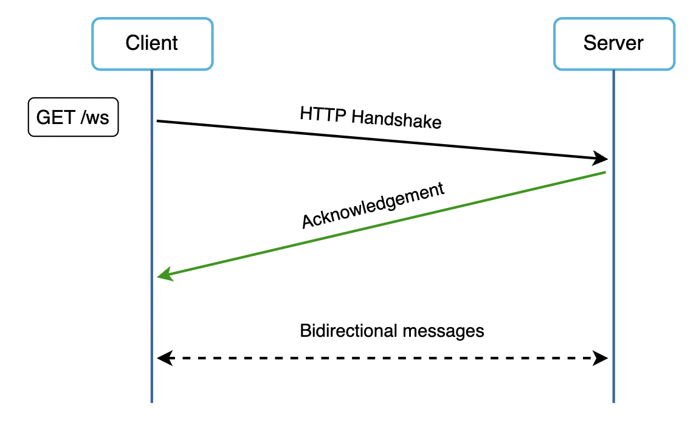

The connection is initiated by the client and starts as HTTP, but can be upgraded after handshake.
In this setup, both clients and servers can initiate messages.

One caveat with web sockets is that this is a persistent protocol, making the servers stateful. Efficient connection management is necessary when using it.

## High-level design
Although we mentioned how web sockets can be useful for exchanging messages, most other standard features of our chat can use the normal request/response protocol over HTTP.

Given this remark, our service can be broken down into three parts - stateless API, stateful websocket API and third-party integration for notifications:
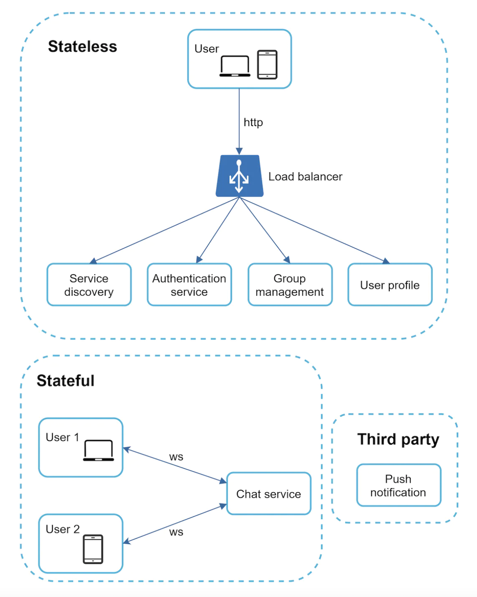

### Stateless Services
Traditional public-facing request/response services are used to manage login, signup, user profile, etc.

These services sit behind a load-balancer, which distributes requests across a set of service replicas.

The service discovery service, in particular, is interesting and will be discussed more in-depth in the deep dive.

### Stateful Service
The only stateful service is our chat service. It is stateful as it maintain a persistent connection with clients which connect to it.

In this case, a client doesn't switch to other chat services as long as the existing one stays alive.

Service discovery coordinates closely with the chat services to avoid overload.

### Third-party Integration
It is important for a chat application to support push notifications in order to get notified when someone sends you a message.

This component won't be discussed extensively as it's already covered in the [Design a notification system chapter](../chapter11).

### Scalability
On a small scale, we can fit everything in a single server.

With 1mil concurrent users, assuming each connection takes up 10k memory, a single server will need to use 10GB of memory to service them all.

Despite this, we shouldn't propose a single-server setup as it raises a red flag in the interviewer.
One big drawback of a single server design is the single point of failure.

It is fine, however, to start from a single-server design and extend it later as long as you explicitly state that during the interview.

Here's our refined high-level design:
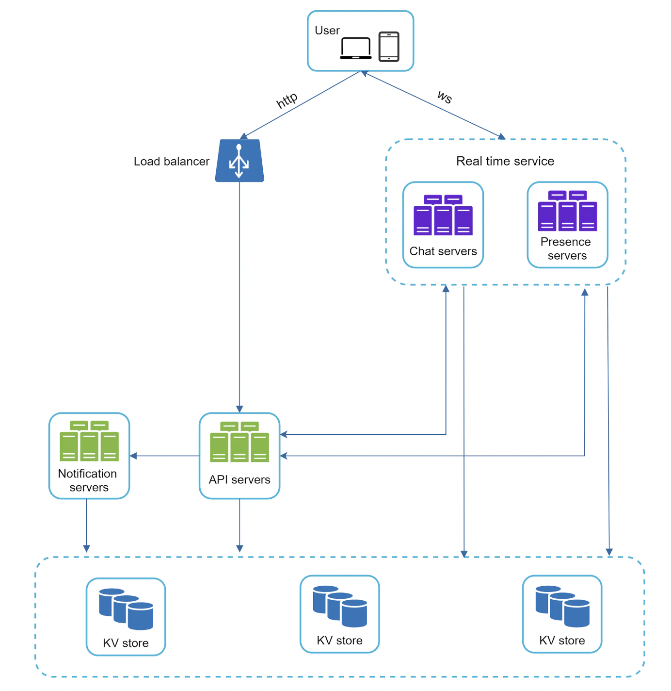
 * clients maintain a persistent web socket connection with a chat server for real-time messaging
 * The chat servers facilitate message sending/receiving
 * Presense servers manage online/offline status
 * API servers handle traditional request/response-based responsibilities - login, sign up, change profile, etc.
 * Notification servers manage push notifications
 * Key-value store is used for storing chat history. When offline user goes online, they will see their chat history and missed messages.

### Storage
One important decision for the storage/data layer is whether we should go with a SQL or NoSQL database.

To make the decision, we need to examine the read/write access patterns.

Traditional data such as user profile, settings, user friends list can be stored in a traditional relational database.
Replication and sharding are common techniques to meet scalability needs for relational databases.

Chat history data, on the other hand, is very specific kind of data of chat systems due to its read/write pattern:
 * Amount of data is enormous, [a study](https://www.theverge.com/2016/4/12/11415198/facebook-messenger-whatsapp-number-messages-vs-sms-f8-2016) revealed that Facebook and WhatsApp process 60bil messages per day.
 * Only recent chats are accessed frequently. Users typically don't go too far back in chat history.
 * Although chat history is accessed infrequently, we should still be able to search within it as users can use a search bar for random access.
 * Read to write ratio is 1:1 on chat apps.

Selecting the correct storage system for this kind of data is crucial. Author recommends using a key-value store:
 * they allow easy horizontal scaling
 * they provide low latency access to data
 * Relational databases don't handle long-tail (less-frequently accessed but large part of a distribution) of data well. When indexes grow large, random access is expensive.
 * Key-value stores are widely adopted for chat systems. Facebook and Discord both use key-value stores. Facebook uses HBase, Discord uses Cassandra.

## Data models
Let's take a look at the data model for our messages.

Message table for one-on-one chat:
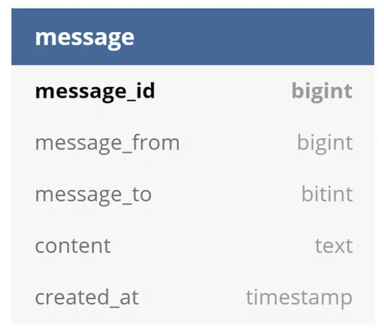

One caveat is that we'll use the primary key (message_id) instead of created_at to determine message sequence as messages can be sent at the same time.

Message table for a group chat:
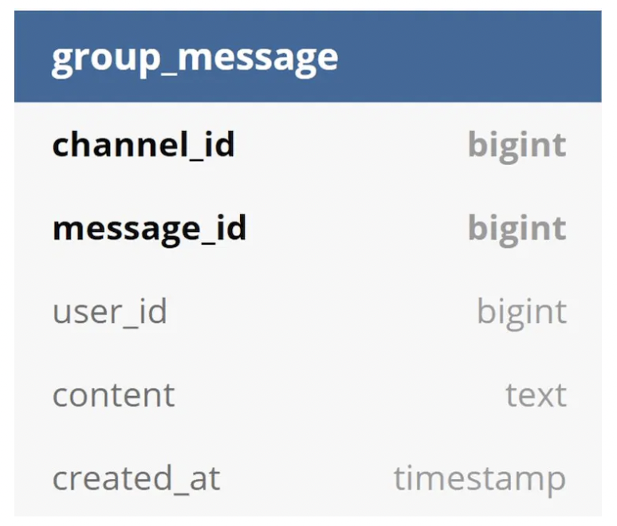

In the above table, `(channel_id, message_id)` is the primary key, while `channel_id` is also the sharding key.

One interesting discussion is how should the `message_id` be generated, as it is used for message ordering. It should have two important attributes:
 * IDs must be unique
 * IDs must be sortable by time

One option is to use the `auto_increment` feature of relational databases. But that's not supported in key-value stores.
An alternative is to use Snowflake - Twitter's algorithm for generating 64-byte IDs which are globally unique and sortable by time.

Finally, we could also use a local sequence number generator, which is unique only within a group. 
We can afford this because we only need to guarantee message sequence within a chat, but not between different chats.

# Step 3 - Design deep-dive
In a system design interview, typically you are asked to go deeper into some of the components.

In this case, we'll go deeper into the service discovery component, messaging flows and online/offline indicator.

## Service discovery
The primary goal of service discovery is to choose the best server based on some criteria - eg geographic location, server capacity, etc.

Apache Zookeeper is a popular open-source solution for service discovery. It registers all available chat servers and picks the best one based on a predefined criteria.
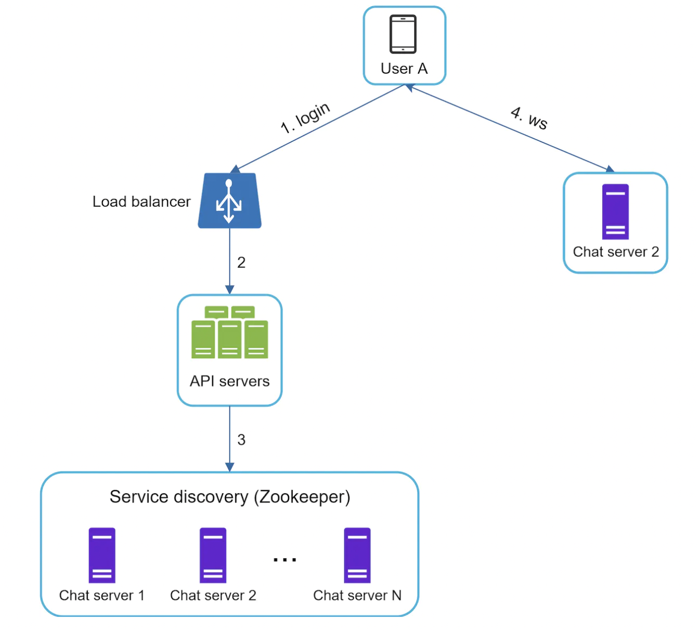
 * User A tries to login to the app
 * Load balancer sends request to API servers.
 * After authentication, service discovery chooses the best chat server for user A. In this case, chat server 2 is chosen.
 * User A connects to chat server 2 via web sockets protocol.

## Message flows
The message flows are an interesting topic to deep dive into. We'll explore one on one chats, message synchronization and group chat.

### 1 on 1 chat flow
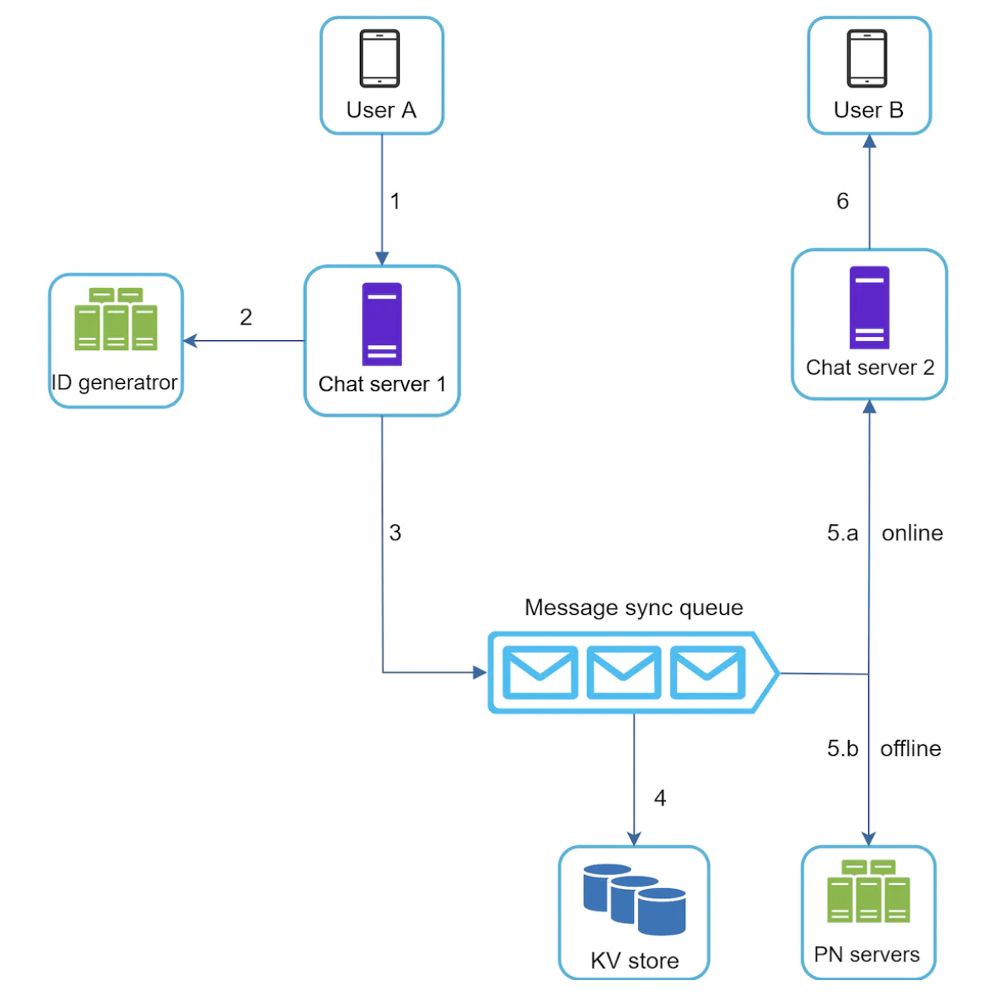
 * User A sends a message to chat server 1
 * Chat server 1 obtains a message_id from Id generator
 * Chat server 1 sends the message to the "message sync" queue.
 * Message is stored in a key-value store.
 * If User B is online, message is forwarded to chat server 2, where User B is connected.
 * If offline, push notification is sent via the push notification servers.
 * Chat server 2 forwards the message to user B.

### Message synchronization across devices
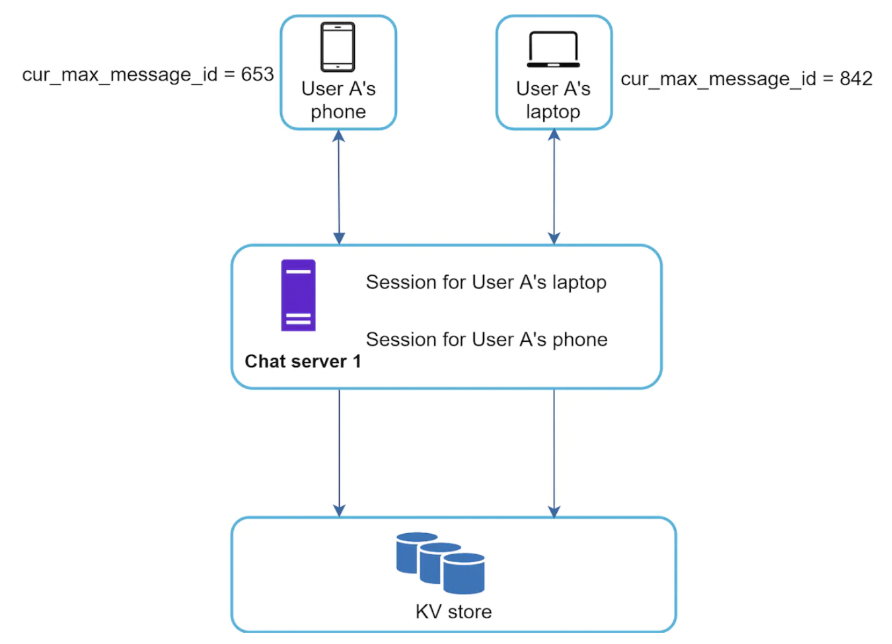
 * When user A logs in via phone, a web socket is established for that device with chat server 1.
 * Each device maintains a variable called `cur_max_message_id`, keeping track of latest message received on given device.
 * Messages whose recipient ID is currently logged in (via any device) and whose message_id is greater than `cur_max_message_id` are considered new

### Small group chat flow
Group chats are a bit more complicated:

Whenever User A sends a message, the message is copied across each message queue of participants in the group (User B and C).

Using one inbox per user is a good choice for small group chats as:
 * it simplifies message sync since each user only need to consult their own queue.
 * storing a message copy in each participant's inbox is feasible for small group chats.

This is not acceptable though, for larger group chats.

As for the recipient, in their queue, they can receive messages from different group chats:
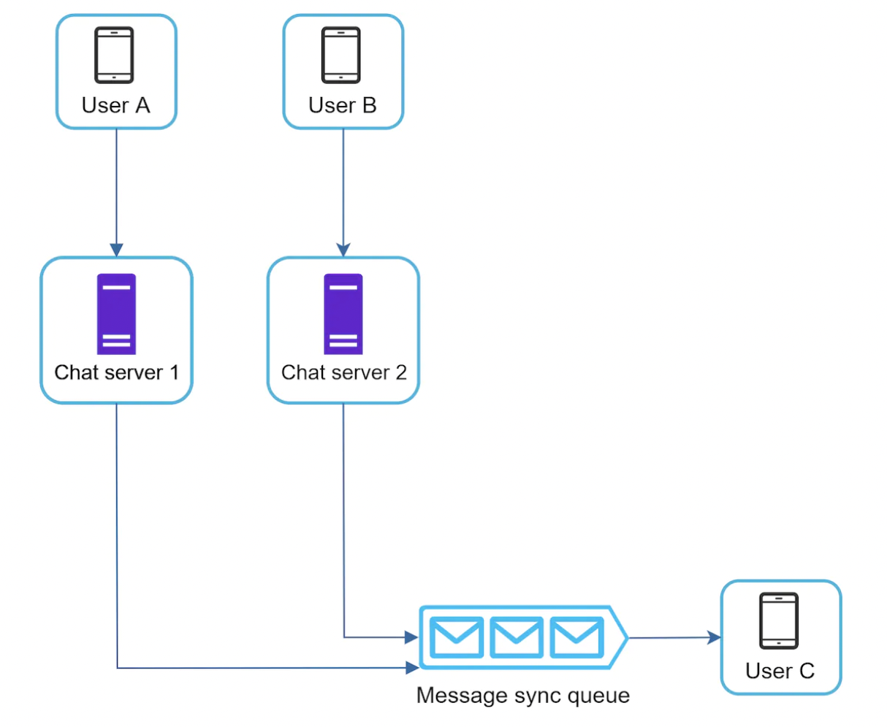

## Online presence
Presence servers manage the online/offline indication in chat applications.

Whenever the user logs in, their status is changed to "online":

Once the user send a logout message to the presence servers (and subsequently disconnects), their status is changed to "offline":
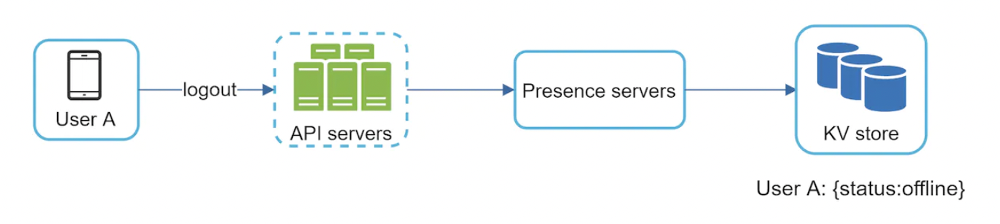

One caveat is handling user disconnection. A naive approach to handle that is to mark a user as "offline" when they disconnect from the presence server.
This makes for a poor user experience as a user could frequently disconnect and reconnect to presence servers due to poor internet.

To mitigate this, we'll introduce a heartbeat mechanism - clients periodically send a heartbeat to the presence servers to indicate online status.
If a heartbeat is not received within a given time frame, user is marked offline:

How does a user's friend find out about a user's presence status though?

We'll use a fanout mechanism, where each friend pair have a queue assigned and status changes are sent to the respective queues:
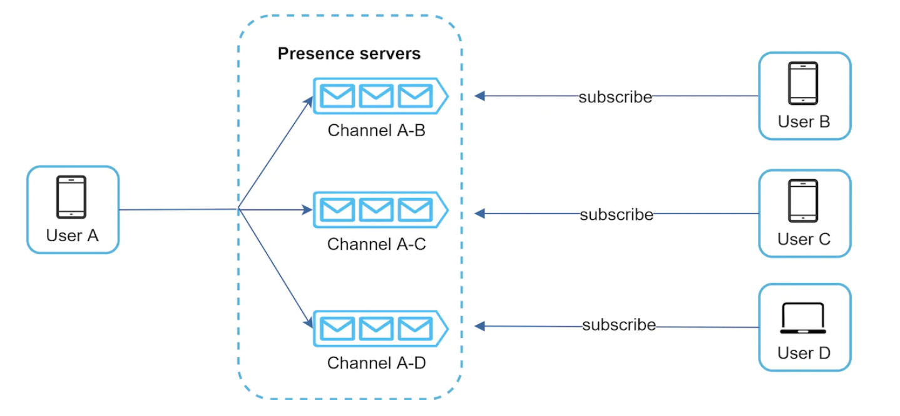

This is effective for small group chats. WeChat uses a similar approach and its user group is capped to 500 users.

If we need to support larger groups, a possible mitigation is to fetch presence status only when a user enters a group or refreshes the members list.

# Step 4 - Wrap up
We managed to build a chat system which supports both one-on-one and group chats.
 * We used web sockets for real-time communication between clients and servers.

System components: 
 * chat servers (real-time messages)
 * presence servers (online/offline status)
 * push notification servers
 * key-value stores for chat history
 * API servers for everything else

Additional talking points:
 * Extend chat app to support media - video, images, voice. Compression, cloud storage and thumbnails can be discussed.
 * End-to-end encryption - only sender and receiver can read messages.
 * Caching messages on client-side is effective to reduce server-client data transfer.
 * Improve load time - Slack built a geographically distributed network to cache user data, channels, etc for better load time.
 * Error handling
 * Chat server error - what happens if a chat server goes down. Zookeeper can facilitate a hand off to another chat server.
 * Message resend mechanism - retrying and queueing are common approaches for re-sending messages.

