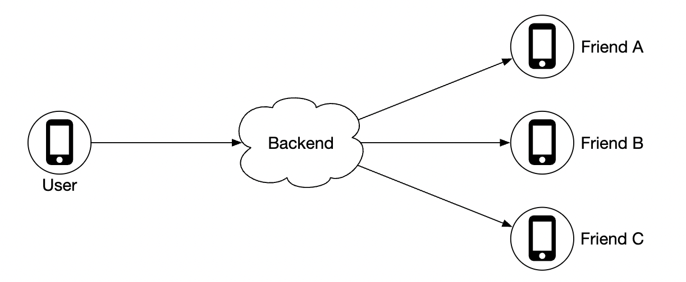
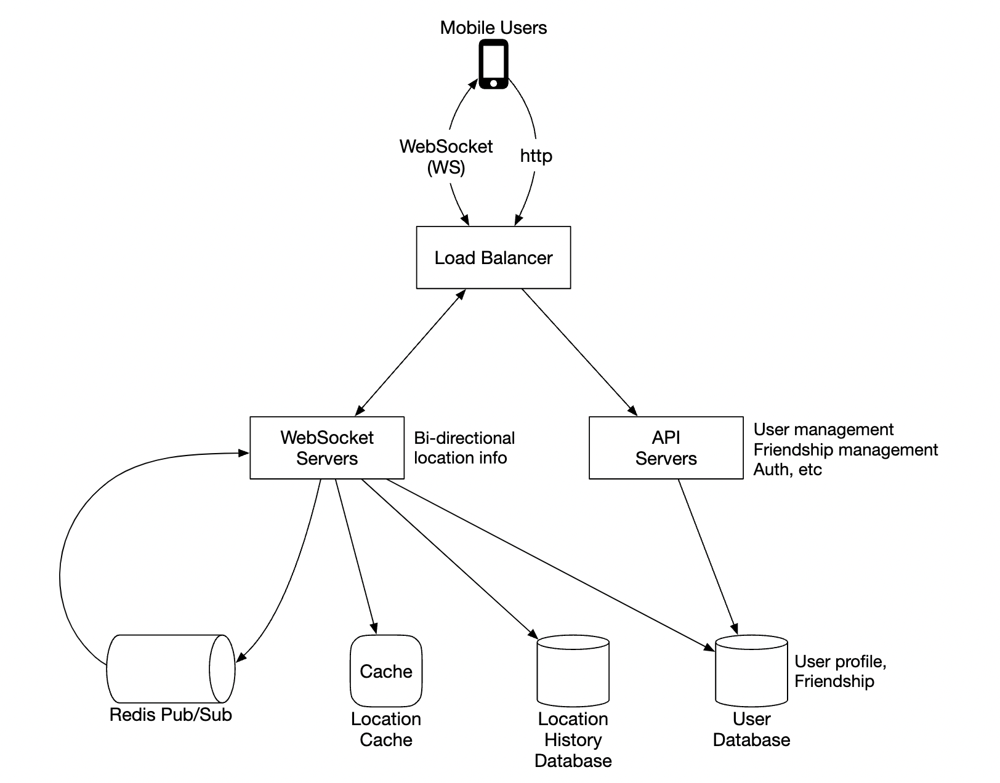
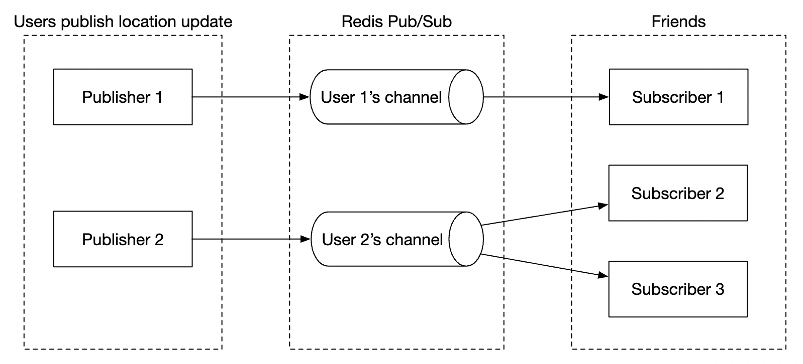
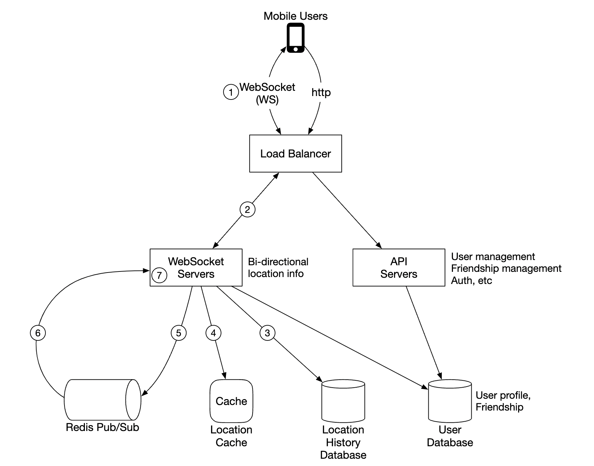
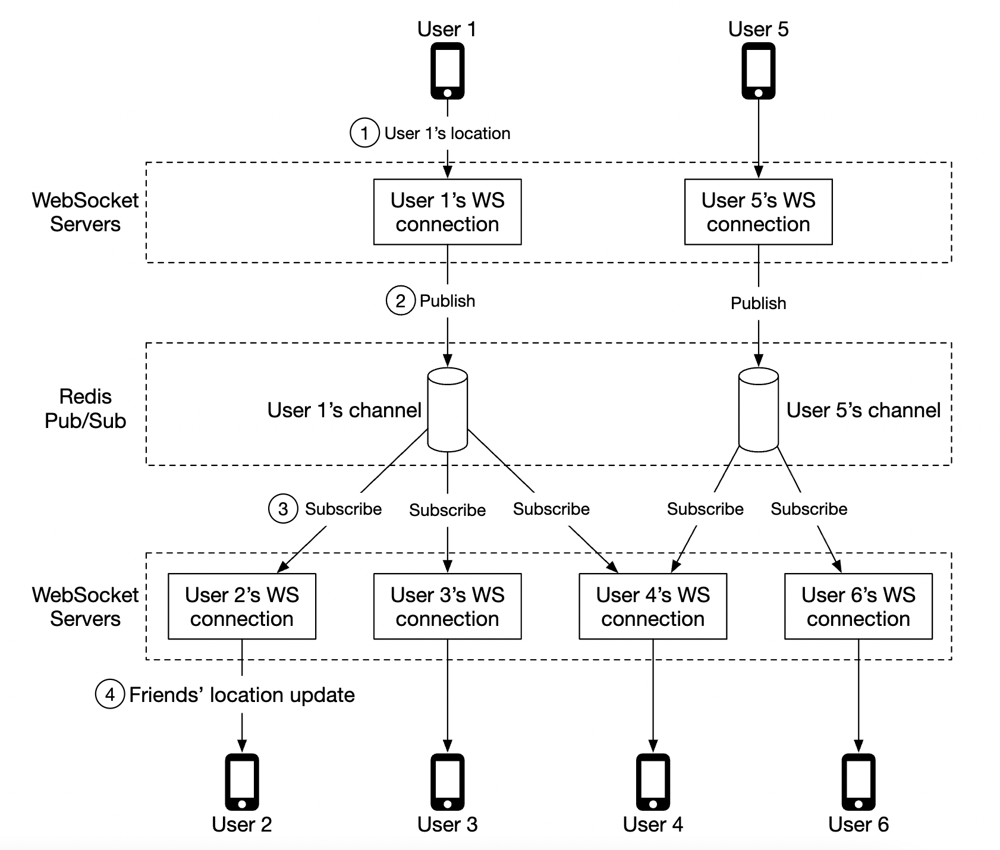
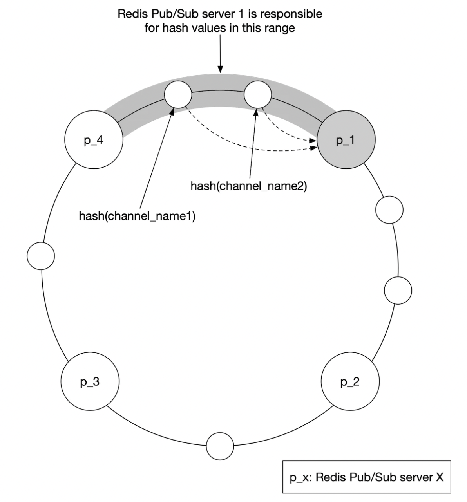
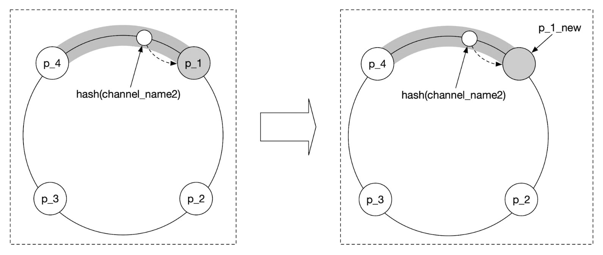
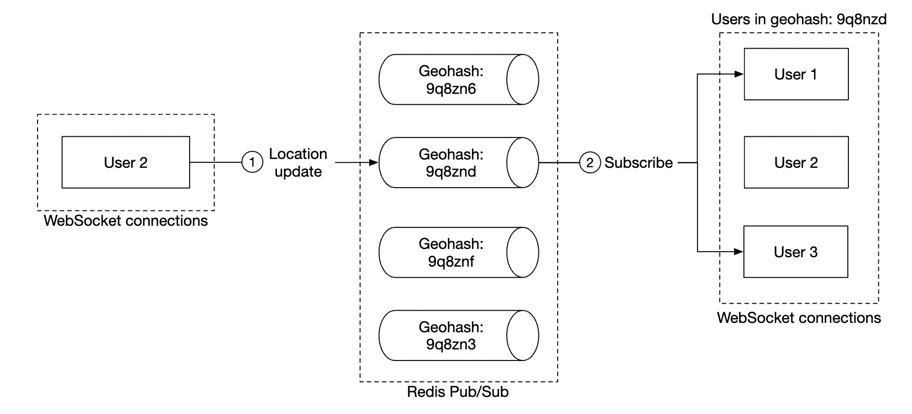
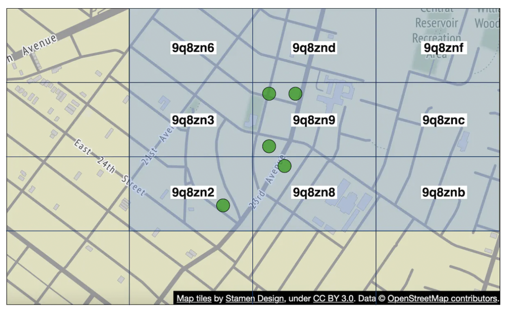

# Nearby Friends
This chapter focuses on designing a scalable backend for an application which enables user to share their location and discover friends who are nearby.

The major difference with the proximity chapter is that in this problem, locations constantly change, whereas in that one, business addresses more or less stay the same.

# Step 1 - Understand the Problem and Establish Design Scope
Some questions to drive the interview:
 * C: How geographically close is considered to be "nearby"?
 * I: 5 miles, this number should be configurable
 * C: Is distance calculated as straight-line distance vs. taking into consideration eg a river in-between friends
 * I: Yes, that is a reasonable assumption
 * C: How many users does the app have?
 * I: 1bil users and 10% of them use the nearby friends feature
 * C: Do we need to store location history?
 * I: Yes, it can be valuable for eg machine learning
 * C: Can we assume inactive friends will disappear from the feature in 10min
 * I: Yes
 * C: Do we need to worry about GDPR, etc?
 * I: No, for simlicity's sake

## Functional requirements
 * Users should be able to see nearby friends on their mobile app. Each friend has a distance and timestamp, indicating when the location was updated
 * Nearby friends list should be updated every few seconds

## Non-functional requirements
 * Low latency - it's important to receive location updates without too much delay
 * Reliability - Occassional data point loss is acceptable, but system should be generally available
 * Eventual consistency - Location data store doesn't need strong consistency. Few seconds delay in receiving location data in different replicas is acceptable

## Back-of-the-envelope
Some estimations to determine potential scale:
 * Nearby friends are friends within 5mile radius
 * Location refresh interval is 30s. Human walking speed is slow, hence, no need to update location too frequently.
 * On average, 100mil users use the feature every day \w 10% concurrent users, ie 10mil
 * On average, a user has 400 friends, all of them use the nearby friends feature
 * App displays 20 nearby friends per page
 * Location Update QPS = 10mil / 30 == ~334k updates per second

# Step 2 - Propose High-Level Design and Get Buy-In
Before exploring API and data model design, we'll study the communication protocol we'll use as it's less ubiquitous than traditional request-response communication model.

## High-level design
At a high-level we'd want to establish effective message passing between peers. This can be done via a peer-to-peer protocol, but that's not practical for a mobile app with flaky connection and tight power consumption constraints.

A more practical approach is to use a shared backend as a fan-out mechanism towards friends you want to reach:

What does the backend do?
 * Receives location updates from all active users
 * For each location update, find all active users which should receive it and forward it to them
 * Do not forward location data if distance between friends is beyond the configured threshold

This sounds simple but the challenge is to design the system for the scale we're operating with.

We'll start with a simpler design at first and discuss a more advanced approach in the deep dive:

 * The load balancer spreads traffic across rest API servers as well as bidirectional web socket servers
 * The rest API servers handles auxiliary tasks such as managing friends, updating profiles, etc
 * The websocket servers are stateful servers, which forward location update requests to respective clients. It also manages seeding the mobile client with nearby friends locations at initialization (discussed in detail later).
 * Redis location cache is used to store most recent location data for each active user. There is a TTL set on each entry in the cache. When the TTL expires, user is no longer active and their data is removed from the cache.
 * User database stores user and friendship data. Either a relational or NoSQL database can be used for this purpose.
 * Location history database stores a history of user location data, not necessarily used directly within nearby friends feature, but instead used to track historical data for analytical purposes
 * Redis pubsub is used as a lightweight message bus which enables different topics for each user channel for location updates.

In the above example, websocket servers subscribe to channels for the users which are connected to them & forward location updates whenever they receive them to appropriate users.

## Periodic location update
Here's how the periodic location update flow works:

 * Mobile client sends a location update to the load balancer
 * Load balancer forwards location update to the websocket server's persistent connection for that client
 * Websocket server saves location data to location history database
 * Location data is updated in location cache. Websocket server also saves location data in-memory for subsequent distance calculations for that user
 * Websocket server publishes location data in user's channel via redis pub sub
 * Redis pubsub broadcasts location update to all subscribers for that user channel, ie servers responsible for the friends of that user
 * Subscribed web socket servers receive location update, calculate which users the update should be sent to and sends it

Here's a more detailed version of the same flow:

On average, there's going to be 40 location updates to forward as a user has 400 friends on average and 10% of them are online at a time.

## API Design
Websocket Routines we'll need to support:
 * periodic location update - user sends location data to websocket server
 * client receives location update - server sends friend location data and timestamp
 * websocket client initialization - client sends user location, server sends back nearby friends location data
 * Subscribe to a new friend - websocket server sends a friend ID mobile client is supposed to track eg when friend appears online for the first time
 * Unsubscribe a friend - websocket server sends a friend ID, mobile client is supposed to unsubscribe from due to eg friend going offline

HTTP API - traditional request/response payloads for auxiliary responsibilities.

## Data model
 * The location cache will store a mapping between `user_id` and `lat,long,timestamp`. Redis is a great choice for this cache as we only care about current location and it supports TTL eviction which we need for our use-case.
 * Location history table stores the same data but in a relational table \w the four columns stated above. Cassandra can be used for this data as it is optimized for write-heavy loads.

# Step 3 - Design Deep Dive
Let's discuss how we scale the high-level design so that it works at the scale we're targetting.

## How well does each component scale?
 * API servers - can be easily scaled via autoscaling groups and replicating server instances
 * Websocket servers - we can easily scale out the ws servers, but we need to ensure we gracefully shutdown existing connections when tearing down a server. Eg we can mark a server as "draining" in the load balancer and stop sending connections to it, prior to being finally removed from the server pool
 * Client initialization - when a client first connects to a server, it fetches the user's friends, subscribes to their channels on redis pubsub, fetches their location from cache and finally forwards to client
 * User database - We can shard the database based on user_id. It might also make sense to expose user/friends data via a dedicated service and API, managed by a dedicated team
 * Location cache - We can shard the cache easily by spinning up several redis nodes. Also, the TTL puts a limit on the max memory we could have taken up at a time. But we still want to handle the large write load
 * Redis pub/sub server - we leverage the fact that no memory is consumed if there are channels initialized but are not in use. Hence, we can pre-allocate channels for all users who use the nearby friends feature to avoid having to deal with eg bringing up a new channel when a user comes online and notifying active websocket servers

## Scaling deep-dive on redis pub/sub component
We will need around 200gb of memory to maintain all pub/sub channels. This can be achieved by using 2 redis servers with 100gb each.

Given that we need to push ~14mil location updates per second, we will however need at least 140 redis servers to handle that amount of load, assuming that a single server can handle ~100k pushes per second.

Hence, we'll need a distributed redis server cluster to handle the intense CPU load.

In order to support a distributed redis cluster, we'll need to utilize a service discovery component, such as zookeeper or etcd, to keep track of which servers are alive.

What we need to encode in the service discovery component is this data:

Web socket servers use that encoded data, fetched from zookeeper to determine where a particular channel lives. For efficiency, the hash ring data can be cached in-memory on each websocket server.

In terms of scaling the server cluster up or down, we can setup a daily job to scale the cluster as needed based on historical traffic data. We can also overprovision the cluster to handle spikes in loads.

The redis cluster can be treated as a stateful storage server as there is some state maintained for the channels and there is a need for coordination with subscribers so that they hand-off to newly provisioned nodes in the cluster.

We have to be mindful of some potential issues during scaling operations:
 * There will be a lot of resubscription requests from the web socket servers due to channels being moved around
 * Some location updates might be missed from clients during the operation, which is acceptable for this problem, but we should still minimize it from happening. Consider doing such operation when traffic is at lowest point of the day.
 * We can leverage consistent hashing to minimize amount of channels moved in the event of adding/removing servers

## Adding/removing friends
Whenever a friend is added/removed, websocket server responsible for affected user needs to subscribe/unsubscribe from the friend's channel.

Since the "nearby friends" feature is part of a larger app, we can assume that a callback on the mobile client side can be registered whenever any of the events occur and the client will send a message to the websocket server to do the appropriate action.

## Users with many friends
We can put a cap on the total number of friends one can have, eg facebook has a cap of 5000 max friends.

The websocket server handling the "whale" user might have a higher load on its end, but as long as we have enough web socket servers, we should be okay.

## Nearby random person
What if the interviewer wants to update the design to include a feature where we can occasionally see a random person pop up on our nearby friends map?

One way to handle this is to define a pool of pubsub channels, based on geohash:

Anyone within the geohash subscribes to the appropriate channel to receive location updates for random users:

We could also subscribe to several geohashes to handle cases where someone is close but in a bordering geohash:

## Alternative to Redis pub/sub
An alternative to using Redis for pub/sub is to leverage Erlang - a general programming language, optimized for distributed computing applications.

With it, we can spawn millions of small, erland processes which communicate with each other. We can handle both websocket connections and pub/sub channels within the distributed erlang application.

A challenge with using Erlang, though, is that it's a niche programming language and it could be hard to source strong erlang developers.

# Step 4 - Wrap Up
We successfully designed a system, supporting the nearby friends features.

Core components:
 * Web socket servers - real-time comms between client and server
 * Redis - fast read and write of location data + pub/sub channels

We also explored how to scale restful api servers, websocket servers, data layer, redis pub/sub servers and we also explored an alternative to using Redis Pub/Sub. We also explored a "random nearby person" feature.
