# Distributed Message Queue
We'll be designing a distributed message queue in this chapter.

Benefits of message queues:
 * Decoupling - Eliminates tight coupling between components. Let them update separately.
 * Improved scalability - Producers and consumers can be scaled independently based on traffic.
 * Increased availability - If one part of the system goes down, other parts continue interacting with the queue.
 * Better performance - Producers can produce messages without waiting for consumer confirmation.

Some popular message queue implementations - Kafka, RabbitMQ, RocketMQ, Apache Pulsar, ActiveMQ, ZeroMQ.

Strictly speaking, Kafka and Pulsar are not message queues. They are event streaming platforms.
There is however a convergence of features which blurs the distinction between message queues and event streaming platforms.

In this chapter, we'll be building a message queue with support for more advanced features such as long data retention, repeated message consumption, etc.

# Step 1 - Understand the problem and establish design scope
Message queues ought to support few basic features - producers produce messages and consumers consume them.
There are, however, different considerations with regards to performance, message delivery, data retention, etc.

Here's a set of potential questions between Candidate and Interviewer:
 * C: What's the format and average message size? Is it text only?
 * I: Messages are text-only and usually a few KBs
 * C: Can messages be repeatedly consumed?
 * I: Yes, messages can be repeatedly consumed by different consumers. This is an added requirement, which traditional message queues don't support.
 * C: Are messages consumed in the same order they were produced?
 * I: Yes, order guarantee should be preserved. This is an added requirement, traditional message queues don't support this.
 * C: What are the data retention requirements?
 * I: Messages need to have a retention of two weeks. This is an added requirement.
 * C: How many producers and consumers do we want to support?
 * I: The more, the better.
 * C: What data delivery semantic do we want to support? At-most-once, at-least-once, exactly-once?
 * I: We definitely want to support at-least-once. Ideally, we can support all and make them configurable.
 * C: What's the target throughput for end-to-end latency?
 * I: It should support high throughput for use cases like log aggregation and low throughput for more traditional use cases.

Functional requirements:
 * Producers send messages to a message queue
 * Consumers consume messages from the queue
 * Messages can be consumed once or repeatedly
 * Historical data can be truncated
 * Message size is in the KB range
 * Order of messages needs to be preserved
 * Data delivery semantics is configurable - at-most-once/at-least-once/exactly-once.

Non-functional requirements:
 * High throughput or low latency. Configurable based on use-case
 * Scalable - system should be distributed and support a sudden surge in message volume
 * Persistent and durable - data should be persisted on disk and replicated among nodes

Traditional message queues typically don't support data retention and don't provide ordering guarantees. This greatly simplifies the design and we'll discuss it.

# Step 2 - Propose high-level design and get buy-in
Key components of a message queue:
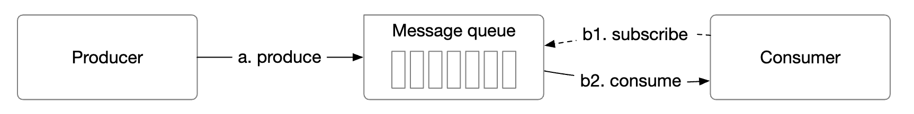
 * Producer sends messages to a queue
 * Consumer subscribes to a queue and consumes the subscribed messages
 * Message queue is a service in the middle which decouples producers from consumers, letting them scale independently.
 * Producer and consumer are both clients, while the message queue is the server.

## Messaging models
The first type of messaging model is point-to-point and it's commonly found in traditional message queues:
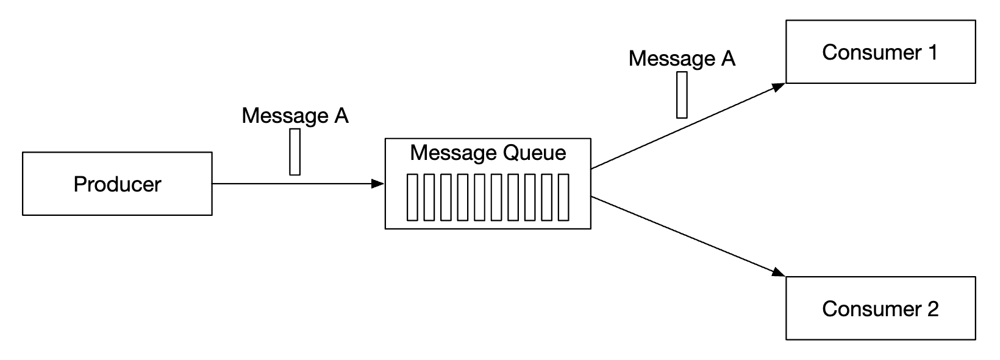
 * A message is sent to a queue and it's consumed by exactly one consumer.
 * There can be multiple consumers, but a message is consumed only once.
 * Once message is acknowledged as consumed, it is removed from the queue.
 * There is no data retention in the point-to-point model, but there is such in our design.

On the other hand, the publish-subscribe model is more common for event streaming platforms:
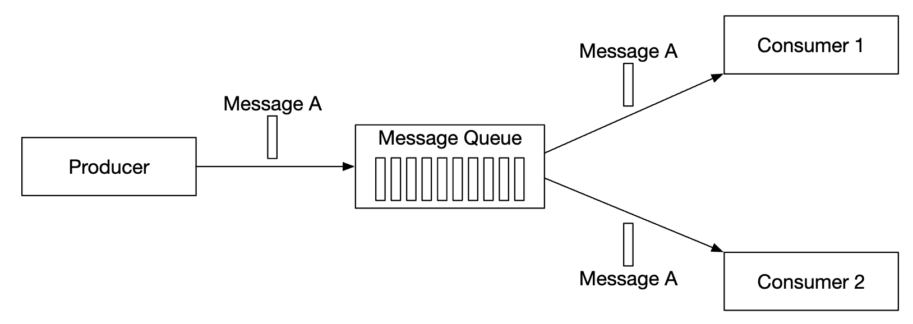
 * In this model, messages are associated to a topic.
 * Consumers are subscribed to a topic and they receive all messages sent to this topic.

## Topics, partitions and brokers
What if the data volume for a topic is too large? One way to scale is by splitting a topic into partitions (aka sharding):
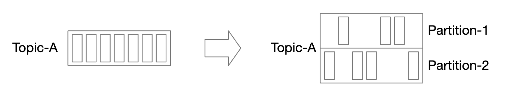
 * Messages sent to a topic are evenly distributed across partitions
 * The servers that host partitions are called brokers
 * Each topic operates like a queue using FIFO for message processing. Message order is preserved within a partition.
 * The position of a message within the partition is called an **offset**.
 * Each message produced is sent to a specific partition. A partition key specifies which partition a message should land in. 
   * Eg a `user_id` can be used as a partition key to guarantee order of messages for the same user.
 * Each consumer subscribes to one or more partitions. When there are multiple consumers for the same messages, they form a consumer group.

## Consumer groups
Consumer groups are a set of consumers working together to consume messages from a topic:

 * Messages are replicated per consumer group (not per consumer).
 * Each consumer group maintains its own offset.
 * Reading messages in parallel by a consumer group improves throughput but hampers the ordering guarantee.
 * This can be mitigated by only allowing one consumer from a group to be subscribed to a partition. 
 * This means that we can't have more consumers in a group than there are partitions.

## High-level architecture
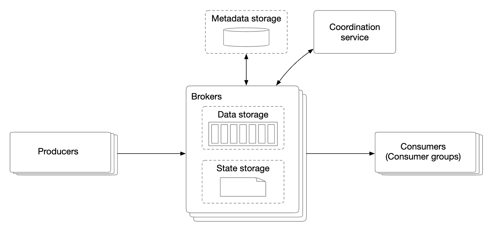
 * Clients are producer and consumer. Producer pushes messages to a designated topic. Consumer group subscribes to messages from a topic.
 * Brokers hold multiple partitions. A partition holds a subset of messages for a topic.
 * Data storage stores messages in partitions.
 * State storage keeps the consumer states.
 * Metadata storage stores configuration and topic properties
 * The coordination service is responsible for service discovery (which brokers are alive) and leader election (which broker is leader, responsible for assigning partitions).

# Step 3 - Design Deep Dive
In order to achieve high throughput and preserve the high data retention requirement, we made some important design choices:
 * We chose an on-disk data structure which takes advantage of the properties of modern HDD and disk caching strategies of modern OS-es.
 * The message data structure is immutable to avoid extra copying, which we want to avoid in a high volume/high traffic system.
 * We designed our writes around batching as small I/O is an enemy of high throughput.

## Data storage
In order to find the best data store for messages, we must examine a message's properties:
 * Write-heavy, read-heavy
 * No update/delete operations. In traditional message queues, there is a "delete" operation as messages are not retained.
 * Predominantly sequential read/write access pattern.

What are our options:
 * Database - not ideal as typical databases don't support well both write and read heavy systems.
 * Write-ahead log (WAL) - a plain text file which only supports appending to it and is very HDD-friendly. 
   * We split partitions into segments to avoid maintaining a very large file.
   * Old segments are read-only. Writes are accepted by latest segment only.
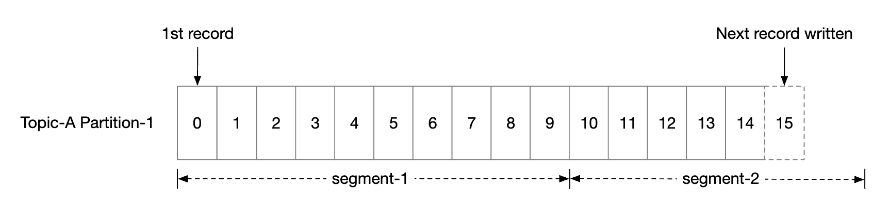

WAL files are extremely efficient when used with traditional HDDs. 

There is a misconception that HDD acces is slow, but that hugely depends on the access pattern.
When the access pattern is sequential (as in our case), HDDs can achieve several MB/s write/read speed which is sufficient for our needs.
We also piggyback on the fact that the OS caches disk data in memory aggressively.

## Message data structure
It is important that the message schema is compliant between producer, queue and consumer to avoid extra copying. This allows much more efficient processing.

Example message structure:
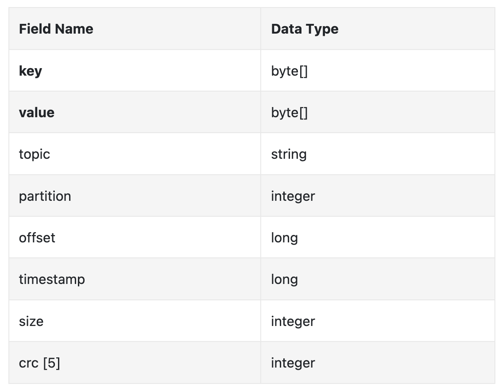

The key of the message specifies which partition a message belongs to. An example mapping is `hash(key) % numPartitions`.
For more flexibility, the producer can override default keys in order to control which partitions messages are distributed to.

The message value is the payload of a message. It can be plaintext or a compressed binary block.

**Note:** Message keys, unlike traditional KV stores, need not be unique. It is acceptable to have duplicate keys and for it to even be missing.

Other message files:
 * Topic - topic the message belongs to
 * Partition - The ID of the partition a message belongs to
 * Offset - The position of the message in a partition. A message can be located via `topic`, `partition`, `offset`.
 * Timestamp - When the message is stored
 * Size - the size of this message
 * CRC - checksum to ensure message integrity

Additional features such as filtering can be supported by adding additional fields.

## Batching
Batching is critical for the performance of our system. We apply it in the producer, consumer and message queue.

It is critical because:
 * It allows the operating system to group messages together, amortizing the cost of expensive network round trips
 * Messages are written to the WAL in groups sequentially, which leads to a lot of sequential writes and disk caching.

There is a trade-off between latency and throughput:
 * High batching leads to high throughput and higher latency. 
 * Less batching leads to lower throughput and lower latency.

If we need to support lower latency since the system is deployed as a traditional message queue, the system could be tuned to use a smaller batch size.

If tuned for throughput, we might need more partitions per topic to compensate for the slower sequential disk write throughput.

## Producer flow
If a producer wants to send a message to a partition, which broker should it connect to?

One option is to introduce a routing layer, which route messages to the correct broker. If replication is enabled, the correct broker is the leader replica:
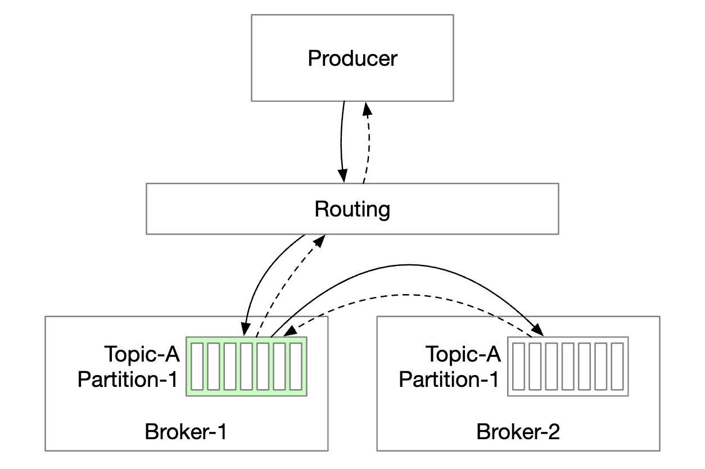
 * Routing layer reads the replication plan from the metadata store and caches it locally.
 * Producer sends a message to the routing layer.
 * Message is forwarded to broker 1 who is the leader of the given partition
 * Follower replicas pull the new message from the leader. Once enough confirmations are received, the leader commits the data and responds to the producer.

The reason for having replicas is to enable fault tolerance.

This approach works but has some drawbacks:
 * Additional network hops due to the extra component
 * The design doesn't enable batching messages

To mitigate these issues, we can embed the routing layer into the producer:
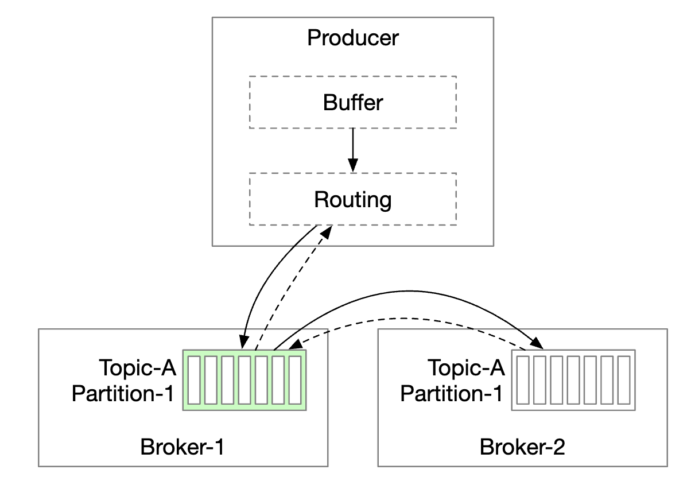
 * Fewer network hops lead to lower latency
 * Producers can control which partition a message is routed to
 * The buffer allows us to batch messages in-memory and send out larger batches in a single request, which increases throughput.

The batch size choice is a classical trade-off between throughput and latency. 
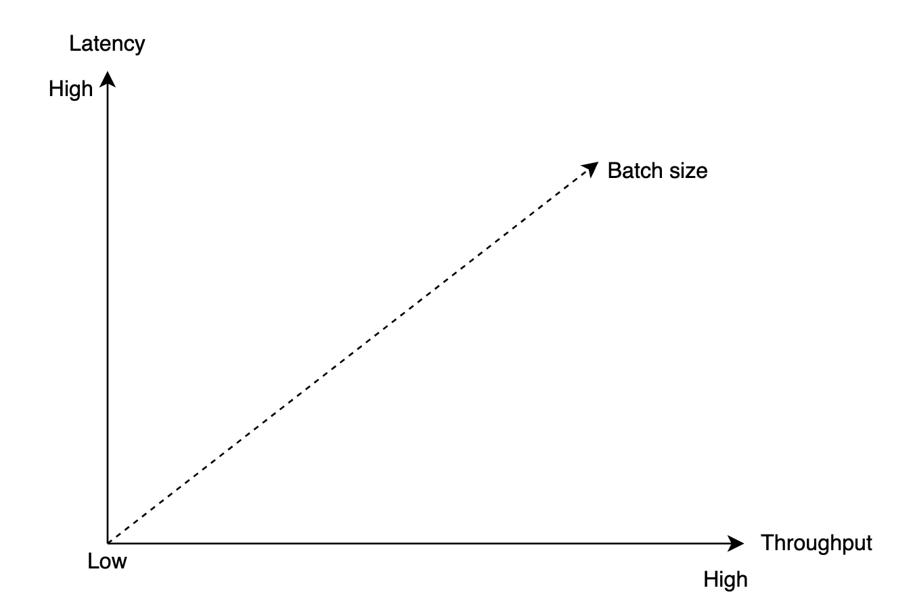
 * Larger batch size leads to longer wait time before batch is committed. 
 * Smaller batch size leads to request being sent sooner and having lower latency but lower throughput.

## Consumer flow
The consumer specifies its offset in a partition and receives a chunk of messages, beginning from that offset:
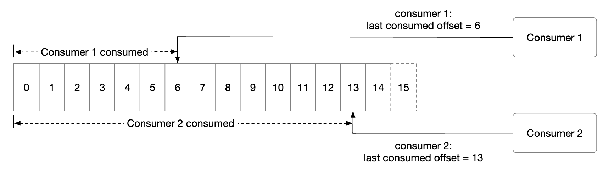

One important consideration when designing the consumer is whether to use a push or a pull model:
 * Push model leads to lower latency as broker pushes messages to consumer as it receives them.
   * However, if rate of consumption falls behind the rate of production, the consumer can be overwhelmed.
   * It is challenging to deal with consumers with varying processing power as the broker controls the rate of consumption.
 * Pull model leads to the consumer controlling the consumption rate. 
   * If rate of consumption is slow, consumer will not be overwhelmed and we can scale it to catch up.
   * The pull model is more suitable for batch processing, because with the push model, the broker can't know how many messages a consumer can handle. 
   * With the pull model, on the other hand, consumers can aggressively fetch large message batches.
   * The down side is the higher latency and extra network calls when there are no new messages. Latter issue can be mitigated using long polling.

Hence, most message queues (and us) choose the pull model.
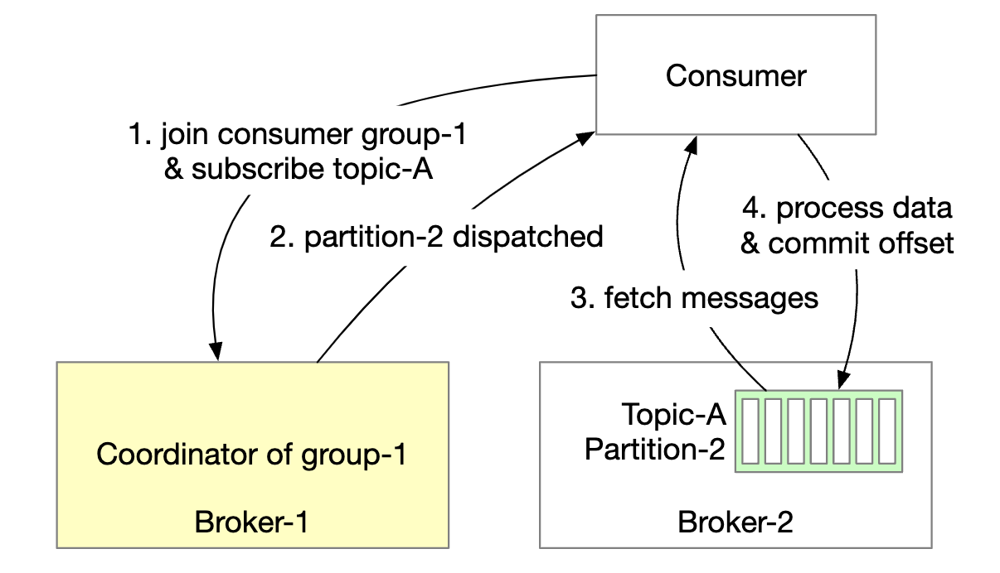
 * A new consumer subscribes to topic A and joins group 1.
 * The correct broker node is found by hashing the group name. This way, all consumers in a group connect to the same broker.
 * Note that this consumer group coordinator is different from the coordination service (ZooKeeper).
 * Coordinator confirms that the consumer has joined the group and assigns partition 2 to that consumer.
 * There are different partition assignment strategies - round-robin, range, etc.
 * Consumer fetches latest messages from the last offset. The state storage keeps the consumer offsets.
 * Consumer processes messages and commits the offset to the broker. The order of those operations affects the message delivery semantics.

## Consumer rebalancing
Consumer rebalancing is responsible for deciding which consumers are responsible for which partition.

This process occurs when a consumer joins/leaves or a partition is added/removed.

The broker, acting as a coordinator plays a huge role in orchestrating the rebalancing workflow.
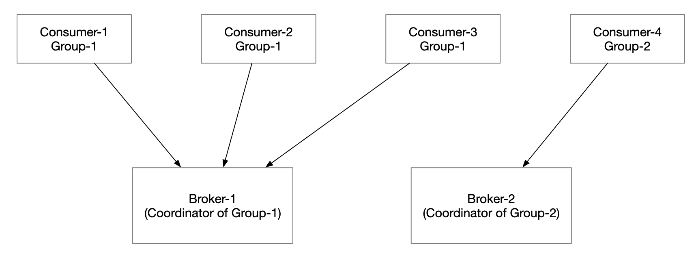
 * All consumers from the same group are connected to the same coordinator. The coordinator is found by hashing the group name.
 * When the consumer list changes, the coordinator chooses a new leader of the group.
 * The leader of the group calculates a new partition dispatch plan and reports it back to the coordinator, which broadcasts it to the other consumers.

When the coordinator stops receiving heartbeats from the consumers in a group, a rebalancing is triggered:
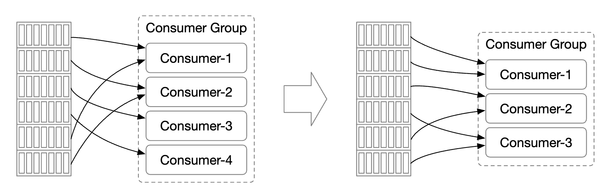

Let's explore what happens when a consumer joins a group:
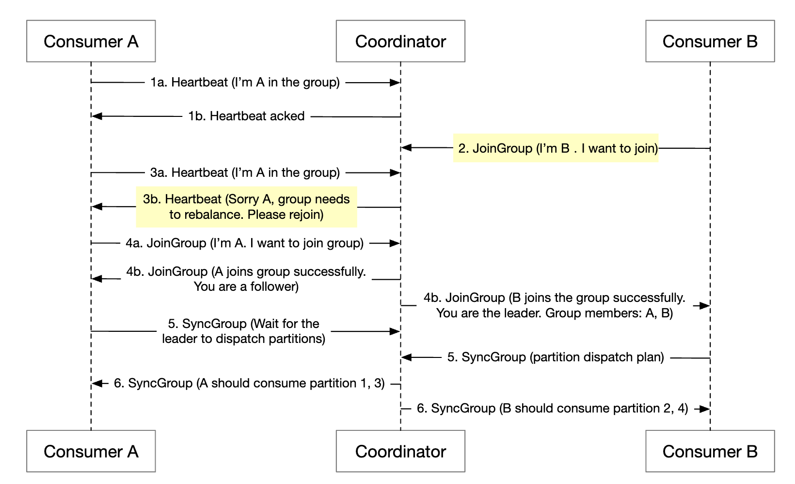
 * Initially, only consumer A is in the group and it consumes all partitions.
 * Consumer B sends a request to join the group.
 * The coordinator notifies all group members that it's time to rebalance passively - as a response to the heartbeat.
 * Once all consumers rejoin the group, the coordinator chooses a leader and notifies the rest about the election result.
 * The leader generates the partition dispatch plan and sends it to the coordinator. Others wait for the dispatch plan.
 * Consumers start consuming from the newly assigned partitions.

Here's what happens when a consumer leaves the group:
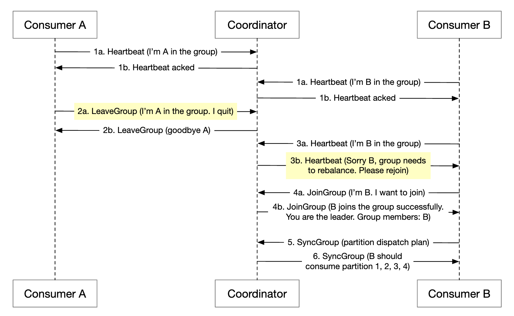
 * Consumer A and B are in the same group
 * Consumer B asks to leave the group
 * When coordinator receives A's heartbeat, it informs them that it's time to rebalance.
 * The rest of the steps are the same.

The process is similar when a consumer doesn't send a heartbeat for a long time:
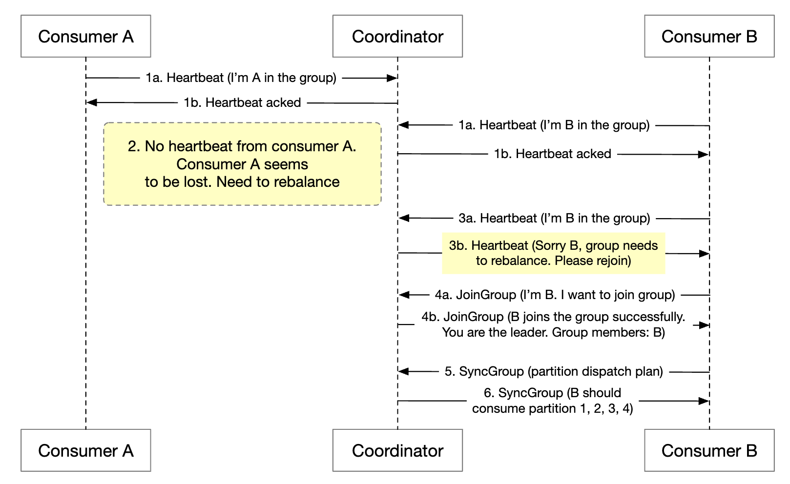

## State storage
The state storage stores mapping between partitions and consumers, as well as the last consumed offsets for a partition.
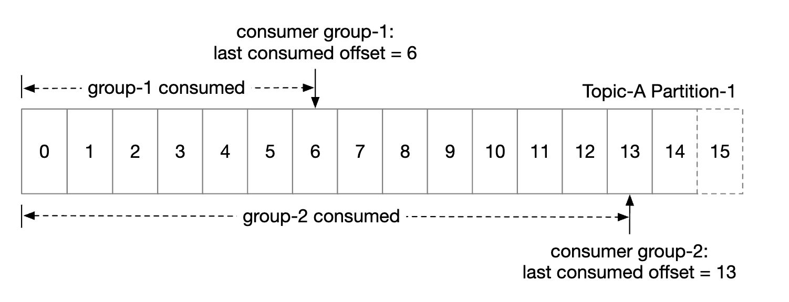

Group 1's offset is at 6, meaning all previous messages are consumed. If a consumer crashes, the new consumer will continue from that message on wards.
 
Data access patterns for consumer states:
 * Frequent read/write operations, but low volume
 * Data is updated frequently, but rarely deleted
 * Random read/write
 * Data consistency is important

Given these requirements, a fast KV storage like Zookeeper is ideal.

## Metadata storage
The metadata storage stores configuration and topic properties - partition number, retention period, replica distribution.

Metadata doesn't change often and volume is small, but there is a high consistency requirement.
Zookeeper is a good choice for this storage.

## ZooKeeper
Zookeeper is essential for building distributed message queues.

It is a hierarchical key-value store, commonly used for a distributed configuration, synchronization service and naming registry (ie service discovery).
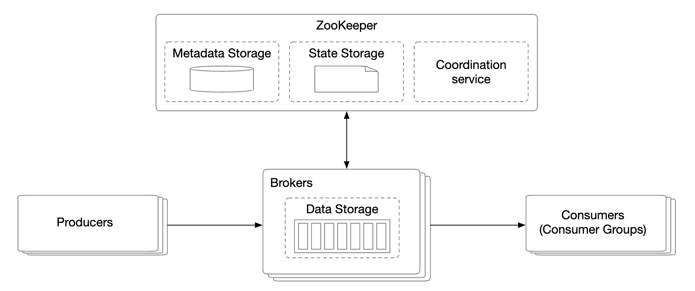

With this change, the broker only needs to maintain data for the messages. Metadata and state storage is in Zookeeper.

Zookeeper also helps with leader election of the broker replicas.

## Replication
In distributed systems, hardware issues are inevitable. We can tackle this via replication to achieve high availability.
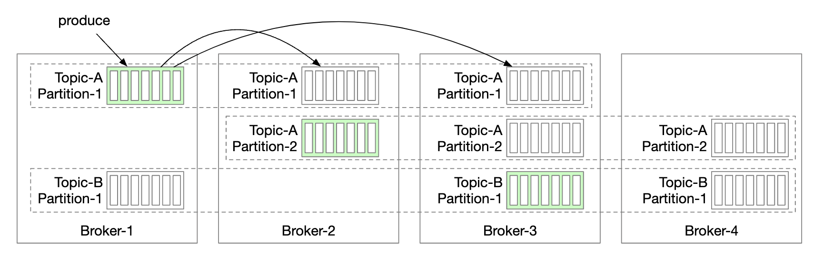
 * Each partition is replicated across multiple brokers, but there is only one leader replica.
 * Producers send messages to leader replicas
 * Followers pull the replicated messages from the leader
 * Once enough replicas are synchronized, the leader returns acknowledgment to the producer
 * Distribution of replicas for each partition is called the replica distribution plan.
 * The leader for a given partition creates the replica distribution plan and saves it in Zookeeper

## In-sync replicas
One problem we need to tackle is keeping messages in-sync between the leader and the followers for a given partition.

In-sync replicas (ISR) are replicas for a partition that stay in-sync with the leader.

The `replica.lag.max.messages` defines how many messages can a replica be lagging behind the leader to be considered in-sync.

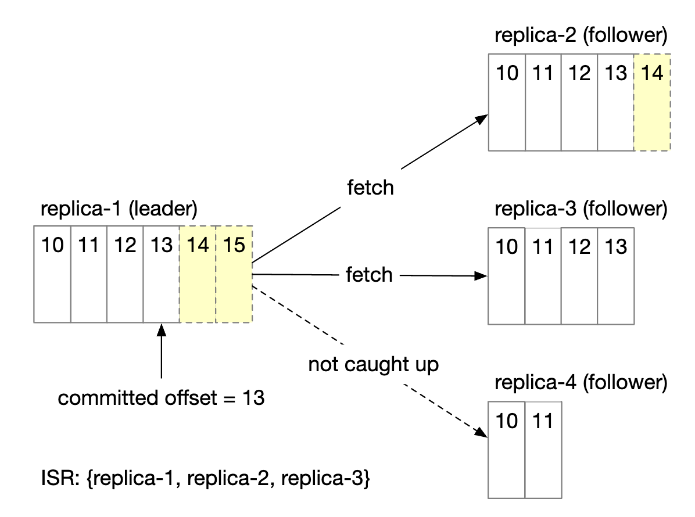
 * Committed offset is 13
 * Two new messages are written to the leader, but not committed yet.
 * A message is committed once all replicas in the ISR have synchronized that message
 * Replica 2 and 3 have fully caught up with leader, hence, they are in ISR
 * Replica 4 has lagged behind, hence, is removed from ISR for now

ISR reflects a trade-off between performance and durability.
 * In order for producers not to lose messages, all replicas should be in sync before sending an acknowledgment
 * But a slow replica will cause the whole partition to become unavailable

Acknowledgment handling is configurable.

`ACK=all` means that all replicas in ISR have to sync a message. Message sending is slow, but message durability is highest.
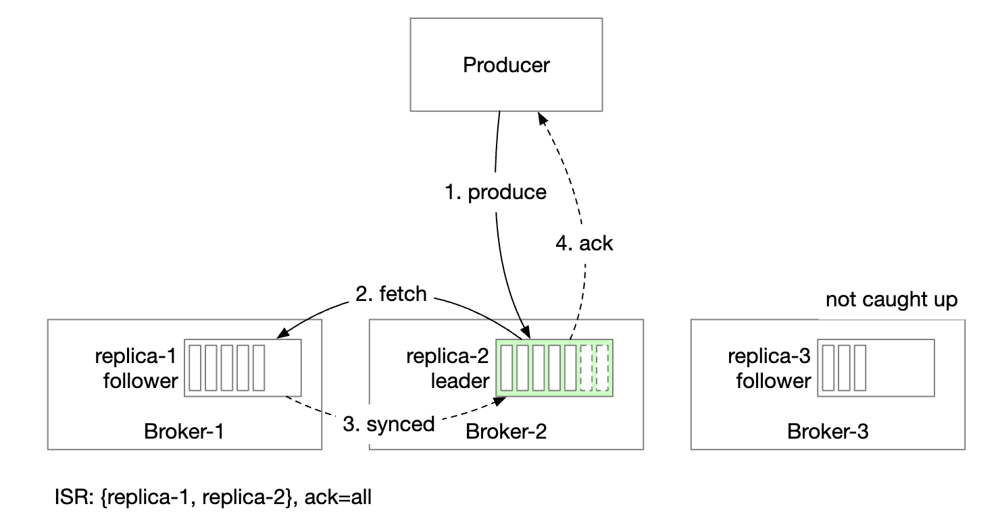

`ACK=1` means that producer receives acknowledgment once leader receives the message. Message sending is fast, but message durability is low.
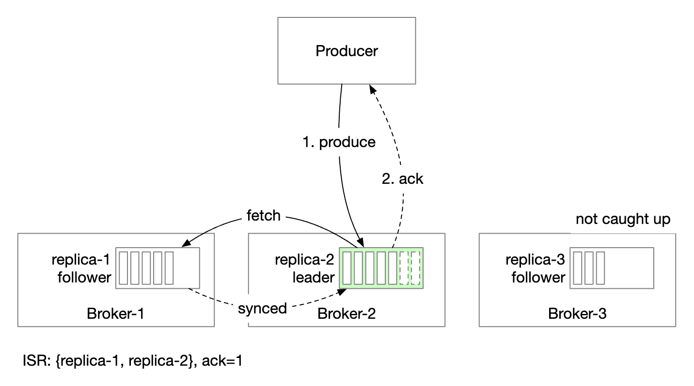

`ACK=0` means that producer sends messages without waiting for any acknowledgment from leader. Message sending is fastest, message durability is lowest.
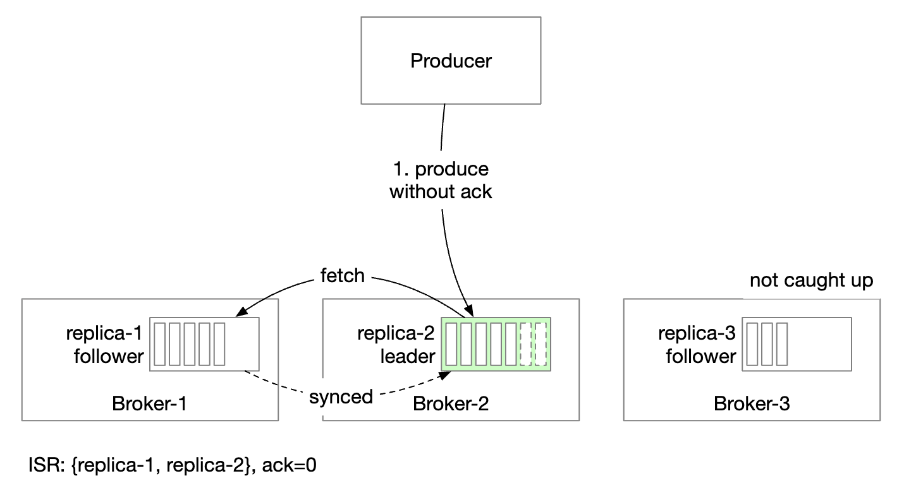

On the consumer side, we can connect all consumers to the leader for a partition and let them read messages from it:
 * This makes for the simplest design and easiest operation
 * Messages in a partition are sent to only one consumer in a group, which limits the connections to the leader replica
 * The number of connections to leader replica is typically not high as long as the topic is not super hot
 * We can scale a hot topic by increasing the number of partitions and consumers
 * In certain scenarios, it might make sense to let a consumer lead from an ISR, eg if they're located in a separate DC

The ISR list is maintained by the leader who tracks the lag between itself and each replica.

## Scalability
Let's evaluate how we can scale different parts of the system.

### Producer
The producer is much smaller than the consumer. Its scalability can easily be achieved by adding/removing new producer instances.

### Consumer
Consumer groups are isolated from each other. It is easy to add/remove consumer groups at will.

Rebalancing help handle the case when consumers are added/removed from a group gracefully.

Consumer groups are rebalancing help us achieve scalability and fault tolerance.

### Broker
How do brokers handle failure?
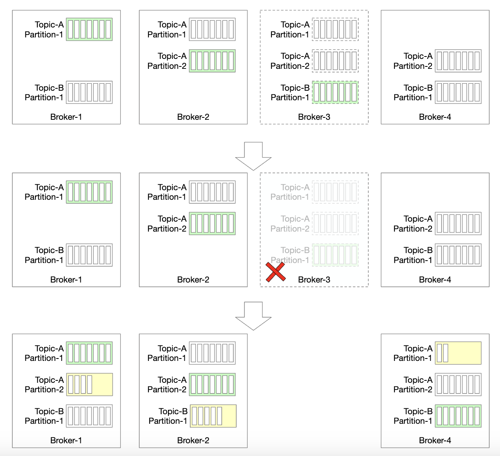
 * Once a broker fails, there are still enough replicas to avoid partition data loss
 * A new leader is elected and the broker coordinator redistributes partitions which were at the failed broker to existing replicas
 * Existing replicas pick up the new partitions and act as followers until they're caught up with the leader and become ISR

Additional considerations to make the broker fault-tolerant:
 * The minimum number of ISRs balances latency and safety. You can fine-tune it to meet your needs.
 * If all replicas of a partition are in the same node, then it's a waste of resources. Replicas should be across different brokers.
 * If all replicas of a partition crash, then the data is lost forever. Spreading replicas across data centers can help, but it adds up a lot of latency. One option is to use [data mirroring](https://cwiki.apache.org/confluence/pages/viewpage.action?pageId=27846330) as a work around.

How do we handle redistribution of replicas when a new broker is added?
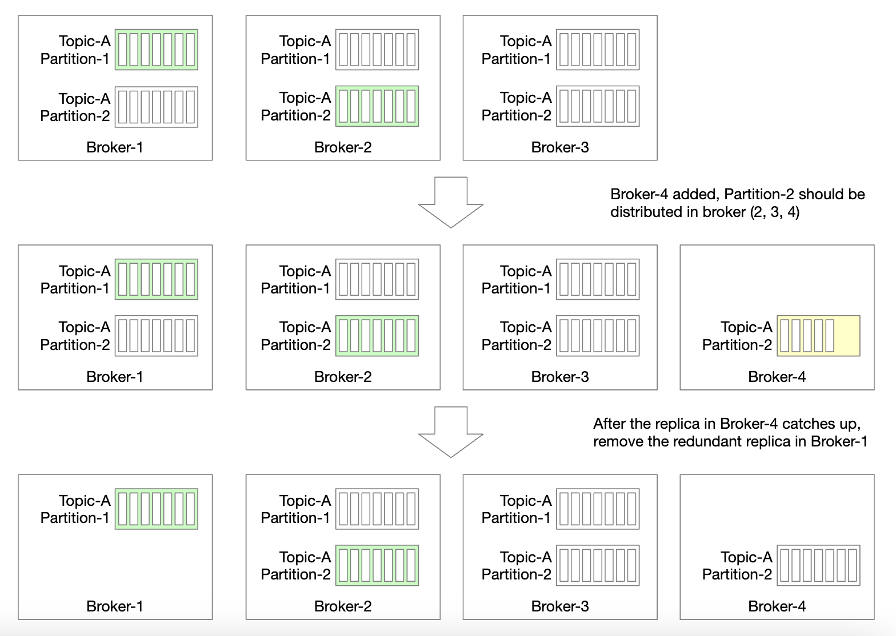
 * We can temporarily allow more replicas than configured, until new broker catches up
 * Once it does, we can remove the partition replica which is no longer needed

### Partition
Whenever a new partition is added, the producer is notified and consumer rebalancing is triggered.

In terms of data storage, we can only store new messages to the new partition vs. trying to copy all old ones:
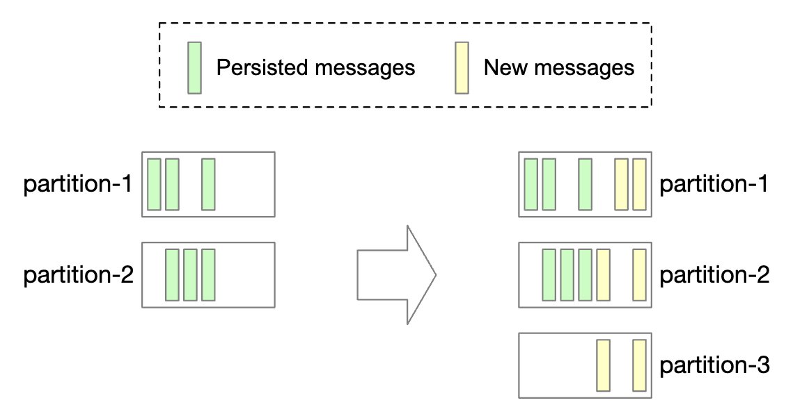

Decreasing the number of partitions is more involved:

 * Once a partition is decommissioned, new messages are only received by remaining partitions
 * The decommissioned partition isn't removed immediately as messages can still be consumed from it
 * Once a pre-configured retention period passes, do we truncate the data and storage space is freed up
 * During the transitional period, producers only send messages to active partitions, but consumers read from all
 * Once retention period expires, consumers are rebalanced

## Data delivery semantics
Let's discuss different delivery semantics.

### At-most once
With this guarantee, messages are delivered not more than once and could not be delivered at all.
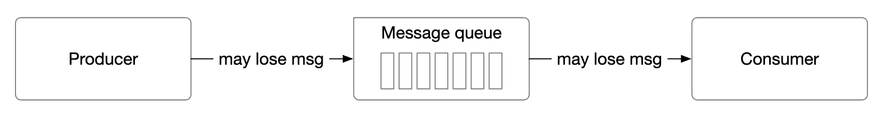
 * Producer sends a message asynchronously to a topic. If message delivery fails, there is no retry.
 * Consumer fetches message and immediately commits offset. If consumer crashes before processing the message, the message will not be processed.

### At-least once
A message can be sent more than once and no message should be left unprocessed.
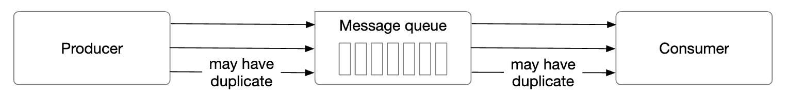
 * Producer sends message with `ack=1` or `ack=all`. If there is any issue, it will keep retrying.
 * Consumer fetches the message and consumes the offset only after it's done processing it.
 * It is possible for a message to be delivered more than once if eg consumer crashes before committing offset but after processing it.
 * This is why, this is good for use-cases where data duplication is acceptable or deduplication is possible.

### Exactly once
Extremely costly to implement for the system, albeit it's the friendliest guarantee to users:
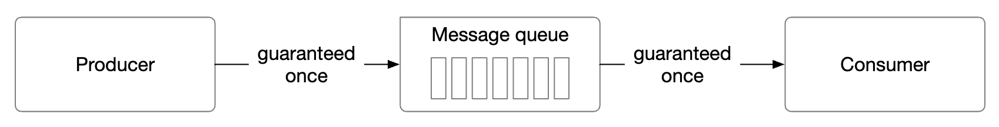

## Advanced features
Let's discuss some advanced features, we might discuss in the interview.

### Message filtering
Some consumers might want to only consume messages of a certain type within a partition.

This can be achieved by building separate topics for each subset of messages, but this can be costly if systems have too many differing use-cases.
 * It is a waste of resources to store the same message on different topics
 * Producer is now tightly coupled to consumers as it changes with each new consumer requirement

We can resolve this using message filtering.
 * A naive approach would be to do the filtering on the consumer-side, but that introduces unnecessary consumer traffic
 * Alternatively, messages can have tags attached to them and consumers can specify which tags they're subscribed to
 * Filtering could also be done via the message payloads but that can be challenging and unsafe for encrypted/serialized messages
 * For more complex mathematical formulaes, the broker could implement a grammar parser or script executor, but that can be heavyweight for the message queue
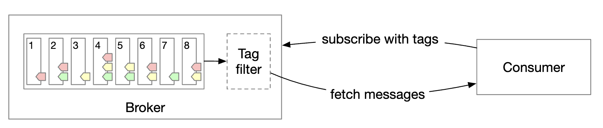

### Delayed messages & scheduled messages
For some use-cases, we might want to delay or schedule message delivery. 
For example, we might submit a payment verification check for 30m from now, which triggers the consumer to see if a payment was successful.

This can be achieved by sending messages to temporary storage in the broker and moving the message to the partition at the right time:
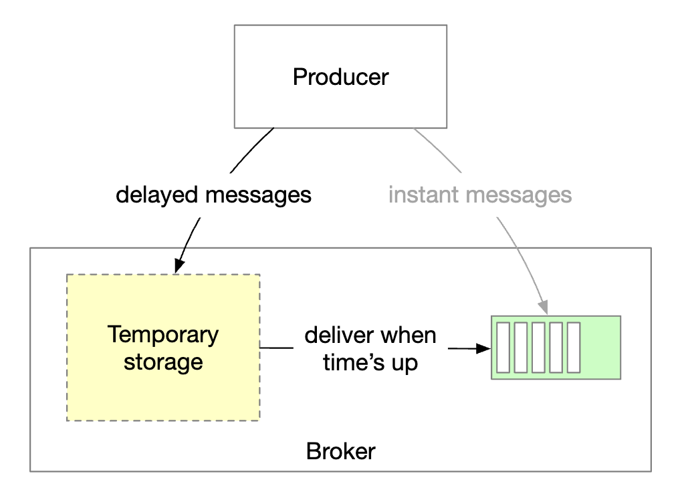
 * The temporary storage can be one or more special message topics
 * The timing function can be achieved using dedicated delay queues or a [hierarchical time wheel](http://www.cs.columbia.edu/~nahum/w6998/papers/sosp87-timing-wheels.pdf)

# Step 4 - Wrap up
Additional talking points:
 * Protocol of communication. Important considerations - support all use-cases and high data volume, as well as verify message integrity. Popular protocols - AMQP and Kafka protocol.
 * Retry consumption - if we can't process a message immediately, we could send it to a dedicated retry topic to be attempted later.
 * Historical data archive - old messages can be backed up in high-capacity storages such as HDFS or object storage (eg S3).
