# Metrics Monitoring and Alerting System
This chapter focuses on designing a highly scalable metrics monitoring and alerting system, which is critical for ensuring high availability and reliability.

# Step 1 - Understand the Problem and Establish Design Scope
A metrics monitoring system can mean a lot of different things - eg you don't want to design a logs aggregation system, when the interviewer is interested in infra metrics only.

Let's try to understand the problem first:
 * C: Who are we building the system for? An in-house monitoring system for a big tech company or a SaaS like DataDog?
 * I: We are building for internal use only.
 * C: Which metrics do we want to collect?
 * I: Operational system metrics - CPU load, Memory, Data disk space. But also high-level metrics like requests per second. Business metrics are not in scope.
 * C: What is the scale of the infrastructure we're monitoring?
 * I: 100mil daily active users, 1000 server pools, 100 machines per pool
 * C: How long should we keep the data?
 * I: Let's assume 1y retention.
 * C: May we reduce metrics data resolution for long-term storage?
 * I: Keep newly received metrics for 7 days. Roll them up to 1m resolution for next 30 days. Further roll them up to 1h resolution after 30 days.
 * C: What are the supported alert channels?
 * I: Email, phone, PagerDuty or webhooks.
 * C: Do we need to collect logs such as error or access logs?
 * I: No
 * C: Do we need to support distributed system tracing?
 * I: No

## High-level requirements and assumptions
The infrastructure being monitored is large-scale:
 * 100mil DAU
 * 1000 server pools * 100 machines * ~100 metrics per machine -> ~10mil metrics
 * 1-year data retention
 * Data retention policy - raw for 7d, 1-minute resolution for 30d, 1h resolution for 1y

A variety of metrics can be monitored:
 * CPU load
 * Request count
 * Memory usage
 * Message count in message queues

## Non-functional requirements
 * Scalability - System should be scalable to accommodate more metrics and alerts
 * Low latency - System needs to have low query latency for dashboards and alerts
 * Reliability - System should be highly reliable to avoid missing critical alerts
 * Flexibility - System should be able to easily integrate new technologies in the future

What requirements are out of scope?
 * Log monitoring - the ELK stack is very popular for this use-case
 * Distributed system tracing - this refers to collecting data about a request lifecycle as it flows through multiple services within the system

# Step 2 - Propose High-Level Design and Get Buy-In
## Fundamentals
There are five core components involved in a metrics monitoring and alerting system:
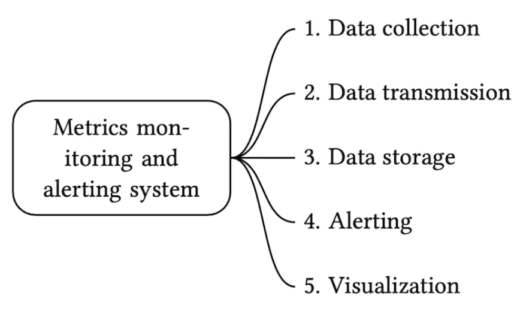
 * Data collection - collect metrics data from different sources
 * Data transmission - transfer data from sources to the metrics monitoring system
 * Data storage - organize and store incoming data
 * Alerting - Analyze incoming data, detect anomalies and generate alerts
 * Visualization - Present data in graphs, charts, etc

## Data model
Metrics data is usually recorded as a time-series, which contains a set of values with timestamps.
The series can be identified by name and an optional set of tags.

Example 1 - What is the CPU load on production server instance i631 at 20:00?
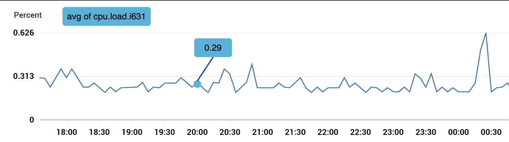

The data can be identified by the following table:
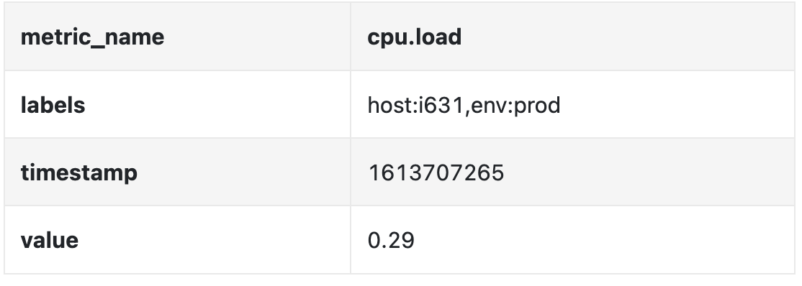

The time series is identified by the metric name, labels and a single point in at a specific time.

Example 2 - What is the average CPU load across all web servers in the us-west region for the last 10min?
```
CPU.load host=webserver01,region=us-west 1613707265 50

CPU.load host=webserver01,region=us-west 1613707265 62

CPU.load host=webserver02,region=us-west 1613707265 43

CPU.load host=webserver02,region=us-west 1613707265 53

...

CPU.load host=webserver01,region=us-west 1613707265 76

CPU.load host=webserver01,region=us-west 1613707265 83
```

This is an example data we might pull from storage to answer that question.
The average CPU load can be calculated by averaging the values in the last column of the rows.

The format shown above is called the line protocol and is used by many popular monitoring software in the market - eg Prometheus, OpenTSDB.

What every time series consists of:
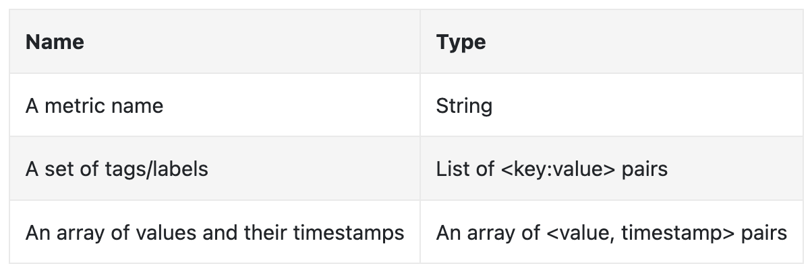

A good way to visualize how data looks like:
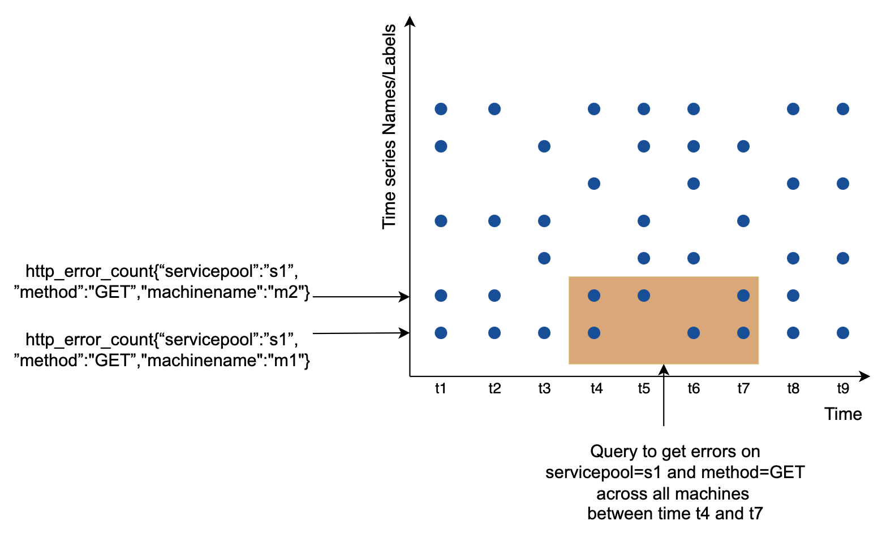
 * The x axis is the time
 * the y axis is the dimension you're querying - eg metric name, tag, etc.

The data access pattern is write-heavy and spiky reads as we collect a lot of metrics, but they are infrequently accessed, although in bursts when eg there are ongoing incidents.

The data storage system is the heart of this design. 
 * It is not recommended to use a general-purpose database for this problem, although you could achieve good scale \w expert-level tuning.
 * Using a NoSQL database can work in theory, but it is hard to devise a scalable schema for effectively storing and querying time-series data.

There are many databases, specifically tailored for storing time-series data. Many of them support custom query interfaces which allow for effective querying of time-series data.
 * OpenTSDB is a distributed time-series database, but it is based on Hadoop and HBase. If you don't have that infrastructure provisioned, it would be hard to use this tech.
 * Twitter uses MetricsDB, while Amazon offers Timestream.
 * The two most popular time-series databases are InfluxDB and Prometheus. 
 * They are designed to store large volumes of time-series data. Both of them are based on in-memory cache + on-disk storage.

Example scale of InfluxDB - more than 250k writes per second when provisioned with 8 cores and 32gb RAM:
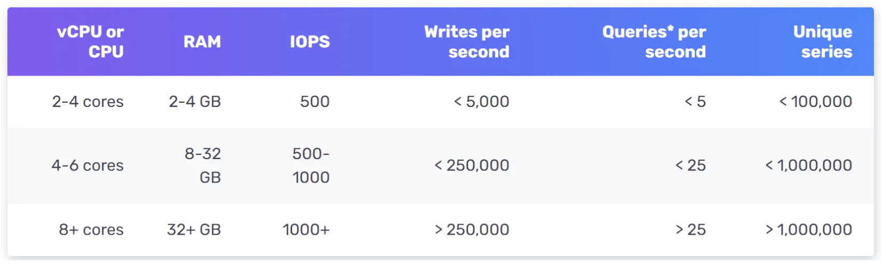

It is not expected for you to understand the internals of a metrics database as it is niche knowledge. You might be asked only if you've mentioned it on your resume.

For the purposes of the interview, it is sufficient to understand that metrics are time-series data and to be aware of popular time-series databases, like InfluxDB.

One nice feature of time-series databases is the efficient aggregation and analysis of large amounts of time-series data by labels.
InfluxDB, for example, builds indexes for each label.

It is critical, however, to keep the cardinality of labels low - ie, not using too many unique labels.

## High-level Design
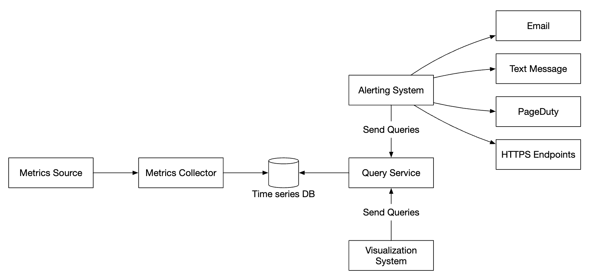
 * Metrics source - can be application servers, SQL databases, message queues, etc.
 * Metrics collector - Gathers metrics data and writes to time-series database
 * Time-series database - stores metrics as time-series. Provides a custom query interface for analyzing large amounts of metrics.
 * Query service - Makes it easy to query and retrieve data from the time-series DB. Could be replaced entirely by the DB's interface if it's sufficiently powerful.
 * Alerting system - Sends alert notifications to various alerting destinations.
 * Visualization system - Shows metrics in the form of graphs/charts.

# Step 3 - Design Deep Dive
Let's deep dive into several of the more interesting parts of the system.

## Metrics collection
For metrics collection, occasional data loss is not critical. It's acceptable for clients to fire and forget.


There are two ways to implement metrics collection - pull or push.

Here's how the pull model might look like:
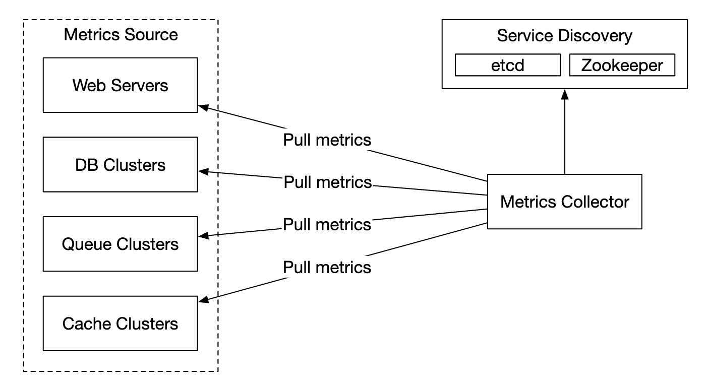

For this solution, the metrics collector needs to maintain an up-to-date list of services and metrics endpoints.
We can use Zookeeper or etcd for that purpose - service discovery.

Service discovery contains contains configuration rules about when and where to collect metrics from:
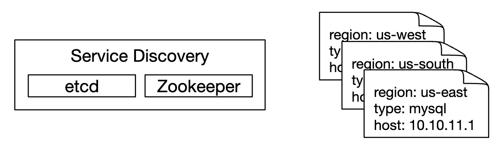

Here's a detailed explanation of the metrics collection flow:
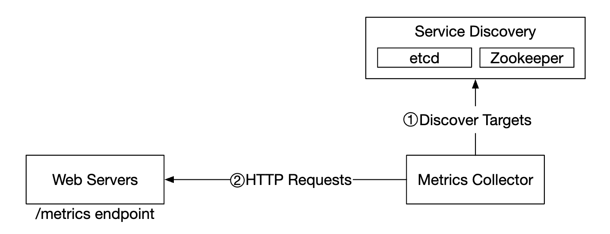
 * Metrics collector fetches configuration metadata from service discovery. This includes pulling interval, IP addresses, timeout & retry params.
 * Metrics collector pulls metrics data via a pre-defined http endpoint (eg `/metrics`). This is typically done by a client library.
 * Alternatively, the metrics collector can register a change event notification with the service discovery to be notified once the service endpoint changes.
 * Another option is for the metrics collector to periodically poll for metrics endpoint configuration changes.

At our scale, a single metrics collector is not enough. There must be multiple instances. 
However, there must also be some kind of synchronization among them so that two collectors don't collect the same metrics twice.

One solution for this is to position collectors and servers on a consistent hash ring and associate a set of servers with a single collector only:
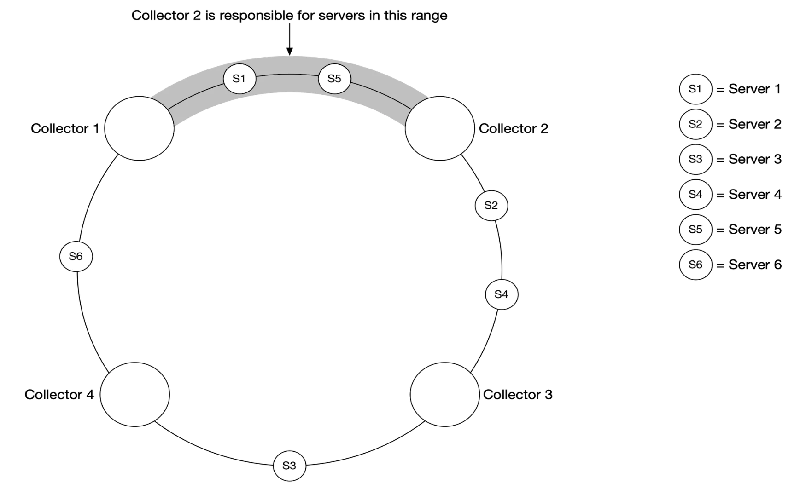

With the push model, on the other hand, services push their metrics to the metrics collector proactively:
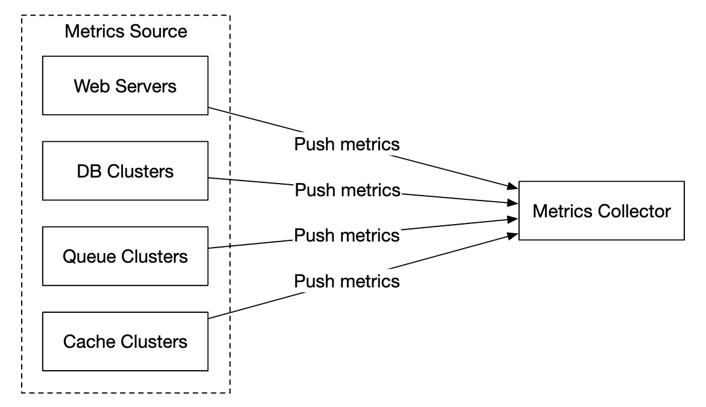

In this approach, typically a collection agent is installed alongside service instances. 
The agent collects metrics from the server and pushes them to the metrics collector.
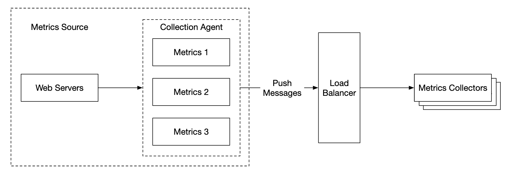

With this model, we can potentially aggregate metrics before sending them to the collector, which reduces the volume of data processed by the collector.

On the flip side, metrics collector can reject push requests as it can't handle the load. 
It is important, hence, to add the collector to an auto-scaling group behind a load balancer.

so which one is better? There are trade-offs between both approaches and different systems use different approaches:
 * Prometheus uses a pull architecture
 * Amazon Cloud Watch and Graphite use a push architecture

Here are some of the main differences between push and pull:
|                                        | Pull                                                                                                                                                                                                    | Push                                                                                                                                                                                                                                    |
|----------------------------------------|---------------------------------------------------------------------------------------------------------------------------------------------------------------------------------------------------------|-----------------------------------------------------------------------------------------------------------------------------------------------------------------------------------------------------------------------------------------|
| Easy debugging                         | The /metrics endpoint on application servers used for pulling metrics can be used to view metrics at any time. You can even do this on your laptop. Pull wins.                                          | If the metrics collector doesn’t receive metrics, the problem might be caused by network issues.                                                                                                                                        |
| Health check                           | If an application server doesn’t respond to the pull, you can quickly figure out if an application server is down. Pull wins.                                                                           | If the metrics collector doesn’t receive metrics, the problem might be caused by network issues.                                                                                                                                        |
| Short-lived jobs                       |                                                                                                                                                                                                         | Some of the batch jobs might be short-lived and don’t last long enough to be pulled. Push wins. This can be fixed by introducing push gateways for the pull model [22].                                                                 |
| Firewall or complicated network setups | Having servers pulling metrics requires all metric endpoints to be reachable. This is potentially problematic in multiple data center setups. It might require a more elaborate network infrastructure. | If the metrics collector is set up with a load balancer and an auto-scaling group, it is possible to receive data from anywhere. Push wins.                                                                                             |
| Performance                            | Pull methods typically use TCP.                                                                                                                                                                         | Push methods typically use UDP. This means the push method provides lower-latency transports of metrics. The counterargument here is that the effort of establishing a TCP connection is small compared to sending the metrics payload. |
| Data authenticity                      | Application servers to collect metrics from are defined in config files in advance. Metrics gathered from those servers are guaranteed to be authentic.                                                 | Any kind of client can push metrics to the metrics collector. This can be fixed by whitelisting servers from which to accept metrics, or by requiring authentication.                                                                   |

There is no clear winner. A large organization probably needs to support both. There might not be a way to install a push agent in the first place.

## Scale the metrics transmission pipeline
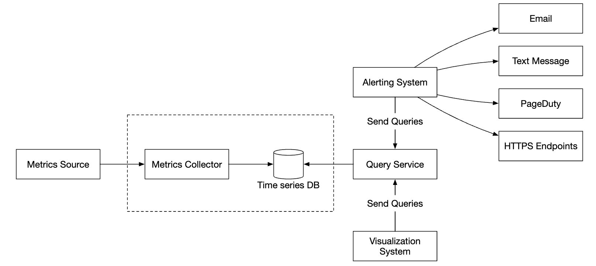

The metrics collector is provisioned in an auto-scaling group, regardless if we use the push or pull model.

There is a chance of data loss if the time-series DB is down, however. To mitigate this, we'll provision a queuing mechanism:
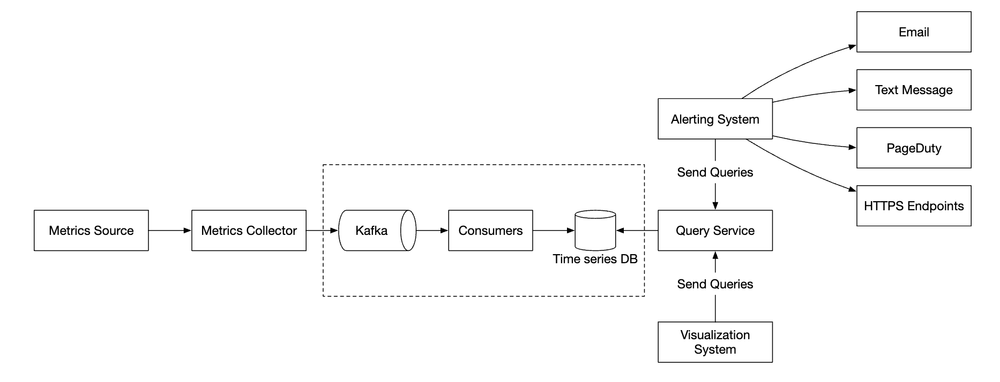
 * Metrics collectors push metrics data into kafka
 * Consumers or stream processing services such as Apache Storm, Flink or Spark process the data and push it to the time-series DB

This approach has several advantages:
 * Kafka is used as a highly-reliable and scalable distributed message platform
 * It decouples data collection and data processing from one another
 * It can prevent data loss by retaining the data in Kafka

Kafka can be configured with one partition per metric name, so that consumers can aggregate data by metric names.
To scale this, we can further partition by tags/labels and categorize/prioritize metrics to be collected first.
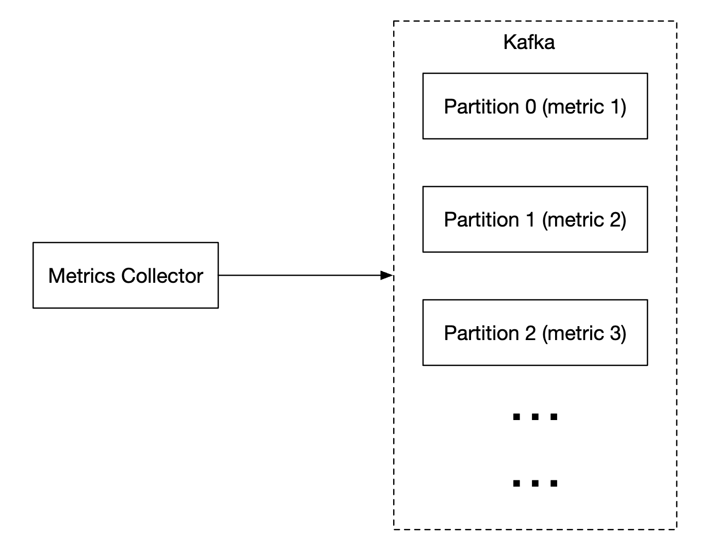

The main downside of using Kafka for this problem is the maintenance/operation overhead.
An alternative is to use a large-scale ingestion system like [Gorilla](https://www.vldb.org/pvldb/vol8/p1816-teller.pdf).
It can be argued that using that would be as scalable as using Kafka for queuing.

## Where aggregations can happen
Metrics can be aggregated at several places. There are trade-offs between different choices:
 * Collection agent - client-side collection agent only supports simple aggregation logic. Eg collect a counter for 1m and send it to the metrics collector.
 * Ingestion pipeline - To aggregate data before writing to the DB, we need a stream processing engine like Flink. This reduces write volume, but we lose data precision as we don't store raw data.
 * Query side - We can aggregate data when we run queries via our visualization system. There is no data loss, but queries can be slow due to a lot of data processing.

## Query Service
Having a separate query service from the time-series DB decouples the visualization and alerting system from the database, which enables us to decouple the DB from clients and change it at will.

We can add a Cache layer here to reduce the load to the time-series database:
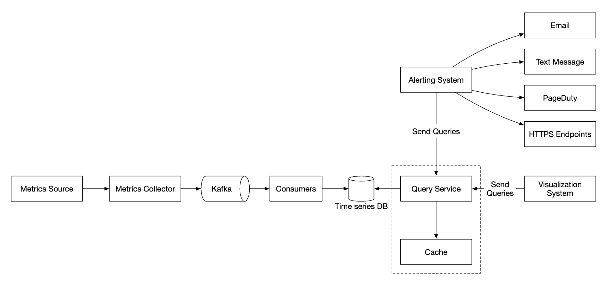

We can also avoid adding a query service altogether as most visualization and alerting systems have powerful plugins to integrate with most time-series databases.
With a well-chosen time-series DB, we might not need to introduce our own caching layer as well.

Most time-series DBs don't support SQL simply because it is ineffective for querying time-series data. Here's an example SQL query for computing an exponential moving average:
```
select id,
       temp,
       avg(temp) over (partition by group_nr order by time_read) as rolling_avg
from (
  select id,
         temp,
         time_read,
         interval_group,
         id - row_number() over (partition by interval_group order by time_read) as group_nr
  from (
    select id,
    time_read,
    "epoch"::timestamp + "900 seconds"::interval * (extract(epoch from time_read)::int4 / 900) as interval_group,
    temp
    from readings
  ) t1
) t2
order by time_read;
```

Here's the same query in Flux - query language used in InfluxDB:
```
from(db:"telegraf")
  |> range(start:-1h)
  |> filter(fn: (r) => r._measurement == "foo")
  |> exponentialMovingAverage(size:-10s)
```

## Storage layer
It is important to choose the time-series database carefully.

According to research published by Facebook, ~85% of queries to the operational store were for data from the past 26h.

If we choose a database, which harnesses this property, it could have significant impact on system performance. InfluxDB is one such option.

Regardless of the database we choose, there are some optimizations we might employ.

Data encoding and compression can significantly reduce the size of data. Those features are usually built into a good time-series database.
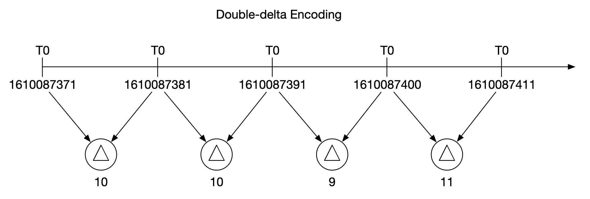

In the above example, instead of storing full timestamps, we can store timestamp deltas.

Another technique we can employ is down-sampling - converting high-resolution data to low-resolution in order to reduce disk usage.

We can use that for old data and make the rules configurable by data scientists, eg:
 * 7d - no down-sampling
 * 30d - down-sample to 1min
 * 1y - down-sample to 1h

For example, here's a 10-second resolution metrics table:
| metric | timestamp            | hostname | Metric_value |
|--------|----------------------|----------|--------------|
| cpu    | 2021-10-24T19:00:00Z | host-a   | 10           |
| cpu    | 2021-10-24T19:00:10Z | host-a   | 16           |
| cpu    | 2021-10-24T19:00:20Z | host-a   | 20           |
| cpu    | 2021-10-24T19:00:30Z | host-a   | 30           |
| cpu    | 2021-10-24T19:00:40Z | host-a   | 20           |
| cpu    | 2021-10-24T19:00:50Z | host-a   | 30           |

down-sampled to 30-second resolution:
| metric | timestamp            | hostname | Metric_value (avg) |
|--------|----------------------|----------|--------------------|
| cpu    | 2021-10-24T19:00:00Z | host-a   | 19                 |
| cpu    | 2021-10-24T19:00:30Z | host-a   | 25                 |

Finally, we can also use cold storage to use old data, which is no longer used. The financial cost for cold storage is much lower.

## Alerting system
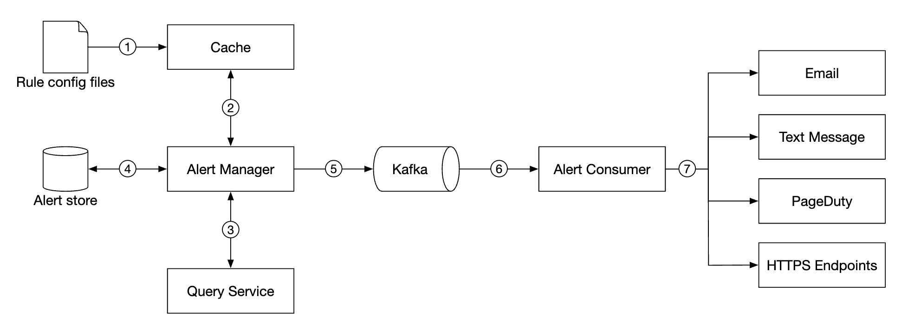

Configuration is loaded to cache servers. Rules are typically defined in YAML format. Here's an example:
```
- name: instance_down
  rules:

  # Alert for any instance that is unreachable for >5 minutes.
  - alert: instance_down
    expr: up == 0
    for: 5m
    labels:
      severity: page
```

The alert manager fetches alert configurations from cache. Based on configuration rules, it also calls the query service at a predefined interval.
If a rule is met, an alert event is created.

Other responsibilities of the alert manager are:
 * Filtering, merging and deduplicating alerts. Eg if an alert of a single instance is triggered multiple times, only one alert event is generated.
 * Access control - it is important to restrict alert-management operations to certain individuals only
 * Retry - the manager ensures that the alert is propagated at least once.

The alert store is a key-value database, like Cassandra, which keeps the state of all alerts. It ensures a notification is sent at least once.
Once an alert is triggered, it is published to Kafka.

Finally, alert consumers pull alerts data from Kafka and send notifications over to different channels - Email, text message, PagerDuty, webhooks.

In the real-world, there are many off-the-shelf solutions for alerting systems. It is difficult to justify building your own system in-house.

## Visualization system
The visualization system shows metrics and alerts over a time period. Here's an dashboard built with Grafana:
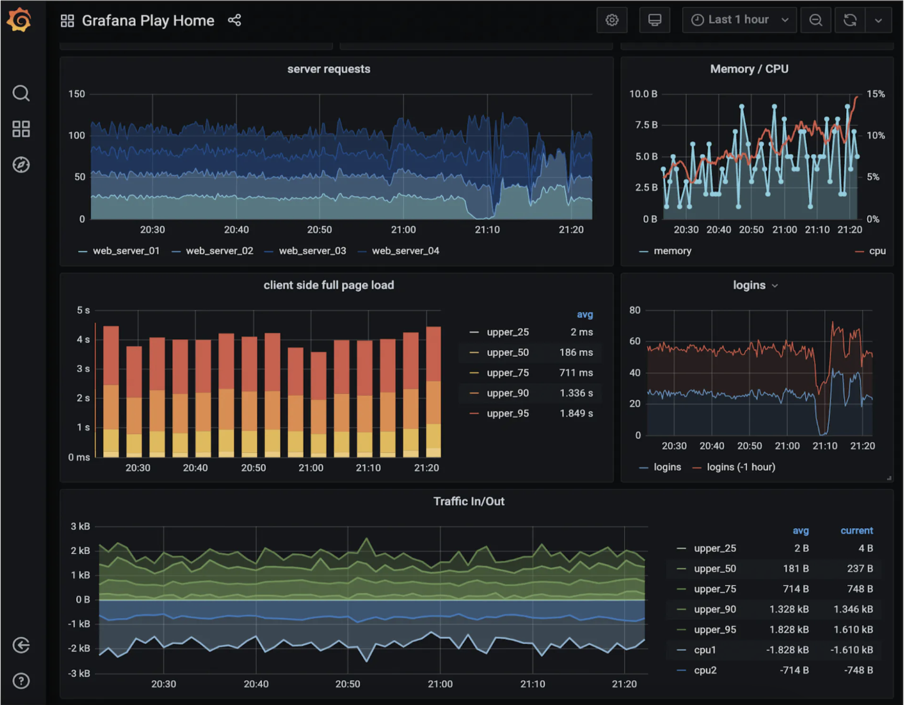

A high-quality visualization system is very hard to build. It is hard to justify not using an off-the-shelf solution like Grafana.

# Step 4 - Wrap up
Here's our final design:
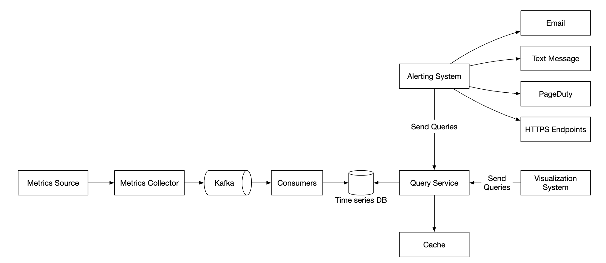
