# Hotel Reservation System
In this chapter, we're designing a hotel reservation system, similar to Marriott International.

Applicable to other types of systems as well - Airbnb, flight reservation, movie ticket booking.

# Step 1 - Understand the Problem and Establish Design Scope
Before diving into designing the system, we should ask the interviewer questions to clarify the scope:
 * C: What is the scale of the system?
 * I: We're building a website for a hotel chain \w 5000 hotels and 1mil rooms
 * C: Do customers pay when they make a reservation or when they arrive at the hotel?
 * I: They pay in full when making reservations.
 * C: Do customers book hotel rooms through the website only? Do we have to support other reservation options such as phone calls?
 * I: They make bookings through the website or app only.
 * C: Can customers cancel reservations?
 * I: Yes
 * C: Other things to consider?
 * I: Yes, we allow overbooking by 10%. Hotel will sell more rooms than there actually are. Hotels do this in anticipation that clients will cancel bookings.
 * C: Since not much time, we'll focus on - show hotel-related page, hotel-room details page, reserve a room, admin panel, support overbooking.
 * I: Sounds good.
 * I: One more thing - hotel prices change all the time. Assume a hotel room's price changes every day.
 * C: OK.

## Non-functional requirements
 * Support high concurrency - there might be a lot of customers trying to book the same hotel during peak season.
 * Moderate latency - it's ideal to have low latency when a user makes a reservation, but it's acceptable if the system takes a few seconds to process it.

## Back-of-the-envelope estimation
 * 5000 hotels and 1mil rooms in total
 * Assume 70% of rooms are occupied and average stay duration is 3 days
 * Estimated daily reservations - 1mil * 0.7 / 3 = ~240k reservations per day
 * Reservations per second - 240k / 10^5 seconds in a day = ~3. Average reservation TPS is low.

Let's estimate the QPS. If we assume that there are three steps to reach the reservation page and there is a 10% conversion rate per page,
we can estimate that if there are 3 reservations, then there must be 30 views of reservation page and 300 views of hotel room detail page.
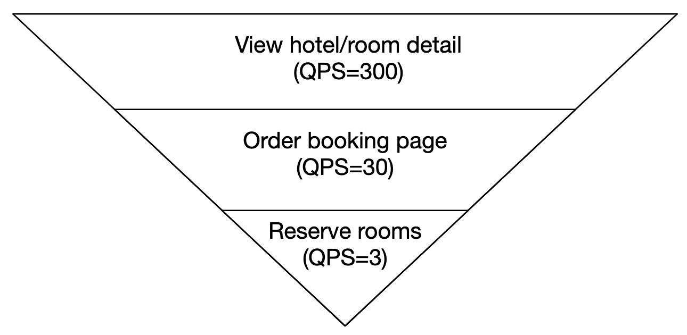

# Step 2 - Propose High-Level Design and Get Buy-In
We'll explore - API Design, Data model, high-level design.

## API Design
This API Design focuses on the core endpoints (using RESTful practices), we'll need in order to support a hotel reservation system.

A fully-fledged system would require a more extensive API with support for searching for rooms based on lots of criteria, but we won't be focusing on that in this section.
Reason is that they aren't technically challenging, so they're out of scope.

**Hotel-related API**
 * `GET /v1/hotels/{id}` - get detailed info about a hotel
 * `POST /v1/hotels` - add a new hotel. Only available to ops
 * `PUT /v1/hotels/{id}` - update hotel info. Only available to ops
 * `DELETE /v1/hotels/{id}` - delete a hotel. API is only available to ops

**Room-related API**
 * `GET /v1/hotels/{id}/rooms/{id}` - get detailed information about a room
 * `POST /v1/hotels/{id}/rooms` - Add a room. Only available to ops
 * `PUT /v1/hotels/{id}/rooms/{id}` - Update room info. Only available to ops
 * `DELETE /v1/hotels/{id}/rooms/{id}` - Delete a room. Only available to ops

**Reservation-related API**
 * `GET /v1/reservations` - get reservation history of current user
 * `GET /v1/reservations/{id}` - get detailed info about a reservation
 * `POST /v1/reservations` - make a new reservation
 * `DELETE /v1/reservations/{id}` - cancel a reservation

Here's an example request to make a reservation:
```
{
  "startDate":"2021-04-28",
  "endDate":"2021-04-30",
  "hotelID":"245",
  "roomID":"U12354673389",
  "reservationID":"13422445"
}
```

Note that the `reservationID` is an idempotency key to avoid double booking. Details explained in [concurrency section](#concurrency)

## Data model
Before we choose what database to use, let's consider our access patterns.

We need to support the following queries:
 * View detailed info about a hotel
 * Find available types of rooms given a date range
 * Record a reservation
 * Look up a reservation or past history of reservations

From our estimations, we know the scale of the system is not large, but we need to prepare for traffic surges.

Given this knowledge, we'll choose a relational database because:
 * Relational DBs work well with read-heavy and less write-heavy systems.
 * NoSQL databases are normally optimized for writes, but we know we won't have many as only a fraction of users who visit the site make a reservation.
 * Relational DBs provide ACID guarantees. These are important for such a system as without them, we won't be able to prevent problems such as negative balance, double charge, etc.
 * Relational DBs can easily model the data as the structure is very clear.

Here is our schema design:
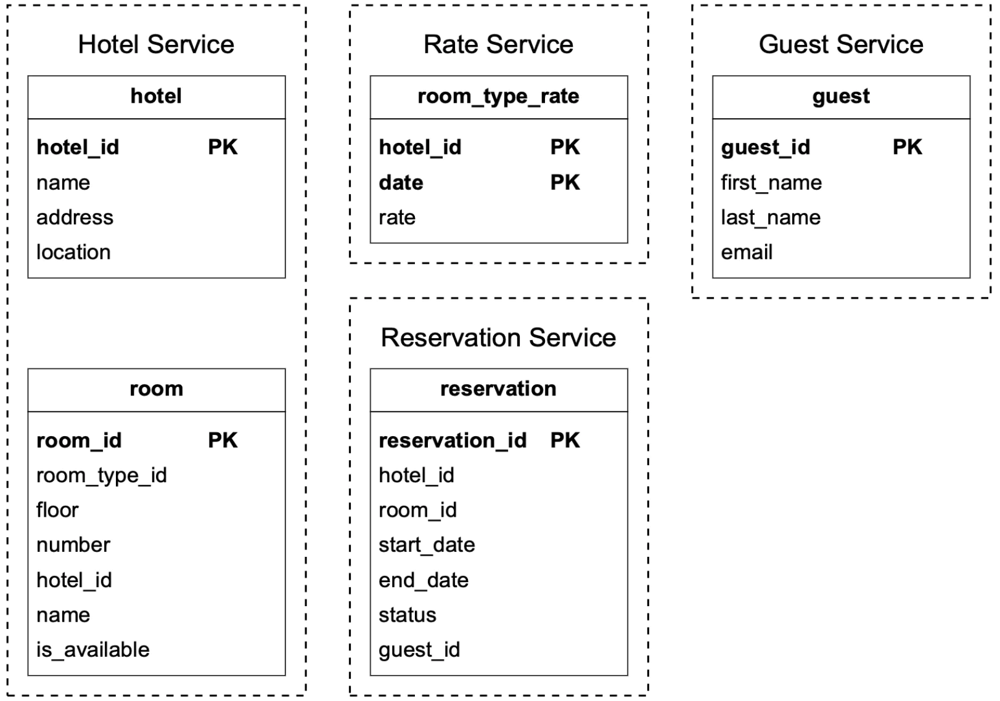

Most fields are self-explanatory. Only field worth mentioning is the `status` field which represents the state machine of a given room:
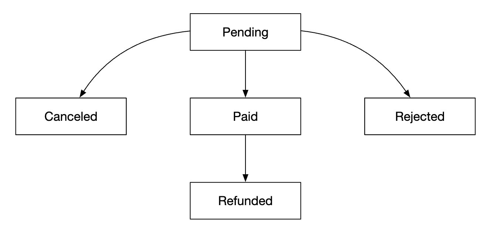

This data model works well for a system like Airbnb, but not for hotels where users don't reserve a particular room but a room type.
They reserve a type of room and a room number is chosen at the point of reservation.

This shortcoming will be addressed in the [Improved Data Model](#improved-data-model) section.

## High-level Design
We've chosen a microservice architecture for this design. It has gained great popularity in recent years:
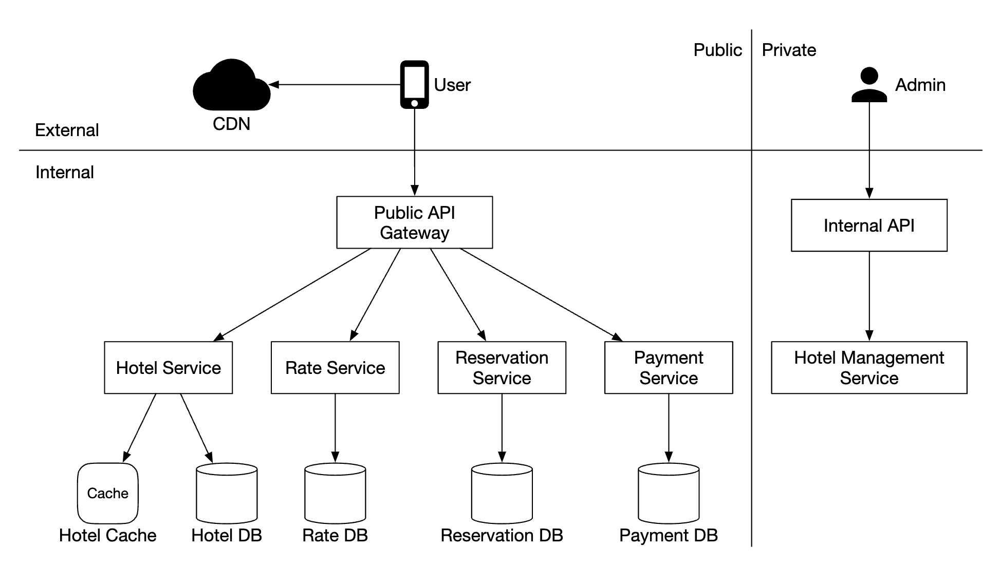
 * Users book a hotel room on their phone or computer
 * Admin perform administrative functions such as refunding/cancelling a payment, etc
 * CDN caches static resources such as JS bundles, images, videos, etc
 * Public API Gateway - fully-managed service which supports rate limiting, authentication, etc.
 * Internal APIs - only visible to authorized personnel. Usually protected by a VPN.
 * Hotel service - provides detailed information about hotels and rooms. Hotel and room data is static, so it can be cached aggressively.
 * Rate service - provides room rates for different future dates. An interesting note about this domain is that prices depend on how full a hotel is at a given day.
 * Reservation service - receives reservation requests and reserves hotel rooms. Also tracks room inventory as reservations are made/cancelled.
 * Payment service - processes payments and updates reservation statuses on success.
 * Hotel management service - available to authorized personnel only. Allows certain administrative functions for managing and viewing reservations, hotels, etc.

Inter-service communication can be facilitated via a RPC framework, such as gRPC.

# Step 3 - Design Deep Dive
Let's dive deeper into:
 * Improved data model
 * Concurrency issues
 * Scalability
 * Resolving data inconsistency in microservices

## Improved data model
As mentioned in a previous section, we need to amend our API and schema to enable reserving a type of room vs. a particular one.

For the reservation API, we no longer reserve a `roomID`, but we reserve a `roomTypeID`:
```
POST /v1/reservations
{
  "startDate":"2021-04-28",
  "endDate":"2021-04-30",
  "hotelID":"245",
  "roomTypeID":"12354673389",
  "roomCount":"3",
  "reservationID":"13422445"
}
```

Here's the updated schema:
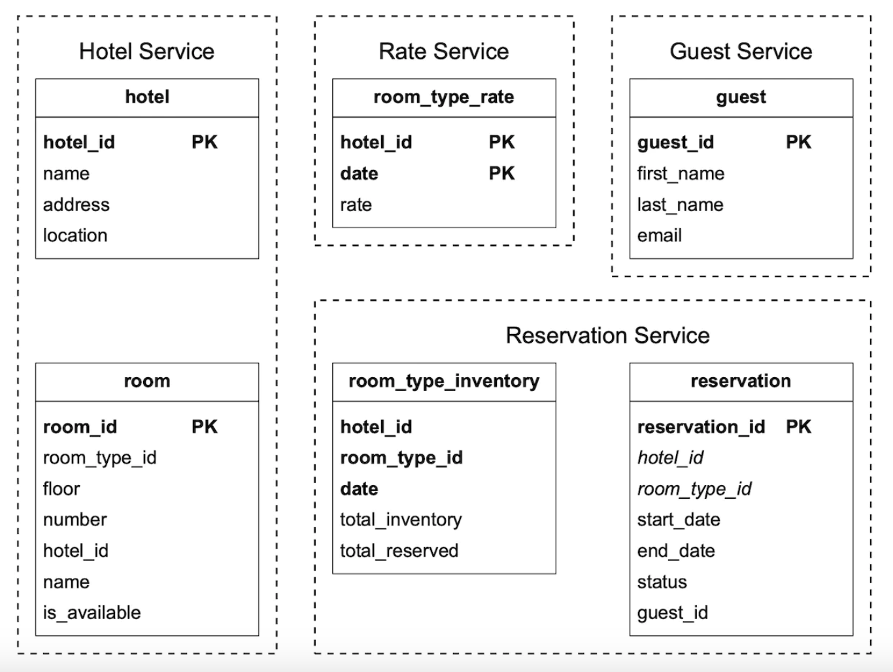
 * room - contains information about a room
 * room_type_rate - contains information about prices for a given room type
 * reservation - records guest reservation data
 * room_type_inventory - stores inventory data about hotel rooms. 

Let's take a look at the `room_type_inventory` columns as that table is more interesting:
 * hotel_id - id of hotel
 * room_type_id - id of a room type
 * date - a single date
 * total_inventory - total number of rooms minus those that are temporarily taken off the inventory.
 * total_reserved - total number of rooms booked for given (hotel_id, room_type_id, date)

There are alternative ways to design this table, but having one room per (hotel_id, room_type_id, date) enables easy 
reservation management and easier queries.

The rows in the table are pre-populated using a daily CRON job.

Sample data:
| hotel_id | room_type_id | date       | total_inventory | total_reserved |
|----------|--------------|------------|-----------------|----------------|
| 211      | 1001         | 2021-06-01 | 100             | 80             |
| 211      | 1001         | 2021-06-02 | 100             | 82             |
| 211      | 1001         | 2021-06-03 | 100             | 86             |
| 211      | 1001         | ...        | ...             |                |
| 211      | 1001         | 2023-05-31 | 100             | 0              |
| 211      | 1002         | 2021-06-01 | 200             | 16             |
| 2210     | 101          | 2021-06-01 | 30              | 23             |
| 2210     | 101          | 2021-06-02 | 30              | 25             |

Sample SQL query to check the availability of a type of room:
```
SELECT date, total_inventory, total_reserved
FROM room_type_inventory
WHERE room_type_id = ${roomTypeId} AND hotel_id = ${hotelId}
AND date between ${startDate} and ${endDate}
```

How to check availability for a specified number of rooms using that data (note that we support overbooking):
```
if (total_reserved + ${numberOfRoomsToReserve}) <= 110% * total_inventory
```

Now let's do some estimation about the storage volume.
 * We have 5000 hotels.
 * Each hotel has 20 types of rooms.
 * 5000 * 20 * 2 (years) * 365 (days) = 73mil rows

73 million rows is not a lot of data and a single database server can handle it.
It makes sense, however, to setup read replication (potentially across different zones) to enable high availability.

Follow-up question - if reservation data is too large for a single database, what would you do?
 * Store only current and future reservation data. Reservation history can be moved to cold storage.
 * Database sharding - we can shard our data by `hash(hotel_id) % servers_cnt` as we always select the `hotel_id` in our queries.

## Concurrency issues
Another important problem to address is double booking.

There are two issues to address:
 * Same user clicks on "book" twice
 * Multiple users try to book a room at the same time

Here's a visualization of the first problem:
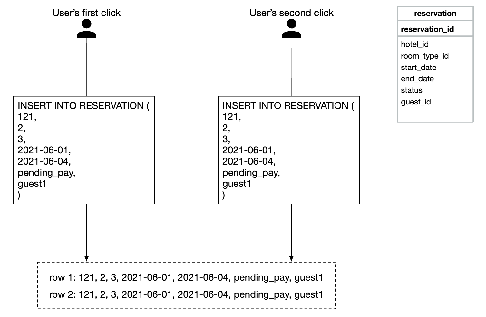

There are two approaches to solving this problem:
 * Client-side handling - front-end can disable the book button once clicked. If a user disabled javascript, however, they won't see the button becoming grayed out.
 * Idemptent API - Add an idempotency key to the API, which enables a user to execute an action once, regardless of how many times the endpoint is invoked:
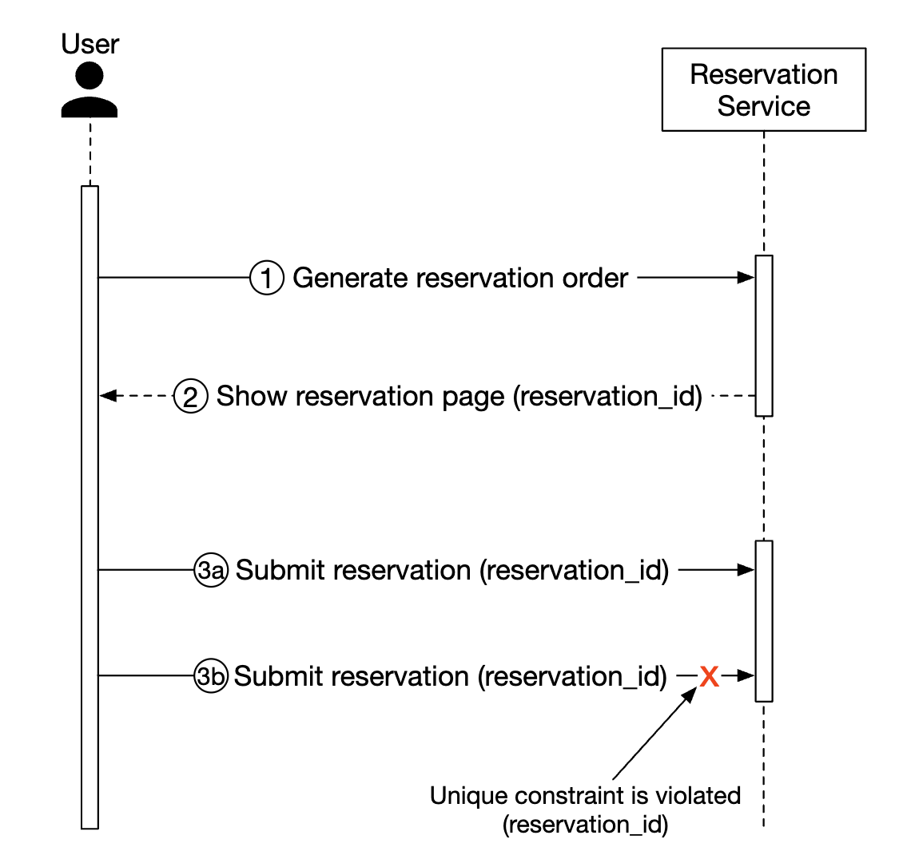

Here's how this flow works:
 * A reservation order is generated once you're in the process of filling in your details and making a booking. The reservation order is generated using a globally unique identifier.
 * Submit reservation 1 using the `reservation_id` generated in the previous step.
 * If "complete booking" is clicked a second time, the same `reservation_id` is sent and the backend detects that this is a duplicate reservation.
 * The duplication is avoided by making the `reservation_id` column have a unique constraint, preventing multiple records with that id being stored in the DB.
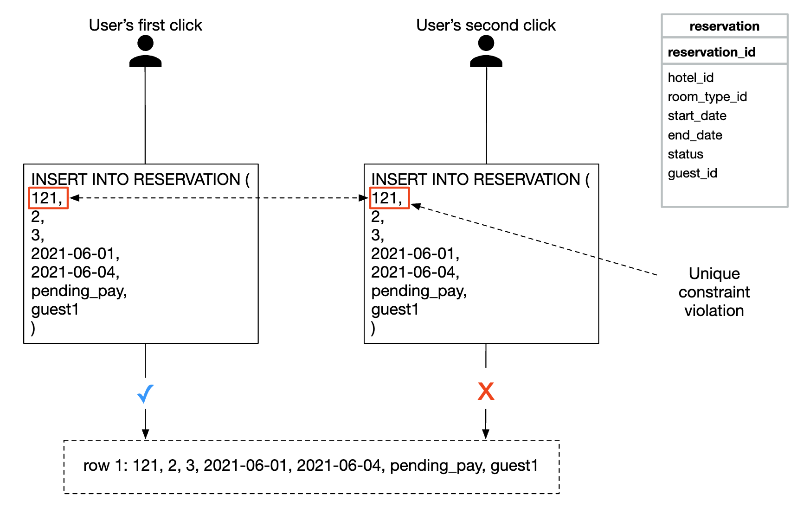

What if there are multiple users making the same reservation?
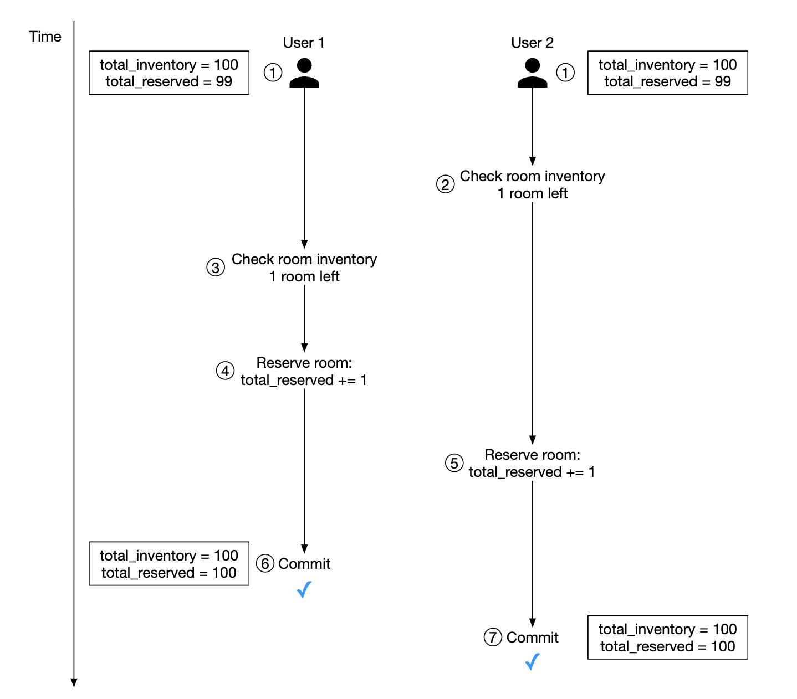
 * Let's assume the transaction isolation level is not serializable
 * User 1 and 2 attempt to book the same room at the same time.
 * Transaction 1 checks if there are enough rooms - there are
 * Transaction 2 check if there are enough rooms - there are
 * Transaction 2 reserves the room and updates the inventory
 * Transaction 1 also reserves the room as it still sees there are 99 `total_reserved` rooms out of 100.
 * Both transactions successfully commit the changes

This problem can be solved using some form of locking mechanism:
 * Pessimistic locking
 * Optimistic locking
 * Database constraints

Here's the SQL we use to reserve a room:
```sql
# step 1: check room inventory
SELECT date, total_inventory, total_reserved
FROM room_type_inventory
WHERE room_type_id = ${roomTypeId} AND hotel_id = ${hotelId}
AND date between ${startDate} and ${endDate}

# For every entry returned from step 1
if((total_reserved + ${numberOfRoomsToReserve}) > 110% * total_inventory) {
  Rollback
}

# step 2: reserve rooms
UPDATE room_type_inventory
SET total_reserved = total_reserved + ${numberOfRoomsToReserve}
WHERE room_type_id = ${roomTypeId}
AND date between ${startDate} and ${endDate}

Commit
```

### Option 1: Pessimistic locking
Pessimistic locking prevents simultaneous updates by putting a lock on a record while it's being updated.

This can be done in MySQL by using the `SELECT... FOR UPDATE` query, which locks the rows selected by the query until the transaction is committed.
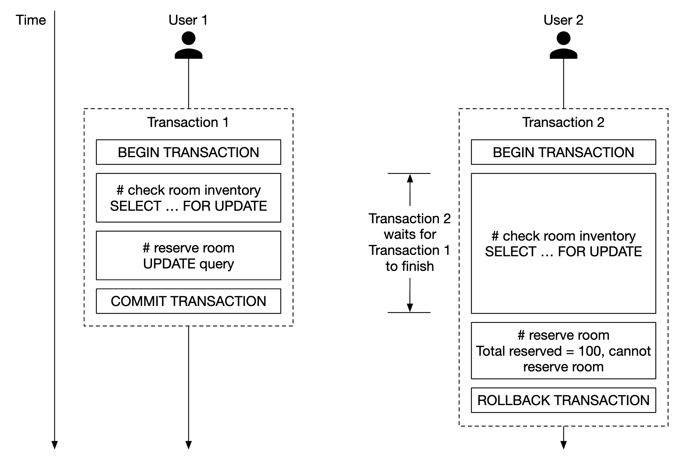

Pros:
 * Prevents applications from updating data that is being changed
 * Easy to implement and avoids conflict by serializing updates. Useful when there is heavy data contention.

Cons:
 * Deadlocks may occur when multiple resources are locked.
 * This approach is not scalable - if transaction is locked for too long, this has impact on all other transactions trying to access the resource.
 * The impact is severe when the query selects a lot of resources and the transaction is long-lived.

The author doesn't recommend this approach due to its scalability issues.

### Option 2: Optimistic locking
Optimistic locking allows multiple users to attempt to update a record at the same time.

There are two common ways to implement it - version numbers and timestamps. Version numbers are recommended as server clocks can be inaccurate.
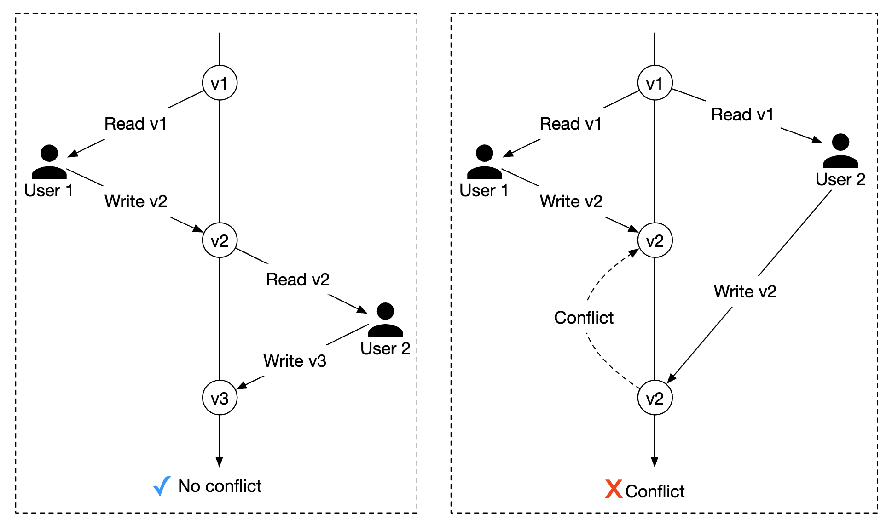
 * A new `version` column is added to the database table
 * Before a user modifies a database row, the version number is read
 * When the user updates the row, the version number is increased by 1 and written back to the database
 * Database validation prevents the insert if the new version number doesn't exceed the previous one

Optimistic locking is usually faster than pessimistic locking as we're not locking the database. 
Its performance tends to degrade when concurrency is high, however, as that leads to a lot of rollbacks.

Pros:
 * It prevents applications from editing stale data
 * We don't need to acquire a lock in the database
 * Preferred option when data contention is low, ie rarely are there update conflicts

Cons:
 * Performance is poor when data contention is high

Optimistic locking is a good option for our system as reservation QPS is not extremely high.

### Option 3: Database constraints
This approach is very similar to optimistic locking, but the guardrails are implemented using a database constraint:
```
CONSTRAINT `check_room_count` CHECK((`total_inventory - total_reserved` >= 0))
```
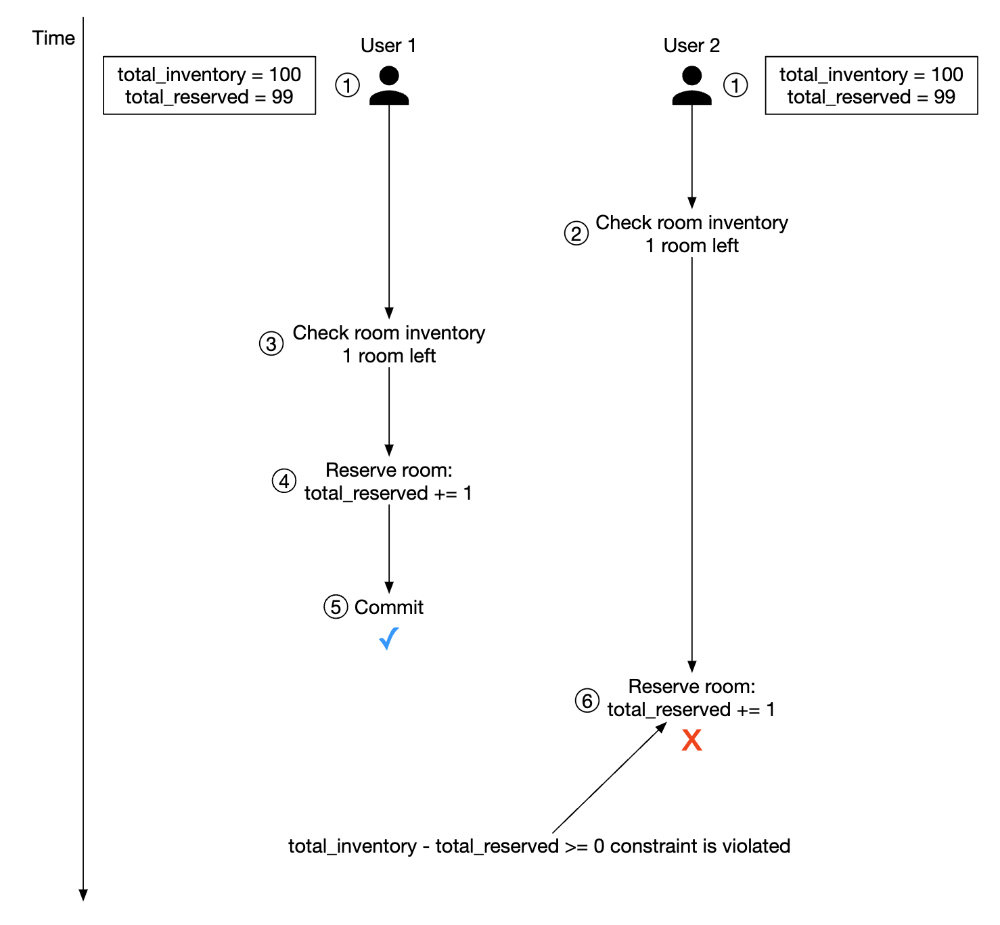

Pros:
 * Easy to implement
 * Works well when data contention is small

Cons:
 * Similar to optimistic locking, performs poorly when data contention is high
 * Database constraints cannot be easily version-controlled like application code
 * Not all databases support constraints

This is another good option for a hotel reservation system due to its ease of implementation.

## Scalability
Usually, the load of a hotel reservation system is not high. 

However, the interviewer might ask you how you'd handle a situation where the system gets adopted for a larger, popular travel site such as booking.com
In that case, QPS can be 1000 times larger.

When there is such a situation, it is important to understand where our bottlenecks are. All the services are stateless, so they can be easily scaled via replication.

The database, however, is stateful and it's not as obvious how it can get scaled.

One way to scale it is by implementing database sharding - we can split the data across multiple databases, where each of them contain a portion of the data.

We can shard based on `hotel_id` as all queries filter based on it. 
Assuming, QPS is 30,000, after sharding the database in 16 shards, each shard handles 1875 QPS, which is within a single MySQL cluster's load capacity.
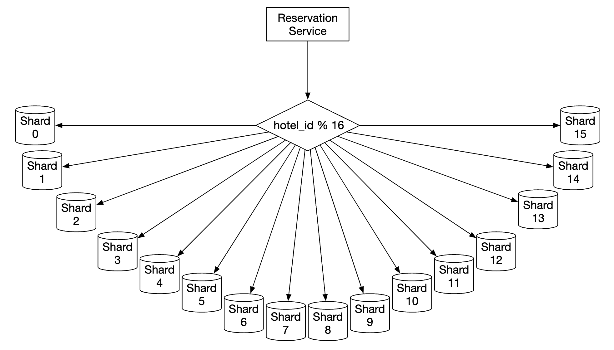

We can also utilize caching for room inventory and reservations via Redis. We can set TTL so that old data can expire for days which are past.
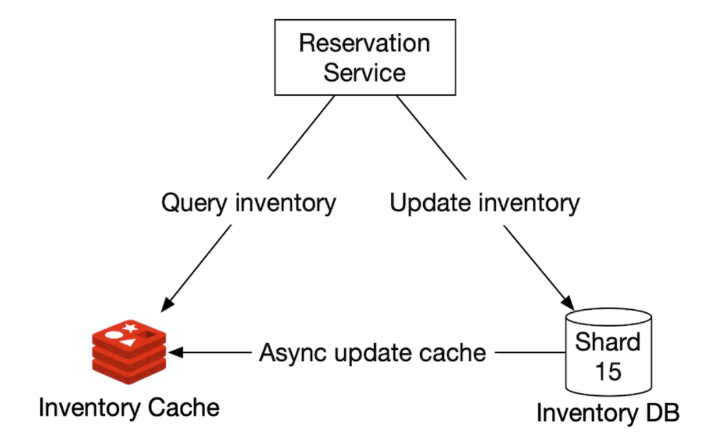

The way we store an inventory is based on the `hotel_id`, `room_type_id` and `date`:
```
key: hotelID_roomTypeID_{date}
value: the number of available rooms for the given hotel ID, room type ID and date.
```

Data consistency happens async and is managed by using a CDC streaming mechanism - database changes are read and applied to a separate system.
Debezium is a popular option for synchronizing database changes with Redis.

Using such a mechanism, there is a possibility that the cache and database are inconsistent for some time.
This is fine in our case because the database will prevent us from making an invalid reservation.

This will cause some issue on the UI as a user would have to refresh the page to see that "there are no more rooms left", 
but that is something which can happen regardless of this issue if eg a person hesitates a lot before making a reservation.

Caching pros:
 * Reduced database load
 * High performance, as Redis manages data in-memory

Caching cons:
 * Maintaining data consistency between cache and DB is hard. We need to consider how the inconsistency impacts user experience.

## Data consistency among services
A monolithic application enables us to use a shared relational database for ensuring data consistency.

In our microservice design, we chose a hybrid approach where some services are separate, 
but the reservation and inventory APIs are handled by the same servicefor the reservation and inventory APIs.

This is done because we want to leverage the relational database's ACID guarantees to ensure consistency.

However, the interviewer might challenge this approach as it's not a pure microservice architecture, where each service has a dedicated database:
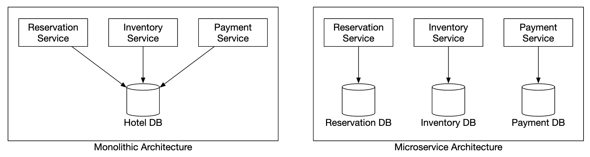

This can lead to consistency issues. In a monolithic server, we can leverage a relational DBs transaction capabilities to implement atomic operations:
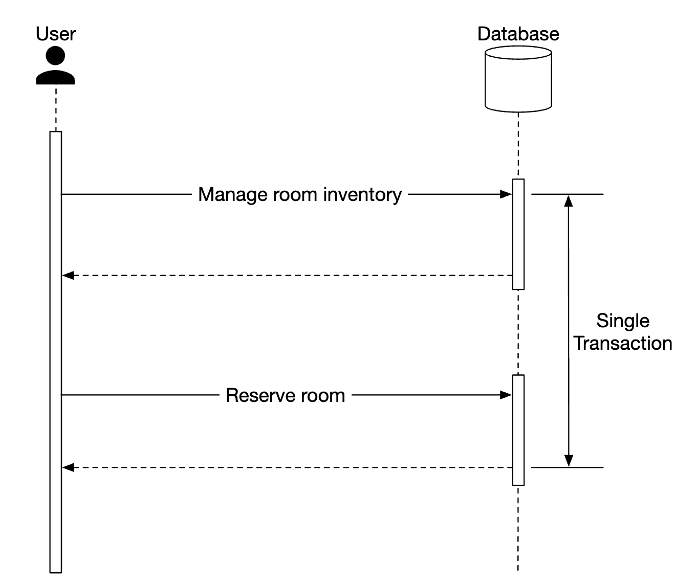

It's more challenging, however, to guarantee this atomicity when the operation spans across multiple services:
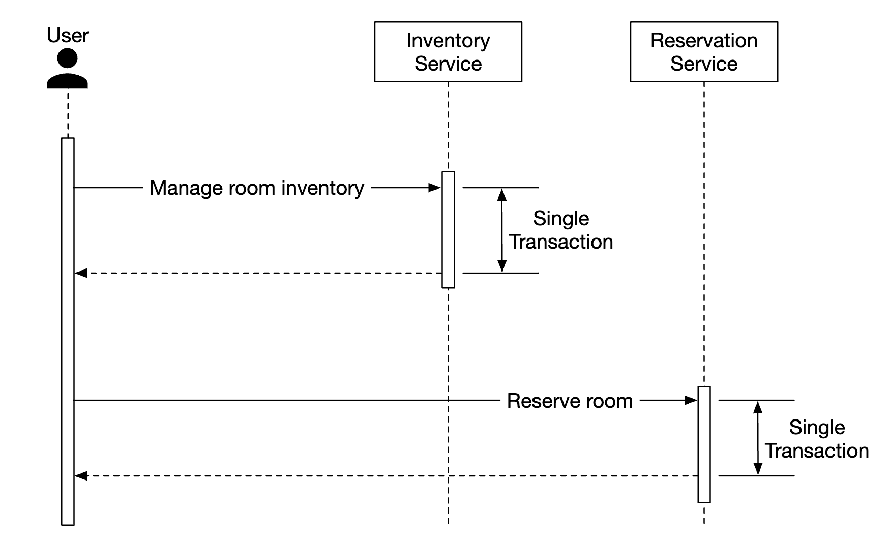

There are some well-known techniques to handle these data inconsistencies:
 * Two-phase commit - a database protocol which guarantees atomic transaction commit across multiple nodes. 
   It's not performant, though, since a single node lag leads to all nodes blocking the operation.
 * Saga - a sequence of local transactions, where compensating transactions are triggered if any of the steps in a workflow fail. This is an eventually consistent approach.

It's worth noting that addressing data inconsistencies across microservices is a challenging problem, which raise the system complexity.
It is good to consider whether the cost is worth it, given our more pragmatic approach of encapsulating dependent operations within the same relational database.

# Step 4 - Wrap Up
We presented a design for a hotel reservation system.

These are the steps we went through:
 * Gathering requirements and doing back-of-the-envelope calculations to understand the system's scale
 * We presented the API Design, Data Model and system architecture in the high-level design
 * In the deep dive, we explored alternative database schema designs as requirements changed
 * We discussed race conditions and proposed solutions - pessimistic/optimistic locking, database constraints
 * Ways to scale the system via database sharding and caching
 * Finally we addressed how to handle data consistency issues across multiple microservices

