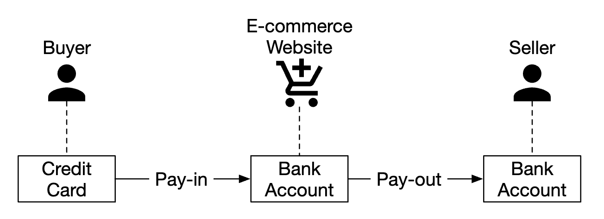
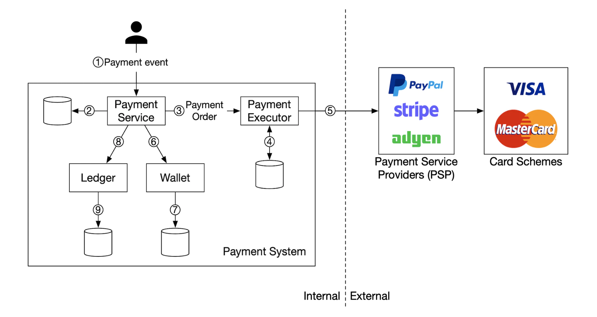
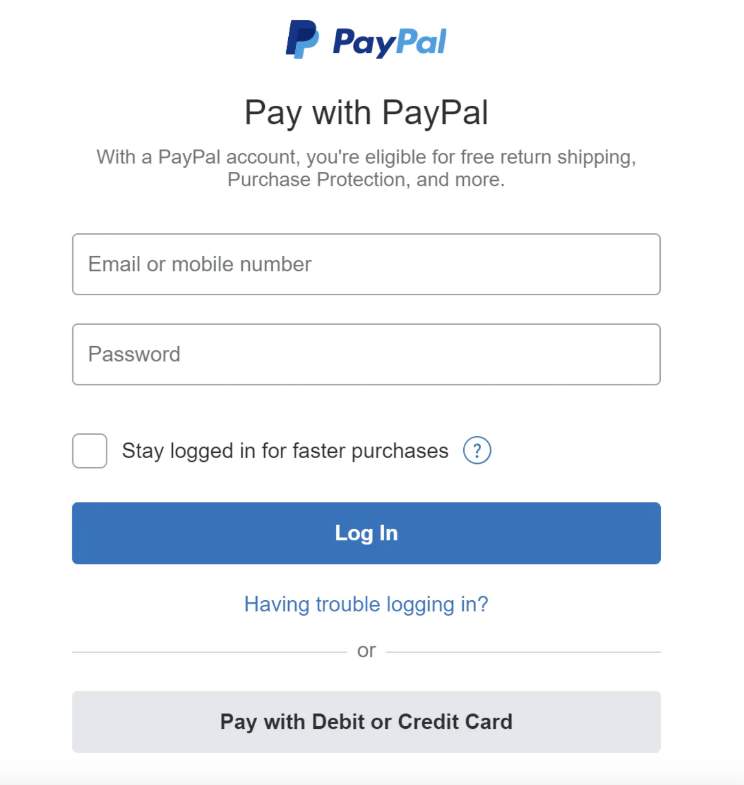
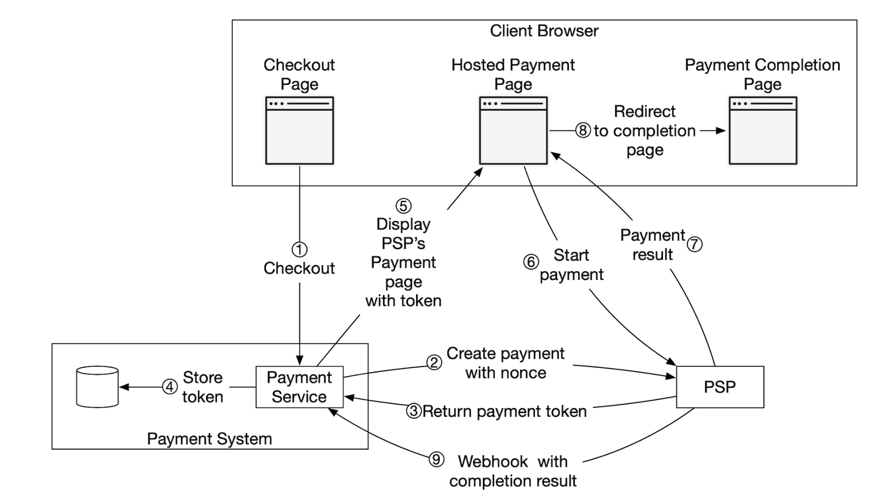
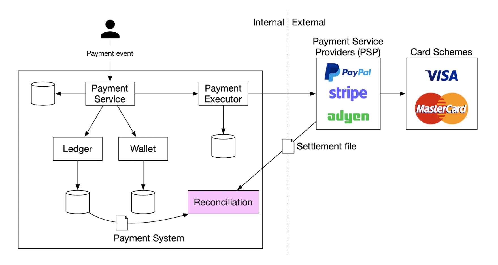
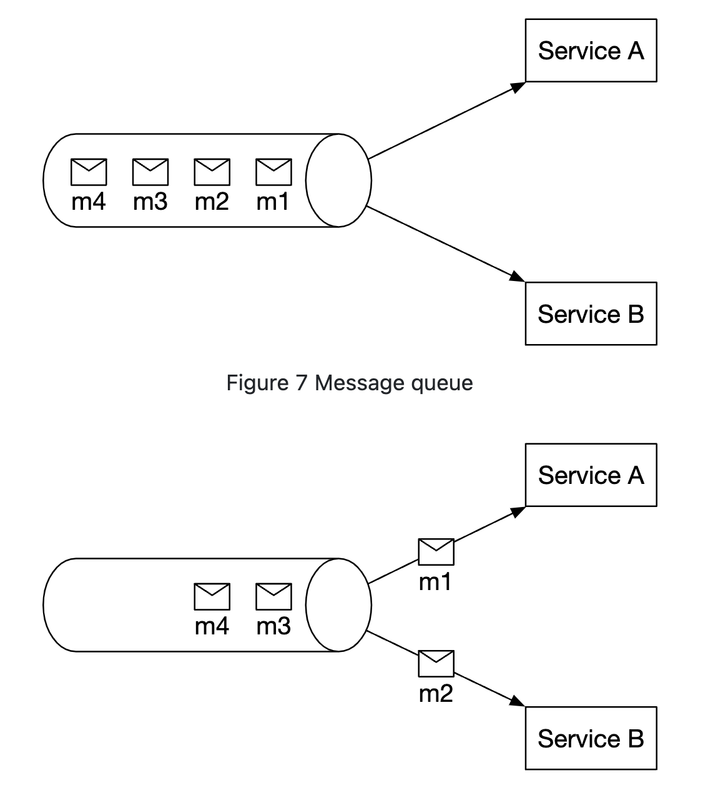
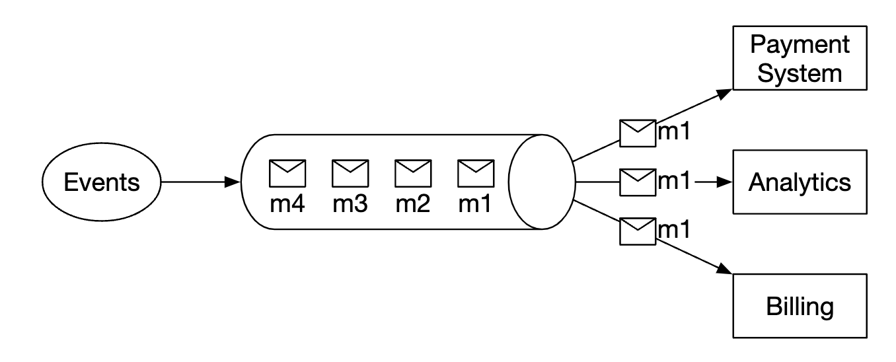
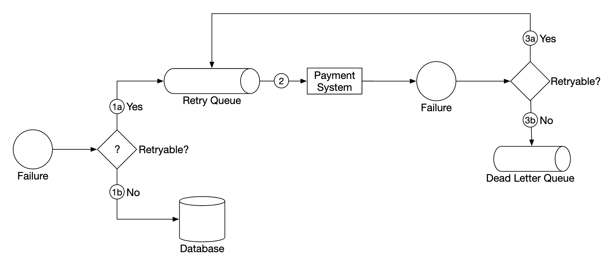
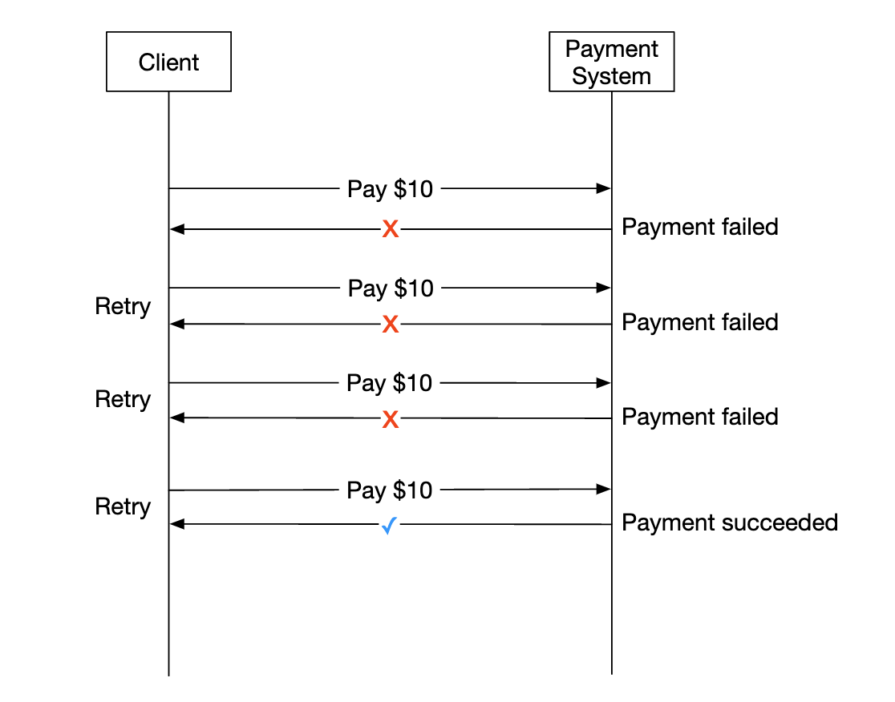
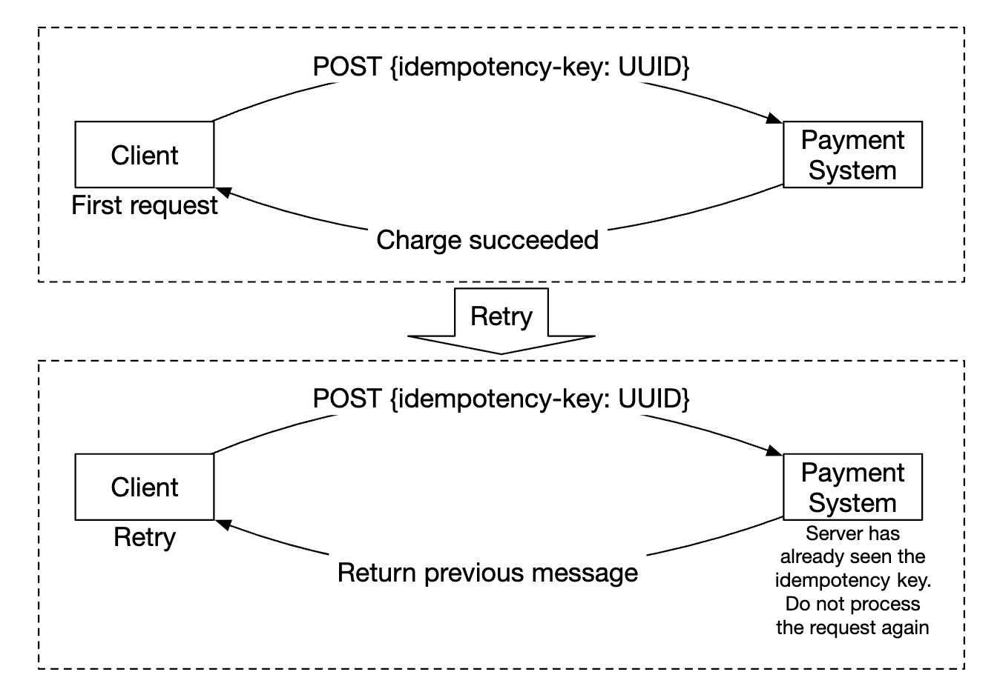

# Payment System
We'll design a payment system in this chapter, which underpins all of modern e-commerce.

A payment system is used to settle financial transactions, transferring monetary value.

# Step 1 - Understand the Problem and Establish Design Scope
 * C: What kind of payment system are we building?
 * I: A payment backend for an e-commerce system, similar to Amazon.com. It handles everything related to money movement.
 * C: What payment options are supported - Credit cards, PayPal, bank cards, etc?
 * I: The system should support all these options in real life. For the purposes of the interview, we can use credit card payments.
 * C: Do we handle credit card processing ourselves?
 * I: No, we use a third-party provider like Stripe, Braintree, Square, etc.
 * C: Do we store credit card data in our system?
 * I: Due to compliance reasons, we do not store credit card data directly in our systems. We rely on third-party payment processors.
 * C: Is the application global? Do we need to support different currencies and international payments?
 * I: The application is global, but we assume only one currency is used for the purposes of the interview.
 * C: How many payment transactions per day do we support?
 * I: 1mil transactions per day.
 * C: Do we need to support the payout flow to eg payout to payers each month?
 * I: Yes, we need to support that
 * C: Is there anything else I should pay attention to?
 * I: We need to support reconciliations to fix any inconsistencies in communicating with internal and external systems.

## Functional requirements
 * Pay-in flow - payment system receives money from customers on behalf of merchants
 * Pay-out flow - payment system sends money to sellers around the world

## Non-functional requirements
 * Reliability and fault-tolerance. Failed payments need to be carefully handled
 * A reconciliation between internal and external systems needs to be setup.

## Back-of-the-envelope estimation
The system needs to process 1mil transactions per day, which is 10 transactions per second.

This is not a high throughput for any database system, so it's not the focus of this interview.

# Step 2 - Propose High-Level Design and Get Buy-In
At a high-level, we have three actors, participating in money movement:


## Pay-in flow
Here's the high-level overview of the pay-in flow:

 * Payment service - accepts payment events and coordinates the payment process. It typically also does a risk check using a third-party provider for AML violations or criminal activity.
 * Payment executor - executes a single payment order via the Payment Service Provider (PSP). Payment events may contain several payment orders.
 * Payment service provider (PSP) - moves money from one account to another, eg from buyer's credit card account to e-commerce site's bank account.
 * Card schemes - organizations that process credit card operations, eg Visa MasterCard, etc.
 * Ledger - keeps financial record of all payment transactions.
 * Wallet - keeps the account balance for all merchants.

Here's an example pay-in flow:
 * user clicks "place order" and a payment event is sent to the payment service
 * payment service stores the event in its database
 * payment service calls the payment executor for all payment orders, part of that payment event
 * payment executor stores the payment order in its database
 * payment executor calls external PSP to process the credit card payment
 * After the payment executor processes the payment, the payment service updates the wallet to record how much money the seller has
 * wallet service stores updated balance information in its database
 * payment service calls the ledger to record all money movements

## APIs for payment service
```
POST /v1/payments
{
  "buyer_info": {...},
  "checkout_id": "some_id",
  "credit_card_info": {...},
  "payment_orders": [{...}, {...}, {...}]
}
```

Example `payment_order`:
```
{
  "seller_account": "SELLER_IBAN",
  "amount": "3.15",
  "currency": "USD",
  "payment_order_id": "globally_unique_payment_id"
}
```

Caveats:
 * The `payment_order_id` is forwarded to the PSP to deduplicate payments, ie it is the idempotency key.
 * The amount field is `string` as `double` is not appropriate for representing monetary values.

```
GET /v1/payments/{:id}
```

This endpoint returns the execution status of a single payment, based on the `payment_order_id`.

## Payment service data model
We need to maintain two tables - `payment_events` and `payment_orders`.

For payments, performance is typically not an important factor. Strong consistency, however, is.

Other considerations for choosing the database:
 * Strong market of DBAs to hire to administer the databaseS
 * Proven track-record where the database has been used by other big financial institutions
 * Richness of supporting tools
 * Traditional SQL over NoSQL/NewSQL for its ACID guarantees

Here's what the `payment_events` table contains:
 * `checkout_id` - string, primary key
 * `buyer_info` - string (personal note - prob a foreign key to another table is more appropriate)
 * `seller_info` - string (personal note - same remark as above)
 * `credit_card_info` - depends on card provider
 * `is_payment_done` - boolean

Here's what the `payment_orders` table contains:
 * `payment_order_id` - string, primary key
 * `buyer_account` - string
 * `amount` - string
 * `currency` - string
 * `checkout_id` - string, foreign key
 * `payment_order_status` - enum (`NOT_STARTED`, `EXECUTING`, `SUCCESS`, `FAILED`)
 * `ledger_updated` - boolean
 * `wallet_updated` - boolean

Caveats:
 * there are many payment orders, linked to a given payment event
 * we don't need the `seller_info` for the pay-in flow. That's required on pay-out only
 * `ledger_updated` and `wallet_updated` are updated when the respective service is called to record the result of a payment
 * payment transitions are managed by a background job, which checks updates of in-flight payments and triggers an alert if a payment is not processed in a reasonable timeframe

## Double-entry ledger system
The double-entry accounting mechanism is key to any payment system. It is a mechanism of tracking money movements by always applying money operations to two accounts, where one's account balance increases (credit) and the other decreases (debit):
| Account | Debit | Credit |
|---------|-------|--------|
| buyer   | $1    |        |
| seller  |       | $1     |

Sum of all transaction entries is always zero. This mechanism provides end-to-end traceability of all money movements within the system.

## Hosted payment page
To avoid storing credit card information and having to comply with various heavy regulations, most companies prefer utilizing a widget, provided by PSPs, which store and handle credit card payments for you:


## Pay-out flow
The components of the pay-out flow are very similar to the pay-in flow.

Main differences:
 * money is moved from e-commerce site's bank account to merchant's bank account
 * we can utilize a third-party account payable provider such as Tipalti
 * There's a lot of bookkeeping and regulatory requirements to handle with regards to pay-outs as well

# Step 3 - Design Deep Dive
This section focuses on making the system faster, more robust and secure.

## PSP Integration
If our system can directly connect to banks or card schemes, payment can be made without a PSP.
These kinds of connections are very rare and uncommon, typically done at large companies which can justify the investment.

If we go down the traditional route, a PSP can be integrated in one of two ways:
 * Through API, if our payment system can collect payment information
 * Through a hosted payment page to avoid dealing with payment information regulations

Here's how the hosted payment page workflow works:

 * User clicks "checkout" button in the browser
 * Client calls the payment service with the payment order information
 * After receiving payment order information, the payment service sends a payment registration request to the PSP.
 * The PSP receives payment info such as currency, amount, expiration, etc, as well as a UUID for idempotency purposes. Typically the UUID of the payment order.
 * The PSP returns a token back which uniquely identifies the payment registration. The token is stored in the payment service database.
 * Once token is stored, the user is served with a PSP-hosted payment page. It is initialized using the token as well as a redirect URL for success/failure. 
 * User fills in payment details on the PSP page, PSP processes payment and returns the payment status
 * User is now redirected back to the redirectURL. Example redirect url - `https://your-company.com/?tokenID=JIOUIQ123NSF&payResult=X324FSa`
 * Asynchronously, the PSP calls our payment service via a webhook to inform our backend of the payment result
 * Payment service records the payment result based on the webhook received

## Reconciliation
The previous section explains the happy path of a payment. Unhappy paths are detected and reconciled using a background reconciliation process.

Every night, the PSP sends a settlement file which our system uses to compare the external system's state against our internal system's state.


This process can also be used to detect internal inconsistencies between eg the ledger and the wallet services.

Mismatches are handled manually by the finance team. Mismatches are handled as:
 * classifiable, hence, it is a known mismatch which can be adjusted using a standard procedure
 * classifiable, but can't be automated. Manually adjusted by the finance team
 * unclassifiable. Manually investigated and adjusted by the finance team

## Handling payment processing delays
There are cases, where a payment can take hours to complete, although it typically takes seconds.

This can happen due to:
 * a payment being flagged as high-risk and someone has to manually review it
 * credit card requires extra protection, eg 3D Secure Authentication, which requires extra details from card holder to complete

These situations are handled by:
 * waiting for the PSP to send us a webhook when a payment is complete or polling its API if the PSP doesn't provide webhooks
 * showing a "pending" status to the user and giving them a page, where they can check-in for payment updates. We could also send them an email once their payment is complete

## Communication among internal services
There are two types of communication patterns services use to communicate with one another - synchronous and asynchronous.

Synchronous communication (ie HTTP) works well for small-scale systems, but suffers as scale increases:
 * low performance - request-response cycle is long as more services get involved in the call chain
 * poor failure isolation - if PSPs or any other service fails, user will not receive a response
 * tight coupling - sender needs to know the receiver
 * hard to scale - not easy to support sudden increase in traffic due to not having a buffer

Asynchronous communication can be divided into two categories.

Single receiver - multiple receivers subscribe to the same topic and messages are processed only once:


Multiple receivers - multiple receivers subscribe to the same topic, but messages are forwarded to all of them:


Latter model works well for our payment system as a payment can trigger multiple side effects, handled by different services.

In a nutshell, synchronous communication is simpler but doesn't allow services to be autonomous. 
Async communication trades simplicity and consistency for scalability and resilience.

## Handling failed payments
Every payment system needs to address failed payments. Here are some of the mechanism we'll use to achieve that:
 * Tracking payment state - whenever a payment fails, we can determine whether to retry/refund based on the payment state.
 * Retry queue - payments which we'll retry are published to a retry queue
 * Dead-letter queue - payments which have terminally failed are pushed to a dead-letter queue, where the failed payment can be debugged and inspected.


## Exactly-once delivery
We need to ensure a payment gets processed exactly-once to avoid double-charging a customer.

An operation is executed exactly-once if it is executed at-least-once and at-most-once at the same time.

To achieve the at-least-once guarantee, we'll use a retry mechanism:


Here are some common strategies on deciding the retry intervals:
 * immediate retry - client immediately sends another request after failure
 * fixed intervals - wait a fixed amount of time before retrying a payment
 * incremental intervals - incrementally increase retry interval between each retry
 * exponential back-off - double retry interval between subsequent retries
 * cancel - client cancels the request. This happens when the error is terminal or retry threshold is reached

As a rule of thumb, default to an exponential back-off retry strategy. A good practice is for the server to specify a retry interval using a `Retry-After` header.

An issue with retries is that the server can potentially process a payment twice:
 * client clicks the "pay button" twice, hence, they are charged twice
 * payment is successfully processed by PSP, but not by downstream services (ledger, wallet). Retry causes the payment to be processed by the PSP again

To address the double payment problem, we need to use an idempotency mechanism - a property that an operation applied multiple times is processed only once.

From an API perspective, clients can make multiple calls which produce the same result. 
Idempotency is managed by a special header in the request (eg `idempotency-key`), which is typically a UUID.


Idempotency can be achieved using the database's mechanism of adding unique key constraints:
 * server attempts to insert a new row in the database
 * the insertion fails due to a unique key constraint violation
 * server detects that error and instead returns the existing object back to the client

Idempotency is also applied at the PSP side, using the nonce, which was previously discussed. PSPs will take care to not process payments with the same nonce twice.

## Consistency
There are several stateful services called throughout a payment's lifecycle - PSP, ledger, wallet, payment service.

Communication between any two services can fail. 
We can ensure eventual data consistency between all services by implementing exactly-once processing and reconciliation.

If we use replication, we'll have to deal with replication lag, which can lead to users observing inconsistent data between primary and replica databases.

To mitigate that, we can serve all reads and writes from the primary database and only utilize replicas for redundancy and fail-over.
Alternatively, we can ensure replicas are always in-sync by utilizing a consensus algorithm such as Paxos or Raft.
We could also use a consensus-based distributed database such as YugabyteDB or CockroachDB.

## Payment security
Here are some mechanisms we can use to ensure payment security:
 * Request/response eavesdropping - we can use HTTPS to secure all communication
 * Data tampering - enforce encryption and integrity monitoring
 * Man-in-the-middle attacks - use SSL \w certificate pinning
 * Data loss - replicate data across multiple regions and take data snapshots
 * DDoS attack - implement rate limiting and firewall
 * Card theft - use tokens instead of storing real card information in our system
 * PCI compliance - a security standard for organizations which handle branded credit cards
 * Fraud - address verification, card verification value (CVV), user behavior analysis, etc

# Step 4 - Wrap Up
Other talking points:
 * Monitoring and alerting
 * Debugging tools - we need tools which make it easy to understand why a payment has failed
 * Currency exchange - important when designing a payment system for international use
 * Geography - different regions might have different payment methods
 * Cash payment - very common in places like India and Brazil
 * Google/Apple Pay integration
