# Digital Wallet
Payment platforms usually have a wallet service, where they allow clients to store funds within the application, which they can withdraw later.

You can also use it to pay for goods & services or transfer money to other users, who use the digital wallet service. That can be faster and cheaper than doing it via normal payment rails.
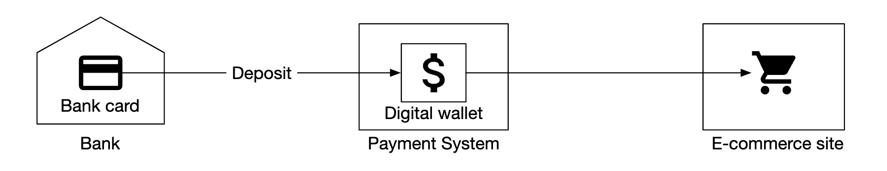

# Step 1 - Understand the Problem and Establish Design Scope
 * C: Should we only focus on transfers between digital wallets? Should we support any other operations?
 * I: Let's focus on transfers between digital wallets for now.
 * C: How many transactions per second does the system need to support?
 * I: Let's assume 1mil TPS
 * C: A digital wallet has strict correctness requirements. Can we assume transactional guarantees are sufficient?
 * I: Sounds good
 * C: Do we need to prove correctness?
 * I: We can do that via reconciliation, but that only detects discrepancies vs. showing us the root cause for them. Instead, we want to be able to replay data from the beginning to reconstruct the history.
 * C: Can we assume availability requirement is 99.99%?
 * I: Yes
 * C: Do we need to take foreign exchange into consideration?
 * I: No, it's out of scope

Here's what we have to support in summary:
 * Support balance transfers between two accounts
 * Support 1mil TPS
 * Reliability is 99.99%
 * Support transactions
 * Support reproducibility

## Back-of-the-envelope estimation
A traditional relational database, provisioned in the cloud can support ~1000 TPS.

In order to reach 1mil TPS, we'd need 1000 database nodes. But if each transfer has two legs, then we actually need to support 2mil TPS.

One of our design goals would be to increase the TPS a single node can handle so that we can have less database nodes.
| Per-node TPS | Node Number |
|--------------|-------------|
| 100          | 20,000      |
| 1,000        | 2,000       |
| 10,000       | 200         |

# Step 2 - Propose High-Level Design and Get Buy-In
## API Design
We only need to support one endpoint for this interview:
```
POST /v1/wallet/balance_transfer - transfers balance from one wallet to another
```

Request parameters - from_account, to_account, amount (string to not lose precision), currency, transaction_id (idempotency key).

Sample response:
```
{
    "status": "success"
    "transaction_id": "01589980-2664-11ec-9621-0242ac130002"
}
```

## In-memory sharding solution
Our wallet application maintains account balances for every user account.

One good data structure to represent this is a `map<user_id, balance>`, which can be implemented using an in-memory Redis store.

Since one redis node cannot withstand 1mil TPS, we need to partition our redis cluster into multiple nodes.

Example partitioning algorithm:
```
String accountID = "A";
Int partitionNumber = 7;
Int myPartition = accountID.hashCode() % partitionNumber;
```

Zookeeper can be used to store the number of partitions and addresses of redis nodes as it's a highly-available configuration storage. 

Finally, a wallet service is a stateless service responsible for carrying out transfer operations. It can easily scale horizontally:
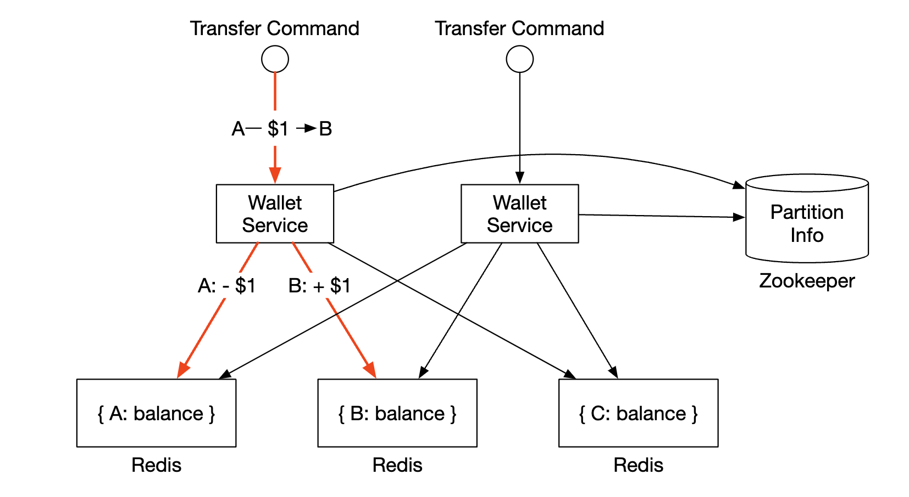

Although this solution addresses scalability concerns, it doesn't allow us to execute balance transfers atomically.

## Distributed transactions
One approach for handling transactions is to use the two-phase commit protocol on top of standard, sharded relational databases:
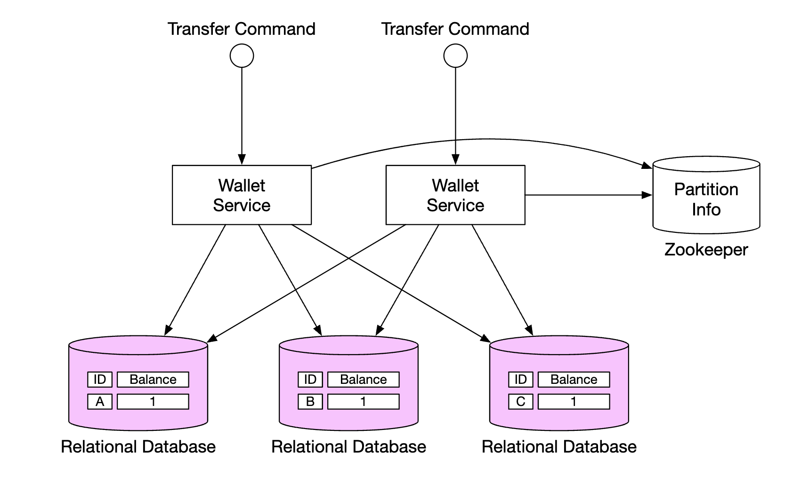

Here's how the two-phase commit (2PC) protocol works:
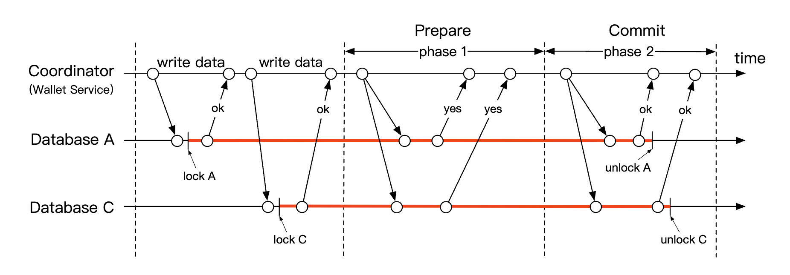
 * Coordinator (wallet service) performs read and write operations on multiple databases as normal
 * When application is ready to commit the transaction, coordinator asks all databases to prepare it
 * If all databases replied with a "yes", then the coordinator asks the databases to commit the transaction.
 * Otherwise, all databases are asked to abort the transaction

Downsides to the 2PC approach:
 * Not performant due to lock contention
 * The coordinator is a single point of failure

## Distributed transaction using Try-Confirm/Cancel (TC/C)
TC/C is a variation of the 2PC protocol, which works with compensating transactions:
 * Coordinator asks all databases to reserve resources for the transaction
 * Coordinator collects replies from DBs - if yes, DBs are asked to try-confirm. If no, DBs are asked to try-cancel.

One important difference between TC/C and 2PC is that 2PC performs a single transaction, whereas in TC/C, there are two independent transactions.

Here's how TC/C works in phases:
| Phase | Operation | A                   | C                   |
|-------|-----------|---------------------|---------------------|
| 1     | Try       | Balance change: -$1 | Do nothing          |
| 2     | Confirm   | Do nothing          | Balance change: +$1 |
|       | Cancel    | Balance change: +$1 | Do Nothing          |

Phase 1 - try:
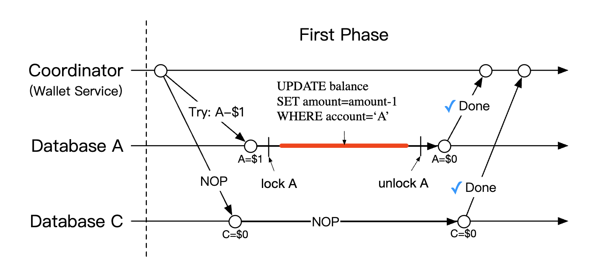
 * coordinator starts local transaction in A's DB to reduce A's balance by 1$
 * C's DB is given a NOP instruction, which does nothing

Phase 2a - confirm:
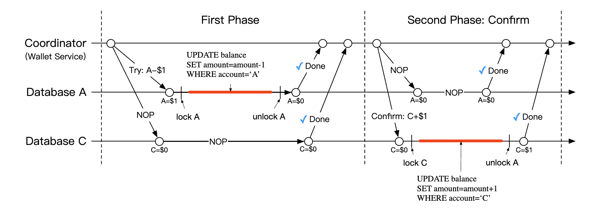
 * if both DBs replied with "yes", confirm phase starts.
 * A's DB receives NOP, whereas C's DB is instructed to increase C's balance by 1$ (local transaction)

Phase 2b - cancel:
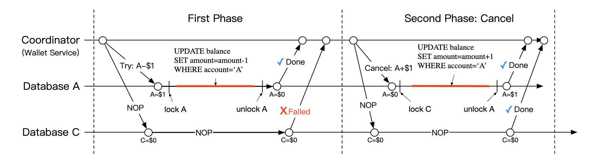
 * If any of the operations in phase 1 fails, the cancel phase starts.
 * A's DB is instructed to increase A's balance by 1$, C's DB receives NOP

Here's a comparison between 2PC and TC/C:
|      | First Phase                                            | Second Phase: success              | Second Phase: fail                        |
|------|--------------------------------------------------------|------------------------------------|-------------------------------------------|
| 2PC  | transactions are not done yet                          | Commit/Cancel all transactions     | Cancel all transactions                   |
| TC/C | All transactions are completed - committed or canceled | Execute new transactions if needed | Reverse the already committed transaction |

TC/C is also referred to as a distributed transaction by compensation. High-level operation is handled in the business logic.

Other properties of TC/C:
 * database agnostic, as long as database supports transactions
 * Details and complexity of distributed transactions need to be handled in the business logic

## TC/C Failure modes
If the coordinator dies mid-flight, it needs to recover its intermediary state. 
That can be done by maintaining phase status tables, atomically updated within the database shards:
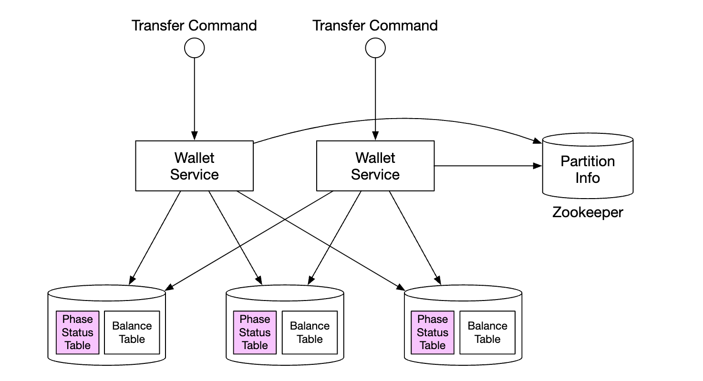

What does that table contain:
 * ID and content of distributed transaction
 * status of try phase - not sent, has been sent, response received
 * second phase name - confirm or cancel
 * status of second phase
 * out-of-order flag (explained later)

One caveat when using TC/C is that there is a brief moment where the account states are inconsistent with each other while a distributed transaction is in-flight:
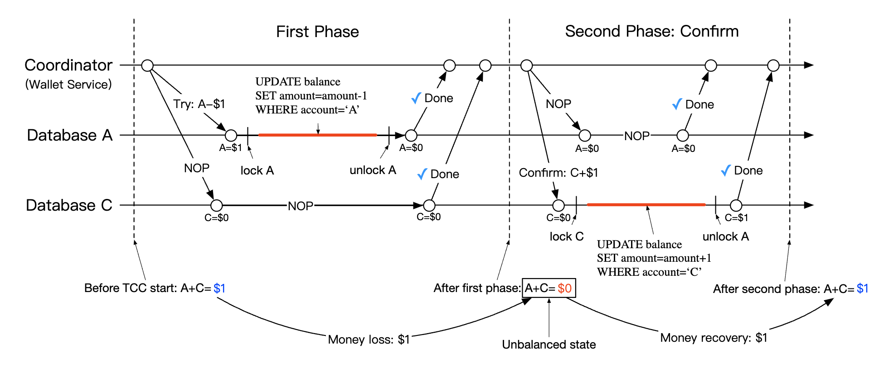

This is fine as long as we always recover from this state and that users cannot use the intermediary state to eg spend it. 
This is guaranteed by always executing deductions prior to additions.
| Try phase choices  | Account A | Account C |
|--------------------|-----------|-----------|
| Choice 1           | -$1       | NOP       |
| Choice 2 (invalid) | NOP       | +$1       |
| Choice 3 (invalid) | -$1       | +$1       |

Note that choice 3 from table above is invalid because we cannot guarantee atomic execution of transactions across different databases without relying on 2PC.

One edge-case to address is out of order execution:
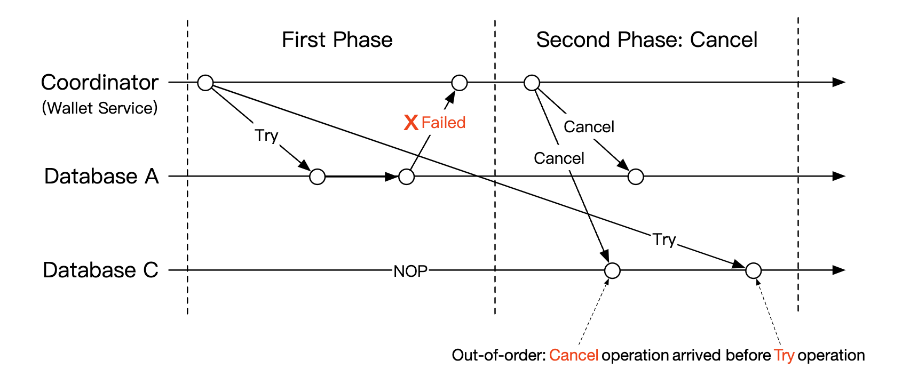

It is possible that a database receives a cancel operation, before receiving a try. This edge case can be handled by adding an out of order flag in our phase status table.
When we receive a try operation, we first check if the out of order flag is set and if so, a failure is returned.

## Distributed transaction using Saga
Another popular approach is using Sagas - a standard for implementing distributed transactions with microservice architectures.

Here's how it works:
 * all operations are ordered in a sequence. All operations are independent in their own databases.
 * operations are executed from first to last
 * when an operation fails, the entire process starts to roll back until the beginning with compensating operations
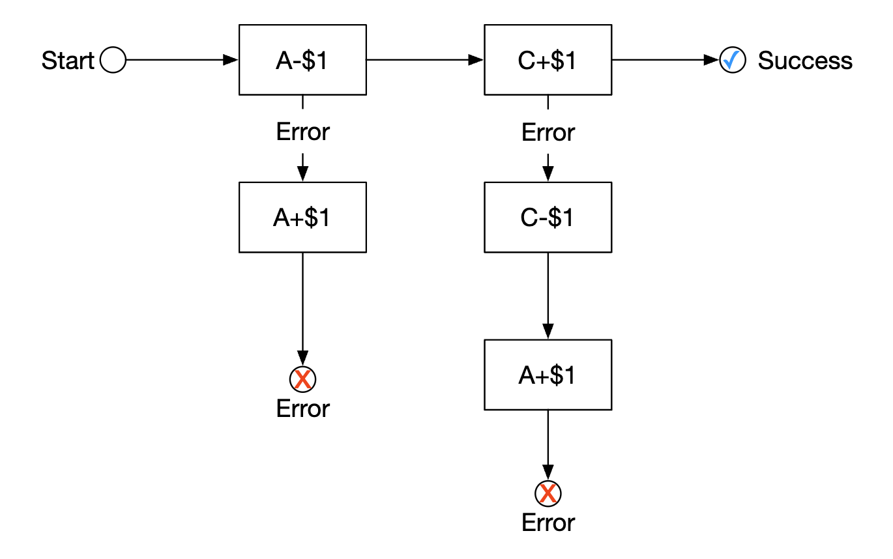

How do we coordinate the workflow? There are two approaches we can take:
 * Choreography - all services involved in a saga subscribe to the related events and do their part in the saga
 * Orchestration - a single coordinator instructs all services to do their jobs in the correct order

The challenge of using choreography is that business logic is split across multiple service, which communicate asynchronously.
The orchestration approach handles complexity well, so it is typically the preferred approach in a digital wallet system.

Here's a comparison between TC/C and Saga:
|                                           | TC/C            | Saga                     |
|-------------------------------------------|-----------------|--------------------------|
| Compensating action                       | In Cancel phase | In rollback phase        |
| Central coordination                      | Yes             | Yes (orchestration mode) |
| Operation execution order                 | any             | linear                   |
| Parallel execution possibility            | Yes             | No (linear execution)    |
| Could see the partial inconsistent status | Yes             | Yes                      |
| Application or database logic             | Application     | Application              |

The main difference is that TC/C is parallelizable, so our decision is based on the latency requirement - if we need to achieve low latency, we should go for the TC/C approach.

Regardless of the approach we take, we still need to support auditing and replaying history to recover from failed states.

## Event sourcing
In real-life, a digital wallet application might be audited and we have to answer certain questions:
 * Do we know the account balance at any given time?
 * How do we know the historical and current balances are correct?
 * How do we prove the system logic is correct after a code change?

Event sourcing is a technique which helps us answer these questions.

It consists of four concepts:
 * command - intended action from the real world, eg transfer 1$ from account A to B. Need to have a global order, due to which they're put into a FIFO queue.
   * commands, unlike events, can fail and have some randomness due to eg IO or invalid state.
   * commands can produce zero or more events
   * event generation can contain randomness such as external IO. This will be revisited later
 * event - historical facts about events which occured in the system, eg "transferred 1$ from A to B".
   * unlike commands, events are facts that have happened within our system
   * similar to commands, they need to be ordered, hence, they're enqueued in a FIFO queue
 * state - what has changed as a result of an event. Eg a key-value store between account and their balances.
 * state machine - drives the event sourcing process. It mainly validates commands and applies events to update the system state.
   * the state machine should be deterministic, hence, it shouldn't read external IO or rely on randomness. 
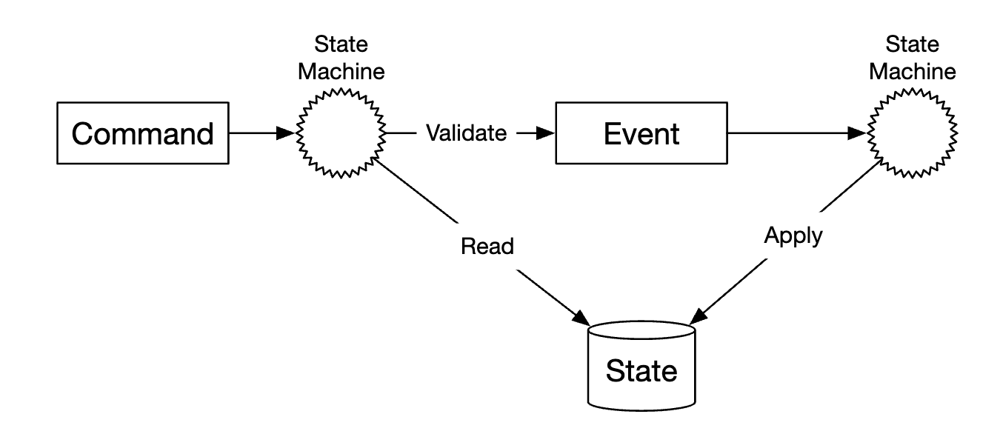

Here's a dynamic view of event sourcing:
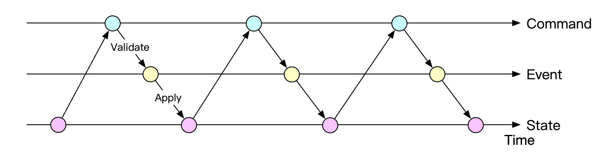

For our wallet service, the commands are balance transfer requests. We can put them in a FIFO queue, such as Kafka:
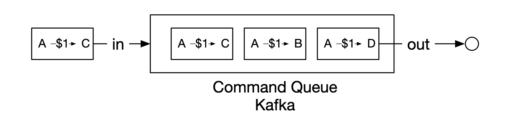

Here's the full picture:
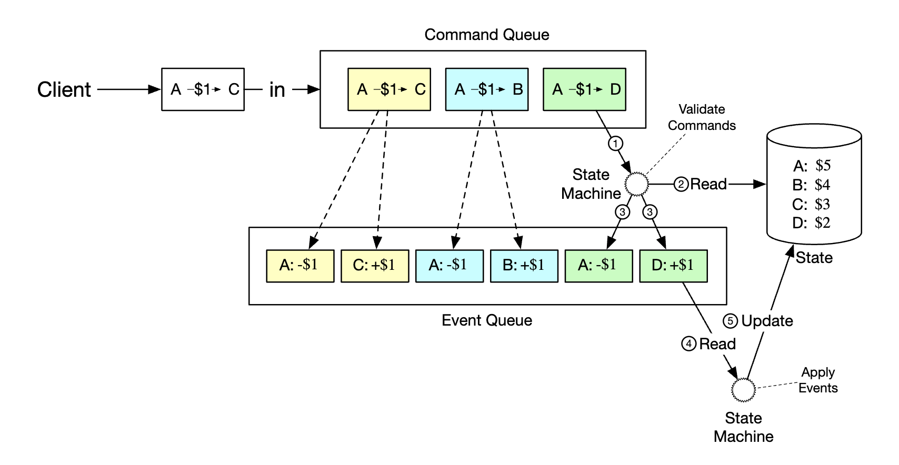
 * state machine reads commands from the command queue
 * balance state is read from the database
 * command is validated. If valid, two events for each of the accounts is generated
 * next event is read and applied by updating the balance (state) in the database

The main advantage of using event sourcing is its reproducibility. In this design, all state update operations are saved as immutable history of all balance changes.

Historical balances can always be reconstructed by replaying events from the beginning. 
Because the event list is immutable and the state machine is deterministic, we are guaranteed to succeed in replaying any of the intermediary states.
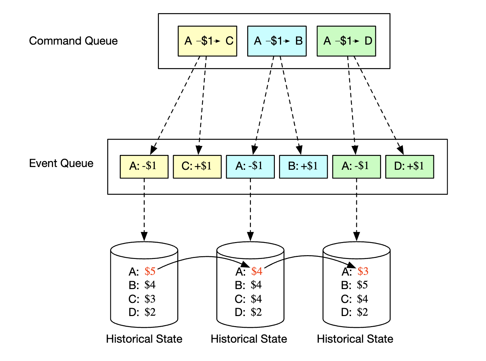

All audit-related questions asked in the beginning of the section can be addressed by relying on event sourcing:
 * Do we know the account balance at any given time? - events can be replayed from the start until the point which we are interested in
 * How do we know the historical and current balances are correct? - correctness can be verified by recalculating all events from the start
 * How do we prove the system logic is correct after a code change? - we can run different versions of the code against the events and verify their results are identical

Answering client queries about their balance can be addressed using the CQRS architecture - there can be multiple read-only state machines which are responsible for querying the historical state, based on the immutable events list:
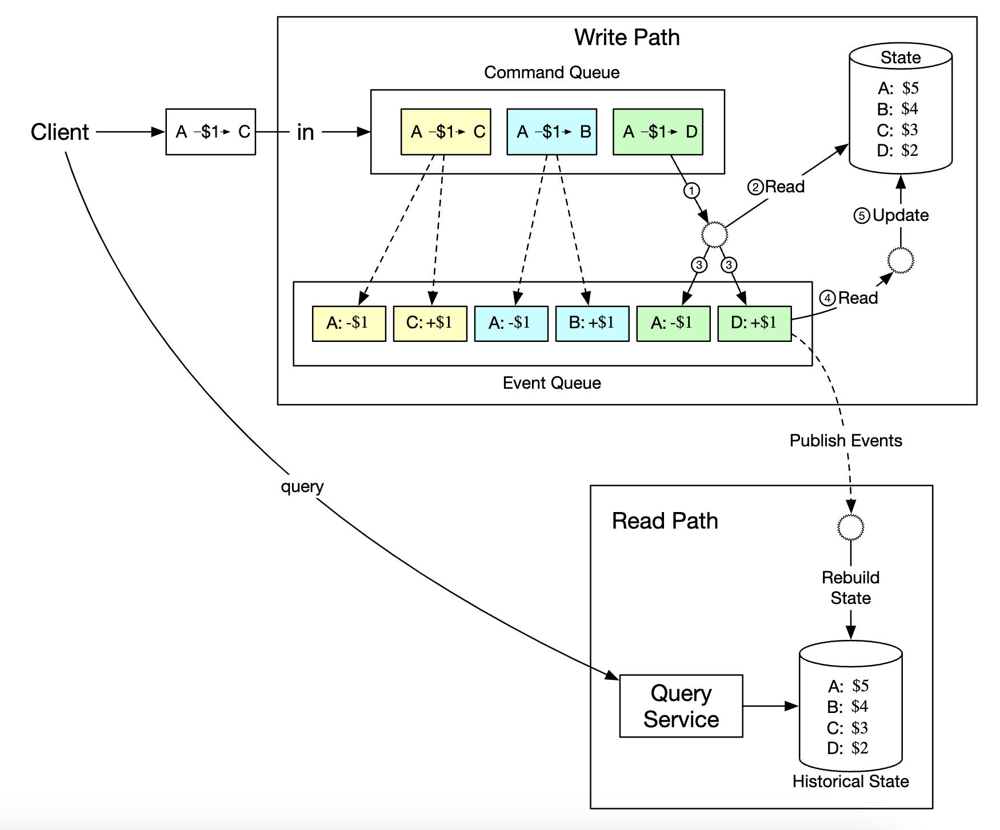

# Step 3 - Design Deep Dive
In this section we'll explore some performance optimizations as we're still required to scale to 1mil TPS.

## High-performance event sourcing
The first optimization we'll explore is to save commands and events into local disk store instead of an external store such as Kafka.

This avoids the network latency and also, since we're only doing appends, that operation is generally fast for HDDs.

The next optimization is to cache recent commands and events in-memory in order to save the time of loading them back from disk.

At a low-level, we can achieve the aforementioned optimizations by leveraging a command called mmap, which stores data in local disk as well as cache it in-memory:
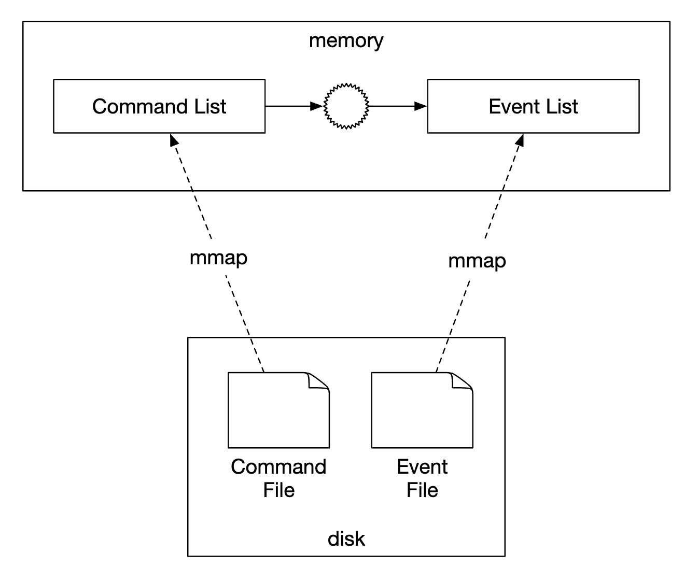

The next optimization we can do is also store state in the local file system using SQLite - a file-based local relational database. RocksDB is also another good option.

For our purposes, we'll choose RocksDB because it uses a log-structured merge-tree (LSM), which is optimized for write operations.
Read performance is optimized via caching.
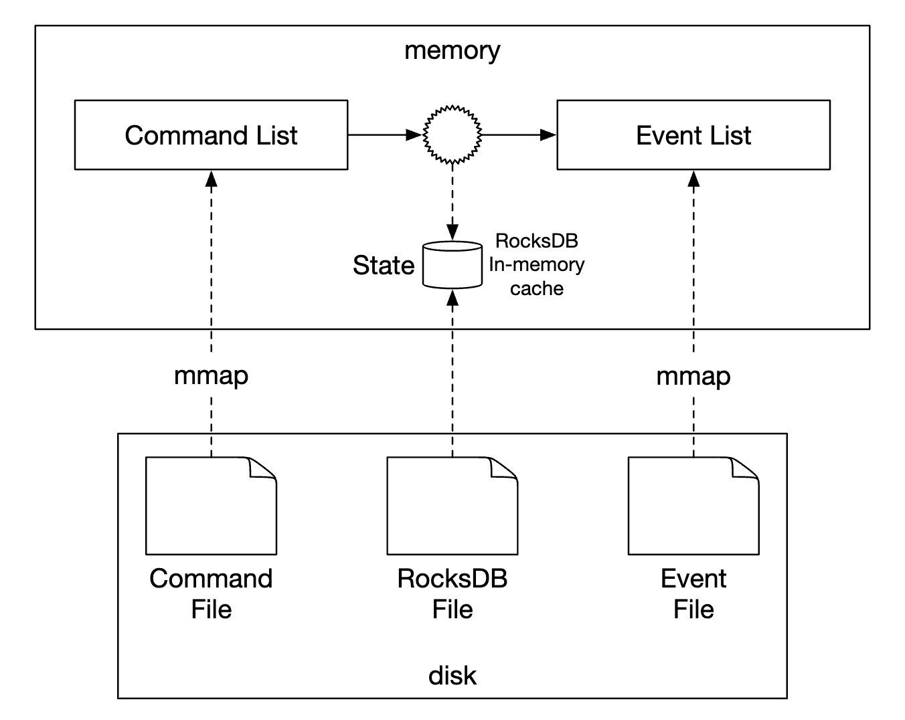

To optimize the reproducibility, we can periodically save snapshots to disk so that we don't have to reproduce a given state from the very beginning every time. We could store snapshots as large binary files in distributed file storage, eg HDFS:
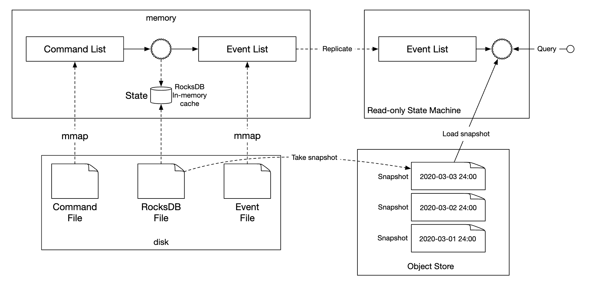

## Reliable high-performance event sourcing
All the optimizations done so far are great, but they make our service stateful. We need to introduce some form of replication for reliability purposes.

Before we do that, we should analyze what kind of data needs high reliability in our system:
 * state and snapshot can always be regenerated by reproducing them from the events list. Hence, we only need to guarantee the event list reliability.
 * one might think we can always regenerate the events list from the command list, but that is not true, since commands are non-deterministic.
 * conclusion is that we need to ensure high reliability for the events list only

In order to achieve high reliability for events, we need to replicate the list across multiple nodes. We need to guarantee:
 * that there is no data loss
 * the relative order of data within a log file remains the same across replicas

To achieve this, we can employ a consensus algorithm, such as Raft.

With Raft, there is a leader who is active and there are followers who are passive. If a leader dies, one of the followers picks up. 
As long as more than half of the nodes are up, the system continues running.
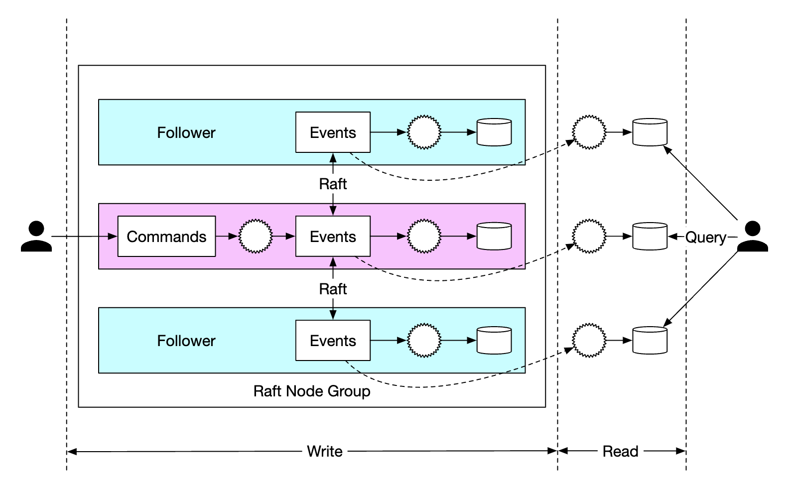

With this approach, all nodes update the state, based on the events list. Raft ensures leader and followers have the same events list.

## Distributed event sourcing
So far, we've managed to design a system which has high single-node performance and is reliable.

Some limitations we have to tackle:
 * The capacity of a single raft group is limited. At some point, we need to shard the data and implement distributed transactions
 * In the CQRS architecture, the request/response flow is slow. A client would need to periodically poll the system to learn when their wallet has been updated

Polling is not real-time, hence, it can take a while for a user to learn about an update in their balance. Also, it can overload the query services if the polling frequency is too high:
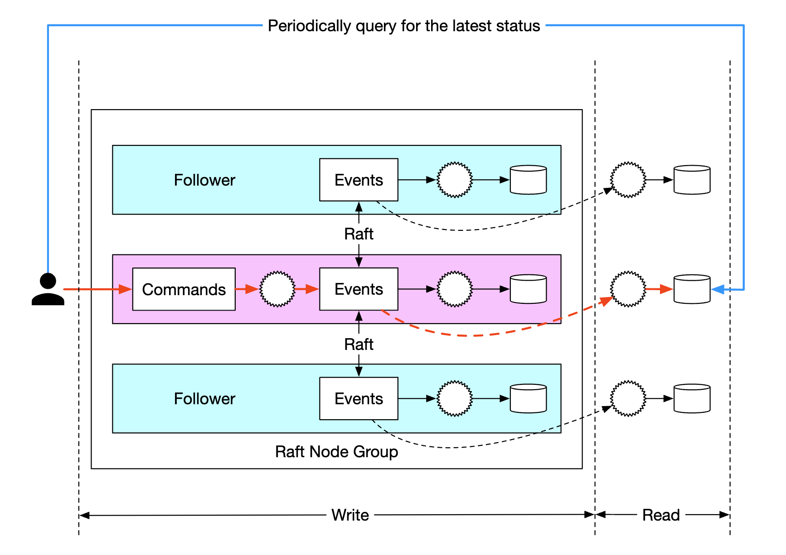

To mitigate the system load, we can introduce a reverse proxy, which sends commands on behalf of the user and polls for response on their behalf:
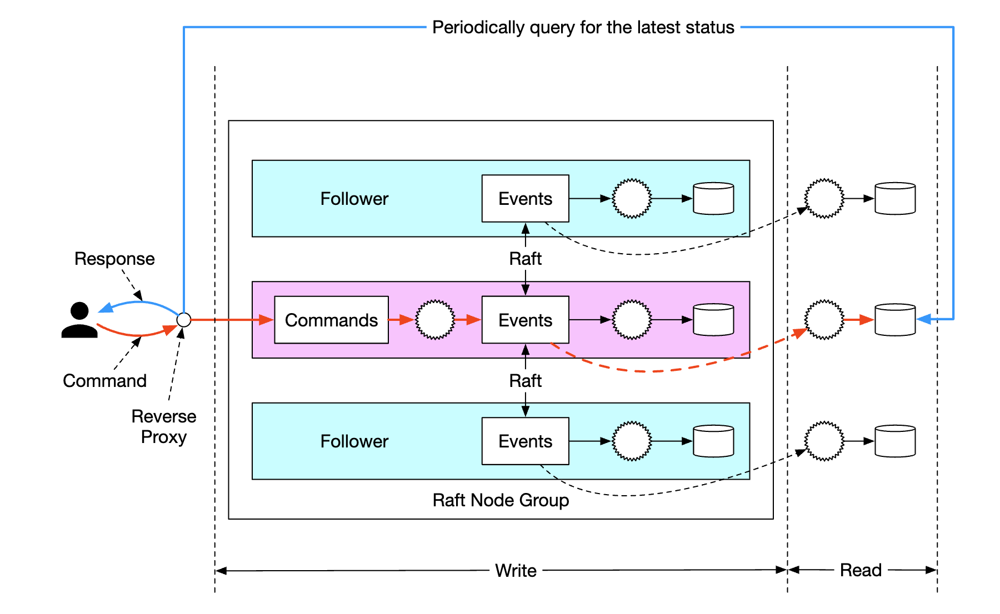

This alleviates the system load as we could fetch data for multiple users using a single request, but it still doesn't solve the real-time receipt requirement.

One final change we could do is make the read-only state machines push responses back to the reverse proxy once it's available. This can give the user the sense that updates happen real-time:
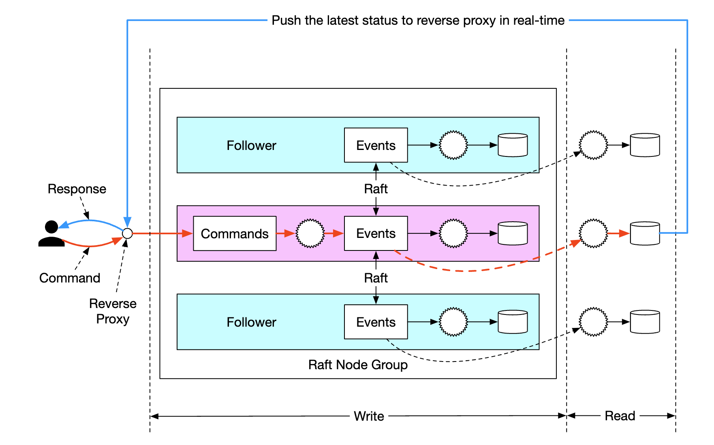

Finally, to scale the system even further, we can shard the system into multiple raft groups, where we implement distributed transactions on top of them using an orchestrator either via TC/C or Sagas:
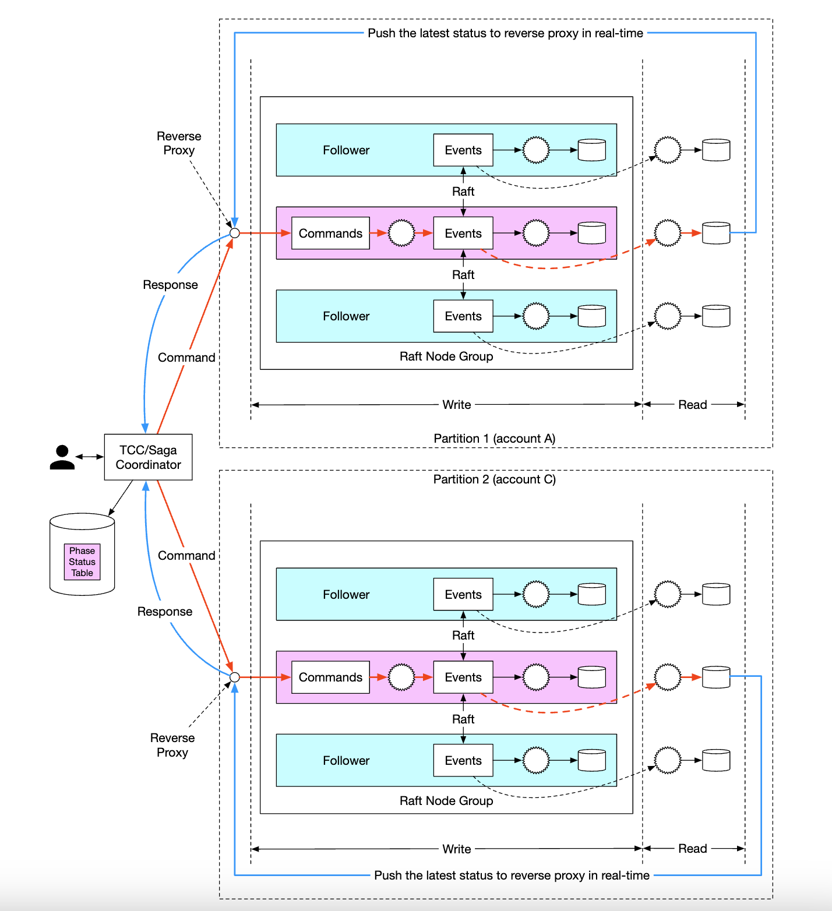

Here's an example lifecycle of a balance transfer request in our final system:
 * User A sends a distributed transaction to the Saga coordinator with two operations - `A-1` and `C+1`.
 * Saga coordinator creates a record in the phase status table to trace the status of the transaction
 * Coordinator determines which partitions it needs to send commands to.
 * Partition 1's raft leader receives the `A-1` command, validates it, converts it to an event and replicates it across other nodes in the raft group
 * Event result is synchronized to the read state machine, which pushes a response back to the coordinator
 * Coordinator creates a record indicating that the operation was successful and proceeds with the next operation - `C+1`
 * Next operation is executed similarly to the first one - partition is determined, command is sent, executed, read state machine pushes back a response
 * Coordinator creates a record indicating operation 2 was also successful and finally informs the client of the result

# Step 4 - Wrap Up
Here's the evolution of our design:
 * We started from a solution using an in-memory Redis. The problem with this approach is that it is not durable storage.
 * We moved on to using relational databases, on top of which we execute distributed transactions using 2PC, TC/C or distributed saga.
 * Next, we introduced event sourcing in order to make all the operations auditable
 * We started by storing the data into external storage using external database and queue, but that's not performant
 * We proceeded to store data in local file storage, leveraging the performance of append-only operations. We also used caching to optimize the read path
 * The previous approach, although performant, wasn't durable. Hence, we introduced Raft consensus with replication to avoid single points of failure
 * We also adopted CQRS with a reverse proxy to manage a transaction's lifecycle on behalf of our users
 * Finally, we partitioned our data across multiple raft groups, which are orchestrated using a distributed transaction mechanism - TC/C or distributed saga
