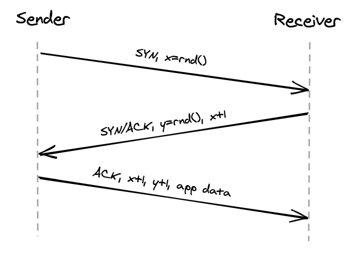
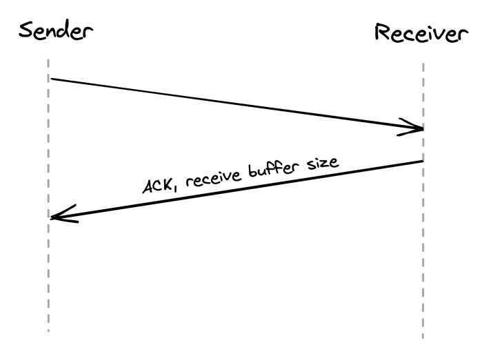
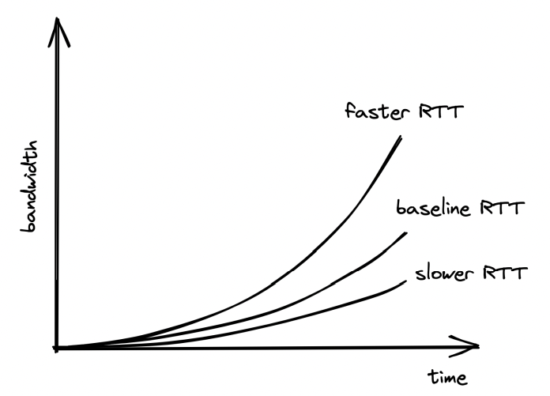
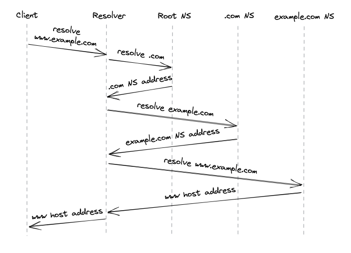

# Communication

## Introduction
In order for processes to communicate, they need to agree on a set of rules which determine how data is transmitted and processed. Network protocols define these rules.

Network protocols are arranged in a stack - every protocol piggybacks on the abstraction provided by the protocol underneath.

Taking a closer look:
 * The link layer provides an interface for operating on the underlying network hardware via eg the Ethernet protocol.
 * The internet layer provides an interface for sending data from one machine to another with a best-effort guarantee - ie data can be lost, corrupted, etc.
 * The transport layer enables transmitting data between processes (different from machines, because you might have N processes on 1 machine). Most important protocol at this layer is TCP - it adds reliability to the IP protocol.
 * The application layer is a high-level protocol, targetted by applications - eg HTTP, DNS, etc.

## Reliable links
Communication between nodes happens by transmitting packages between them. This requires 1) addressing nodes and 2) a mechanism for routing packets across routers.

Addressing is handled by the IP protocol. Routing is handled within the routers' routing tables. Those create a mapping between destination address and the next router along the path.
The responsibility of building & communicating the routing tables is handled by the Border Gateway Protocol (BGP).

IP, however, doesn't guarantee that data sent over the internet will arrive at the destination. TCP, which lies in the transport layer, handles this.
It provides a reliable communication channel on top of an unreliable one (IP). A stream of bytes arrives at the destination without gaps, duplication or corruption.
This protocol also has backoff mechanisms in-place to avoid congesting the transportation network, making it a healthy protocol for the internet.

### Reliability
Achieved by:
 * splitting a stream of bytes into discrete segments, which have sequence numbers and a checksum.
 * Due to this, the receiver can detect holes, duplicates and corrupt segments (due to the checksum).
 * Every segment needs to be acknowledged by the receiver, otherwise, they are re-transmitted.

### Connection lifecycle
With TCP, a connection must be established first. The OS manages the connection state on both sides via sockets.

To establish a connection, TCP uses a three-way-handshake:

The numbers exchanged are the starting sequence numbers for upcoming data packets on both sides of the connection.

This connection setup step is an overhead in starting the communication. It is mainly driven by the round-trip time. To make it fast, put servers as close as possible to clients.
There is also some tear down time spent when closing a connection.

Finally, once a connection is closed, the socket is not released immediately. It has some teardown time as well.
Due to this, constantly opening and closing connections can quickly drain your available sockets.

This is typically mitigated by:
 * Leveraging connection pools
 * Not closing a TCP connection between subsequent request/response pairs

### Flow Control
Flow control is a back-off mechanism which TCP implements to prevent the sender from overflowing the receiver.

Received segments are stored in a buffer, while waiting for the process to read them:

The receive buffer size is also communicated back to the sender, who uses it to determine when to back-off:

This mechanism is similar to rate limiting, but at the connection level.

### Congestion control
TCP protects not only the receiver, but the underlying network as well.

An option called `congestion window` is used, which specifies the total number of packets which can be in-flight (sent but not ack).

The smaller the congestion window, the less bandwidth is utilized.

When a connection starts, the congestion window is first set to a system default and it slowly adjusts based on the feedback from the underlying network:

Timeouts & missed packets adjusts the congestion window down. Successful transmissions adjust it up.

Effectively, slower round trip times yield larger bandwidths. Hence, favor placing servers close to clients.

### Custom Protocols
TCP delivers reliability and stability at the expense of extra latency and reduced bandwidth.

UDP is an alternative protocol, which doesn't provide TCP's reliability mechanisms. It is used as a canvas for custom protocols to be built on-top which have some of TCP's functionalities but not all.

Games are one example where using TCP is an overhead. 
If a client misses a single game frame sent from the server, TCP would attempt to retransmit it. 

However, for games that is unnecessary because the game state would have already progressed once the packet gets retransmitted.

## Secure links
We can now transmit bytes over the network, but they're transmitted in plain-text. We can use TLS to secure the communication.

TLS provides encryption, authentication and integrity for application-layer protocols (eg HTTP).

### Encryption
Encryption guarantees that transmitted data can only be read by sender and receiver. To everyone else, the data is obfuscated.

When a TLS connection is first opened, the sender and receiver negotiate a shared encryption secret using asymmetric encryption.

The shared secret, which was exchanged, is then used for secure communication between the client and server using symmetric encryption.
Periodically, the shared secret key is renegotiated to mitigate the risk of someone decrypting the shared secret during the on-going exchange.

### Authentication
So far, we've managed to encrypt the data exchange, but we haven't established a way for clients to authenticate who the server is and vice versa.

This is achieved via digital signatures and certificates:
 * Digital signature - a server signs some data \w their private key. Client can verify data is indeed created by server by taking the signature and the server's public key.
 * Certificate - a document, which include details about the server (eg name, business, address, etc.).

The client uses the certificate, which the server provides to verify that the server is who they say they are.
However, how can the client verify that the public key they received indeed belongs to eg google.com?

This is done by having the client cross-check a server's certificate with a certificate authority.

Certificates include a server's info, certificate authority info, public key and it is signed by a certificate authority's private key.

If a user has the CA's public key, they use it to check that the certificate is valid. 
Otherwise, they get the CA's certificate, which is signed by another, higher level, certificate authority.
This process repeats until the client finds a certificate signed by a CA they know (ie have their public key). 
By default, browsers have a list of well-known and trusted certificate authorities.

The chain of certificates always ends with a root CA, who self-signs their certificate and is well-known and trusted.

**Note:** servers don't just send their certificate back to the client. They send the whole certificate chain to avoid additional network calls.

One of the most common mistakes made when using TLS is to let a certificate expire. That prevents clients from connecting to your server via TLS.
This is why, automation is important to prevent this from happening.

### Integrity
Encryption prevents middleman from reading transmitted data, while authentication enables us to verify the identity of the server.

However, what's stopping a middleman from tampering the transmitted data?

Eg, one could intercept a message, switch a few bytes and the server/client will decode an entirely different message.
How can they know if this is the actual message sent by the other side or if there is someone who's tampered it?

That's where secure hash functions and in particular HMACs come into play.

Every message is hashed \w this function and the hash is included in the message's payload. 
The client/server can then verify that the message has not been tampered via the formula hash(message.payload) == message.hash.

In addition to tampering, this process also allows us to detect data corruption. 

Typically, we can rely on TCP to prevent data corruptions via its checksum, but that mechanism [has a flaw](https://dl.acm.org/doi/10.1145/347057.347561) where once every ~16GB-1TB, a data corruption issue is not detected.

### Handshake
When a new TLS connection is opened, a handshake occurs which exchanges the variables used throughout the connection for achieving any of the purposes mentioned so far - encryption, authentication, integrity.

During this handshake, the following events occur:
 * Parties agree on a cipher suite - what encryption algorithms are they going to use:
    * key-exchange algorithm - used to generate the shared secret
    * signature algorithm - used to sign/verify digital signatures
    * symmetric encryption algorithm - used to encrypt communication
    * HMAC algorithm - used to verify message integrity
 * Parties use the key-exchange algorithm to generate the shared secret, used afterwards for symmetric encryption
 * Client verifies the certificate provided by the server. Optionally, the server can also verify the client's certificate if one is present (and server is configured to verify it).
    * Client certificates come into play when eg your server has a fixed, well-known set of clients which are allowed to interact with it

The operations don't necessarily happen in this order as there are some optimizations which come into play in recent TLS versions.

The bottom line, though, is that instantiating a TLS connection is not free. Hence, put servers close to clients & reuse connections when possible.

## Discovery
How do we find out what's the IP address of the server we want to connect to?

DNS to the rescue - distributed, hierarchical, eventually consistent key-value store of hostname -> ip address

How does it work?
 * You enter www.example.com into your browser
 * If the hostname you're looking for is in the browser's cache, it returns it
 * Otherwise, the lookup request is routed to the DNS resolver - a server, maintained by your internet service provider (ISP).
 * The DNS resolver checks its cache & returns the address if found. If not, lookup request is routed to the root name server (root NS).
 * Root NS maps top-level domain (TLD), eg `.com`, to the NS server responsible for it.
 * DNS resolver sends request to TLD NS server for `example.com`. NS Server returns the authoritative NS server for `example.com`
 * DNS resolver sends request to the `example.com` NS server which returns the IP address for `www.example.com`

In reality, a lot of caching is involved at each step, enabling us to avoid all the round trips, as domain names rarely change.
Caches refresh the domain names based on a time-to-live value (TTL) which every domain name has.

Specifying the TTL is a trade-off:
 * if it's too big & you make a domain name change, some clients will take longer to update. 
 * Make it too small & average request time will increase.

The original DNS protocol sent plain-text messages over UDP for efficiency, but nowadays, [DNS over TLS (using TCP)](https://en.wikipedia.org/wiki/DNS_over_TLS) is used for security purposes.

One interesting observation is that a DNS name server can be a single point of failure & lead to outages. 
A smart mitigation is to let resolvers serve stale entries vs. returning an error in case the name server is down.

The property of a system to continue to function even when a dependency is down is referred to as "static stability".

## APIs

