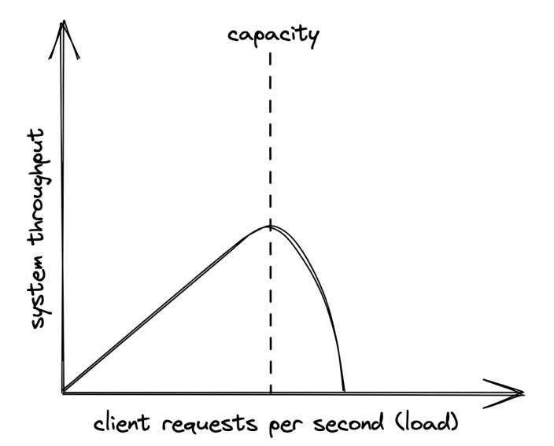

# Introduction

- [Preface](#preface)
- [Communication](#communication)
- [Coordination](#coordination)
- [Scalability](#scalability)
- [Resiliency](#resiliency)
- [Maintainability](#maintainability)
- [Anatomy of a distributed system](#anatomy-of-a-distributed-system)

## Preface
Most materials on distributed systems are either too theoretical or too practical. This book aims at the middle.
If you're already an expert, this book is not for you. It focuses on breadth rather than depth.

Distributed system == group of nodes, communicating over some channel to accomplish a task. Nodes can be a computer, phone, browser, etc.

Why bother building such a system?
 * Some apps are inherently distributed - eg the web.
 * To achieve high availability - if one node fails, the system doesn't crash.
 * To tackle data-intensive workloads which can't fit on a single machine.
 * Performance requirements - eg Netflix streams HQ tv thanks to serving you from a datacenter close to you.

The book focuses on tackling the fundamental problems one faces when designing a distributed system.

## Communication
First challenge is for nodes to communicate with each other over the network:
 * How are request/response messages represented on the wire?
 * What happens when there is a temporary network outage?
 * How to avoid man in the middle attacks?

In practice, a nice network library can abstract away those details, but oftentimes abstractions leak and you need to know how the networks work under the hood.

## Coordination
Some form of coordination is required to make two nodes work together.

Good metaphor - the [two generals problem](https://en.wikipedia.org/wiki/Two_Generals%27_Problem).

Two generals need to agree on a time to make a joint attack on a city. All messages between them can be intercepted & dropped.
How to ensure they attack the city at the same time, despite the faulty communication medium?

## Scalability
How efficiently can the application handle load. Ways to measure it depends on the app's use-case - number of users, number of reads/writes, RPS, etc.

For the type of applications covered in the book, load is measured in:
 * Throughput - number of requests per second (RPS) the application can process.
 * Response time - time elapsed in seconds between sending a request and receiving a response.

When the application reaches a certain threshold in terms of load, throughput starts degrading:


The capacity depends on a system's architecture, implementation, physical limitations (eg CPU, Memory, etc).

An easy way to fix this is to buy more expensive hardware - scaling up. This scaling mechanism has a limit, though, since you can't scale hardware without bounds.

The alternative is to scale horizontally by adding more machines which work together.

## Resiliency
A distributed system is resilient when it doesn't crash even in the face of failures.

Failures which are left unchecked can impact the system's availability - the % of time the system is available for use.
```
availability = uptime / total time.
```

Availability is often expressed in terms of nines:


Three nines is considered acceptable for users, anything above four nines is considered highly available.

There are various techniques one can use to increase availability. All of them try to mitigate failures when they inevitably come up - fault isolation, self-healing mechanisms, redundancy, etc.

## Maintainability
Most of the cost of software is spent maintaining it - fixing bugs, adding new features, operating it.

We should aspire to make our systems easy to maintain - easy to extend, modify and operate.

One critical aspect is for a system to be well-tested - unit, integration & e2e tests.
Another one is for operators to have the necessary tools to monitor a system's health & making quick changes - feature flags, rollback mechanisms, etc.

Historically, developers, testers & operators were different teams, but nowadays, it tends to be the same team.

## Anatomy of a distributed system
Main focus of the book is on backend distributed systems that run on commodity machines.

From a hardware perspective, a distributed system is a set of machines communicating over network links.
From a runtime perspective, it's a set of processes which communicate via inter-process communication (IPC), eg HTTP.
From an implementation perspective, it's a set of loosely-coupled components which communicate via APIs.

All are valid points of view on the system & the book will switch between them based on context.

A service implements one specific part of the overall system's capabilities. At its core sit the business logic.

At the sides, there are interfaces which define functionalities provided by external systems (eg database, another service in the system, etc).
The interfaces are implemented by adapters which implement the technical details of connecting to the external systems.

This architectural pattern is known as [ports and adapters](http://wiki.c2.com/?PortsAndAdaptersArchitecture)

This architectural style accomplishes a setup in which the business logic don't depend on the technical details. Instead, technical details depend on business logic - dependency inversion:

