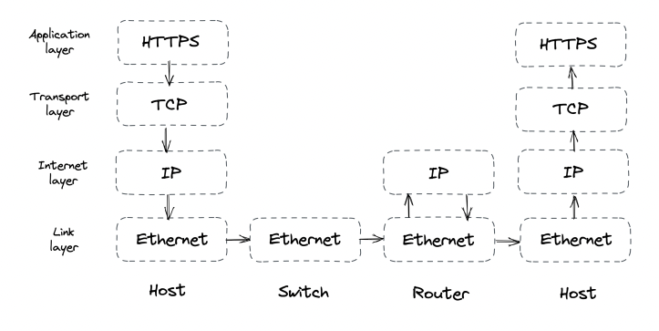
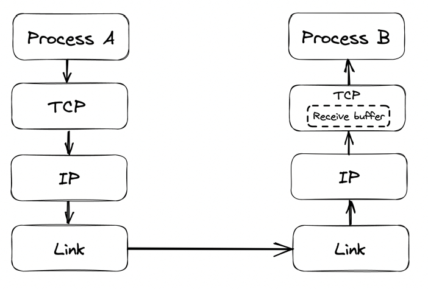
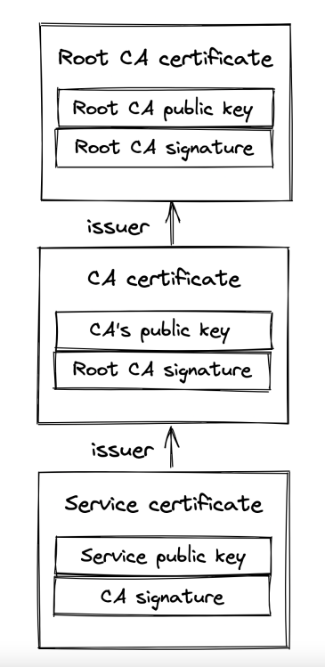

# Communication

- [Introduction](#introduction)
- [Reliable links](#reliable-links)
- [Secure links](#secure-links)
- [Discovery](#discovery)
- [APIs](#apis)

# Introduction
In order for processes to communicate, they need to agree on a set of rules which determine how data is transmitted and processed. Network protocols define these rules.

Network protocols are arranged in a stack - every protocol piggybacks on the abstraction provided by the protocol underneath.


Taking a closer look:
 * The link layer provides an interface for operating on the underlying network hardware via eg the Ethernet protocol.
 * The internet layer provides an interface for sending data from one machine to another with a best-effort guarantee - ie data can be lost, corrupted, etc.
 * The transport layer enables transmitting data between processes (different from machines, because you might have N processes on 1 machine). Most important protocol at this layer is TCP - it adds reliability to the IP protocol.
 * The application layer is a high-level protocol, targetted by applications - eg HTTP, DNS, etc.

# Reliable links
Communication between nodes happens by transmitting packages between them. This requires 1) addressing nodes and 2) a mechanism for routing packets across routers.

Addressing is handled by the IP protocol. Routing is handled within the routers' routing tables. Those create a mapping between destination address and the next router along the path.
The responsibility of building & communicating the routing tables is handled by the Border Gateway Protocol (BGP).

IP, however, doesn't guarantee that data sent over the internet will arrive at the destination. TCP, which lies in the transport layer, handles this.
It provides a reliable communication channel on top of an unreliable one (IP). A stream of bytes arrives at the destination without gaps, duplication or corruption.
This protocol also has backoff mechanisms in-place to avoid congesting the transportation network, making it a healthy protocol for the internet.

## Reliability
Achieved by:
 * splitting a stream of bytes into discrete segments, which have sequence numbers and a checksum.
 * Due to this, the receiver can detect holes, duplicates and corrupt segments (due to the checksum).
 * Every segment needs to be acknowledged by the receiver, otherwise, they are re-transmitted.

## Connection lifecycle
With TCP, a connection must be established first. The OS manages the connection state on both sides via sockets.

To establish a connection, TCP uses a three-way-handshake:


The numbers exchanged are the starting sequence numbers for upcoming data packets on both sides of the connection.

This connection setup step is an overhead in starting the communication. It is mainly driven by the round-trip time. To make it fast, put servers as close as possible to clients.
There is also some tear down time spent when closing a connection.

Finally, once a connection is closed, the socket is not released immediately. It has some teardown time as well.
Due to this, constantly opening and closing connections can quickly drain your available sockets.

This is typically mitigated by:
 * Leveraging connection pools
 * Not closing a TCP connection between subsequent request/response pairs

## Flow Control
Flow control is a back-off mechanism which TCP implements to prevent the sender from overflowing the receiver.

Received segments are stored in a buffer, while waiting for the process to read them:


The receive buffer size is also communicated back to the sender, who uses it to determine when to back-off:


This mechanism is similar to rate limiting, but at the connection level.

## Congestion control
TCP protects not only the receiver, but the underlying network as well.

An option called `congestion window` is used, which specifies the total number of packets which can be in-flight (sent but not ack).

The smaller the congestion window, the less bandwidth is utilized.

When a connection starts, the congestion window is first set to a system default and it slowly adjusts based on the feedback from the underlying network:


Timeouts & missed packets adjusts the congestion window down. Successful transmissions adjust it up.

Effectively, slower round trip times yield larger bandwidths. Hence, favor placing servers close to clients.

## Custom Protocols
TCP delivers reliability and stability at the expense of extra latency and reduced bandwidth.

UDP is an alternative protocol, which doesn't provide TCP's reliability mechanisms. It is used as a canvas for custom protocols to be built on-top which have some of TCP's functionalities but not all.

Games are one example where using TCP is an overhead. 
If a client misses a single game frame sent from the server, TCP would attempt to retransmit it. 

However, for games that is unnecessary because the game state would have already progressed once the packet gets retransmitted.

# Secure links
We can now transmit bytes over the network, but they're transmitted in plain-text. We can use TLS to secure the communication.

TLS provides encryption, authentication and integrity for application-layer protocols (eg HTTP).

## Encryption
Encryption guarantees that transmitted data can only be read by sender and receiver. To everyone else, the data is obfuscated.

When a TLS connection is first opened, the sender and receiver negotiate a shared encryption secret using asymmetric encryption.

The shared secret, which was exchanged, is then used for secure communication between the client and server using symmetric encryption.
Periodically, the shared secret key is renegotiated to mitigate the risk of someone decrypting the shared secret during the on-going exchange.

## Authentication
So far, we've managed to encrypt the data exchange, but we haven't established a way for clients to authenticate who the server is and vice versa.

This is achieved via digital signatures and certificates:
 * Digital signature - a server signs some data \w their private key. Client can verify data is indeed created by server by taking the signature and the server's public key.
 * Certificate - a document, which include details about the server (eg name, business, address, etc.).

The client uses the certificate, which the server provides to verify that the server is who they say they are.
However, how can the client verify that the public key they received indeed belongs to eg google.com?

This is done by having the client cross-check a server's certificate with a certificate authority.

Certificates include a server's info, certificate authority info, public key and it is signed by a certificate authority's private key.

If a user has the CA's public key, they use it to check that the certificate is valid. 
Otherwise, they get the CA's certificate, which is signed by another, higher level, certificate authority.
This process repeats until the client finds a certificate signed by a CA they know (ie have their public key). 
By default, browsers have a list of well-known and trusted certificate authorities.

The chain of certificates always ends with a root CA, who self-signs their certificate and is well-known and trusted.


**Note:** servers don't just send their certificate back to the client. They send the whole certificate chain to avoid additional network calls.

One of the most common mistakes made when using TLS is to let a certificate expire. That prevents clients from connecting to your server via TLS.
This is why, automation is important to prevent this from happening.

## Integrity
Encryption prevents middleman from reading transmitted data, while authentication enables us to verify the identity of the server.

However, what's stopping a middleman from tampering the transmitted data?

Eg, one could intercept a message, switch a few bytes and the server/client will decode an entirely different message.
How can they know if this is the actual message sent by the other side or if there is someone who's tampered it?

That's where secure hash functions and in particular HMACs come into play.

Every message is hashed \w this function and the hash is included in the message's payload. 
The client/server can then verify that the message has not been tampered via the formula hash(message.payload) == message.hash.

In addition to tampering, this process also allows us to detect data corruption. 

Typically, we can rely on TCP to prevent data corruptions via its checksum, but that mechanism [has a flaw](https://dl.acm.org/doi/10.1145/347057.347561) where once every ~16GB-1TB, a data corruption issue is not detected.

## Handshake
When a new TLS connection is opened, a handshake occurs which exchanges the variables used throughout the connection for achieving any of the purposes mentioned so far - encryption, authentication, integrity.

During this handshake, the following events occur:
 * Parties agree on a cipher suite - what encryption algorithms are they going to use:
    * key-exchange algorithm - used to generate the shared secret
    * signature algorithm - used to sign/verify digital signatures
    * symmetric encryption algorithm - used to encrypt communication
    * HMAC algorithm - used to verify message integrity
 * Parties use the key-exchange algorithm to generate the shared secret, used afterwards for symmetric encryption
 * Client verifies the certificate provided by the server. Optionally, the server can also verify the client's certificate if one is present (and server is configured to verify it).
    * Client certificates come into play when eg your server has a fixed, well-known set of clients which are allowed to interact with it

The operations don't necessarily happen in this order as there are some optimizations which come into play in recent TLS versions.

The bottom line, though, is that instantiating a TLS connection is not free. Hence, put servers close to clients & reuse connections when possible.

# Discovery
How do we find out what's the IP address of the server we want to connect to?

DNS to the rescue - distributed, hierarchical, eventually consistent key-value store of hostname -> ip address

How does it work?
 * You enter www.example.com into your browser
 * If the hostname you're looking for is in the browser's cache, it returns it
 * Otherwise, the lookup request is routed to the DNS resolver - a server, maintained by your internet service provider (ISP).
 * The DNS resolver checks its cache & returns the address if found. If not, lookup request is routed to the root name server (root NS).
 * Root NS maps top-level domain (TLD), eg `.com`, to the NS server responsible for it.
 * DNS resolver sends request to TLD NS server for `example.com`. NS Server returns the authoritative NS server for `example.com`
 * DNS resolver sends request to the `example.com` NS server which returns the IP address for `www.example.com`


In reality, a lot of caching is involved at each step, enabling us to avoid all the round trips, as domain names rarely change.
Caches refresh the domain names based on a time-to-live value (TTL) which every domain name has.

Specifying the TTL is a trade-off:
 * if it's too big & you make a domain name change, some clients will take longer to update. 
 * Make it too small & average request time will increase.

The original DNS protocol sent plain-text messages over UDP for efficiency, but nowadays, [DNS over TLS (using TCP)](https://en.wikipedia.org/wiki/DNS_over_TLS) is used for security purposes.

One interesting observation is that a DNS name server can be a single point of failure & lead to outages. 
A smart mitigation is to let resolvers serve stale entries vs. returning an error in case the name server is down.

The property of a system to continue to function even when a dependency is down is referred to as "static stability".

# APIs
When a client makes a call to a server via their hostname + port, that calls goes through an adapter which maps the request to interface calls within the server, invoking its business logic.

Communication can be direct or indirect:
 * Direct - both processes are up and running & communicate in real-time.
 * Indirect - communication is achieved via a broker. One process might be down & receive the message at a later time, asynchronously.

This chapter focuses on direct communication. Indirect comms is covered later in the book.
In particular, the chapter focuses on the request-response communication style.

In this style, clients send messages to the server & the server responds back, similar to function calls in a codebase, but across process & network boundaries.

The data format is language agnostic. The format specifies the (de)serialization speed, whether it's human readable & how hard it is to evolve over time.

Popular data formats:
 * JSON - textual, human-readable format at the expense of larger data packets & parsing overhead.
 * Protocol buffers - binary, efficient format, which has smaller payloads than JSON, but is not human-readable

When a client sends a request to the server, it can either block & wait for response or run the request in a thread & invoke a callback when the response is received.
The former approach is synchronous, latter is asynchronous. For most use-cases, favor asynchronous communication to avoid blocking the UI.

Common IPC technologies for request-response interactions:
 * HTTP - slower but more adopted
 * gRPC - faster, but not supported by all browsers

Typically, server to server communication is implemented via gRPC, client to server is via HTTP.

A popular set of design principles for designing elegant HTTP APIs is REST.

These principles include:
 * requests are stateless - each request contains all the necessary information required to process it.
 * responses are implicitly or explicitly labeled as cacheable, allowing clients to cache them for subsequent requests.

## HTTP
HTTP is a request-response protocol for client to server communication.


In HTTP 1.1, a message is text-based \w three parts - start line, headers, optional body:
 * Start line - In requests, indicates what the request is for, in responses, indicates if request were successful or not
 * Headers - key-value pairs with metadata about the message
 * Body - container for data

HTTP is a stateless protocol, hence, all client info needs to be specified within the requests. 
Servers treat requests as independent, unless there is extra data, indicating what client they're associated with.

HTTP uses TCP for the reliability guarantees and TLS for the security ones. When using TLS, it is referred to as HTTPS.

HTTP 1.1 keeps a connection to a server open between requests to avoid the TCP overhead of re-opening connections.
However, it has a limitation that subsequent requests need to wait before the server sends a response back. 

This is troublesome when eg loading a dozen of images on a page - something which can easily be done in parallel.

Browsers typically work around this by making multiple connections to the server for fetching independent resources.
The price for this workaround is using more memory & sockets.

HTTP 2 was designed to address the limitations of HTTP 1.1 - it uses a binary protocol vs. a textual one. 
This allows multiplexing multiple concurrent request-response transactions on the same connection.

In early 2020, half of the most visited websites used HTTP 2.

HTTP 3 is the latest iteration, which is based on UDP and implements its own reliability mechanisms to address some of TCP's shortcomings.
For example, losing a packet with HTTP 2 blocks all subsequent packages, including ones on unrelated streams, due to how TCP works. 

With HTTP 3, a package loss only blocks the affected stream, not all of them.

Examples in the book use HTTP 1.1 due to its human-readability.

## Resources
Example server application we're building - product catalog management for an e-commerce site.
Customers can browse the catalog, administrators can create, update or delete products.

We'll build this via an HTTP API. HTTP APIs host resources, which can be physical (eg image) or abstract (eg product) entities on which we can execute create/read/update/delete (CRUD) operations.

A URL identifies a resource by describing its location on the server, eg `https://www.example.com/products?sort=price` :
 * `http` is the protocol
 * `www.example.com` is the hostname
 * `products` is the name of the resource
 * `?sort=price` is the query string, which contains additional parameters about how to fetch the results.

A URL can also model relationships between resources, eg:
 * `/products/42` - the product with ID 42
 * `/products/42/reviews` - the reviews of product with ID 42

We also need to deal with how the resource data is serialized. 
That is specified by the client via the `Content-type` header, most popular one being `application/json`.

Example JSON-serialized product:
```json
{
   "id": 42,
   "category": "Laptop",
   "price": 999
}
```

## Request methods
URLs designate what resource you're targeting. HTTP methods define what operation you're performing on the resource.

Most commonly used operations \w example `product` entity:
 * `POST /products` - Create a new product
 * `GET /products`  - List all products. Usually includes query parameters to apply filters on the result set.
 * `GET /products/42` - Get a particular product
 * `PUT /products/42` - Update a product
 * `DELETE /products/42` - Delete a product

Request methods are categorized based on whether they are safe and idempotent:
 * Safe - don't have visible side-effects, hence, can safely be cached.
 * Idempotent - can be executed multiple times and the end result should be the same as if it was executed once. This property is crucial for APIs (covered later).

Table of methods & safe/idempotent properties:
 * POST - not safe & not idempotent
 * GET - safe & idempotent
 * PUT - not safe & idempotent
 * DELETE - not safe & idempotent

## Response status codes
Responses contain a status code, which indicates whether the request is successful or not:
 * 200-299 - indicate success, eg 200 OK
 * 300-399 - used for redirection, eg 301 Moved Permanently indicates the resource is moved to a different URL. The new URL is specified in the `Location` header.
 * 400-499 - client errors
   * 400 Bad Request - when eg input format is wrong
   * 401 Unauthorized - when eg password on login is wrong)
   * 403 Forbidden - when eg you don't have access to resource
   * 404 Not Found - when eg the specified resource doesn't exist
 * 500-599 - server errors, when eg the database is down & you can't process the request. These requests can typically be retried.
   * 500 Internal Server Error - server encountered unexpected error, due to which request can't be handled
   * 502 Bad Gateway - server, while acting as proxy, received a downstream server error
   * 503 Service Unavailable - server is unavailable due to eg a temporary heavy load on it.

## OpenAPI
The server's API can be defined via an Interface Definition Language (IDL) - a language-agnostic format, which specifies what the API contains.

This can be used for generating the server's adapter & the client's library for interacting with the server.

The OpenAPI specification evolved from the Swagger project and is the most popular IDL for RESTful APIs.
It can formally describe an API via YAML format including available endpoints, supported request methods, status codes, schema of the entities.

Example OpenAPI definition:
```yaml
openapi: 3.0.0
info:
   version: "1.0.0"
   title: Catalog Service API

paths:
   /products:
      get:
         summary: List products
         parameters:
            - in: query
              name: sort
              required: false
              schema:
                 type: string
         responses:
            "200":
               description: list of products in catalog
               content:
                  application/json:
                     schema:
                        type: array
                        items:
                           $ref: "#/components/schemas/ProductItem"
            "400":
               description: bad input

components:
   schemas:
      ProductItem:
         type: object
         required:
            - id
            - name
            - category
         properties:
            id:
               type: number
            name:
               type: string
            category:
               type: string
```

This can be then used to generate an API's documentation, boilerplate adapters and client SDKs.

## Evolution
An API starts out as a well-designed interface but it would eventually need to change due to change in requirements.

The last thing we need is to change the API & introduce a breaking change. 
This means that existing client software will stop working properly with the API after the change.
Hence, we'll need to modify every single client of the API. Some of them, we might not have access to.

Two types of breaking changes:
 * at the endpoint level - eg changing `/products` to `/new-products` or making an optional query parameter required.
 * at the schema level - eg changing the type of the `category` property from `string` to `int`

To tackle this, REST APIs should be versioned (eg `/v1/products`). As a general rule of thumb, though, REST APIs should evolve in a backwards compatible manner.

Backwards compatible APIs are usually not elegant, but they're practical.

## Idempotency
If an API request times out without knowing the result, a sensible way to tackle this on the client side is to retry the request (one or more times).

Idempotent HTTP requests are susceptible to this technique as executing multiple identical requests yields the same result as executing it once.

Non-idempotent requests, on the other hand, can't be retried so easily, because they can result in a bad state such as eg creating the same product twice.

To mitigate this, some effort can be done on the server-side to eg make POST requests idempotent. 

A technique to achieve this is to associate a request with an idempotency key. A key used to detect if this request has already been executed.
This can be achieved by eg having an `Idempotency-Key` header (similar to Stripe's API), which is a UUID, generated by the client.

When a server received such a key, it first checks if there is such a key in the DB. If not, execute the request. If there is one, return the already executed response.

These keys can be cleaned up from the database after a while. In other words, they can have a TTL.

One consideration when executing this is to make the act of 1) storing the idempotency key and 2) executing the request an atomic operation.
Otherwise, the server can crash right after storing the idempotency key. Hence, after restart, server thinks that product is already created, but it is not.

This is easy to achieve if we're using an ACID database, which has transaction guarantees. It is a lot more challenging if we need to also change the state of an external system during the transaction.

An interesting edge-case:
 * Client A attempts to create a resource, request fails but resource is created
 * Client B deletes the resource
 * Client A attempts to create the resource again

What should the response be? - [less surprising behavior](https://aws.amazon.com/builders-library/making-retries-safe-with-idempotent-APIs/) is to return success.

In summary, idempotent APIs enable more robust clients, since they can always retry failures without worrying about consequences.
