# Coordination

- [System Models](#system-models)
- [Failure Detection](#failure-detection)
- [Time](#time)
- [Leader Election](#leader-election)
- [Replication](#replication)
- [Coordination avoidance](#coordination-avoidance)
- [Transactions](#transactions)
- [Asynchronous transactions](#asynchronous-transactions)
- [Summary](#summary)

So far, focus is on making nodes communicate. Focus now is to make nodes coordinate as if they're a single coherent system.

# System Models
To reason about distributed systems, we must strictly define what can and cannot happen.

A system model is a set of assumptions about the behavior of processes, communication links and timing while abstracting away the complexities of the technology being used.

Some common models for communication links:
 * fair-loss link - messages may be lost and duplicated, but if sender keeps retransmitting messages, they will eventually be delivered.
 * reliable link - messages are delivered exactly once without loss or duplication. Reliable links can be implemented on top of fair-loss links by deduplicating messages at receiving end.
 * authenticated reliable link - same as reliable link but also assumes the receiver can authenticate the sender.

Although these models are abstractions of real communication links, they are useful to verify the correctness of algorithms.

We can also model process behavior based on the types of failures we can expect:
 * arbitrary-fault model - aka "Byzantine" model, the process can deviate from algorithm in unexpected ways, leading to crashes due to bugs or malicious activity.
 * crash-recovery model - process doesn't deviate from algorithm, but can crash and restart at any time, losing its in-memory state.
 * crash-stop model - process doesn't deviate from algorithm, it can crash and when it does, it doesn't come back online. Used to model unrecoverable hardware faults.

The arbitrary-fault model is used to describe systems which are safety-criticla or not in full control of all the processes - airplanes, nuclear power plants, the bitcoin digital currency.

This model is out of scope for the book. Algorithms presented mainly focus on the crash-recovery model.

Finally, we can model timing assumptions:
 * synchronous model - sending a message or executing an operation never takes more than a certain amount of time. Not realistic for the kinds of systems we're interested in.
    * Sending messages over the network can take an indefinite amount of time. Processes can also be slowed down by garbage collection cycles.
 * asynchronous model - sending a message or executing an operation can take an indefinite amount of time.
 * partially synchronous model - system behaves synchronously most of the time. Typically representative enough of real-world systems.

Throughout the book, we'll assume a system model with fair-loss links, crash-recovery processes and partial synchrony.

# Failure Detection
When a client sends a request to a server & doesn't get a reply back, what's wrong with the server?

One can't tell, it might be:
 * server is very slow
 * it crashed
 * there's a network issue

Worst case, client will wait forever until they get a response back. Possible mitigation is to setup timeout, back-off and retry.
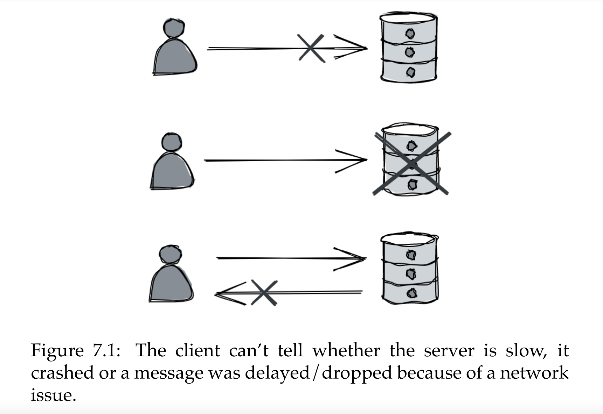

However, a client need not wait until they have to send a message to figure out that the server is down. They can maintain a list of available processes which they ping or heartbeat to figure out if they're alive:
 * ping - periodic request from client to server to check if process is available.
 * heartbeat - periodic request from server to client to indicate that server is still alive.

Pings and heartbeats are used in situations where processes communicate with each other frequently, eg within a microservice deployment.

# Time
Time is critical in distributed systems:
 * On the network layer for DNS TTL records
 * For failure detection via timeouts
 * For determining ordering of events in a distributed system
 
The last use-case is one we're to tackle in the chapter. 

The challenge with that is that in distributed systems, there is no single global clock all services agree on unlike a single-threaded application where events happen sequentially.

We'll be exploring a family of clocks which work out the order of operations in a distributed system.

## Physical Clocks
Processes have access to a physical wall-time clock. Every machine has one. The most common one is based on a vibrating quartz crystal, which is cheap but not insanely accurate.

Because quartz clocks are not accurate, they need to be occasionally synced with servers with high-accuracy clocks.

These kinds of servers are equipped with atomic clocks, which are based on quantum mechanics. They are accurate up to 1s in 3 mil years.

Most common protocol for time synchronization is the Network Time Protocol (NTP).

Clients synchronize their clock via this protocol, which also factors in the network latency. The problem with this approach is that the clock can go back in time on the origin machine.

This can lead to a situation where operation A which happens after operation B has a smaller timestamp.

An alternative is to use a clock, provided by most OS-es - monotonic clock. It's a forward-only moving clock which measures time elapsed since a given event (eg boot up).

This is useful for measuring time elapsed between timestamps on the same machine, but not for timestamps across multiple ones.

## Logical Clocks
Logical clocks measure passing of time in terms of logical operations, not wall-clock time.

Example - counter, incremented on each operation. This works fine on single machines, but what if there are multiple machines.

A Lamport clock is an enhanced version where each message sent across machines includes the logical clock's counter. Receiving machines take into consideration the counter of the message they receive.

Subsequent operations are timestamped with a counter bigger than the one they received.
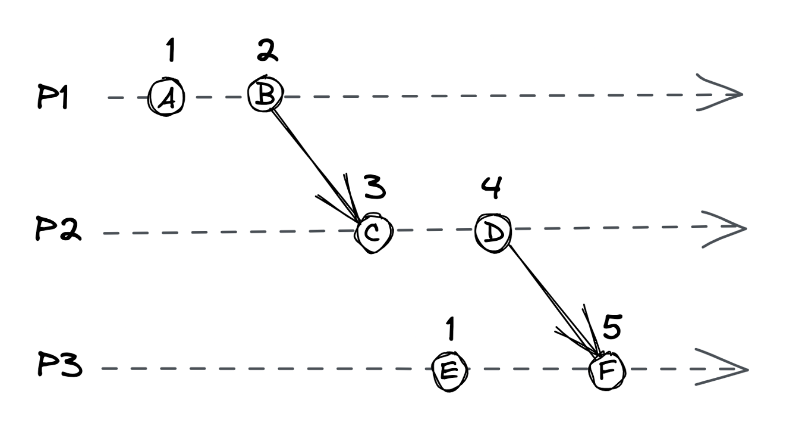

With this approach, dependent operations will have different timestamps, but unrelated ones can have identical ones.

To break ties, the process ID can be included as a second ordering factor.

Regardless of this, logical clocks don't imply a causal relationship. It is possible for event A to happen before B even if B's timestamp is greater.

## Vector Clocks
Vector clocks are logical clocks with the additional property of guaranteeing that event A happened before event B if A's timestamp is smaller than B.

Vector clocks have an array of counters, one for each process in the system:
 * Counters start from 0
 * When an operation occurs, the process increments its process' counter by 1
 * Sending a message increments the process' counter by 1. The array is included in the message
 * Receiving process merges the received array with its local one by taking the max for each element.
   * Finally, its process counter is incremented by 1 

This guarantees that event A happened before B if:
 * Every counter in A is `less than or equal` every counter in B
 * At least one counter in A is `less than` corresponding counter in B 

If neither A happened before B nor B happened before A, the operations are considered concurrent
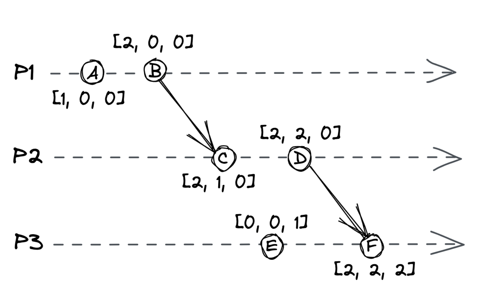

In the above example:
 * B happened before C
 * E and C are concurrent

A downside of vector clocks is that storage requirements grow with every new process.
Other types of logical clocks, like [dotted version clocks](https://queue.acm.org/detail.cfm?id=2917756) solve this issue.

## Summary
Using physical clocks for timestamp is good enough for some records such as logs.

However, when you need to derive the order of events across different processes, you'll need vector clocks.

# Leader Election
There are use-cases where 1 among N processes needs to gain exclusive rights to accessing a shared resource or to assign work to others.

To achieve this, one needs to implement a leader-election algorithm - to elect a single process to be a leader among a group of equally valid candidates.

There are two properties this algorithm needs to sustain:
 * Safety - there will always be one leader elected at a time.
 * Liveness - the process will work correctly even in the presence of failures.

This chapter explores a particular leader-election algorithm - Raft, and how it guarantees these properties.

## Raft leader election
Every process is a state machine with one of three states:
 * follower state - process recognizes another process as a leader
 * candidate state - process starts a new election, proposing itself as a leader
 * leader state - process is the leader

Time is divided into election terms, numbered with consecutive integers (logical timestamp).
A term begins with a new election - one or more candidates attempt to become the leader.

When system starts up, processes begin their journey as followers. 
As a follower, the process expects a periodic heartbeat from the leader.
If one does not arrive, a timeout begins ticking after which the process starts a new election & transitions into the candidate state.

In the candidate state, the process sends a request to all other notes, asking them to vote for them as the new leader.

State transition happens when:
 * Candidate wins the election - majority of processes vote for process, hence it wins the election.
 * Another process wins - when a leader heartbeat is received \w election term index `greater than or equal` to current one.
 * No one wins election - due to split vote. Then, after a random timeout (to avoid consecutive split votes), a new election starts.
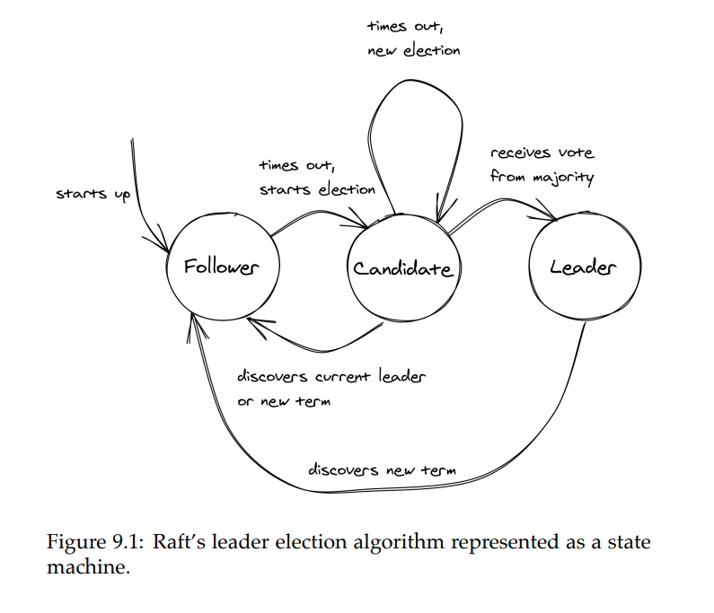

## Practical considerations
There are also other leader election algorithms but Raft is simple & widely used.

In practice, you would rarely implement leader election from scratch, unless you're aiming to avoid external dependencies.

Instead, you can use any fault-tolerant key-value store \w support for TTL and linearizable CAS (compare-and-swap) operations.
This means, in a nutshell, that operations are atomic & there is no possibility for race conditions.

However, there is a possibility for race conditions after you acquire the lease.

It is possible that there is some network issue during which you lose the lease but you still think you're the leader.
This has [lead to big outages in the past](https://ravendb.net/articles/avoid-rolling-your-own-leader-election-algorithm)

As a rule of thumb, leaders should do as little work as possible & we should be prepared to occasionally have more than one leaders.

# Replication
Data replication is fundamental for distributed systems.

One reason for doing that is to increase availability. If data is stored on a single process and it goes down, the data is no longer available.

Another reason is to scale - the more replicas there are, the more clients can be supported concurrently.

The challenge of replication is to keep them consistent with one another in the event of failure.
The chapter will explore Raft's replication algorithm which provides the strongest consistency guarantee - to clients, the data appears to be stored on a single process.

Paxos is a more popular protocol but we're exploring Raft as it's simpler to understand.

Raft is based on state machine replication - leader emits events for state changes & all followers update their state when the event is received.

As long as the followers execute the same sequence of operations as the leader, they will end up with the same state.

Unfortunately, just broadcasting the event is not sufficient in the event of failures, eg network outages.

Example state-machine replication with a distributed key-value store:
 * KV store accepts operations put(k, v) and get(k)
 * State is stored in a dictionary

If every node executes the same sequence of puts, the state is consistent across all of them.

### State machine replication
When system starts up, leader is elected using Raft's leader election algorithm, which was already discussed.

State changes are persisted in an event log which is replicated to followers.
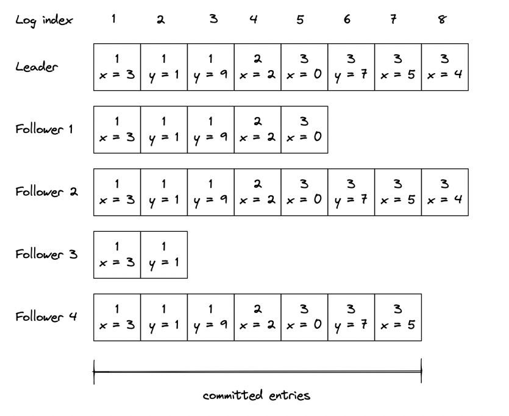

**Note:** The number in the boxes above the operation is the leader election term.

The replication algorithm works as follows:
 * Only the leader can accept state updates
 * When it accepts an update, it is persisted in the local log, but the state is not changed
 * The leader then sends an `AppendEntries` request to all followers \w the new entry. This is also periodically sent for the purposes of heartbeat.
 * When a follower receives the event, it appends it to its local log, but not its state. It then sends an acknowledge message back to leader.
 * Once leader receives enough confirmations to form a quorum (>50% acks from nodes), the state change is persisted to local state.
 * Followers also persist the state change on a subsequent `AppendEntries` request which indicates that the state is changed.

Such a system can tolerate F failures where total nodes = 2F + 1.

What if a failure happens?

If the leader dies, an election occurs. However, what if a follower with less up-to-date log becomes a leader? To avoid this, a node can't vote for another candidate if the candidate's log is less up-to-date.

What if a follower dies & comes back alive afterwards?
 * They will update their log after receiving an `AppendEntries` message from leader. That message also contains the index of the second to last log.
 * If the record is already present in the log, the follower ignores the message.
 * If the record is not present but the second to last log entry is, the new entry is appended.
 * If neither are present, the message is rejected.
 * When the message is rejected, the leader sends the last two messages. If those are also rejected, the last three are sent and so forth.
 * Eventually, the follower will receive all log entries they've missed and make their state up-to-date.

## Consensus
Solving state machine replication lead us to discover a solution to an important distributed systems problem - achieving consensus among a group of nodes.

Consensus definition:
 * every non-faulty process eventually agrees on a value
 * the final decision of non-faulty processes is the same everywhere
 * the value that has been agreed on has been proposed by a process

Consensus use-case example - agreeing on which process in a group gets to acquire a lease.
This is useful in a leader-election scenario.

Realistically, you won't implement consensus yourself. You'll use an off-the-shelf solution. That, however, needs to be fault-tolerant.

Two widely used options are etcd and zookeeper. These data stores replicate their state for fault-tolerance.

To implement acquiring a lease, clients can attempt to create a key \w a specific TTL in the key-value store. 
Clients can also subscribe to state changes, allowing them to reacquire the lease if the leader dies.

## Consistency models
Let's take a closer look at what happens when a client sends a request to a replicated data store.

Ideally, writes are instant:
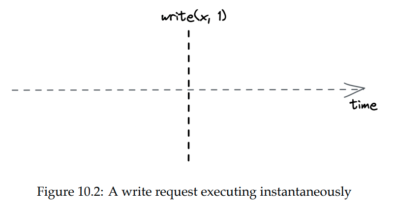

In reality, writes take some time:
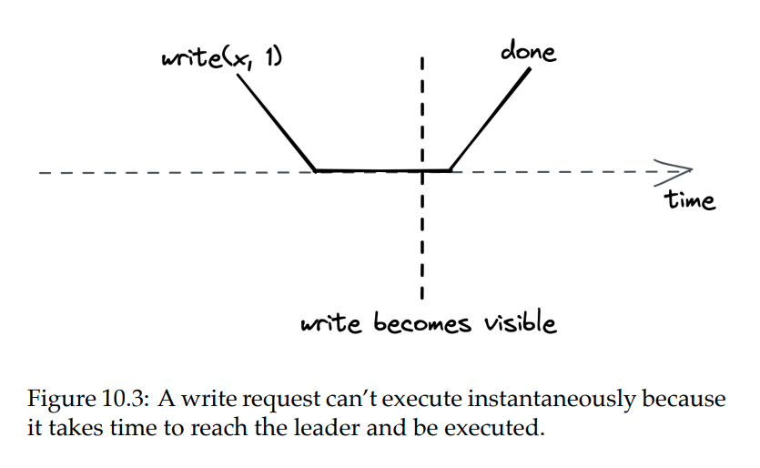

In a replicated data store, writes need to go through the leader, but what about reads?
 * If reads are only served by the leader, then clients will always get the latest state, but throughput is limited
 * If reads are served by leaders and followers, throughput if higher, but two clients can get different views of the system, in case a follower is lagging behind the leader.

Consistency models help define the trade-off between consistency and performance.

### Strong Consistency
If all reads and writes go through the leader, this can guarantee that all observers will see the write after it's persisted.
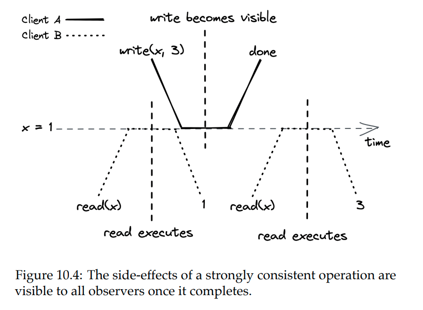

This is a `strong consistency` model.

One caveat is that a leader can't instantly confirm a write is complete after receiving it. It must first confirm that they're still the leader by sending a request to all followers.
This adds up to the time required to serve a read.

### Sequential consistency
Serializing all reads through the leader guarantees strong consistency but limits throughput.

An alternative is to enable followers to serve reads and `attach clients to particular followers`. 
This will lead to an issue where different clients can see a different state, but operations will always occur in the same order.
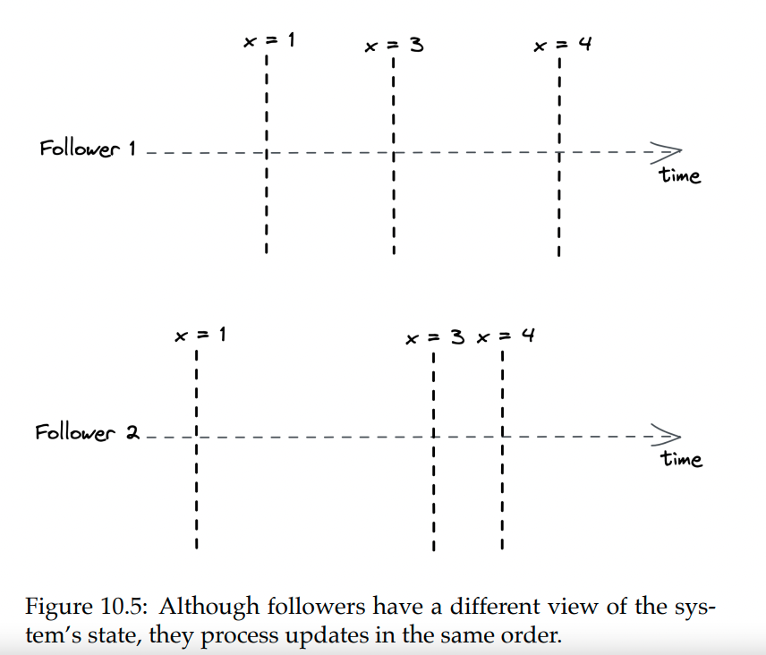

This is a `sequential consistency` model.

Example implementation is a producer/consumer system synchronized with a queue. Producers and consumers always see the events in the same order, but at different times.

### Eventual consistency
In the sequential consistency model, we had to attach clients to particular clients to guarantee in-order state changes.
This will be an issue, however, when the follower a client is pinned to is down. The client will have to wait until the follower is back up.

An alternative is to allow clients to use any follower.

This comes at a consistency price. If follower B is lagging behind follower A and a client first queries follower A and then follower B, they will receive an earlier version of the state.

The only guarantee a client has is that it will eventually see the latest state. This consistency model is referred to as `eventual consistency`.

Using an eventually consistent system can lead to subtle bugs, which are hard to debug. However, not all applications need a strongly consistent system.
If you're eg tracking the number of views on a youtube video, it doesn't matter if you display it wrong by a few users more or less.

### The CAP Theorem
When a network partition occurs - ie parts of the system become disconnected, the system has two choices:
 * Remain highly available by allowing clients to query followers & sacrifice strong consistency.
 * Guarantee strong consistency by declining reads that can't reach the leader.

This dilemma is summarized by the CAP theorem - "strong consistency, availability and fault-tolerance. You can only pick two."

In reality, the choice is only among strong consistency and availability as network faults will always happen.
Additionally, consistency and availability are not binary choices. They're a spectrum. 

Also, even though network partitions can happen, they're usually rare. 
But even without them, there is a trade-off between consistency and latency - The stronger the consistency is, the higher the latency is.

This relationship is expressed by the PACELC theorem:
 * In case of partition (P), one has to choose between availability (A) and consistency (C).
 * Else (E), one has to choose between latency (L) and consistency (C).

Similar to CAP, the choices are a spectrum, not binary.

Due to these considerations, there are data stores which come with counter-intuitive consistency guarantees in order to provide strong availability and performance.
Others allow you to configure how consistent you want them to be - eg Amazon's Cosmos DB and Cassandra.

Taken from another angle, PACELC implies that there is a trade-off between the required coordination and performance.
One way to design around this is to move coordination away from the critical path.

## Chain Replication
Chain replication is a different kettle of fish, compared to leader-based replication protocols such as Raft.
 * With this scheme, processes are arranged in a chain. Leftmost process is the head, rightmost one is the tail.
 * Clients send writes to the head, it makes the state change and forwards to the next node
 * Next node persists & forwards it to the next one. This continues until the tail is reached.
 * After the state update reaches the tail, it acknowledges the receipt back to the previous node. It then acknowledges receipt to previous one and so forth.
 * Finally, the head receives the confirmation and informs the client that the write is successful.

Writes go exclusively through the head. Reads, on the other hand, are served exclusively by the tail.
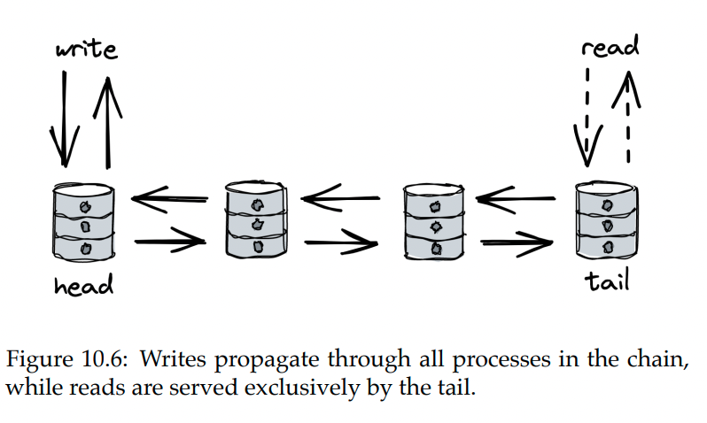

In the absence of failures, this is a strongly-consistent model. What happens in the event of a failure?

Fault-tolerance is dedicated to a separate component, called the control plane. It is replicated (to enable strong consistency) and can eg use Raft for consensus.

The control plane monitors the system's health and reacts when a node dies:
 * If head fails, a new head is appointed and clients are notified of the change.
   * If the head persisted a write without forwarding, no harm is done because client never received acknowledgment of successful write.
 * If the tail fails, its predecessor becomes the new tail.
   * All updates received by the tail must necessarily be acknowledged by the predecessors, so consistency is sustained.
 * If an intermediate node dies, its predecessor is linked to its successor.
   * To sustain consistency, the failing node's successor needs to communicate the last received change to the control plane, which is forwarded to the predecessor.

Chain replication can tolerate up to N-a failures, but the control plane can tolerate only up to C/2 failures.

This model is more suited for strong consistency than Raft, because read/write responsibilities are split between head and tail and the tail need not contact any other node before answering a read response.

The trade-off, though, is that writes need to go through all nodes. A single slow node can slow down all the writes. In contrast, Raft doesn't require all nodes to acknowledge a write.
In addition to that, in case of failure, writes are delayed until the control plane detects the failure & mitigates it.

There are a few optimizations one can do with chain replication:
 * write requests can be pipelined - ie, multiple write requests can be in-flight, even if they are dependent on one another.
 * read throughput can be done by other replicas as well while guaranteeing strong consistency
   * To achieve this, replicas mark an object as dirty if a write request for it passed through them without a subsequent acknowledgment.
   * If someone attempts to read a dirty object, the replica first consults the tail to verify if the write is committed.
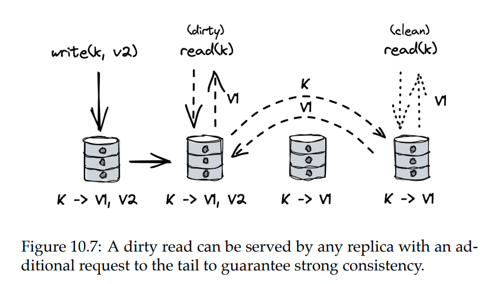

As previously discussed, leader-based replication presents a scalability issue.
But if the consensus coordination is delegated away from the critical path, you can achieve higher throughput and consistency for data-related operations.

Chain replication delegates coordination & failure recovery concerns to the control plane.

But can we go further? Can we achieve replication without the need for consensus? 

That's the next chapter's topic.

# Coordination avoidance
There are two main ingredients to state-machine replication:
 * A broadcast protocol which guarantees every replica eventually receives all updates in the same order
 * A deterministic update function for each replica

Implementing fault-tolerant total order requires consensus. It is also a scalability bottleneck as it requires one process to handle updates at a time.

We'll explore a form of replication which doesn't require total order but still has useful guarantees.

## Broadcast protocols
Network communication over wide area networks like the internet offer unicast protocols only (eg TCP).

To broadcast a message to a group of receivers, a multicast protocol is needed. Hence, we need to implement a multicast protocol over a unicast one.

The challenge is supporting multiple senders and receivers that can crash at any point.

**Best-effort broadcast** guarantees that a message will be deliver to all non-faulty receivers in a group.
One way to implement it is by sending a message to all senders one by one over reliable links.
If, however, the sender fails midway, the receiver will never get the message.
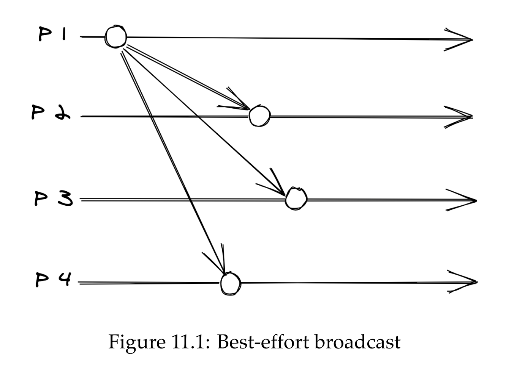

**Reliable broadcast** guarantees that the message is eventually delivered to all non-faulty processes even if the sender crashes before the message is fully delivered.
One way to implement it is to make every sender that receives a message retransmit it to the rest of the group. 
This is known as eager reliable broadcast and is costly as it takes sending the message N^2 times.
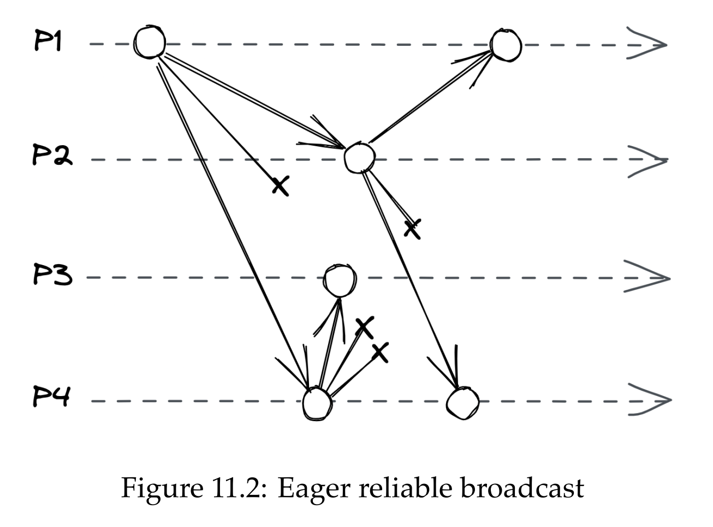

**Gossip broadcast** optimizes this by sending the message to a subset of nodes.
This approach is probabilistic. It doesn't guarantee all nodes get the message, but you can minimize the probability of non-reception by tuning the config params.
This approach is particularly useful when there are large number of nodes as deterministic protocols can't scale to such amounts.
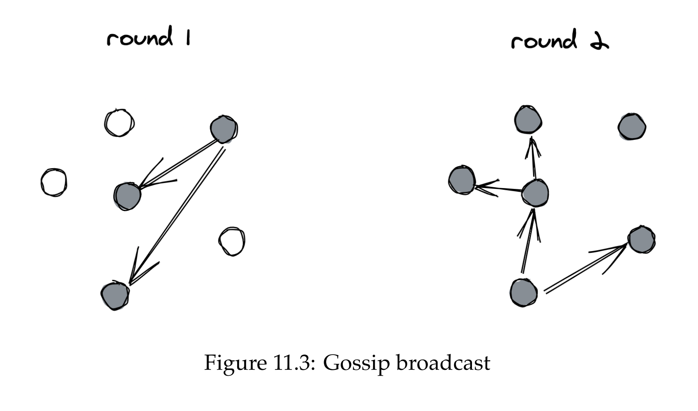

Reliable broadcast protocols guarantee messages are delivered to non-faulty processes, but they don't make ordering guarantees.
**Total order broadcast** guarantees both reception & order of messages, but it requires consensus, which is a scalability bottleneck.

## Conflict-free replicated data types
If we implement replication without guaranteeing total order, we don't need to serialize all writes through a single node.

However, since replicas can receive messages in different order, their states can diverge.
Hence, for this to work, divergence can only be temporary & the replica states need to converge back to the same state.

This is the main mechanism behind eventual consistency:
* Eventual delivery guarantee - every update applied to a replica is eventually applied to all replicas
* Convergence guarantee - replicas that have applied the same updates eventually reach the same state

Using a broadcast protocol that doesn't guarantee message order can lead to divergence.
You'll have to reconcile conflicting writes via consensus that all replicas need to agree to.
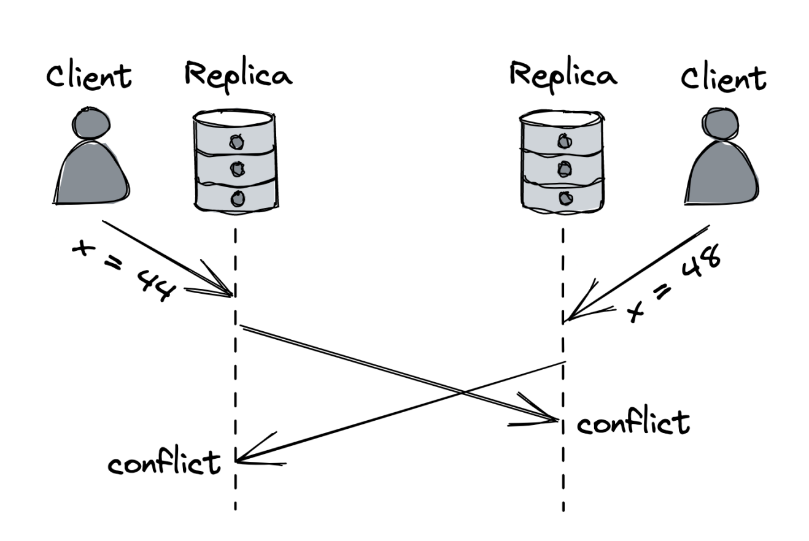

This approach has better availability and performance than total order broadcast.
Consensus is only required to reconcile conflicts & can be moved off the critical path.

However, there is a way to resolve conflicts without using consensus at all - eg the write with the latest timestamp wins.
If we do this, conflicts will be resolved by design & there is no need for consensus.

This replication strategy offers stronger guarantees than eventual consistency:
 * Eventual delivery - same as before
 * Strong convergence - replicas that have executed the same updates **have** the same state

This is referred to as **strong eventual consistency**.

There are certain conditions to guarantee that replicas strongly converge.

Consider a replicated data store which supports query and update operations and behaves in the following way:
 * When a query is received, a replica immediately replies with its local state
 * When an update is received, it is first applied to local state and then broadcast to all replicas
 * When a broadcast message is received, the received state is merged with its own

If two replicas converge, one way to resolve the conflicts is to have an arbiter (consensus) which determines who wins.

Alternatively, convergence can be achieved without an arbiter if these two conditions are met:
 * The object's possible states form a [semilattice](https://www.youtube.com/watch?v=LCFf2DBTVmo&ab_channel=NesoAcademy) (set whose elements can be [partially ordered](https://eli.thegreenplace.net/2018/partial-and-total-orders/))
 * The merge operation returns the least upper bound between two object states. Hence, it needs to be idempotent, commutative and associative.

**Note**: The next couple of lines are personal explanation which might not be 100% correct according to mathy folks, but suffices for my own understanding.

What this means is that if you visualize a graph of an object's ordered states, if you take two of them (c and d), you might not immediately determine which one is greater, but there is eventually some state which is "greater" than both of the non-comparable states (e).
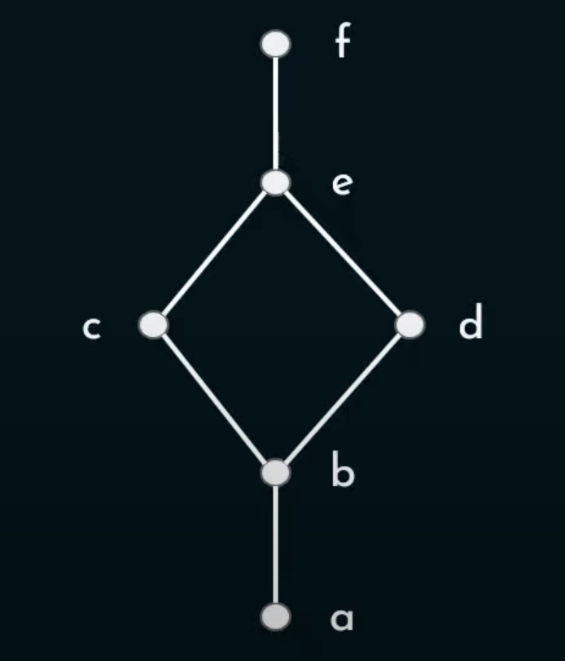

Put into practice, if you have two replicas, whose states have diverged (c and d), eventually, they will converge back to the same value (e).

The second part of the requirement mandates that the operation for merging two states needs to be:
 * Idempotent: x + x = x
 * Commutative: (x + y) + z = x + (y + z)
 * Associative: x + y = y + x

This is because you're not guaranteed that you'll always get to merge two states in the same order (associative & commutative) and you might get a merge request for the same states twice (idempotent).

A data type which has this property is referred to as a **convergent replicated data type** which is part of the family of **conflict-free replicated data types (CRDT)**.

Example - integers can be (partially) ordered and the merge operation is taking the maximum of two ints (least upper bound).

Replicas will always converge to the global maximum even if requests are delivered out of order and/or multiple times.
With this scheme, replicas can also use an unreliable broadcast protocol as long as they periodically broadcast their states & merge them. (anti-entropy mechanism).

Some data types which converge when replicated - registers, counters, sets, dictionaries, graphs.

Example - registers are a memory cell, containing a byte array. 
They can be made convergent by defining partial order and merge operation.

Two common implementations are last-writer-wins registers (LWW) and multi-value registers (MV).

LWW registers associate a timestamp with every update, making them order-able.
The timestamp can be a Lamport timestamp to preserve happened-before relationships with a replica identifier to break ties.

A lamport clock is sufficient because it guarantees happens-before relationships between dependent events & the updates we have are dependent.
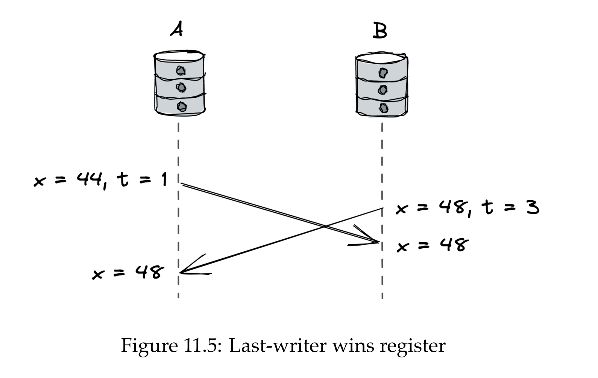

The issue with LWW registers is that when there are concurrent updates, one of them randomly wins.

An alternative is to store both states in the register & let applications determine which update to take.
That's what a MV register does. It uses a vector clock and the merge operation returns the union of all concurrent updates.
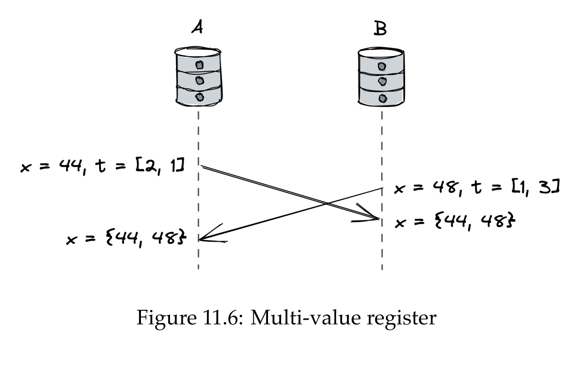

CRDTs can be composed - eg, you can have a dictionary of LWW or MV registers.
Dynamo-style data stores leverage this.

## Dynamo-style data stores
Dynamo is the most popular eventually consistent and highly available key-value store.

Others are inspired by it - Cassandra & Riak KV.

How it works:
 * Every replica accepts read and write requests
 * When a client wants to write, it sends the write request to all N replicas, but waits for acknowledgement from only W replicas (write quorum).
 * Reads work similarly to writes - sent to all replicas (N), sufficient to get acknowledgement by a subset of them (R quorum).

To resolve conflicts, entries behave like LWW or MV registers, depending on the implementation you choose.

W and R are configurable based on your needs:
 * Stronger consistency - When `W + R > N`, at least one read will always return the latest version.*
  * This is not guaranteed on its own. Writes sent to N replicas might not make it to all of them. To make this work, writes need to be bundled in an atomic transaction.
 * Max performance \w consistency cost - `W + R < N`.

You can fine-tune read/write performance while preserving strong consistency:
 * When R is small, reads are fast at the expense of slower writes and vice versa, assuming you preserve `W + R > N`.
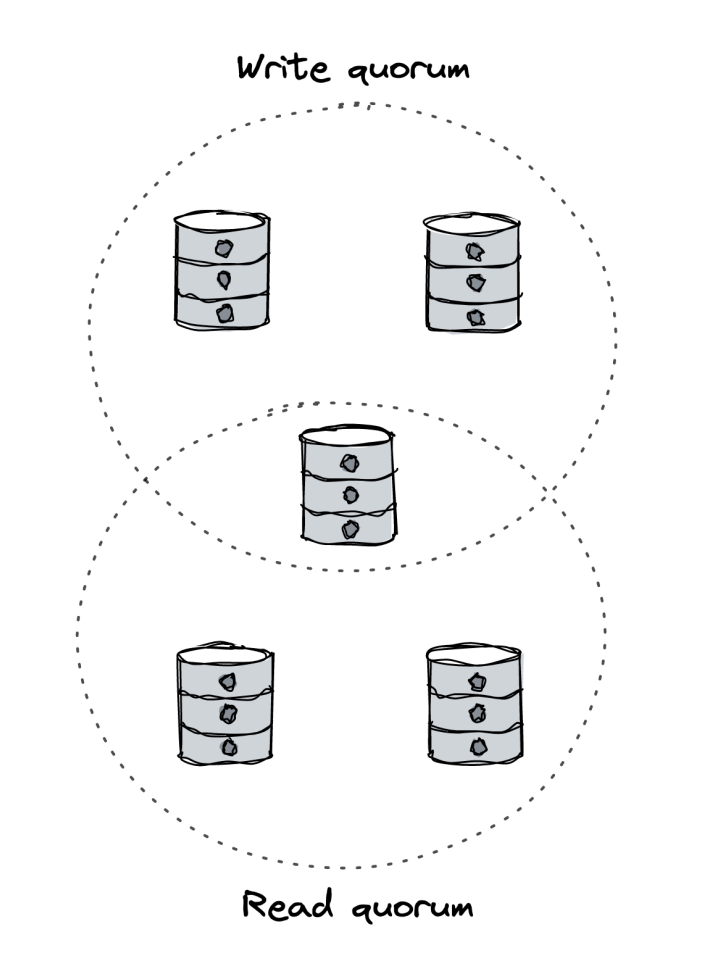

This mechanism doesn't guarantee that all replicas will converge on its own. If a replica never receives a write request, it will never converge.

To solve this issue, there are two possible anti-entropy mechanisms you can use:
 * Read repair - if a client detects that a replica doesn't have the latest version of a key, it sends a write request to that replica.
 * Replica synchronization - Replicas periodically exchange state information to notify each other of their latest states. To minimize amount of data transmitted, replicas exchange merkle tree hashes instead of the key-value pairs directly.

## The CALM theorem
When does an application need coordination (ie consensus) and when can it use an eventually consistent data store?

The CALM theorem states that a program can be consistent and not use coordination if it is monotonic.

An application is monotonic if new inputs further refine the output vs. taking it back to a previous state.
 * Example monotonic program - a counter, which supports increment(n) operations, eg inc(1), inc(2) = 3 == inc(2), inc(1) = 3
 * Example non-monotonic program - arbitrary variable assignment, eg set(5), set(3) = 3 != set(3), set(5) = 5
   * Bear in mind, though, that if you transform your vanilla register to eg a LWW or MV register, you can make it monotonic. 

A monotonic program can be consistent, available and partition tolerant all at once.

However, consistent in the context of CALM is different from consistent in the context of CAP.

CAP refers to consistency in terms of reads and writes. CALM refers to consistency in terms of program output.

It is possible to build applications which are consistent at the application-level but inconsistent on the storage level.

## Causal consistency
Eventual consistency can be used to write consistent, highly available and partition-tolerant applications as long as they're monotonic.

For many applications, though, eventual consistency guarantees are insufficient.
Eventual consistency doesn't guarantee that an operation which happened-before another is observed in the same order.

Eg uploading an image and referencing it in a gallery. In an eventually consistent system, you might get an empty image placeholder for some time.

Strong consistency helps as it guarantees that if operation B happens, operation A is guaranteed to be observed.

There is an alternative which is not strongly consistent but good enough to guarantee happens-before relationships - causal consistency.
Causal consistency imposes a partial order on operations, while strong consistency imposes global order.

**Causal consistency is the strongest consistency model which enables building highly available and partition tolerant systems.**

The essence of this model is that you as a client only care about happens-before relationships of the operations concerning you, rather than all operations within the system.

Example:
 * Client A writes a value (operation A)
 * Client B reads the same value (operation B)
 * Client B writes another value (operation C)
 * Client C writes an unrelated value (operation D)

With a causally consistent system, the system guarantees that operation C happens-before A, hence any client which queries the system must receive operations A and C in this order.

However, it doesn't guarantee the order of operation D in relation to the other operations. Hence, some clients might read operation A and D in this order, others in reverse order.

COPS is a causally-consistent key-value store.
 * clients can make read/write requests to any replica.
 * When a client receives a read request, it keeps track of the returned value's version in a local key-version dictionary to keep track of dependencies
 * Writes are accompanied by copies of the locally-stored key-version dictionary. 
 * Replica assigns a version to the write and sends back the new version to the client
 * The write is propagated to the other replicas
 * When a replica receives a write request, it doesn't commit it immediately. 
 * It first checks if all the write's dependencies are committed locally. Write is only committed when all dependencies are resolved.
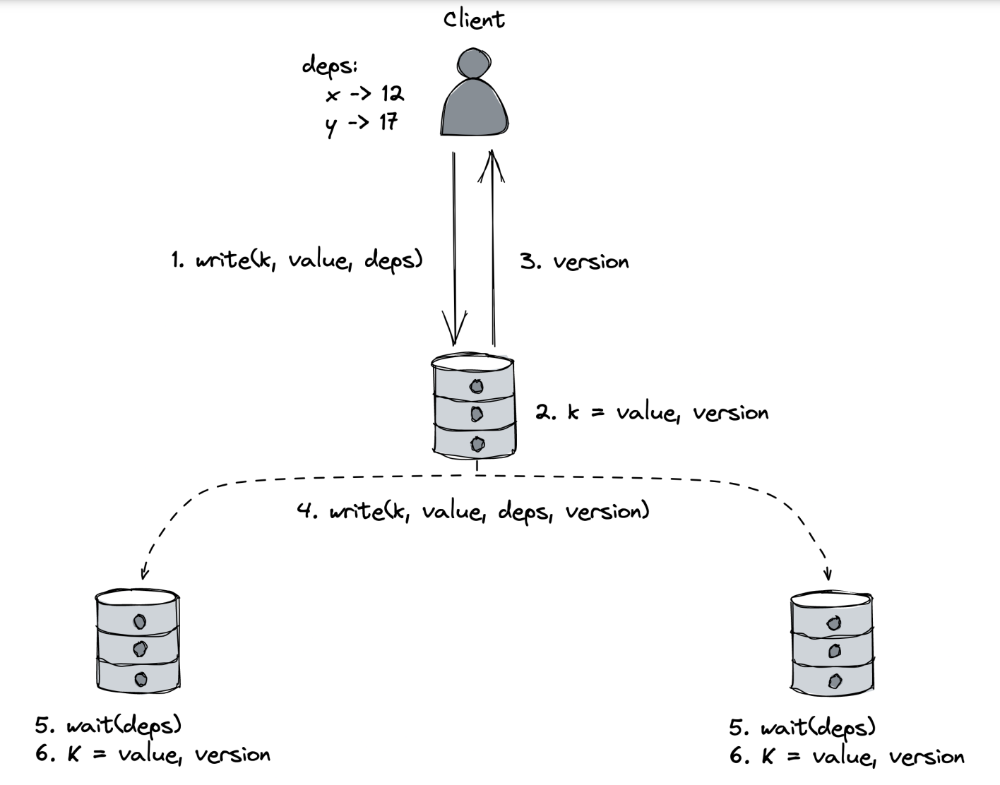

One caveat is that there is a possibility of data loss if a replica commits a write locally but fails before broadcasting it to the rest of the nodes.

This is considered acceptable in COPS case to avoid paying the price of waiting for long-distance requests before acknowledging a write.

## Practical considerations
In summary, replication implies that we have to choose between consistency and availability.

In other words, we must minimize coordination to build a scalable system.

This limitation is present in any large-scale system and there are data stores which allow you to control it - eg Cosmos DB enables developers to choose among 5 consistency models, ranging from eventual consistency to strong consistency, where weaker consistency models have higher throughput.

# Transactions
Transactions allow us to execute multiple operations atomically - either all of them pass or none of them do.

If the application only deals with data within a SQL database, bundling queries into a transaction is straightforward.
However, if operations are performed on multiple data stores, you'll have to execute a distributed transaction which is a lot harder.

In microservice environments, however, this scenario is common.

## ACID
If you eg have to execute a money transfer from one bank to another and the deposit on the oher end fails, then you'd like your money to get deposited back into your account.

In a traditional database, transactions are ACID:
 * Atomicity - partial failures aren't possible. Either all operations succeed or all fail.
 * Consistency - transactions can only transition a database from one valid state to another. The application cannot be left in an invalid state.
 * Isolation - concurrent execution of transactions doesn't cause race conditions. It appears as if transactions execute sequentially when they actually don't.
 * Durability - if a transaction is committed, its changes are persisted & there is no way for the database to lose those changes.

Let's explore how transactions are implemented in centralized, non-distributed databases before going into distributed transactions.

## Isolation
One way to achieve isolation is for transactions to acquire a global lock so that only one transaction executes at a time.
This will work but is not efficient.

Instead, databases do let transactions run concurrently, but this can lead to all sorts of race conditions:
 * dirty write - transaction overwrites the value written by another transaction which is not committed yet.
 * dirty read - transaction reads a value written by a transaction which is not committed yet.
 * fuzzy read - transaction reads a value twice & sees different values because another transaction modified the value in-between.
 * phantom read - transactions read a group matching a given criteria, whilst another transaction changes objects due to which the original matched group changes.

To prevent this, transactions need to be isolated from one another. This is fine-tuned by the transaction's isolation level.

The stronger the isolation level, the stronger the protection against any of the above issues is. However, transactions are less performant as a result.
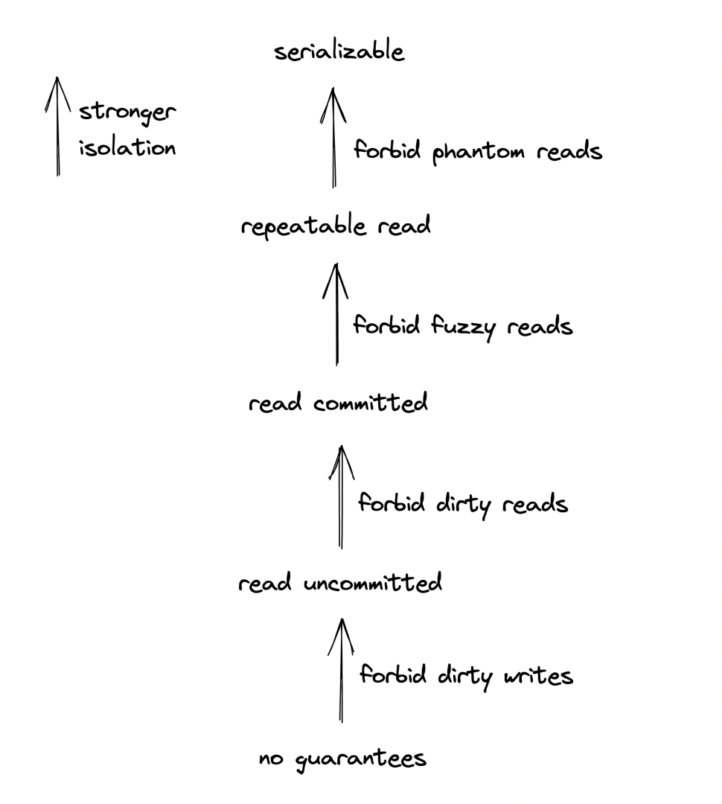

Serializability is the strongest isolation level - it guarantees that executing a group of transactions has the same effect as executing them sequentially.
It guarantees strong consistency, but it involves coordination, which increases contention & hence, transactions are less performant.

Our goal as developers is to maximize concurrency while preserving the appearance of serial execution.

The concurrency strategy is determined by a concurrency control protocol and there are two kinds - pessimistic and optimistic.

## Concurrency control
Pessimistic protocols use locks to block other transactions from accessing a shared object.

The most common implementation is two-phase locking (2PL):
 * Read locks can be acquired by multiple transactions on an object. It is released once all transactions holding the lock commit.
 * Read locks block transactions which want to acquire a write lock.
 * Write locks are held by one transaction only. It prevents read locks from getting acquired on the locked object. It is released once the transaction commits.

With 2PL locking, it is possible to create a deadlock - tx A locks object 1 and wants to read object 2, while tx B locks object 2 and wants to read object 1.

A common approach to handling deadlocks is to detect them, after which a "victim" transaction is chosen & aborted.

Optimistic protocols, on the other hand, works on the principle of (optimistically) attempting to execute transactions concurrently without blocking and if it turns out a value used by a transaction was mutated, that transaction is restarted.

This relies on the fact that transactions are usually short-lived and collisions rarely happen.

Optimistic concurrency control (OCC) is the most popular optimistic protocol.
In OCC, transactions make changes to a local data store. Once it attempts to commit, it checks if the transaction's workspace collides with another transaction's workspace and if so, the transaction is restarted.

Optimistic protocols are usually more performant than pessimistic protocols and are well suited for workflows with a lot of reads and hardly any writes.
Pessimistic protocols are more appropriate for conflict-heavy workflows as they avoid wasting time doing work which might get discarded.

Both protocols, however, are not optimal for read-only transactions:
 * With pessimistic protocols, a read-only tx might have to wait for a long time to acquire a read lock.
 * With optimistic protocols, a read-only tx might get aborted because the value it reads gets written in the middle of it.

Multi-version concurrency control (MVCC) aims to address this issue:
 * Version tags are maintained for each record.
 * When a write happens, a new version tag is created
 * When a read happens, the newest version **since the transaction started** is read
 * For write operations, the protocol falls back to standard pessimistic or optimistic concurrency.

This allows read-only transactions to not get blocked or aborted as they don't conflict with write transactions and is a major performance improvement.
This is why MVCC is the most widely used concurrency control scheme nowadays. The trade-off is that your data store becomes bigger as it needs to tore version tags for each record.

A limited form of OCC is used in distributed applications:
 * Each object has a version number.
 * A transaction assigns a new version number to the object & proceeds with the operation.
 * Once it is ready to commit, the object is only updated if the original version tag hasn't changed.

## Atomicity
Either all operations within a transaction pass or all of them fail.

To guarantee this, data stores record changes in a write-ahead log (WAL) persisted on disk before applying the operations.
Each log entry contains the transaction id, the id of the modified object and both the old and new values.

In most circumstances, that log is not read. But if the data store crashes before a transaction finishes persisting the changes, the database recovers the latest state by reading the WAL. Alternatively, if a transaction is rollbacked, the log is used to undo the persisted changes.

This WAL-based recovery mechanism guarantees atomicity only within a single data store.
If eg you have two transactions which span different data store (money transfer from one bank to the other), this mechanism is insufficient.

## Two-phase commit
Two-phase commit (2PC) is a protocol used to implement atomic transactions across multiple processes.

One process is a coordinator which orchestrates the actions of all other processes - the participants.

Eg, the client initiating a transaction can act as a coordinator.

How it works:
 * Coordinator sends **prepare** request to participants - asking them if they are ready to commit.
 * If all of them are, coordinator then sends **commit** request to execute the commits.
 * If not all processes reply or aren't prepared for some reason, coordinator sends an **abort** request.
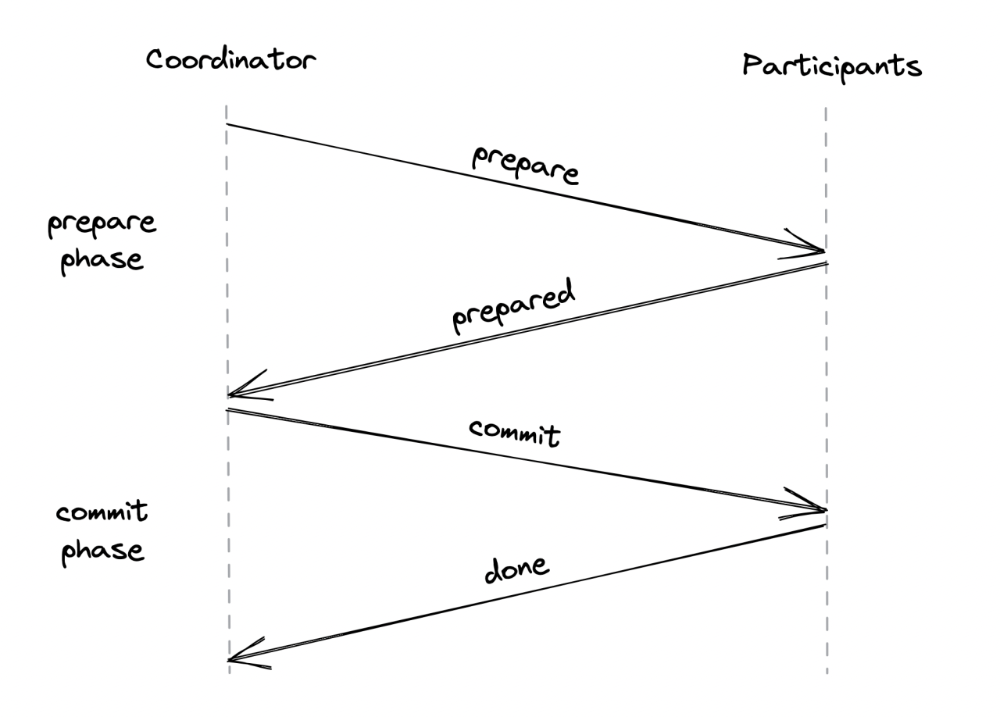

There are two critical points in the above flow:
 * If a participants says it's prepared, it can't move forward without receiving a commit or abort request. This means that a faulty coordinator can make the participant stuck.
 * Once a coordinator decides to commit or abort a transaction, it has to see it through no matter what. If a participant is temporarily down, the coordinator has to retry.

2PC has a mixed reputation:
 * It's slow due to multiple round trips for the same transaction
 * If a process crashes, all other processes are blocked.

One way to mitigate 2PC's shortcomings is to make it resilient to failures - eg replicate coordinator via Raft or participants via primary-secondary replication.

Atomically committing a transaction is a type of consensus called **uniform consensus** - all processes have to agree on a value, even faulty ones.
In contrast, standard consensus only guarantees that non-faulty processes agree on a value, meaning that uniform consensus is harder to implement.

## NewSQL
Originally, we had SQL databases, which offered ACID guarantees but were hard to scale.
In late 2000s, NoSQL databases emerged which ditched ACID guarantees in favor of scalability.

So for a long time, one had to choose between scale & strong consistency.
Nowadays, a new type of databases emerged which offer both strong consistency guarantees and high scalability. They're referred to as **NewSQL**.

One of the most successful implementations is Google's Spanner:
 * It breaks key-value pairs into partitions in order to scale.
 * Each partition is replicated among a group of nodes using state machine replication (Paxos).
 * In each such group (replication group) there is a leader.
 * The leader applies client write requests for that partition by replicating it among the majority of nodes & then applying it.
 * The leader is also a lock manager, which implements 2PL to isolate transactions on the same partition from one another.
 * For multiple partition transactions, Spanner implements 2PC. The coordinator is one of the involved partitions' leader.
 * The transaction is logged into a WAL. If the coordinator crashes, one of the other nodes in the replication group picks up from where they left of using the WAL.
 * Spanner uses MVCC for read-only transactions and 2PL for write transactions to achieve maximum concurrency.
 * MVCC is based on timestamping records using physical clocks. This is easy to do on a single machine, but not as easy in a distributed system.
 * To solve this, Spanner calculates the possible timestamp offset & transactions wait for the longest possible offset to avoid future transactions to be logged with earlier timestamps.
 * This mechanism means that the timestamp offset needs to be as low as possible to have fast transactions. Therefore, Google has deployed very accurate GPS and atomic clocks in every data center.
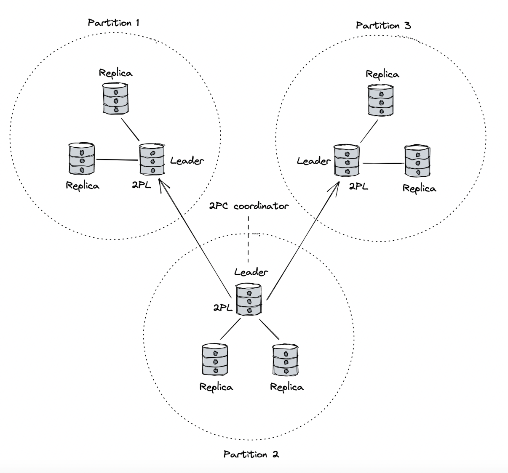

Another system inspired by Spanner is CockroachDB which works in a similar way, but uses hybrid-logical clocks to avoid having to provision highly costly atomic clocks.

# Asynchronous transactions
2PC is synchronous & blocking. It is usually combined with 2PL to provide isolation.

If any of the participants is not available, the transaction can't make progress.

The underlying assumption of 2PC is that transactions are short-lived and participants are highly available.
We can control availability, but some transactions are inherently slow.

In addition to that, if the transaction spans several organizations, they might be unwilling to grant you the power to block their systems.

Solution from real world - fund transfer:
 * Asynchronous & atomic
 * Check is sent from one bank to another and it can't be lost or deposited more than once.
 * While check is in transfer, bank accounts are in an inconsistent state (lack of isolation).

Checks are an example of persistent messages - in other words, they are processed **exactly once**.

## Outbox Pattern
Common issue - persist data in multiple data stores, eg Database + Elasticsearch.

The problem is the lack of consistency between the non-related services.

Solution - using the outbox pattern:
 * When saving the data in DB, save it to the designated table + a special "outbox" table.
 * A process periodically starts which queries the outbox table & sends pending messages to the second data store.
 * A message channel such as Kafka can be used to achieve idempotency & guaranteed delivery.

## Sagas
Problem - we're a travel booking service which coordinates booking travels + hotels via separate third-party services.

Bookings must happen atomically & both the travel & hotel booking services can fail.

Booking a trip requires several steps to complete, some of which are required on failure.

The saga pattern provides a solution:
 * A distributed transaction is composed of several local transactions, each of which has a compensating transaction which reverses it.
 * The saga guarantees that either all transactions succeed or in case of failure, the compensating transactions reverse the partial result.

A saga can be implemented via an orchestrator, who manages execution of local transactions across the involved processes.

In our example, the travel booking saga can be implemented as follows:
 * T1 is executed - flight is booked via third-party service.
 * T2 is executed - hotel is booked via third-party service.
 * If there are any failures, execute compensating transactions C2 and C1:
   * C1 - cancel flight via third-party service API.
   * C2 - cancel hotel booking via third-party service API.

The orchestrator can communicate via message channels (ie Kafka) to tolerate temporary failures. The requests need to be idempotent to tolerate temporary failures.
It also has to checkpoint a transaction's intermediary state to persistent storage in case the orchestrator crashes.
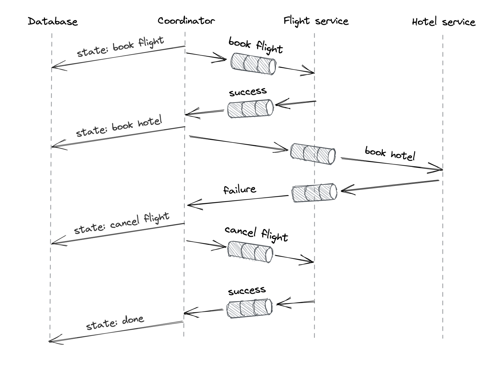

In practice, one doesn't need to implement workflow engines from scratch. One can leverage workflow engines such as Temporal which already do this for you.

## Isolation
A sacrifice we endured when we used distributed transactions is the lack of isolation - distributed transactions operate on the same data & there is no isolation between them.

One way to work around this is to use "semantic locks" - the data used by a transaction is marked as "dirty" and is unavailable for use by other transactions.

Other transactions reliant on the dirty data can either fail & rollback or wait until the flag is cleared.

# Summary
Takeaways:
 * Failures are unavoidable - systems would be so much simpler if they needn't be fault tolerant.
 * Coordination is expensive - keep it off the critical path when possible.

