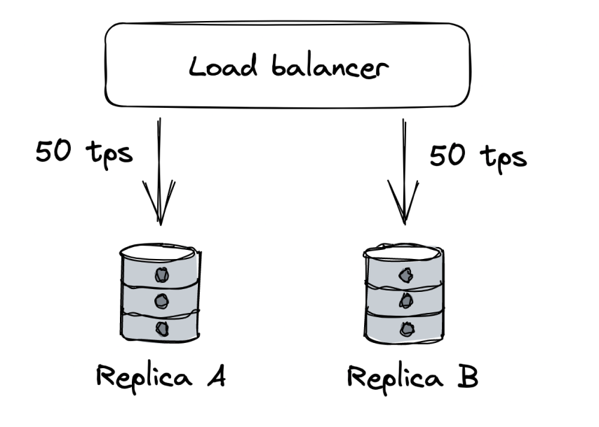
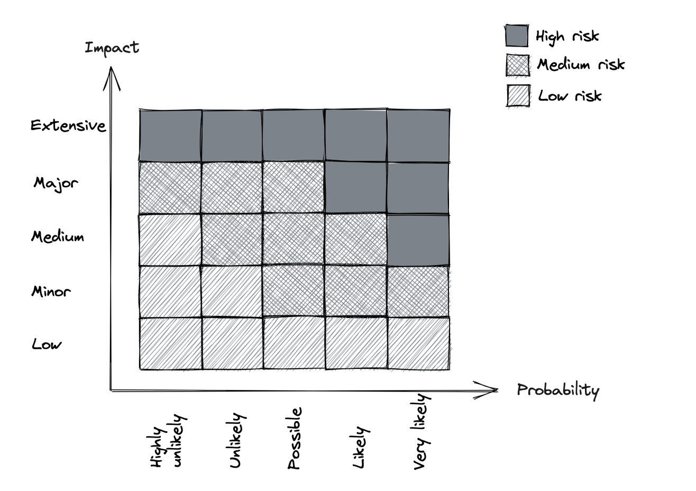
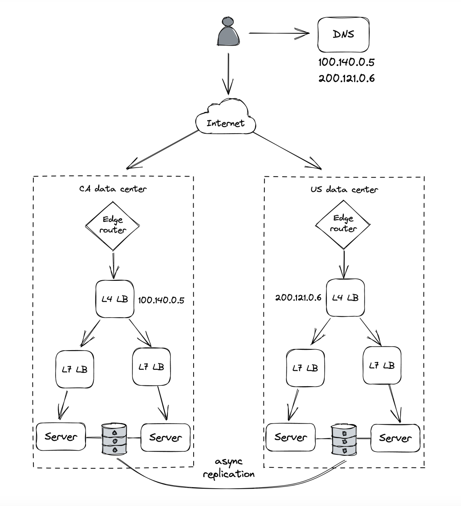
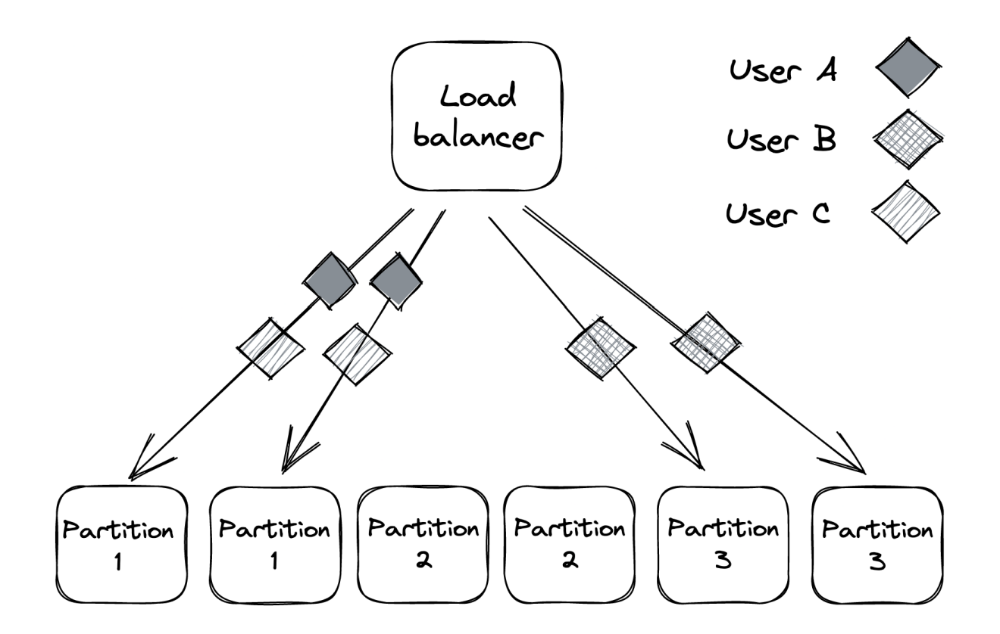
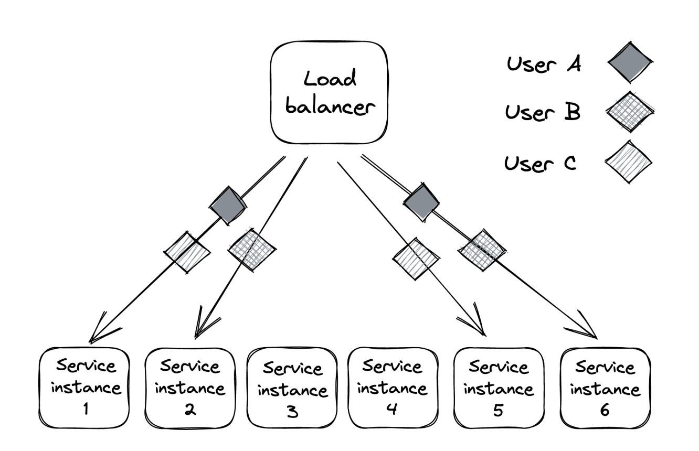
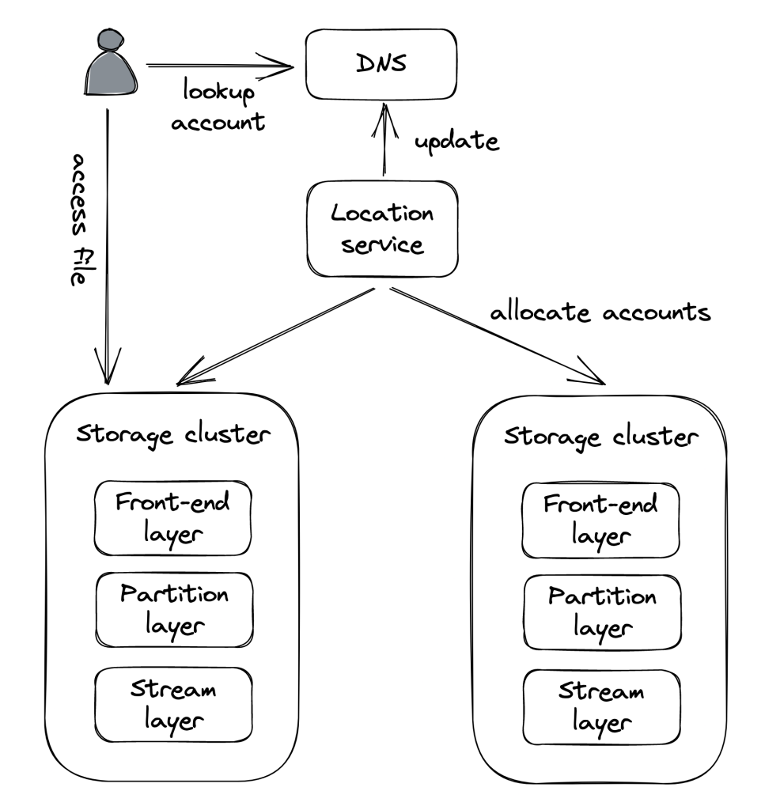

# Resiliency

The three fundamental scalability patterns discussed so far:
 * functional decomposition - splitting a monolithic system into independent parts which composed provide the same functionality
 * data partitioning - splitting data across several nodes
 * replication - duplicating data across several nodes

All the patterns have one thing in common - they increase the number of moving parts in our system.
The more moving parts there are in a system, the higher the probability of them failing.

If we want to guarantee two nines for a system (99%), then we can only afford the application to be down 15m per day.
If we strive for three nines (99.9%), we can afford 43m per month.

The more nines we want, the faster our systems need to detect & react to outages.

# Common failure causes
A system has a failure when it no longer provides service to its users based on the system's specifications.

Failures are caused by a fault - failure of internal component or external dependency.
Not all faults can lead to a failure. Some can be tolerated.

To build a fault-tolerant system, we need to understand what can go wrong.

## Hardware faults
Any physical part of a machine can fail - HDD, SSD, NIC, CPU, etc.

Hardware faults can also lead to data corruption. Entire data centers can go down due to a power cut or natural disaster.

Many of the infrastructure faults can be addressed with redundancy.

Most distributed applications don't fail due to these kinds of faults. In reality, common faults happen for more mundane reasons.

## Incorrect error handling
A [2014 study](https://www.usenix.org/system/files/conference/osdi14/osdi14-paper-yuan.pdf) found that the majority of catastrophic failures in five of the most popular distributed data stores were due to incorrect error handling of non-fatal errors.

In most cases, the bugs could have been avoided with more thorough testing:
 * Completely ignoring errors.
 * Catching an overly generic exception, eg `Exception` in Java.
 * Partially implemented handlers with `FIXME` and `TODO` comments.

This is not a surprise as error handling tends to be an afterthought.

## Configuration changes
Configuration changes are among [the leading causes](https://github.com/danluu/post-mortems#config-errors) for major failures. 

Sometimes, it is a misconfiguration. At other times, it is a valid configuration which is rarely used, hence, not working as expected anymore.

Configuration changes can be even more problematic if their effect is delayed - eg application fetches the new configuration several hours later, making it very hard to trace the exact root cause for an outage.

Due to this, configuration changes should be version-controlled, tested & released like any code change.

## Single points of failure
A SPOF is a component, whose failure brings down the entire system down with it.A

Common SPOFs:
 * Humans which need to accurately execute a sequence of steps. You better automate those.
 * DNS - domain name expiring, root level domains going down, expired TLS certificate.

SPOFs should be identified when the system is designed. If you can, you should architect away a SPOF using eg redundancy.
If you can't, you'll have to at least try and reduce the blast radius in the event the SPOF fails.

## Network faults
When a client sends a request to a server and doesn't get a timely response, it can either timeout or block & wait for a response.

What can trigger network faults? - server is slow, server has crashed, the network is losing parts of the packers, causing retransmission and delay.
Slow network calls are the silent killers of distributed systems.

Clients don't know if a response will eventually arrive, hence, it can wait for a long time before timing out, leading to performance degradations which are hard to detect & debug.

## Resource leaks
Resource leaks very commonly lead to slow processes.

Memory leaks are the most common resource leaks. It causes a steady increase in memory consumption over time.
Even garbage-collected languages are vulnerable to memory leaks. 

When a memory leak occurs, the OS starts to use swap memory, which is very slow and the garbage collector kicks in more aggressively, consuming CPU cycles.

There are also other resources which can leak:
 * Thread pools - a thread is blocked waiting on a synchronous HTTP call & can't be allocated for another job.
 * Socket pools - making http connections without a timeout consume a socket from a pool of available ones and you will eventually run out of sockets in the pool.
 * A third-party library you depend on might have a resource leak & you inherit its problem.

## Load pressure
Every system has capacity - how much load it can withstand.

Organic increase in load allows the time for a system to scale out & increase its capacity.
A sudden increase in load, however, can lead to failure.

Why can that happen?
 * Requests have seasonality - they tend to increase during some time of the day.
 * Some requests are more expensive than others like scrapers, which consume data very fast.
 * Some requests are malicious, such as those incoming from DDoS attacks.

Some load surges can be handled by automatically adding additional capacity (autoscaling). Others can be rejected via rate-limiting.

## Cascading failures
If a system has hundreds of processes and a small subset of them are unreachable, this can still lead to a global outage.

This is because failures can cascade across services & bring the entire system down - this occurs when components depend on each other and a failure in one, leads to a failure in dependent ones.

Example:
 * clients are querying two database replicas via a load balancer. Each replica handles 50 tps. 
 * Replica B becomes unavailabe due to a network fault.
 * Load balancer removes B from the pool and redirects all the traffic to A.
 * If replica A can't handle the double increase in tps, it will eventually crash, bringing the whole system down.
 * In essence, the failure in B, cascaded to the other replica A.
 * If replica B comes back up again after a while, all requests will be redirected to it and it will also encounter a capacity failure.

A failure like this one are very hard to handle and usually require a corrective action such as stopping all traffic temporarily.

## Managing risk
Distributed applications need to accept that faults are inevitable and must be prepared to detect, react & repair.

There is a tremendous amount of faults that can occur. But we don't need to do something about all of them.

We need to measure probability & impact of occurring. Afterwards, prioritize the more likely & impactful faults.

Once we decide to tackle a specific fault, we can focus on reducing its impact or probability.

# Redundancy
Redundancy == replication of functionality or state. This is the first line of defense against failures.

When functionality (or state) is replicated across multiple nodes, others can take over in the event of failure.

This is the main reason distributed applications can achieve better availability than single-node apps.

However, in order for redundancy to be effective, there are some prerequisites:
 * Complexity introduced by redundancy mustn't cost more availability than it adds.
 * The system must reliably detect which components are healthy and which aren't.
 * System must be able to run in degraded mode.
 * System must be able to recover to fully redundant mode.

Example - adding redundancy to protect against hardware faults:
 * A load balancer can mitigate this type of fault using a pool of redundant nodes.
 * The load balancer increases the system's complexity, but the benefits in terms of scalability and availability outweigh the costs.
 * Load balancer detects faulty nodes using health checks.
 * When a server is taken out of the pool, the rest of the replicas must have enough capacity to handle the load increase.
 * The load balancer also enables the system to go back to fully redundant mode as new servers are added to the pool, requests get routed to them.

Replication for stateful services is a lot more challenging and was discussed at length at previous chapters.

## Correlation
Redundancy helps only if the nodes can't fail all at once for the same reason - ie, failures are not correlated.

Example:
 * Memory corruption on one server is unlikely to occur on another at the same time. 
 * However, a data center outage (eg natural disaster) can cause all servers to go down unless they're replicated across multiple data centers.

Cloud providers (eg AWS, Azure) replicate their entire stack in multiple regions for that reason:
 * Each region comprises of multiple data centers, called availability zones (AZ). Those are cross-connected with high-speed network links.
 * AZs are far enough from each other to minimize the risk of correlated failures.
 * However, they are still close enough to have low network latency among themselves.
 * The low latency enables supporting synchronous replication protocols across multiple AZs.
 * Using AZs, we can create apps resilient to data center outages by load balancing instances across multiple AZs, behind a shared load balancer.

But, if we want to have even more redundancy in the event a catastrophic disaster brings down all AZs, we can duplicate the entire application stack in multiple regions:
 * Load balancing can be achieved by using global DNS load balancing. 
 * Using this approach, though, requires application state to be replicated asynchronously due to the high network latency between the DCs.
 * Before doing this, though, you should have pretty good reason to, because it is expensive to pull off & maintain.
 * A common reason for doing this is legal compliance since European customer data must be processed and stored within Europe.
 

# Fault isolation
Infrastructure faults can be controlled using redundancy. However, there are faults where redundancy won't help due to the high degree of correlation.

Example:
 * Specific user sends malformed requests that causes servers handling them to crash due to a bug.
 * Since bug is in the code, it doesn't matter how redundant your application is.
 * These kinds of requests are often referred to as poison pills.
 * A similar case is when a particular request requires a lot of resources to serve it and that degrades everyone else's performance (the noisy neighbor problem).

The main issue with this example is that the blast radius of such a fault is the entire application. 
Hence, we can focus on reducing it by partitioning user requests, therefore reducing the blast radius to a particular partition where the user is assigned.

Even if a user is degrading a partition, the rest of the partitions will be isolated from that fault.

For example, if we partition a set of 6 instances into three partitions, a noisy neighbor can only impact 33% of users. As the number of partitions increases, the blast radius is reduced.

This is also referred to as the "bulkhead pattern", named after the pattern of splitting a ship's hull into compartments. If one compartment is damaged and filled with water, the rest of the compartments are left intact.

## Shuffle sharding
The problem with partitioning is that unlucky users who end up on the degraded partition are consistently impacted as well.

A way to mitigate this is by using shuffle sharding:
 * Instead of assigning an application instance to a single partition, it is assigned to multiple "virtual partitions".
 * This makes it much more unlikely that two users will be assigned to the same partition - eg, 6 application instances can form up to 15 partitions.
 * The downside is that virtual partitions partially overlap. So faults in one partition can impact users in another one.
 * However, clients can be made fault tolerant and retry requests, so that they hit a different instance within a partition every time.
 * The net effect is that impacted users within the system will only experience partial degradation instead of consistent degradation. 

## Cellular architecture
We can enhance partitioning even more by partitioning the entire application stack with its dependencies into cells based on the user.
Each cell is completely independent of another one and a gateway service is responsible for routing requests to the right cell.

Azure Storage, for example, uses a cellular architecture. The storage clusters are the cells in the cellular architecture:

What makes a cellular architecture appealing is that a cell can have a maximum capacity.
When the system needs to scale, a new cell is added vs. scaling out existing ones.
This enables you to thoroughly test & benchmark your application for the maximum cell size as you won't suddenly face a surprise surge in traffic.

# Downstream resiliency
