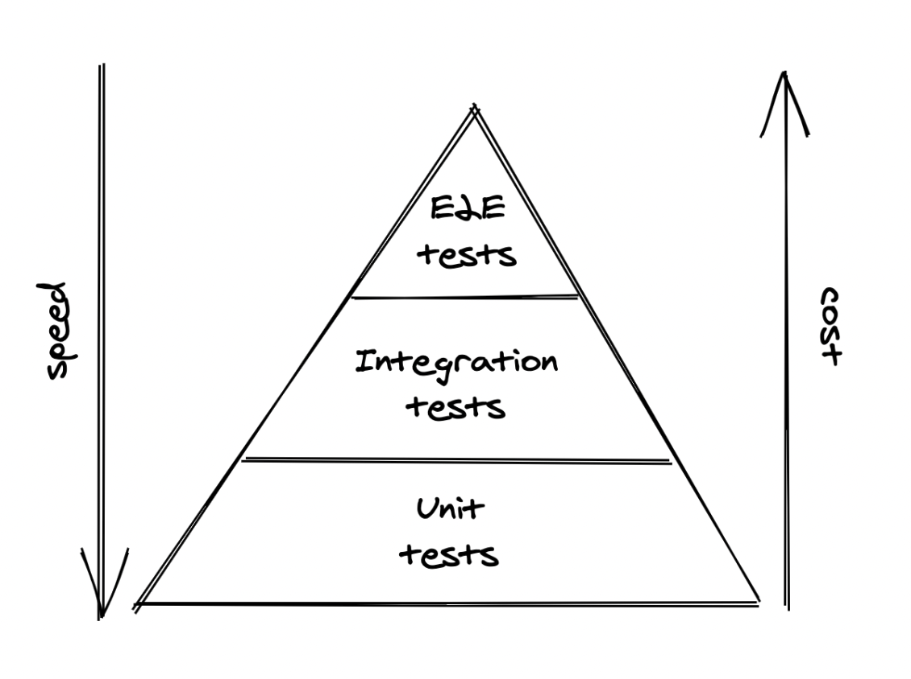
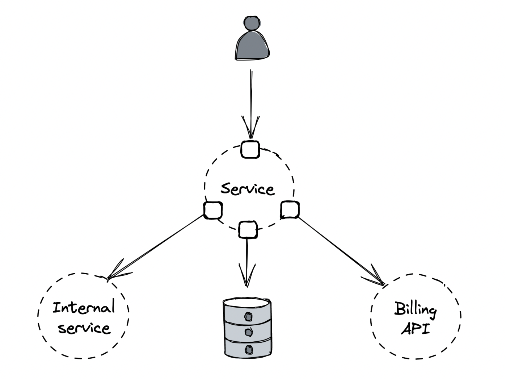
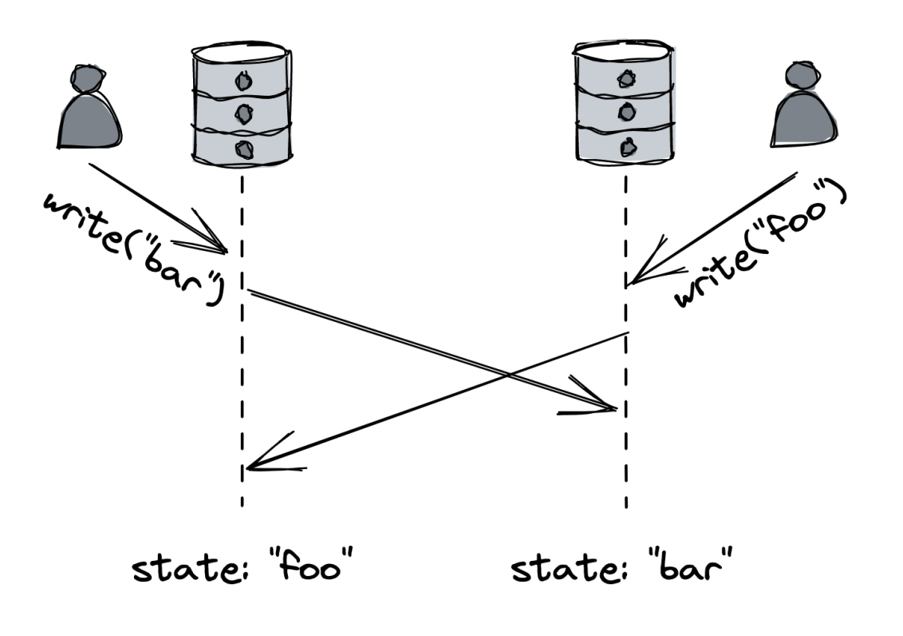
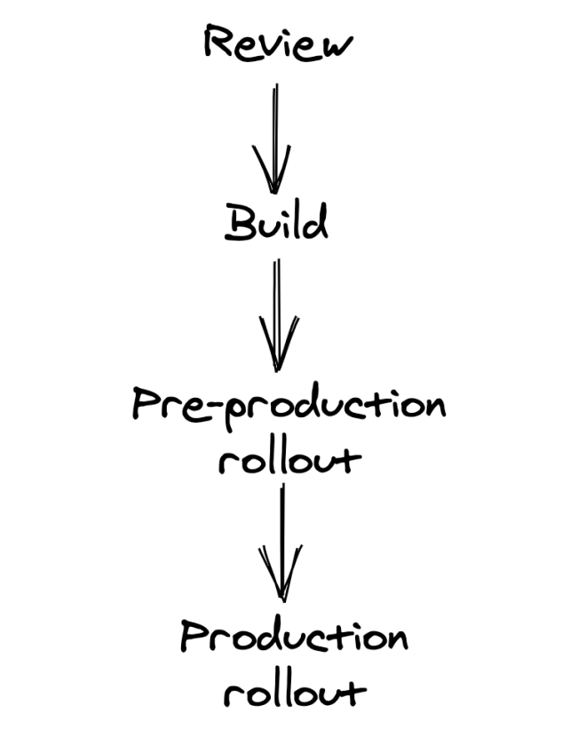
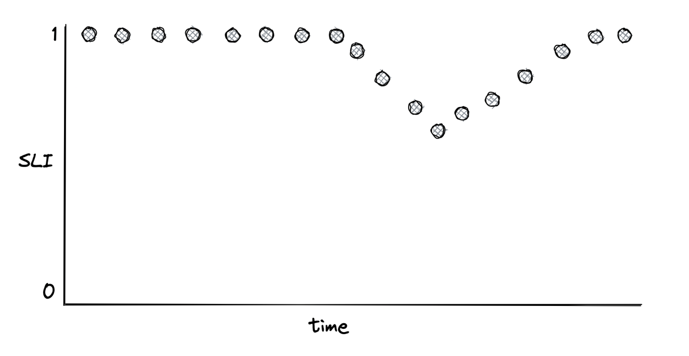
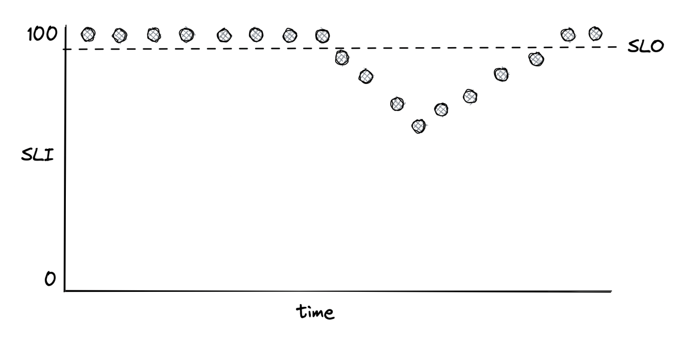
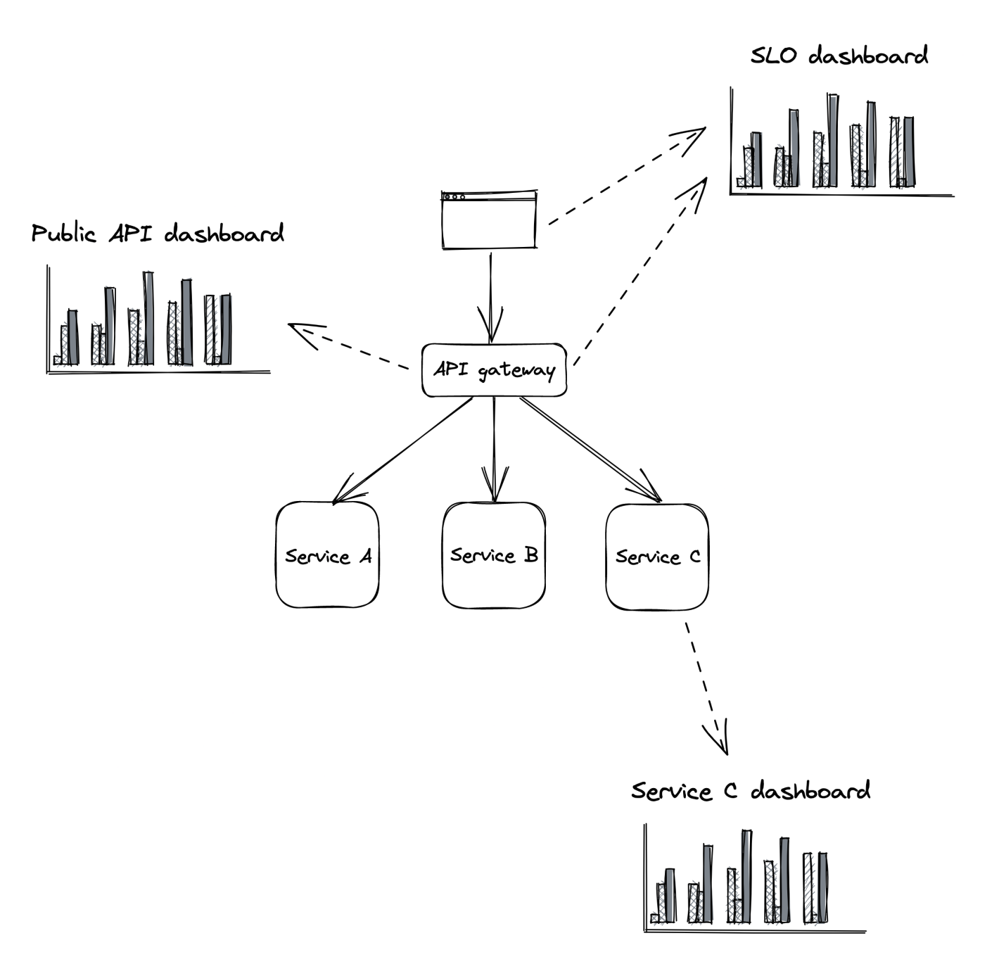
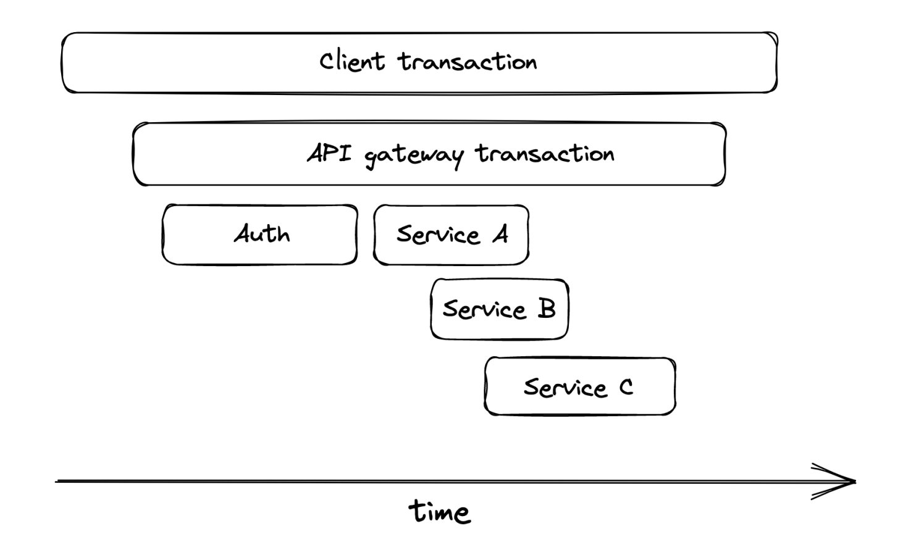

# Maintainability
- [Testing](#testing)
- [Continuous delivery and deployment](#continuous-delivery-and-deployment)
- [Monitoring](#monitoring)
- [Observability](#observability)
- [Traces](#traces)
- [Manageability](#manageability)
- [Summary](#summary)

The majority of the cost of software is spent in maintaining it after its initial development:
 * Fixing bugs
 * Adding new features
 * Operating it

We should aspire our systems to be easy to modify, extend and operate so that they're easy to maintain.

How to do that?
 * Good testing is a minimal requirement to be able to extend a system while ensuring it doesn't break.
 * Once the change is merged into the repo, it should be rolled out into production without that affecting the application's availability.
 * Operators need to be able to monitor the system's health, investigate degradations and restore it when it gets into a bad state.
 * This requires altering the system's state without touching the code - via a configuration change or a feature flag.

Historically, developers, testers and operators were different teams. Nowadays, developers do it all.

This part is all about best practices in testing & operating large scale distributed systems.

# Testing
The longer it takes to detect a bug, the more expensive it is to fix it.

How does testing help?
 * A software test verifies that some part of the application works correctly, catching bugs early.
 * The real benefit, though, is that tests allow you to alter the system's behavior with high confidence that you're not breaking the expected behavior.
 * Tests are also an always up-to-date documentation of the codebase.
 * Finally, they improve the public interface of a system as developers are forced to look at the system from a client's perspective.

Testing is not a silver bullet, though, as you can't predict all the states an application can get into. You can only predict those behaviors developers can predict.
Oftentimes, complex behaviors which only occur in production are not captured by tests.

Regardless, tests do a good job of validating expected behaviors, although they don't guarantee your code is bug-free.

If you want to be confident in your application's behavior, you'll need to add tests for it.

## Scope
Scope defines the code path under test aka system under test (SUT).

This designates whether a test is unit, integration or end to end.

A unit test validates the behavior of a single component such as a class.
A good unit test is relatively static & only changes when the behavior of the component changes.

To achieve that, a unit test should:
 * work with the public interface of the component only.
 * test for state changes in the SUT vs testing for a predetermined sequence of actions.
 * test for behaviors - ie, how SUT reacts to a given input given it is in a specific state.

An integration test has a larger scope than a unit test as it verifies the correct integration with an external component.

Integration tests have different meanings in difference contexts. Martin Fowler defines them as:
 * A narrow integration test only exercises the code paths of a service, communicating with an external dependency.
 * A broad integration test exercises code paths across multiple services. We will refer to those as end-to-end tests.

An end-to-end test validates behavior that spans multiple services, ie a user-facing scenario.
These tests usually run in a shared environment (eg staging or prod). They should not impact other users or tests using the same environment.

Because of the larger scope, they are slower & more prone to intermittent failures.

These can also be painful to maintain - when such a test fails, it's not obvious which particular component failed.
But they're a necessary evil as they validate user-facing behavior which is harder to validate with tests with a smaller scope.

To minimize end-to-end tests, you can frame them as a user journey test - they validate multi-step interactions of a user with a system vs. testing an individual action.

As the scope of a test increases, it becomes more brittle, slow and costly. Intermittently failing tests are nearly as bad as no tests at all since developers quickly learn to ignore them due to the noise.

A good trade-off is to have a lot of unit tests, a smaller fraction of integration tests and a few end to end tests:


## Size
The size of the tests determines how much computing resources (ie nodes) the test needs to run. This largely depends on how realistic the environment where the test runs is.

Scope and size are usually correlated, but they are distinct concepts.

How to differentiate tests in terms of size:
 * A small test runs in a single process, without performing any I/O - it's very fast, deterministic & probability of intermittent failures is low.
 * An intermediate test runs on a single node and performs local I/O - this leaves more room for delay & intermittent failures.
 * A large test requires multiple nodes to run - leading to more non-determinism and delays.

The larger the test is, the longer it takes to run & the flakier it becomes. Hence, we should write the smallest possible test for a given behavior.

A technique to avoid increasing the size of a test is using test doubles:
 * A fake is a lightweight implementation of the external dependency that behaves similarly to it. Eg an in-memory version of a database.
 * A stub is a function which always returns the same value regardless of input.
 * A mock has expectations on how it should be called and it's used to test interactions between objects.

The problem with test doubles is that they don't behave like the real system, hence the confidence we have with them is lower.
That's why - when the real implementation is fast, deterministic & has few dependencies, we can use it directly instead.
When that is not an option, we can use a fake of the real implementation, which is maintained by the same developers.

Stubbing and mocking are last-resort options as they offer the lowest degree of confidence.

For integration tests, using [contract tests](https://martinfowler.com/bliki/ContractTest.html) is a good compromise.
A contract test defines the request for an external dependency with expected result. The test uses this contract to mock the dependency.

But the dependency also validates its system acts in the way the contract expects it to.

## Practical considerations
Testing requires trade-offs, similar to everything else.

Let's imagine we want to test the behavior of a specific API endpoint of a service with:
 * A data store
 * An internal service owned by another team
 * A third-party API used for billing


As previously discussed, we should attempt to write the smallest possible test for the scope we want while minimizing the use of test doubles.

Our decisions:
 * Assuming our endpoint doesn't use the internal service, we can use a mock in its place.
 * If the data store has an in-memory version, we can use it to avoid making network calls.
 * We can't call the third-party billing API directly as that entails making actual transactions, but the API might have a testing environment we can use instead.

A more nuanced example - testing that we can safely purge the data belonging to a particular user across the entire system as that's mandated by GDPR.
Failing to comply can lead to fines up to 20mil EUR or 4% annual turnover.

The impact of this functionality silently breaking is high, hence we should maximize our confidence that the functionality works correctly - we'll need to setup an end to end test, that periodically runs in production and uses live services.

## Formal verification
Software tests are not the only way to capture bugs early.

Writing a high-level description of how the system behaves (ie specification) allows subtle bugs & architecture shortcomings to be detected before writing any code.
A specification helps us reason about the behaviors of our system. It's also a documentation and guide for the ones which implement the system.

A specification can range from a one-pager to a formal mathematical description that a computer can check.
Writing one doesn't entail describing every corner of the system in detail - we only want to specify those paths that are most likely to contain errors, which are hard to detect via tests.

TLA+ is a well-known formal specification language. One can use it to describe the behavior of a system via a set of states & changes across them.
Microsoft & Amazon use it to describe their most complex distributed systems, such as S3 and CosmosDB.

The goal of using such a tool is to verify the safety & liveness of an application:
 * Safety - something is true for all behaviors of the system (invariant).
 * Liveness - something eventually happens.

TLA+ is very useful for systems running at huge scale as those will eventually run into states, which humans can't imagine.

Example - we have a key-value store X and we want to migrate to key-value store Y.

How to implement that:
 * Service writes to both X and Y (dual writes), while reading from X.
 * One-off batch process backfills Y with the data from X.
 * Application switches to read/write exclusively from Y.

Approach seems reasonable but it doesn't guarantee that both stores will eventually end up in the same state:
 * In case write to A succeeds, but write to B fails, the data stores are not in the same state.
 * Using an atomic write resolves the liveness issue, but two service instances writing at the same time can lead to writes not coming in the same order.


 * Finally, using a message channel between application instances and the database can serialize the writes and guarantee global order.

Regardless of the specific problem, the point is that using a formal verification system such as TLA+ can help us catch these kinds of errors before any code is written.

# Continuous delivery and deployment
Once a change is merged in a repository, it needs to get released to production.
If the rollout happens manually, it won't happen often.

This leads to several unreleased changes being merged & the eventual rollout becomes more and more risky.
Also, if an issue is discovered, it's hard to figure out which change exactly caused the issue.

Furthermote, the developer who deployed the change needs to monitor dashboards and alerts to ensure the change is working.

In a nutshell, manual deployments are a waste of time and should be automated.
Once a change hits the main branch, it should be automatically deployed to production.

Once that's done, the developer is free to pick up their next task vs. babysitting the deployment process.
This whole process can be automated via a continuous delivery pipeline (CD).

Releasing changes is among the main root causes of failures. This is why, significant time needs to be invested in safeguards, monitoring and automation.
Whenever a bad version is detected, the pipeline should automatically rollback to the previous stable version.

There is a balance between rollout safety & the time it takes to release a change to production. A good pipeline makes a balance between the two.

## Review and build
There are four stages involved in deployment:


It starts with a pull request, which is reviewed. A pipeline needs to validate the change by running a set of linters & tests to ensure it's valid.

A team member needs to review and approve the change. A checklist helps here:
 * Does the change include unit/integration/end to end tests as needed?
 * Does the change incldue metrics, logs, traces?
 * Can this change break production by introducing a backwards-incompatible change?
 * Can the change be rollbacked safely?

This process can be reused for non-code related changes as well - static assets, end to end tests, configuration files.
All of this should be version controlled in a repository.

It's very important to release configuration changes via a CD pipeline. They are a common source of outages.

Infrastructure should also be defined as code - Infrastructure-as-code. Terraform is the most popular tool for that.
This enables all infra changes to be version controlled & reviewed just like normal code.

Once a change is moved into the main branch, we proceed to the build stage, where the code is built & release artifacts are created.

## Pre-production
In this stage, the change is released in a non-production environment where end-to-end tests are run.
Although this environment isn't as realistic as production, it's helpful for verifying end to end integration.

There can be multiple pre-production environments. 
One can have simple smoke tests, while another can have part of production traffic mirrored to it to make it more realistic.

The CD pipeline should assess an artifact's health using the same metrics used in production.

## Production
Once pre-production passes, the artifact can be deployed to production.

It should be released to a small number of instances initially. The goal is to surface problems not detected so far before hitting all production instances.
If this stage passes, it is then gradually rolled out to the rest of the instances.

During deployment, part of the instances can't serve production traffic, hence, the rest of the instances need to compensate.
You should ensure there is sufficient capacity to handle this operation.

If there are multiple regions the service is deployed to, it should first be deployed to the lower traffic region.
The remaining region rollouts should be divided into sequential stages to minimize risk.

The more stages there are, the longer the deployment will take. 
To mitigate this, you can make a parallel rollout once enough confidence has been built in the initial stages.

## Rollbacks
For every step, the CD pipeline needs to verify the artifact's health. If it's not OK, an automatic rollback should be triggered.
Example indicators you could use - end to end tests, health metrics, errors and alerts.

Just monitoring the health metrics is often not enough. The CD pipeline should also monitor the health of upstream/downstream dependencies to detect any indirect impact.

The pipeline should wait some time between stages (bake time) to ensure it's successful since some issues can take a while to surface.
The bake time can be reduced after each successful stage.

You could also determine the bake time based on the number of requests you've received so that your API can be properly exercised to raise confidence it works properly.

When any indicator fails, the CD pipeline stops - at this stage, it can either trigger a rollback or alert the oncall engineer for manual intervention.
Based on the engineer's input, the CD pipeline can either retry or rollback entirely.

In some circumstances, the operator might choose to wait for a new version to get released and roll it forward.
This might be necessary due to a backwards incompatible change. One of the common reasons is changing the serialization format for persistence or IPC.

For safely introducing a backwards incompatible change, it can be broken down into several smaller backward-compatible changes.

Example - handling backwards-incompatible message schema change between producer and consumer:
 * Prepare change - consumer is modified to support new and old formats.
 * Activate change - producer is modified to write messages in the new format.
 * Cleanup change - The consumer stops supporting the old messaging format altogether. This is only released once enough confidence is accumulated.

An automatic upgrade-downgrade test step can be setup in pre-production to verify a change can be safely rolled back.

# Monitoring
Monitoring is used to detect production issues quickly & alert human operators responsible for the system.
Another use-case is to provide high-level health information about a system via dashboards.

Initially, monitoring was black-box - reporting only if service was up. After a while, developers started instrumenting their code to track the health of specific features (white-box monitoring).
Black-box monitoring is useful to detect symptoms of a failure, white-box monitoring is useful to identify the root cause.

Main use-case for black box monitoring is to track health of external dependencies and validate the impact to users.
A common approach is to run periodic scripts (synthetics) which send periodic requests to test endpoints and monitor latency & success rate.

A benefit of using synthetics is that they can catch issues not visible to the application (eg connectivity issues) and they can be used to exercise endpoints which aren't used by users that often.
Example - DNS server is down & service thinks it's just not receiving a lot of requests. Synthetics would catch that issue as they are unable to resolve a service's IP address.

## Metrics
Metric == time series of raw measurements for resources (ie CPU load) or behavior (ie number of requests).
Each sample is represented by a floating-point number and a timestamp.

A metric can also be tagged with labels - set of key-value pairs. This can be used to filter metrics for eg specific region, environment, node, etc.
Labels are very useful to be able to filter without creating separate metrics for different environments. 
But they're also harder to store & process because every label combination is a distinct metric.

Minimum metrics for a service to consider:
 * Request throughput
 * Internal state (eg in-memory cache)
 * Dependencies availability and performance

This requires, however, deliberate effort by developers to instrument their code.

Example simple call with various metrics you might want to consider instrumenting:
```python
def get_resource(id):
    resource = self._cache.get(id) # in-process cache
    # Is the id valid?
    # Was there a cache hit?
    # How long has the resource been in the cache?

    if resource is not None:
        return resource

    resource = self._repository.get(id)
    # Did the remote call fail, and if so, why?
    # Did the remote call time out?
    # How long did the call take?

    self._cache[id] = resource
    # What's the size of the cache?

    return resource
    # How long did it take for the handler to run?
```

How does metric reporting work? - one way is via event-based reporting:
 * Whenever the handler fails, it reports a failure count of 1 in an event, sent to a local telemetry agent:
```
{"failureCount": 1, "serviceRegion": "EastUs2", "timestamp": 1614438079}
```
 * Agent batches the events & periodically sends them to a remote telemetry service, which persists them in a specialized store.
 * To reduce the storage costs, events can be pre-aggregated into time buckets of eg 1m, 5m, 1h, etc.
```
"00:00", 561,
"01:00", 42,
"02:00", 61,
...
```
 * This pre-aggregation can be done client-side by the telemetry agent and server-side. The technique dramatically reduces the cost of metrics.
 * But the downside is that we lose the ability to re-aggregate on a lower scale - eg aggregating per 5m, when we've pre-aggregated on 1h.

## Service-level indicators
Just because we can alert on anything due to the advent of metrics, doesn't mean we should alert on everything. 
It doesn't make sense to be alerted during the middle of the night when there was a spike in memory consumption.

One specific metric category which is good to alert on is SLI (service-level indicator) - this is a metric tied to the level of service we provide to our users, eg. response time, error rate, throughput.

SLIs are typically aggregated over a rolling time window & represented via a summary statistic, ie average or percentile.
They are also typically a ratio of two items - "good events" over the total number of events. This makes it easy to measure - 0 means service is broken, 1 means that whatever is measured has no issues.

Commonly used SLIs:
 * Response time - how many requests occurred faster than a given threshold
 * Availability - how long was the service usable, ie. - (successful requests / total requests)


Where should we measure - eg with response time, should we measure response time as seen by service, load balancer or clients?
Ideally, we should measure as close to the user's experience as possible. If too costly, pick the next best candidate.

How should we measure response time?
Usually via a long-tailed, right-skewed distribution.
Distribution can be summarized via a statistic - ie average, but it's not very good because one large outlier skews the whole average. In example 99 requests of 1s and one request of 10m make for an average of 7s.

Percentiles are a better way to summarize a distribution - the value below which a percentage of response times fall. 
For example, if 99th percentile is 1s, then 99% of requests are below 1s. Rightmost percentiles (ie 99.9th percentile) are referred to as long-tailed latencies.
They represent a small fraction of requests and their latencies.

It might be important to monitor those because although they're small in quantity, they could be the most important business users of our application.

Don't underestimate latencies - studies show that 100ms delay in load time hurts conversion rates by 7%.
Long-tail response times can dramatically impact the service - if you have 2k threads serving 10k requests and 1% of requests start taking 20s to complete, you'll need 2k more threads to handle the load.

Also, reducing long-tail latencies usually improves our average-case scenarios as well.

## Service-level objectives
Servive-level objective (SLO) == range of acceptable values for an SLI which indicate the service is healthy.
SLOs can be used to define SLAs with users - a contractual agreement that dictates what are the consequences once an SLA is not met, usually a fine of sorts.

Eg, an SLO can define that 99% of API calls to endpoint X should complete below 200ms over a rolling window of 1 week.

Another point of view is that only 1% of requests are allowed to have more than 200ms latency. This 1% is the error budget, which represent the number of failures which can be tolerated.
SLOs are helpful for alerting and help the team prioritize repair tasks. 


Examples: 
 * Team can agree that repair items are prioritized over new features once error budget is exhausted.
 * Incident importance can be measured by the amount of error budget burned.

Small time windows force the team to act quickly and prioritize bug fixes and repair items. 
Longer time windows are better suited for longer term decisions on which projects to invest in.

How strict should an SLO be?
 * Too lenient - we won't detect user-facing issues.
 * Too strict - engineering time is wasted with micro optimizations that yield diminishing returns.

Note that 100% reliability doesn't guarantee 100% reliable experience to users since we can't eg guarantee their last-mile connection.

It's reasonable to start with comfortable ranges for an SLO at first & adjust over time.
Overall, anything above 3 nines (99.9%) is very costly & provides diminishing returns.

Strive to keep things simple & have as few SLOs as possible that provide good enough indication of service health.

SLOs need to be agreed on with stakeholders. If error budger is burned too quickly, repair items need to be prioritized over features.

From Google's SRE book:
> if you can’t ever win a conversation about priorities by quoting a particular SLO, it’s probably not worth having that SLO.

Users might become over-reliant on actual behavior of our service rather than documented SLA. 
It might make sense to introduce [controlled failures](https://en.wikipedia.org/wiki/Chaos_engineering) to ensure dependencies can cope with targeted SLA - eg, we do weekly DC failovers at Uber to make sure critical services can withstand a disaster where one of the DCs goes down.

## Alerts
The part of a monitoring system which triggers an action once a metric crosses a threshold.

Depending on the severity & type, an alert can:
 * Trigger an automated script to eg restart the service.
 * Paging the engineer who is on-call for the impacted service.

For an alert to be useful, it has to be actionable - The operator should be able to quickly assess the impact & urgency.
For example, an alert on CPU usage is not useful, but an alert on an SLO is more useful as it directly impacts users and you know how.

One could monitor the SLO's error budget and trigger an alert once a large fraction of it has been consumed.

When defining alerts, there is a trade-off between precision and recall:
 * Precision - fraction of significant events over total number of alerts. (ie how many alerts actually indicate an incident?)
 * Recall - fraction of significant events which triggered an alert. (ie are you missing any significant events you should have alerted on?)

Low precision leads to a lot of alerts which are noisy and not actionable. Low recall leads to outages which is often not alerted on.

Although it would be great to have 100% of both, improving one typically lowers the other.

Practical example on defining an alert:
 * We have a SLO target of 99% over 30 deys
 * A naive approach for alerting would be to alert whenever the alert goes down below 99%, but it can be a transient failure.
 * We can increase the time an alert needs to be active to trigger, but now the alert will take longer to trigger even during an actual outage.
 * A better approach is to trigger based on how fast the error budger is being burned (burn rate).
 * Burn rate == % of error budget consumed / % of elapsed SLO time window.
 * Burn rate = 1 => error budget is exhausted in 30 days, Burn rate = 2 => error budget is exhausted in 15 days, etc.
 * To improve recall, we can configure the alert to be low-severity for burn rate of 2 and high-severity for burn rate of 10.

Most alerts should be configured based on SLOs. 
But we should also have alerts on known failure modes such as memory leaks we haven't had time to design away.
In this case, automatic mitigation by restarting the service should suffice.

## Dashboards
Apart from alerting, metrics are used to render dashboards which present the system's real-time health.
Dashboards can, however, become a dumping ground for charts which are not useful and forgotten.

When creating dashboards, we need to first consider who the audience is and work backwards.


Example dashboards:
 * SLO Dashboard - used by org's stakeholders to gain quick insight into the system's health. During an incident, it shows user impact.
 * Public API Dashboard - show health of public endpoints, used by operators to trace the error path during an outage.
 * Service dashboard - service-specific implementation details used by developers who have more context about the service.
    * Apart from service metrics, it should also track upstream and downstream health of dependencies/dependents.
    * These include other services, but also infra components such as message queues or load balancers.

### Best practices
Dashboards should be defined using domain-specific languages and version-controlled like code.
This lets them be kept in sync across different environments. They're updated from a single pull request without the need for manual steps, which is error-prone.

The most important charts should be at the top of the dashboards because that's what the operators see first.
They should also be rendered with a default timezone to ease communication between operators.

All charts in the dashboard should use the same time resolution - 1m, 5m, 1h, etc, and range - 24h, 7d, etc.
We can pick the default resolution based on most frequent use-case - 1h range & 1m resolution is useful for incidents, while 1y range & 1d resolution is useful for capacity planning.

The number of metrics and data points on a chart should be kept to a minimum as it makes dashboards slow & hard to understand.

A chart should contain metrics within a similar range, otherwise, the largest one will hide all others.
You can split related statistics in multiple charts - eg 10th, average & 90th percentile can be one chart, 99.9th and 0.1th percentile can be another.

A chart should also contain annotations:
 * Description, links to runbooks, related dashboards and escalation contacts.
 * Horizontal lines for alert thresholds.
 * Vertical line for each relevant deployment.

Metrics shouldn't just be emitted when there are errors. 
Otherwise, charts will render will gaps, from which you can't derive whether there were no errors or your service stopped emitting metrics.
To avoid this, emit a metric with 0 in case there are no errors and 1 when there are.

## Being on call
Healthy on-call is possible when services are built with realiability and operatbility in mind.
To incentivize developers to do that, they can be the ones on-call so that they aim to reduce operational toll to minimum.
They are also the ones which make most sense to be on-call, because they know the service most intimately.

Being on-call is stressful. Even if there are no alerts, it is stressful to not be able to freely leave your desk after working hours.
This is why, being on-call should be compensated and on-call engineer shouldn't be expected to progress on feature work.

Healthy on-call is possible when alerts are actionable - they link to relevant dashboards & runbook.

Unless a false positive, all actions taken by operator should be communicated in a global outages channel.
This lets other engineers more quickly catch up and pick up from where the on-call engineer left off in case of escalations.

The first step during an outage should be to mitigate it, not fix it. Once mitigated, understand the root-cause (in normal working hours) and figure out a way to prevent it from happening again.
The greater the outage impact (measured by the SLOs), the more time you ought to spend on preventing it.

When an incident burns a significant amount of the error budget, there should be a postmortem. 
Its goal is to understand the root cause & come up with repair items that prevent it from happening again.

Additionally, if the incident spiraled out of control, there should be an agreement within the team to spot feature work and focus solely on the repair items.

The [SRE books](https://sre.google/books/) are a great reference to learn more about creating a healthy on-call rotation.

# Observability
A distributed system is not always 100% healthy.
Using some of the techniques described in the book, we can tolerate and mitigate failures but with every moving part, the system becomes more complex.

With more complexity, it becomes very hard to reason about the possible emergent behaviors the system can have.

Human operators are still needed for a distributed systems as there are things which cannot be automated - eg debugging a failure.

To effectiely debug a failure, an operator needs to inspect metrics & dashboards. But that's not sufficient.

Observability is a set of tools that provide granular insights into a production system. A good observability system minimizes the time it takes to validate a failure hypothesis.

This requires a rich suite of granular events, as one can't know what will be useful in the future upfront.
At the core of observability are metrics, event logs and traces.

Metrics are stored in time-series databases, that have high throughput, but struggle with high dimensionality (having many columns).
Event logs and traces are stored in stores that support highly-dimensional data (a lot of columns), but have lower throughput.

Metrics are used for monitoring, event logs and traces are used for debugging.

Monitoring is part of observability. Monitoring is focused on tracking a system's health, while observability also includes tools for debugging production issues.

## Logs
Log == immutable list of time-stamped events which happened over time.

The format can be either free text or a structured format such as JSON or protobuf.

Example structured log:
```
{
    "failureCount": 1,
    "serviceRegion": "EastUs2",
    "timestamp": 1614438079
}
```

Logs can originate from services we write or external dependencies such as a message broker or data store.
Most languages have structure logging libraries, which help with creating these kinds of logs.

Logs are typically dumped in a file, which is then sent to a log collector (ie ELK stack, AWS CloudWatch) asynchronously.

Logs provide a lot of information about what's happening in a service, given they're instrumented properly.
They help with tracing the execution of a particular request or tracing back eg a service crash.

They are simple to emit, but that's about the only advantage they have compared to metrics and other telemetry data:
 * Logging libraries can add overhead to our services if they don't flush logs to disk asynchronously.
 * If the disk gets full, either we stop emitting logs or the service starts degrading.
 * They're not cheap to store & ingest regardless of whether we use cloud or in-house deployment due to the volume.
 * Structured logs are more expensive than free-form ones due to their high dimensionality.
 * Usually have low signal to noise ratio as they're very fine-grained and service specific.

### Best practices
To make logs more effective, all the data related to a particular context (eg a user request) needs to be tagged with eg a request id.
To effectively implement this, code paths typically need to pass through a context object which enriches the logs.
This is effective to avoid joining data, but you still might have to do it if a request spans multiple services.

Additionally, events should have useful data about the work unit - who created it, what it was for, whether it succeeded or failed, how long it took.
Finally, logged data should be stripped from any sensitive information such as PII.

### Costs
To keep the cost under control, you could:
 * Setup log levels and only log the more interesting ones (ie ERROR). You can control this via a flag an operator can toggle.
 * Use sampling - only log every Nth event. Events can also be prioritized, ie errors are more interesting than successful calls.

Even so, someone can unintentionally introduce a bug which leads to a surge of logs. Therefore, log collectors should rate limit requests.
What's more, these options help with a single-node system. As we add more nodes, logging will inevitably increase.

Finally, we can always decide to aggregate metrics & emit those vs. raw logs but we lose the ability to drill down if necessary.

# Traces
Tracing captures the entire lifespan of a request throughout the services of our distributed system.

Trace == a list of related spans, that represent the execution flow of a request.
Span == a time interval which represents a logical operation with a bag of key-value pairs.


When a request is initiated, it is assigned a unique trace ID. It is propagated across services so that you can trace the entire lifecycle.
Each stage of a trace, is represented by a span. Once a span ends, it is propagated to a collector service which assembles it into a trace.
Popular distribute trace collectors - Open Zipkin, AWS X-Ray.

Traces enable a developer to:
 * Debug issues caused by specific requests. Useful for client-raised issues.
 * Debug rare issues which affect a small number of requests.
 * Debug common issues which affect a large number of requests and they all have an issue in common.
 * Identify bottlenecks in an end-to-end request.
 * Identify which users hit what downstream services. Can be used for rate-limiting or billing purposes.

Tracing is challenging to retrofit into an existing system as it requires each component to proactively instrument them.

In addition to that, third-party services and libraries we use also need to support traces.

## Putting it all together
The main drawback of event logs is that they are too fine-grained and service-specific.

When a user request passes through a system, it can go through several services. 
Logs can only be used within the context of a single service.

Similarly, a single event doesn't give much info about the health or state of the system.

Metrics and traces are much more useful. They can be thought of as derived views built from event logs & optimized for specific use-cases.
 * Metrics == time series of summary statistics, derived by aggregating counters or observations over multiple events.
 * Traces == aggregation of events belonging to the lifecycle of a specific user request.

In both cases, we can emit individual counters or spans and have the backend aggregate them into more useful metrics/traces.

# Manageability
Operators use observability tools to understand the behavior of a system, but they also need a way to modify it without making any code changes.

Examples - releasing a new version to production or changing the way a system behaves via a configuration change.

An application generally depends on various configuration settings. Some affect its behavior (ie max cache size), others contain secrest (eg GCP credentials).
Since these settings vary per environment, they shouldn't be hardcoded.

To decouple the application from its configuration, you can use a dedicated store - eg AWS AppConfig or Azure App Configuration.

The CD pipeline can read the configuration at deployment time & override your defaults for the specific environment.

The drawback is that you can't change the configuration without redeploying the service.
Alternatively, the configuration can be made to react to configuration changes by periodically re-reading the configuration and applying the changes.

Once that's possible, new features can be released with feature flags you can toggle.
This enables you to release a new build with a disabled feature at first and enable it later for eg a fraction of application users to build up confidence.

The same mechanism can be used to implement A/B tests.

# Summary
Everyone who spends a few months in a team that operates a production system should be quite familiar with these topics.

Although we all want to design new services, the majority of time is spent on maintaining existing ones - fixing bugs, adding new features, operating the service.

In the author's opinion, the only way to become a better system designer is by embracing these maintenance activities.
Aspire to make your systems easy to modify, extend and operate so that they can be easily maintained.

This enables you to have a sixth-sense that enables you to critique the design of other services and ultimately you become a better systems designer.

Take every chance you get to learn from production systems. Be on call. 
Participate in as many post-mortems as possible. Ask yourself - how could the incident have been avoided.

These activities will pay off in the long-term way more than reading about the latest architectural trends.
